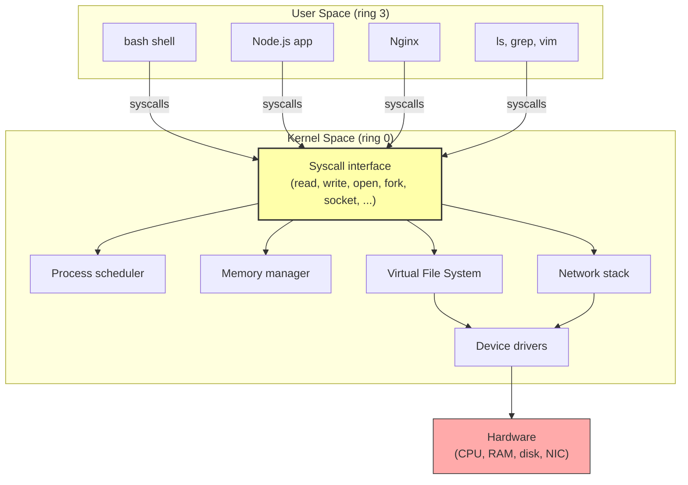

# 2. The Linux Kernel and User Space

> [!info] Chapter Context
> Linux is divided into two worlds: **kernel space** and **user space**. The kernel runs with full hardware access; user-space programs run with restricted privileges and must ask the kernel (via syscalls) to do anything that requires hardware access. Understanding this split is essential for understanding permissions, containers, and security.

Related: [[01 - Installing Apps/1. Linux Overview and Distributions]] | [[01 - Installing Apps/3. The Filesystem Hierarchy Standard]] | [[03 - Processes and Services/1. Processes and the Process Tree]]

---

## 1. Kernel Space vs. User Space

The Linux kernel is the core of the operating system. It runs in **kernel mode** (also called "ring 0" on x86 CPUs), where it has full access to the hardware: memory, CPU, disks, network cards, devices. The kernel is trusted code; if it crashes, the whole system crashes.

**User space** is everything else: your shell, your browser, Nginx, Node.js, the `ls` command. User-space programs run in **user mode** (ring 3), where they have restricted privileges. They cannot directly access hardware, cannot read arbitrary memory, and cannot execute privileged CPU instructions.

When a user-space program needs to do something privileged — read a file, open a network socket, allocate memory, spawn a process — it makes a **system call** (syscall) to the kernel. The kernel checks whether the request is allowed (based on permissions, capabilities, etc.), performs the operation on the program's behalf, and returns the result.



---

## 2. Common System Calls

A user-space program interacts with the kernel exclusively through syscalls. The Linux kernel has about 330 syscalls. The most common ones:

| Syscall | Purpose |
| :--- | :--- |
| `read(fd, buf, count)` | Read bytes from a file descriptor. |
| `write(fd, buf, count)` | Write bytes to a file descriptor. |
| `open(path, flags)` | Open a file. |
| `close(fd)` | Close a file descriptor. |
| `fork()` | Create a copy of the current process. |
| `execve(path, argv, envp)` | Replace the current process with a new program. |
| `exit(status)` | Terminate the current process. |
| `wait(pid)` | Wait for a child process to exit. |
| `socket(domain, type, protocol)` | Create a network socket. |
| `bind(fd, addr, len)` | Bind a socket to an address. |
| `connect(fd, addr, len)` | Connect to a remote socket. |
| `brk(addr)` / `mmap()` | Allocate memory. |
| `kill(pid, sig)` | Send a signal to a process. |
| `clone(...)` | Create a new process or thread (with optional namespace isolation). |

When you run `cat file.txt`, the `cat` process makes these syscalls (roughly):

1. `open("file.txt", O_RDONLY)` — kernel checks permissions, returns a file descriptor (e.g., `fd=3`).
2. `read(3, buf, 4096)` — kernel reads bytes from the file into `cat`'s memory.
3. `write(1, buf, n)` — kernel writes those bytes to file descriptor 1 (stdout).
4. Repeat 2-3 until `read` returns 0 (end of file).
5. `close(3)` — kernel releases the file descriptor.
6. `exit(0)` — kernel terminates the process.

---

## 3. File Descriptors

A **file descriptor** (FD) is a small integer that a process uses to refer to an open file (or socket, pipe, device, etc.). FDs are per-process; the same integer in two processes refers to completely different files.

Every process starts with three open FDs:

| FD | Name | Default | Purpose |
| :--- | :--- | :--- | :--- |
| 0 | STDIN | Keyboard | Input. |
| 1 | STDOUT | Terminal | Normal output. |
| 2 | STDERR | Terminal | Error output. |

When you write `echo hello > file.txt`, the shell:

1. Opens `file.txt` for writing, gets a new FD (say, 3).
2. Closes FD 1 (STDOUT).
3. Duplicates FD 3 to FD 1 (so FD 1 now points to `file.txt`).
4. Runs `echo hello`, which calls `write(1, "hello\n", 6)`.
5. The bytes go to `file.txt` instead of the terminal.

This is what **redirection** (`>`, `<`, `2>`) is doing under the hood — manipulating file descriptors.

---

## 4. The `glibc` Library

Most user-space programs do not make syscalls directly. They call functions in the C standard library (`glibc` on most Linux distros, `musl` on Alpine). `glibc` provides convenient wrappers like `printf`, `fopen`, `malloc`, `pthread_create` that handle buffering, error translation, and platform differences, and ultimately call the appropriate syscalls.

When you write a Python program that does `print("hello")`, Python's runtime calls C's `printf` (or similar), which calls `write(1, ...)` in `glibc`, which invokes the `write` syscall.

This is why some Python packages behave differently on Alpine (which uses `musl`) vs. Ubuntu (which uses `glibc`) — they assume `glibc` semantics. The same issue applies to Docker images built on Alpine.

---

## 5. Why This Matters for Cloud Engineers

- **Containers** are user-space processes placed inside kernel **namespaces** and assigned to **cgroups**. The kernel does the work; Docker just orchestrates syscalls. See [[03 - Docker/1.1 Container Isolation Internals]].
- **Permissions** are enforced by the kernel's VFS layer. When `cat` tries to `open("/etc/shadow", O_RDONLY)`, the kernel checks the calling process's UID against the file's permissions.
- **Performance analysis** often involves counting syscalls. Tools like `strace` show every syscall a process makes. Excessive syscalls are a common performance bottleneck.
- **Security** is fundamentally about what syscalls a process is allowed to make. `seccomp` filters syscalls; `capabilities` grant specific privileges; `AppArmor`/`SELinux` enforce MAC policies.

---

## 6. The `strace` Tool

`strace` traces the syscalls a process makes. It is invaluable for debugging "why is this program failing?"

```bash
# Trace all syscalls made by `cat file.txt`
strace cat file.txt

# Trace a running process by PID
strace -p 1234

# Show only file-related syscalls
strace -e trace=file cat file.txt

# Show only network-related syscalls
strace -e trace=network curl http://example.com

# Count syscalls (summary)
strace -c cat file.txt
```

Example output:

```
openat(AT_FDCWD, "file.txt", O_RDONLY) = 3
read(3, "Hello, world!\n", 4096)        = 14
write(1, "Hello, world!\n", 14)         = 14
read(3, "", 4096)                       = 0
close(3)                                = 0
exit_group(0)                           = ?
```

Each line shows the syscall name, its arguments, and its return value. A return of `-1` indicates an error; the next line usually shows `errno` (e.g., `EACCES` for permission denied).

> [!tip] Debugging "Permission Denied" with strace
> If a program fails with "permission denied" but you cannot tell which file is the problem, run `strace -e trace=file <command> 2>&1 | grep EACCES` to find the failing `open` call.

---

## 7. The `/proc` and `/sys` Filesystems

The kernel exposes a lot of internal state through two pseudo-filesystems:

- **`/proc`** — Process information. `/proc/<pid>/` has info about each process (cmdline, env, open files, memory maps, etc.). `/proc/cpuinfo`, `/proc/meminfo`, `/proc/loadavg` have system-wide info.
- **`/sys`** — Device and kernel info. `/sys/class/net/` lists network interfaces. `/sys/fs/cgroup/` exposes cgroup controls.

These are not real files on disk — they are views into the kernel's data structures, generated on the fly when you read them. `cat /proc/cpuinfo` does not read a file; it asks the kernel to print CPU information.

```bash
cat /proc/cpuinfo | head -20
cat /proc/meminfo
cat /proc/loadavg
ls /proc/1234/                  # info about PID 1234
cat /proc/1234/cmdline | tr '\0' ' '   # the command line that started PID 1234
```

---

## 8. Common Student Mistakes

> [!warning] Mistake 1 — Thinking the Kernel Is "Just Another Program"
> The kernel is special. It runs with full hardware access. If it crashes (kernel panic), the whole system goes down. User-space programs can crash without affecting the kernel.

> [!warning] Mistake 2 — Confusing Kernel Space with User Space
> Drivers run in kernel space. Applications run in user space. A bug in a driver can crash the kernel; a bug in an application crashes only that application.

> [!warning] Mistake 3 — Forgetting That Everything Goes Through Syscalls
> When your Python program reads a file, it ultimately calls the `read` syscall. If you want to know what your program is doing at the lowest level, `strace` it.

> [!warning] Mistake 4 — Modifying `/proc` and `/sys` Blindly
> Some files in `/proc` and `/sys` are writable and let you change kernel parameters at runtime. Writing the wrong value can destabilize the system. Always read the documentation first.

---

## 9. Summary Checklist

- [ ] Linux is split into **kernel space** (ring 0, full hardware access) and **user space** (ring 3, restricted).
- [ ] User-space programs request privileged operations via **syscalls** (~330 of them).
- [ ] Common syscalls: `read`, `write`, `open`, `close`, `fork`, `execve`, `socket`, `bind`, `kill`.
- [ ] Every process starts with three file descriptors: STDIN (0), STDOUT (1), STDERR (2).
- [ ] `glibc` (or `musl` on Alpine) wraps syscalls in convenient C functions.
- [ ] `strace` traces syscalls — invaluable for debugging.
- [ ] `/proc` and `/sys` are pseudo-filesystems exposing kernel state.

---

Previous: [[01 - Installing Apps/1. Linux Overview and Distributions]] | Next: [[01 - Installing Apps/3. The Filesystem Hierarchy Standard]]
