# 3. The Filesystem Hierarchy Standard

> [!info] Chapter Context
> Linux has a convention for where different types of files live. The **Filesystem Hierarchy Standard (FHS)** defines this convention. Knowing where to look for executables, config files, logs, and libraries saves hours of searching. This note is the definitive guide.

Related: [[01 - Installing Apps/1. Linux Overview and Distributions]] | [[01 - Installing Apps/2. The Linux Kernel and User Space]] | [[02 - File System and Permissions/1. Paths, Inodes, and Links]]

---

## 1. Why a Standard Exists

Without a standard, every distribution could put `ls` in a different directory. You would have to memorize "on Ubuntu, `ls` is in `/usr/bin`, but on Fedora it's in `/bin`..." — chaos. The FHS prevents this by defining the purpose of each top-level directory.

The FHS is not enforced by law; it is a convention. Most distributions follow it, with minor variations. Alpine is the most notable exception — it uses BusyBox, so many "binaries" are symlinks to a single BusyBox executable.

---

## 2. The Top-Level Directories

```mermaid
graph TD
    Root["/ (root)"]
    Root --> Bin["bin<br/>Essential user binaries"]
    Root --> Boot["boot<br/>Boot loader files"]
    Root --> Dev["dev<br/>Device files"]
    Root --> Etc["etc<br/>System-wide config files"]
    Root --> Home["home<br/>User home directories"]
    Root --> Lib["lib<br/>Shared libraries"]
    Root --> Media["media<br/>Removable media mount points"]
    Root --> Mnt["mnt<br/>Temporary mount points"]
    Root --> Opt["opt<br/>Optional add-on software"]
    Root --> Proc["proc<br/>Process/kernel info (pseudo)"]
    Root --> RootDir["root<br/>Root user's home"]
    Root --> Run["run<br/>Runtime variable data"]
    Root --> Sbin["sbin<br/>System admin binaries"]
    Root --> Srv["srv<br/>Service data (rarely used)"]
    Root --> Sys["sys<br/>Device/kernel info (pseudo)"]
    Root --> Tmp["tmp<br/>Temporary files (cleared on reboot)"]
    Root --> Usr["usr<br/>User utilities & apps"]
    Root --> Var["var<br/>Variable data: logs, spool, db"]

    Usr --> UsrBin["bin<br/>Most user binaries"]
    Usr --> UsrSbin["sbin<br/>Non-essential system binaries"]
    Usr --> UsrLib["lib<br/>Libraries"]
    Usr --> UsrLocal["local<br/>Locally installed software"]
    Usr --> UsrShare["share<br/>Architecture-independent data"]

    Var --> VarLog["log<br/>System & app logs"]
    Var --> VarLib["lib<br/>State info (databases, pkg state)"]
    Var --> VarCache["cache<br/>Application cache"]
    Var --> VarSpool["spool<br/>Print/mail queues, cron"]
    Var --> VarTmp["tmp<br/>Temp files (survive reboot)"]

    style Root fill:#bbf,stroke:#333,stroke-width:2px
    style Etc fill:#afa,stroke:#333
    style Var fill:#faa,stroke:#333
    style Proc fill:#ffa,stroke:#333
    style Sys fill:#ffa,stroke:#333
```



---

## 3. Detailed Directory Walkthrough

### 3.1 `/bin` and `/usr/bin` — Executables

- **`/bin`** — Essential binaries needed for booting and single-user mode. Examples: `ls`, `cp`, `cat`, `grep`, `bash`, `mount`.
- **`/usr/bin`** — Most user binaries. Examples: `python3`, `node`, `curl`, `git`, `vim`.

> [!note] The Modern `/bin` → `/usr/bin` Merge
> Historically, `/bin` and `/usr/bin` were separate because `/usr` was sometimes on a different filesystem (mounted later in boot). Modern systems (Fedora since 2011, Debian since 12, Arch) merge them: `/bin` is a symlink to `/usr/bin`, and `/sbin` is a symlink to `/usr/sbin`. On these systems, `/bin/ls` and `/usr/bin/ls` are the same file. The distinction is historical.

### 3.2 `/sbin` and `/usr/sbin` — System Administration Binaries

- **`/sbin`** — Essential system binaries, typically run as root: `mount`, `umount`, `fsck`, `iptables`, `ip`, `reboot`, `shutdown`.
- **`/usr/sbin`** — More system binaries: `useradd`, `groupadd`, `sshd`, `nginx` (sometimes), `apache2`.

### 3.3 `/etc` — Configuration Files

System-wide configuration files are plain text. Examples:

- `/etc/passwd` — User accounts.
- `/etc/shadow` — User passwords (hashed).
- `/etc/group` — Groups.
- `/etc/hostname` — The system's hostname.
- `/etc/hosts` — Static hostname-to-IP mappings (overrides DNS).
- `/etc/resolv.conf` — DNS resolver configuration.
- `/etc/fstab` — Filesystem mount table (what to mount at boot).
- `/etc/ssh/sshd_config` — SSH server configuration.
- `/etc/nginx/` — Nginx configuration directory.
- `/etc/systemd/system/` — Systemd unit files.

> [!tip] `/etc` Is Where Configuration Lives
> If you need to configure a service, look in `/etc`. If you need to find the default config for an application, look in `/etc`. Almost every Linux service keeps its config in `/etc/<service-name>/` or `/etc/<service-name>.conf`.

### 3.4 `/var` — Variable Data

- **`/var/log`** — Log files. `syslog`, `auth.log`, `nginx/access.log`, `postgresql/`, etc.
- **`/var/lib`** — State information. Databases store their data here (e.g., `/var/lib/postgresql/`, `/var/lib/mysql/`, `/var/lib/docker/`).
- **`/var/cache`** — Cached data that can be regenerated. Package manager caches live here.
- **`/var/spool`** — Queued data. Print queues, mail queues, cron jobs.
- **`/var/tmp`** — Temporary files that survive reboot (unlike `/tmp`).

> [!warning] `/var/lib/docker` Is Where Docker Stores Images and Containers
> If you fill up `/var`, Docker stops working. Monitor `/var` disk usage on production servers. On cloud instances, consider mounting a separate EBS volume at `/var/lib/docker`.

### 3.5 `/home` and `/root`

- **`/home/<username>`** — Each user's personal directory. Files here are owned by the user. The user can read and write freely.
- **`/root`** — The root user's home directory. (Not `/home/root`.)

### 3.6 `/tmp`

Temporary files. World-writable. Cleared on reboot (on most distros). Do not store anything important here. Many programs use `/tmp` for scratch space.

> [!warning] `/tmp` Is World-Writable
> Anyone can read or write files in `/tmp`. Do not store secrets here. The "sticky bit" (the `t` in `drwxrwxrwt`) prevents users from deleting other users' files, but it does not prevent reading.

### 3.7 `/opt` — Optional Software

Third-party software that is not managed by the distribution's package manager. Each application typically gets its own subdirectory: `/opt/google/chrome/`, `/opt/intel/`, `/opt/myapp/`.

### 3.8 `/usr/local` — Locally Installed Software

Software you compile and install yourself (e.g., `make install`) goes here. The package manager does not touch `/usr/local`, so it is safe across upgrades.

- `/usr/local/bin/` — Your custom binaries.
- `/usr/local/lib/` — Your custom libraries.
- `/usr/local/etc/` — Your custom config.

### 3.9 `/dev` — Device Files

Everything in Linux is a file, including hardware devices:

- `/dev/sda` — First SCSI/SATA disk.
- `/dev/sda1` — First partition on `/dev/sda`.
- `/dev/null` — A "black hole" — write to it and the data disappears; read from it and get EOF.
- `/dev/zero` — Read from it and get infinite zero bytes.
- `/dev/random` — Random numbers (blocks if entropy is low).
- `/dev/urandom` — Random numbers (never blocks, slightly less random in theory).
- `/dev/stdin`, `/dev/stdout`, `/dev/stderr` — Symlinks to the current process's standard streams.

```bash
# Discard output (send to /dev/null)
ls > /dev/null

# Create a 100 MB file of zeros
dd if=/dev/zero of=zeros.bin bs=1M count=100

# Generate a random 32-character password
head -c 32 /dev/urandom | base64
```

### 3.10 `/proc` and `/sys` — Pseudo-Filesystems

Covered in detail in [[01 - Installing Apps/2. The Linux Kernel and User Space]]. These are not on disk — they are views into the kernel's data structures.

---

## 4. The `PATH` Environment Variable

When you type `ls`, the shell does not know where `ls` is. It searches directories in the `PATH` environment variable, in order, until it finds an executable named `ls`.

```bash
echo $PATH
# /usr/local/sbin:/usr/local/bin:/usr/sbin:/usr/bin:/sbin:/bin
```

If you install a binary in `/usr/local/bin`, it will be found because `/usr/local/bin` is in `PATH` (and usually comes first, so your local version overrides the distro version).

If you install a binary in `/opt/myapp/bin`, you need to add that to `PATH`:

```bash
export PATH=$PATH:/opt/myapp/bin
# To make permanent, add to ~/.bashrc or ~/.profile
```

---

## 5. Where Compilers and Interpreters Live

| Tool | Typical location |
| :--- | :--- |
| `gcc`, `g++` | `/usr/bin/` |
| `clang` | `/usr/bin/` |
| `python3` | `/usr/bin/python3` (symlink to `/usr/bin/python3.11` or similar) |
| `pip3` | `/usr/bin/pip3` |
| `node` | `/usr/bin/node` (or `/usr/local/bin/node` if installed via nvm) |
| `npm` | `/usr/bin/npm` |
| `java` | `/usr/bin/java` (symlink into `/usr/lib/jvm/`) |
| `go` | `/usr/local/go/bin/go` (when installed from official tarball) |

Find any executable with:

```bash
which python3                  # shows first match in PATH
whereis python3                # shows binary, source, and man page locations
type python3                   # shows how the shell interprets the command (incl. aliases)
```

---

## 6. Where Application Files Live

When you install an application, its files are distributed across multiple directories according to FHS:

| Type of file | Location |
| :--- | :--- |
| Executable | `/usr/bin/<app>` |
| Configuration | `/etc/<app>/` or `/etc/<app>.conf` |
| Libraries | `/usr/lib/<app>/` or `/usr/lib/x86_64-linux-gnu/<app>/` |
| Documentation | `/usr/share/doc/<app>/` |
| Man pages | `/usr/share/man/man1/<app>.1.gz` |
| Logs | `/var/log/<app>/` |
| State / data | `/var/lib/<app>/` |
| Cache | `/var/cache/<app>/` |

You can ask the package manager exactly which files an installed package provides:

```bash
dpkg -L nginx                  # Debian/Ubuntu
rpm -ql nginx                  # Fedora/RHEL/CentOS
```

---

## 7. Common Student Mistakes

> [!warning] Mistake 1 — Looking for Executables in `/etc`
> `/etc` has configuration files, not executables. Binaries live in `/bin`, `/usr/bin`, `/sbin`, `/usr/sbin`.

> [!warning] Mistake 2 — Storing Data in `/tmp`
> `/tmp` is cleared on reboot. Use `/var/tmp` (survives reboot) or a proper data directory.

> [!warning] Mistake 3 — Installing Software in Random Places
> If you compile software yourself, install it to `/usr/local/`, not `/opt/my-stuff/` or your home directory. `/usr/local` is the convention for self-compiled software and is in the default `PATH`.

> [!warning] Mistake 4 — Editing `/etc/passwd` Directly
> Use `useradd`, `usermod`, `userdel` to manage users. Directly editing `/etc/passwd` can corrupt it. Same for `/etc/group` (use `groupadd` etc.).

> [!warning] Mistake 5 — Forgetting That `/var` Can Fill Up
> Logs, package caches, and Docker images all live in `/var`. Monitor `/var` disk space.

---

## 8. Summary Checklist

- [ ] `/bin`, `/usr/bin` — User binaries (often merged on modern distros).
- [ ] `/sbin`, `/usr/sbin` — System administration binaries.
- [ ] `/etc` — System-wide configuration files (plain text).
- [ ] `/var` — Variable data: logs, databases, caches, spool.
- [ ] `/home/<user>` — User home directories; `/root` — root's home.
- [ ] `/tmp` — Temporary files (cleared on reboot); `/var/tmp` — survives reboot.
- [ ] `/opt` — Optional third-party software; `/usr/local` — locally compiled software.
- [ ] `/dev` — Device files (hardware and pseudo-devices like `/dev/null`).
- [ ] `/proc` — Process info; `/sys` — Kernel and device info (pseudo-filesystems).
- [ ] `PATH` controls where the shell looks for executables.

---

Previous: [[01 - Installing Apps/2. The Linux Kernel and User Space]] | Next: [[01 - Installing Apps/4. Ways to Install Apps in Linux]]
