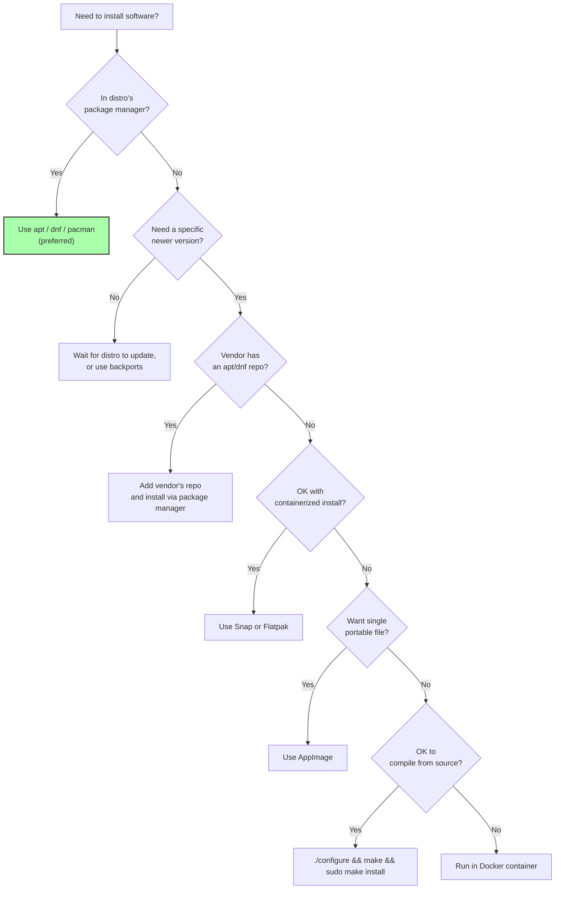

# 4. Ways to Install Apps in Linux

> [!info] Chapter Context
> Unlike Windows (where you download `.exe` installers) or macOS (where you drag `.app` bundles), Linux has **multiple** installation methods, each with different trade-offs. This note is a comprehensive overview. The subsequent notes go deep on each method.

Related: [[01 - Installing Apps/1. Linux Overview and Distributions]] | [[01 - Installing Apps/5. APT and dpkg]] | [[01 - Installing Apps/6. .deb Files]] | [[01 - Installing Apps/7. .tar.gz Files and Manual Installation]] | [[01 - Installing Apps/8. AppImage, Snap, and Flatpak]]

---

## 1. The Landscape of Installation Methods

Linux offers at least eight distinct ways to install an application:

1. **Distribution package manager** (APT, DNF, pacman, apk) — The traditional, recommended way.
2. **Graphical App Center / Software Center** — A GUI front-end to the package manager.
3. **Direct `.deb` / `.rpm` installation** — Download the package file and install it with `dpkg` or `rpm`.
4. **`.tar.gz` archives** — Download, extract, and run (or compile from source).
5. **AppImage** — A single self-contained executable file.
6. **Snap** — Canonical's containerized package format.
7. **Flatpak** — A cross-distribution containerized package format.
8. **Compile from source** — Download source code, `./configure && make && make install`.

Each has different trade-offs in convenience, security, update management, and integration with the rest of the system.

---

## 2. The Distribution Package Manager (Preferred)

Every distribution has a primary package manager:

| Distro family | Package manager | Install command |
| :--- | :--- | :--- |
| Debian/Ubuntu | `apt` (front-end to `dpkg`) | `sudo apt install nginx` |
| Fedora/RHEL/CentOS | `dnf` (front-end to `rpm`) | `sudo dnf install nginx` |
| Arch/Manjaro | `pacman` | `sudo pacman -S nginx` |
| Alpine | `apk` | `apk add nginx` |
| openSUSE | `zypper` | `sudo zypper install nginx` |

### 2.1 Why This Is Preferred

- **Dependency resolution** — The package manager installs all required dependencies automatically.
- **Updates** — `sudo apt update && sudo apt upgrade` updates every installed package.
- **Security patches** — Distribution maintainers backport security fixes; you get them via the package manager.
- **Clean removal** — `sudo apt remove nginx` cleanly uninstalls (and `--purge` removes config files too).
- **Reproducibility** — The same package version is installed across all machines.

### 2.2 The Trade-Off

The package versions in the distribution's repositories are typically **older** than upstream. Ubuntu 22.04's `nginx` package might be 1.18, while the latest Nginx is 1.25. This is intentional — older versions are tested and stable.

If you need a newer version, options:

- Use a PPA (Ubuntu Personal Package Archive) — third-party apt repository.
- Use the upstream project's official apt/dnf repository.
- Install via Snap, Flatpak, or AppImage.
- Compile from source.
- Use Docker (run the app in a container).

---

## 3. The Graphical App Center

Most desktop Linux distributions ship a graphical "Software" or "App Center" application. It is a front-end to the underlying package manager (plus optionally Snap/Flatpak). It lets you browse, install, update, and remove applications with a click.

For server / cloud work, you will use the command-line package manager instead. The App Center is mostly relevant for desktop Linux users.

---

## 4. Direct `.deb` / `.rpm` Installation

Some software vendors distribute `.deb` (Debian/Ubuntu) or `.rpm` (Fedora/RHEL) files directly. You download the file and install it with `dpkg -i` or `rpm -i`.

```bash
# Debian/Ubuntu
sudo dpkg -i google-chrome-stable_current_amd64.deb
# If dependencies are missing, fix with:
sudo apt install -f

# Or, better, install with apt directly (handles deps):
sudo apt install ./google-chrome-stable_current_amd64.deb
```

```bash
# Fedora/RHEL
sudo dnf install google-chrome-stable_current_x86_64.rpm
```

### 4.1 Trade-offs

- **Pros**: Easy for users; vendor controls the version.
- **Cons**: No automatic dependency resolution with `dpkg -i` (you have to run `apt install -f` to fix). No automatic updates (the package manager will not update the package unless you add the vendor's repository).

---

## 5. `.tar.gz` Archives

Some software is distributed as a compressed tarball containing pre-compiled binaries. You extract it and run.

```bash
tar xzf myapp-1.0-linux-x64.tar.gz
cd myapp-1.0
./myapp
```

Or move it to `/opt/` for a more permanent install:

```bash
sudo tar xzf myapp-1.0-linux-x64.tar.gz -C /opt/
sudo ln -s /opt/myapp-1.0/myapp /usr/local/bin/myapp
```

This is how Go, some Java JDKs, and many IDEs (like IntelliJ IDEA) are distributed.

### 5.1 Trade-offs

- **Pros**: No root needed (if extracting to your home directory); works on any distro.
- **Cons**: No automatic updates; no dependency management; you must manually create symlinks or PATH entries.

---

## 6. AppImage

AppImage is a single-file format. The entire application and its dependencies are bundled into one executable file.

```bash
chmod +x myapp-1.0-x86_64.AppImage
./myapp-1.0-x86_64.AppImage
```

### 6.1 Trade-offs

- **Pros**: No installation; no root; runs on any distro; portable.
- **Cons**: No automatic updates (some AppImages have built-in updataters, many do not); no system integration (no desktop icon by default — you create a `.desktop` file); large file size (bundles everything).

---

## 7. Snap

Snap is Canonical's (Ubuntu's parent company) package format. Snaps are containerized — each snap runs in a restricted environment with its own dependencies.

```bash
sudo snap install code --classic       # install VS Code
sudo snap list                          # list installed snaps
sudo snap refresh code                  # update
sudo snap remove code                   # remove
```

### 7.1 Trade-offs

- **Pros**: Cross-distribution (works on Fedora, Arch, etc., not just Ubuntu); automatic updates; sandboxed.
- **Cons**: Larger than native packages (bundles dependencies); slower startup (especially on first run); automatic updates can be surprising; `--classic` snaps have full system access (defeats the sandboxing).

---

## 8. Flatpak

Flatpak is the non-Canonical alternative to Snap. It is cross-distribution and containerized, but more decentralized — Flatpaks are typically hosted on Flathub.

```bash
sudo apt install flatpak                                  # install Flatpak itself
flatpak remote-add --if-not-exists flathub https://flathub.org/repo/flathub.flatpakrepo
flatpak install flathub com.visualstudio.Code             # install VS Code
flatpak list                                              # list installed
flatpak update                                            # update all
flatpak uninstall com.visualstudio.Code                   # remove
```

### 8.1 Trade-offs

- **Pros**: Cross-distribution; sandboxed; decentralized (Flathub is just one repository); no automatic forced updates (you control when).
- **Cons**: Larger than native packages; some apps have permission issues with the sandbox; download sizes are big.

---

## 9. Compile from Source

For software not packaged by your distribution, you can compile from source.

```bash
tar xzf myapp-1.0.tar.gz
cd myapp-1.0
./configure
make
sudo make install           # installs to /usr/local/
```

### 9.1 Trade-offs

- **Pros**: Latest version; can customize compile-time options.
- **Cons**: Slow (compilation can take minutes to hours); requires build tools (`gcc`, `make`, `autoconf`, etc.); hard to uninstall (use `checkinstall` to create a package instead of `make install`); no automatic updates.

> [!tip] Use `checkinstall` Instead of `make install`
> `checkinstall` creates a `.deb` or `.rpm` package from your compiled software, then installs it via the package manager. This means you can uninstall it cleanly with `apt remove`. Without `checkinstall`, `make install` scatters files across `/usr/local/` and you cannot easily remove them.

---

## 10. Decision Matrix



---

## 11. Common Student Mistakes

> [!warning] Mistake 1 — Mixing `dpkg -i` and `apt install`
> `dpkg -i file.deb` installs the package but does not resolve dependencies. If dependencies are missing, the install fails. Always use `sudo apt install ./file.deb` instead — it resolves dependencies automatically.

> [!warning] Mistake 2 — Forgetting to Update the Package Index
> `sudo apt install nginx` installs the version listed in your local package index. If the index is stale, you install an old version. Run `sudo apt update` first to refresh the index.

> [!warning] Mistake 3 — Installing Software via `curl | bash`
> `curl https://example.com/install.sh | bash` runs arbitrary code as root. Only do this for trusted vendors. Even then, prefer a package repository so you get updates.

> [!warning] Mistake 4 — Compiling from Source Without `checkinstall`
> `make install` scatters files in `/usr/local/` with no easy way to remove them. Use `checkinstall` to create a proper package.

> [!warning] Mistake 5 — Assuming Snap and Flatpak Are the Same
> Snap is Canonical-specific (default on Ubuntu); Flatpak is more cross-distribution. Snaps auto-update by default; Flatpaks do not (you control when).

---

## 12. Summary Checklist

- [ ] Prefer the distribution's package manager (APT, DNF, pacman, apk).
- [ ] App Center is a GUI front-end to the package manager (and optionally Snap/Flatpak).
- [ ] `.deb` / `.rpm` files are installed with `apt install ./file.deb` / `dnf install file.rpm`.
- [ ] `.tar.gz` archives are extracted and run (or moved to `/opt/`).
- [ ] AppImage is a single self-contained executable.
- [ ] Snap (Canonical) and Flatpak (cross-distro) are containerized package formats.
- [ ] Compiling from source gives the latest version but is slow and hard to manage.
- [ ] Use `checkinstall` to create a package instead of `make install`.

---

Previous: [[01 - Installing Apps/3. The Filesystem Hierarchy Standard]] | Next: [[01 - Installing Apps/5. APT and dpkg]]
