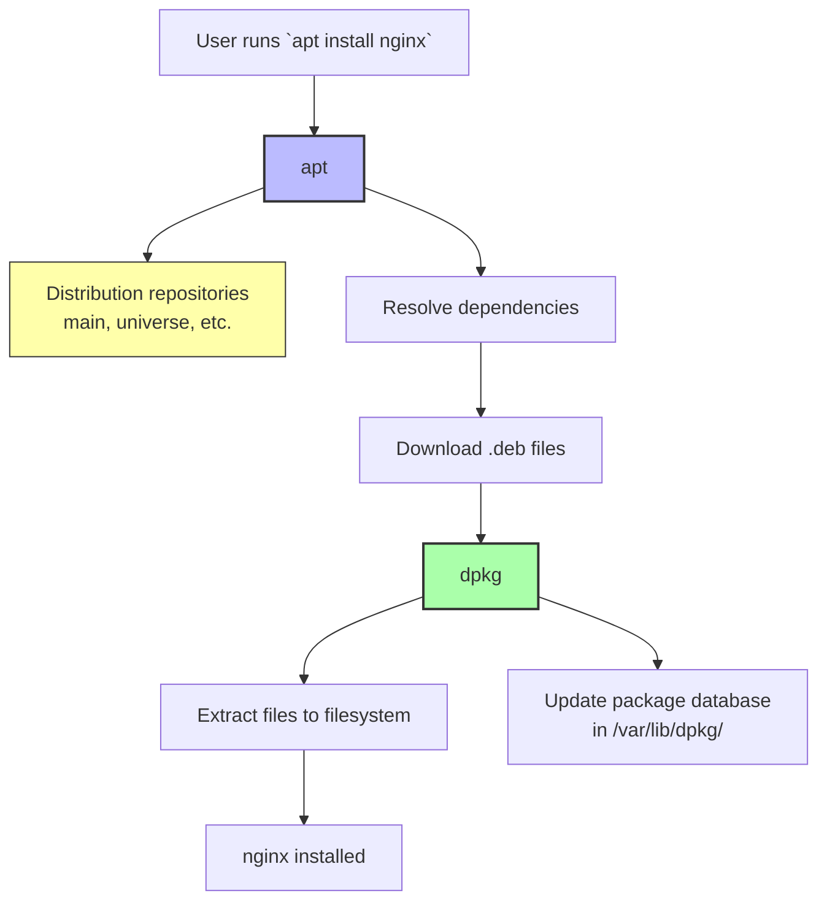

# 5. APT and dpkg

> [!info] Chapter Context
> APT (Advanced Package Tool) is the package manager used by Debian and Ubuntu. Underneath APT is `dpkg`, the lower-level tool that actually installs `.deb` files. This note covers both layers, how they relate, and the everyday commands you need.

Related: [[01 - Installing Apps/4. Ways to Install Apps in Linux]] | [[01 - Installing Apps/6. .deb Files]] | [[01 - Installing Apps/7. .tar.gz Files and Manual Installation]] | [[04 - Shell and Text Tools/1. The Shell and Bash Basics]]

---

## 1. The Two-Layer Architecture

Debian-based distributions (Ubuntu, Linux Mint, Pop!_OS, Debian itself) have two package management layers:

| Tool | Layer | Role |
| :--- | :--- | :--- |
| `dpkg` | Low level | Installs a single `.deb` file. Does NOT resolve dependencies. |
| `apt` (or `apt-get`) | High level | Downloads packages from repositories, resolves dependencies, calls `dpkg` to install them. |



You can use `dpkg` directly (e.g., `dpkg -i nginx.deb`), but it will not resolve dependencies. If `nginx.deb` requires `libc6 >= 2.31` and you do not have it, `dpkg -i` fails. `apt install ./nginx.deb` (with the `./`) resolves dependencies automatically.

---

## 2. APT Commands

### 2.1 Updating the Package Index

```bash
sudo apt update
```

APT maintains a local index of available packages and their versions, downloaded from each repository listed in `/etc/apt/sources.list` and `/etc/apt/sources.list.d/`. `apt update` refreshes this index from the remote repositories.

> [!warning] Always Run `apt update` Before `apt install`
> Without `apt update`, you may install a stale version of a package (whatever was in the local index). Run `apt update` first to get the latest version list.

### 2.2 Upgrading Installed Packages

```bash
sudo apt upgrade                  # upgrade all packages, but do not remove any
sudo apt full-upgrade             # upgrade all packages, removing some if necessary
sudo apt dist-upgrade             # alias for full-upgrade (older name)
```

`upgrade` will not remove packages — if upgrading package A requires removing package B, `upgrade` skips A. `full-upgrade` will remove B if needed to upgrade A.

### 2.3 Installing Packages

```bash
sudo apt install nginx                   # install nginx
sudo apt install nginx postgresql redis  # install multiple
sudo apt install nginx=1.24.*            # install a specific version
sudo apt install ./myapp.deb             # install a local .deb file (resolves deps)
sudo apt install -y nginx                # do not prompt for confirmation
```

### 2.4 Removing Packages

```bash
sudo apt remove nginx            # remove binaries, keep config files
sudo apt purge nginx             # remove binaries AND config files
sudo apt autoremove              # remove packages installed as dependencies that are no longer needed
sudo apt autoremove --purge      # same, but also remove their config files
```

### 2.5 Searching for Packages

```bash
apt search nginx                 # search package names and descriptions
apt show nginx                   # show detailed info about a package
apt list --installed             # list all installed packages
apt list --upgradable            # list packages with available updates
```

### 2.6 The `apt` vs `apt-get` Distinction

`apt` is a newer, more user-friendly front-end introduced in Ubuntu 16.04. `apt-get` is the older, script-friendly version. They overlap but differ:

| Command | `apt` | `apt-get` |
| :--- | :--- | :--- |
| Install | `apt install` | `apt-get install` |
| Update index | `apt update` | `apt-get update` |
| Upgrade | `apt upgrade` | `apt-get upgrade` |
| Search | `apt search` | `apt-cache search` |
| Show | `apt show` | `apt-cache show` |
| List installed | `apt list --installed` | `dpkg -l` |

For interactive use, prefer `apt`. For scripts, prefer `apt-get` (its output is more stable across versions).

---

## 3. APT Repositories

APT downloads packages from repositories listed in:

- `/etc/apt/sources.list` — The main file (legacy).
- `/etc/apt/sources.list.d/*.list` — Additional repositories (modern convention).
- `/etc/apt/sources.list.d/*.sources` — The new "deb822" format (Debian 12+).

### 3.1 Example `sources.list` Lines

```
deb http://archive.ubuntu.com/ubuntu jammy main restricted universe multiverse
deb http://archive.ubuntu.com/ubuntu jammy-updates main restricted universe multiverse
deb http://security.ubuntu.com/ubuntu jammy-security main restricted universe multiverse
```

Format: `deb <url> <distribution> <components>`

- `deb` — Binary packages (`deb-src` would be source packages).
- `<url>` — Repository URL.
- `<distribution>` — The release name (`jammy` = Ubuntu 22.04).
- `<components>` — Which sections to use:
  - `main` — Officially supported, free software.
  - `restricted` — Supported, non-free software (e.g., device drivers).
  - `universe` — Community-maintained, free software.
  - `multiverse` — Community-maintained, non-free software.

### 3.2 Adding a Third-Party Repository

```bash
# Add Nginx's official repository
curl https://nginx.org/keys/nginx_signing.key | sudo gpg --dearmor -o /usr/share/keyrings/nginx-key.gpg
echo "deb [signed-by=/usr/share/keyrings/nginx-key.gpg] http://nginx.org/packages/ubuntu jammy nginx" | sudo tee /etc/apt/sources.list.d/nginx.list
sudo apt update
sudo apt install nginx
```

The `[signed-by=...]` part tells APT which key to use to verify packages from this repository. Without it, APT refuses to install (security feature).

### 3.3 PPAs (Ubuntu Personal Package Archives)

PPAs are third-party apt repositories hosted on Launchpad, mostly for Ubuntu.

```bash
sudo add-apt-repository ppa:deadsnakes/ppa
sudo apt update
sudo apt install python3.12
```

PPAs are convenient but require trust — the PPA owner can push any package, and you have no guarantee of quality or security.

---

## 4. The `dpkg` Layer

`dpkg` is the underlying tool. It manages the package database at `/var/lib/dpkg/`.

### 4.1 Common `dpkg` Commands

```bash
# Install a .deb file (does not resolve dependencies)
sudo dpkg -i myapp.deb

# List installed packages
dpkg -l
dpkg -l | grep nginx

# Show info about an installed package
dpkg -s nginx
dpkg -s nginx | grep Version

# List files installed by a package
dpkg -L nginx

# Find which package installed a file
dpkg -S /usr/sbin/nginx
dpkg -S /etc/nginx/nginx.conf

# Remove a package
sudo dpkg -r nginx           # keep config
sudo dpkg -P nginx           # purge config too

# Inspect a .deb file without installing
dpkg-deb -I myapp.deb        # show info
dpkg-deb -c myapp.deb        # list contents
dpkg-deb -x myapp.deb /tmp/extract/   # extract to a directory
```

### 4.2 The Package Database

Every installed package has a record in `/var/lib/dpkg/status` (a plain text file). `dpkg -s <package>` reads from this file.

The files installed by each package are tracked in `/var/lib/dpkg/info/<package>.list`. `dpkg -L <package>` reads from this file.

This is how `dpkg -S /usr/bin/curl` can tell you that `curl` is installed by the `curl` package — it searches every package's `.list` file.

---

## 5. Common Student Mistakes

> [!warning] Mistake 1 — Running `apt install` Without `apt update`
> The local package index might be stale. You install an old version or fail because the package name changed. Always `sudo apt update` first.

> [!warning] Mistake 2 — Using `dpkg -i` for Packages with Dependencies
> `dpkg -i file.deb` does not resolve dependencies. If the install fails with "dependency problems," run `sudo apt install -f` to fix, or use `sudo apt install ./file.deb` instead.

> [!warning] Mistake 3 — Forgetting `autoremove`
> When you remove a package, its dependencies remain. Over time, your system accumulates dozens of unused packages. Run `sudo apt autoremove` periodically.

> [!warning] Mistake 4 — Confusing `apt remove` and `apt purge`
> `remove` keeps config files (in `/etc/`); `purge` removes them. If you reinstall after `remove`, your old config is reused. If you want a fresh start, use `purge`.

> [!warning] Mistake 5 — Adding Untrusted PPAs
> Anyone can publish a PPA. Only add PPAs from trusted sources (e.g., official project maintainers). A malicious PPA can install anything.

> [!warning] Mistake 6 — Forgetting to Import the GPG Key
> When adding a third-party apt repository, you must also add the GPG key. Otherwise `apt update` refuses to use the repository (security feature to prevent tampering).

---

## 6. Summary Checklist

- [ ] `apt` is the high-level package manager; `dpkg` is the low-level installer.
- [ ] `apt install` resolves dependencies; `dpkg -i` does not.
- [ ] Always run `sudo apt update` before `apt install` to refresh the package index.
- [ ] `apt upgrade` upgrades without removing; `apt full-upgrade` may remove.
- [ ] `apt remove` keeps config; `apt purge` removes config.
- [ ] `apt autoremove` cleans up orphaned dependencies.
- [ ] Repositories are configured in `/etc/apt/sources.list` and `/etc/apt/sources.list.d/`.
- [ ] Third-party repos require a GPG key (`[signed-by=...]`).
- [ ] `dpkg -L <package>` lists files installed by a package.
- [ ] `dpkg -S <file>` finds which package installed a file.

---

Previous: [[01 - Installing Apps/4. Ways to Install Apps in Linux]] | Next: [[01 - Installing Apps/6. .deb Files]]
