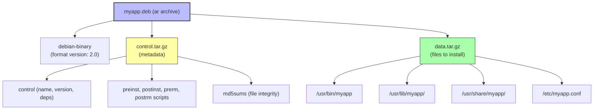
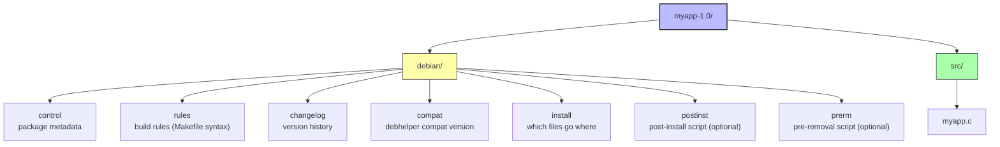

# 6. .deb Files

> [!info] Chapter Context
> `.deb` is the package format used by Debian, Ubuntu, and derivatives. This note covers what is inside a `.deb` file, how to inspect one without installing it, and how to install one properly (handling dependencies).

Related: [[01 - Installing Apps/4. Ways to Install Apps in Linux]] | [[01 - Installing Apps/5. APT and dpkg]] | [[01 - Installing Apps/7. .tar.gz Files and Manual Installation]]

---

## 1. What Is a `.deb` File

A `.deb` file is an **ar archive** (a Unix archive format, not to be confused with `tar`) containing three things:

1. **`debian-binary`** — A text file with the `.deb` format version number (currently `2.0`).
2. **`control.tar.*`** — The package metadata: name, version, dependencies, maintainer, pre/post install scripts.
3. **`data.tar.*`** — The actual files to be installed, with their target paths.



---

## 2. Inspecting a `.deb` Without Installing

Before installing a `.deb` from the internet, inspect it to verify it contains what you expect.

### 2.1 View Metadata

```bash
dpkg-deb -I myapp.deb             # show control info
dpkg-deb -f myapp.deb             # show only the control file fields
dpkg-deb -f myapp.deb Version     # show just the version
```

The control file looks like:

```
Package: myapp
Version: 1.2.3
Architecture: amd64
Maintainer: Jane Developer <jane@example.com>
Installed-Size: 12345
Depends: libc6 (>= 2.31), libssl3, python3
Section: utils
Priority: optional
Description: My awesome application
 A longer description that can span
 multiple lines.
```

### 2.2 List Files Inside

```bash
dpkg-deb -c myapp.deb             # list files (like `ls -l`)
dpkg-deb --contents myapp.deb     # same thing
```

### 2.3 Extract Files

```bash
dpkg-deb -x myapp.deb /tmp/myapp-extracted/    # extract data.tar only
dpkg-deb -e myapp.deb /tmp/myapp-control/      # extract control.tar only
dpkg-deb -R myapp.deb /tmp/myapp-full/         # extract everything
```

This lets you inspect scripts and binaries without installing.

---

## 3. Installing a `.deb`

### 3.1 The Wrong Way (Often Fails)

```bash
sudo dpkg -i myapp.deb
```

This installs the package but does not resolve dependencies. If `myapp` depends on `libssl3` and it is not installed, `dpkg -i` fails with:

```
dpkg: dependency problems prevent configuration of myapp:
 myapp depends on libssl3; however:
  Package libssl3 is not installed.
```

You can fix it after the fact with:

```bash
sudo apt install -f            # -f = --fix-broken
```

`apt install -f` looks at the broken state, figures out what is missing, and installs the missing dependencies.

### 3.2 The Right Way (Handles Dependencies)

```bash
sudo apt install ./myapp.deb
```

Note the `./` prefix — this tells `apt` that the argument is a file path, not a package name in a repository. `apt install` resolves dependencies automatically and installs the `.deb` cleanly.

### 3.3 For Multiple `.deb` Files

```bash
sudo apt install ./myapp.deb ./lib-dependency.deb
```

`apt` figures out the correct install order based on dependencies.

---

## 4. Removing a Package Installed from `.deb`

Once installed, a `.deb`-installed package is indistinguishable from a package installed via the package manager. Remove it the same way:

```bash
sudo apt remove myapp           # keep config
sudo apt purge myapp            # remove config too
```

The package name is what is in the `Package:` field of the control file, not the file name.

---

## 5. The `control` File Fields

| Field | Meaning |
| :--- | :--- |
| `Package` | The package name (lowercase, no spaces). |
| `Version` | The version (e.g., `1.2.3-1`). |
| `Architecture` | `amd64`, `arm64`, `all` (architecture-independent), etc. |
| `Maintainer` | Name and email of the maintainer. |
| `Installed-Size` | Disk usage in KB after installation. |
| `Depends` | Hard dependencies (must be installed). |
| `Recommends` | Strongly suggested dependencies (installed by default). |
| `Suggests` | Optional dependencies (not installed by default). |
| `Conflicts` | Packages that cannot be installed alongside this one. |
| `Replaces` | Files this package overwrites from other packages. |
| `Section` | Category (`utils`, `net`, `devel`, etc.). |
| `Priority` | `required`, `important`, `standard`, `optional`, `extra`. |
| `Description` | Short description on first line, longer description after. |

---

## 6. Pre/Post Install Scripts

A `.deb` can include four scripts that run at specific lifecycle points:

| Script | When it runs |
| :--- | :--- |
| `preinst` | Before the package is unpacked. |
| `postinst` | After the package is unpacked and configured. |
| `prerm` | Before the package is removed. |
| `postrm` | After the package is removed. |

These scripts can do anything: create users, set up directories, start services, register with a service discovery system, etc.

> [!warning] Pre/Post Scripts Run as Root
> These scripts execute with root privileges. Inspect them before installing a `.deb` from an untrusted source. A malicious `.deb` can run arbitrary code as root during installation.

---

## 7. Building a `.deb` (Brief Overview)

If you want to package your own software as a `.deb`:

The source directory structure for a Debian package:



Build with:

```bash
cd myapp-1.0
dpkg-buildpackage -us -uc -b
# produces ../myapp_1.0_amd64.deb
```

The `dh_make` tool can scaffold a new Debian package directory. For complex packages, refer to the [Debian Policy Manual](https://www.debian.org/doc/debian-policy/).

---

## 8. Common Student Mistakes

> [!warning] Mistake 1 — Using `dpkg -i` and Forgetting `apt install -f`
> `dpkg -i file.deb` does not resolve dependencies. If it fails, run `sudo apt install -f` to fix the broken state.

> [!warning] Mistake 2 — Forgetting the `./` in `apt install`
> `sudo apt install myapp.deb` tries to find a package named `myapp.deb` in the repositories (fails). Use `sudo apt install ./myapp.deb` (with `./`) to install a local file.

> [!warning] Mistake 3 — Assuming Architecture Matches
> A `.deb` for `amd64` will not install on `arm64`. Check the `Architecture:` field with `dpkg-deb -I file.deb` first. Use `dpkg --print-architecture` to see your system's architecture.

> [!warning] Mistake 4 — Installing `.deb` Files from Untrusted Sources
> `.deb` files run pre/post scripts as root. Only install `.deb` files from the distribution's repository or from a trusted vendor. Verify GPG signatures where possible.

> [!warning] Mistake 5 — Confusing Package Name with File Name
> After installing `myapp-1.2.3-amd64.deb`, the package name is `myapp` (look at the `Package:` field), not the file name. `apt remove myapp-1.2.3-amd64.deb` fails; use `apt remove myapp`.

---

## 9. Summary Checklist

- [ ] A `.deb` is an `ar` archive containing `debian-binary`, `control.tar.*`, and `data.tar.*`.
- [ ] `dpkg-deb -I file.deb` shows metadata; `-c` lists contents; `-x` extracts files.
- [ ] `sudo apt install ./file.deb` is the right way (handles dependencies).
- [ ] `sudo dpkg -i file.deb` works but does not resolve dependencies (use `apt install -f` to fix).
- [ ] The `control` file contains package name, version, dependencies, etc.
- [ ] Pre/post install scripts (`preinst`, `postinst`, `prerm`, `postrm`) run as root.
- [ ] The package name is in the `Package:` field, not the file name.

---

Previous: [[01 - Installing Apps/5. APT and dpkg]] | Next: [[01 - Installing Apps/7. .tar.gz Files and Manual Installation]]
