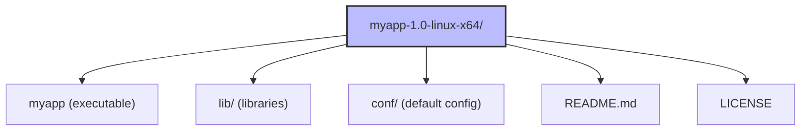
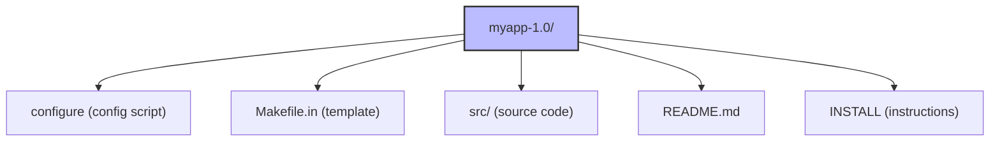

# 7. .tar.gz Files and Manual Installation

> [!info] Chapter Context
> Some software is distributed as `.tar.gz` (or `.tar.bz2`, `.tar.xz`) archives containing pre-compiled binaries or source code. This note covers how to extract them, where to install the contents, and how to manage updates for software installed this way.

Related: [[01 - Installing Apps/4. Ways to Install Apps in Linux]] | [[01 - Installing Apps/6. .deb Files]] | [[04 - Shell and Text Tools/3. tar and Archive Tools]] | [[01 - Installing Apps/8. AppImage, Snap, and Flatpak]]

---

## 1. What Is a `.tar.gz` File

A `.tar.gz` file is a **tar archive** (which combines multiple files into one) compressed with **gzip**. It is the Unix equivalent of a `.zip` file.

Other common variants:

- `.tar.bz2` — tar compressed with bzip2 (slower but smaller).
- `.tar.xz` — tar compressed with xz (slowest but smallest).
- `.tgz` — shorthand for `.tar.gz`.

The `tar` command handles all of these. The compression format is detected automatically (with modern `tar`).

---

## 2. Extracting `.tar.gz` Files

```bash
# Basic extraction (modern tar auto-detects compression)
tar xf myapp.tar.gz

# Verbose (shows files as they are extracted)
tar xvf myapp.tar.gz

# Extract to a specific directory
tar xzf myapp.tar.gz -C /opt/

# The "z" flag explicitly tells tar to use gzip
tar xzf myapp.tar.gz

# For .tar.bz2, use "j" instead of "z"
tar xjf myapp.tar.bz2

# For .tar.xz, use "J" (capital)
tar xJf myapp.tar.xz
```

The flag breakdown:

| Flag | Meaning |
| :--- | :--- |
| `x` | E**x**tract. |
| `c` | **C**reate. |
| `t` | Lis**t** (do not extract). |
| `v` | **V**erbose (show files). |
| `f` | **F**ile (next argument is the archive file). |
| `z` | g**Z**ip compression. |
| `j` | b**z**ip2 compression. |
| `J` | **X**Z compression. |

---

## 3. What Is Inside

A `.tar.gz` for a pre-compiled binary distribution usually contains:



A `.tar.gz` for source code contains:



---

## 4. Installing Pre-Compiled Binaries

### 4.1 The Simple Way (User-Local Install)

If you only need the software for one user, install it under your home directory:

```bash
mkdir -p ~/opt
tar xzf myapp-1.0-linux-x64.tar.gz -C ~/opt/
~/opt/myapp-1.0/myapp
```

Add to PATH for convenience:

```bash
echo 'export PATH=$PATH:$HOME/opt/myapp-1.0' >> ~/.bashrc
source ~/.bashrc
myapp
```

### 4.2 The System-Wide Way (Root Install)

For all users, install under `/opt/` (the FHS directory for add-on software):

```bash
sudo tar xzf myapp-1.0-linux-x64.tar.gz -C /opt/
sudo ln -s /opt/myapp-1.0/myapp /usr/local/bin/myapp
myapp
```

The `ln -s` creates a symlink in `/usr/local/bin/` (which is in `PATH`), pointing to the actual binary in `/opt/`. This way, you can type `myapp` instead of the full path.

### 4.3 Real-World Example: Installing Go

```bash
# Download (or use curl)
# https://go.dev/dl/
wget https://go.dev/dl/go1.21.5.linux-amd64.tar.gz

# Extract to /usr/local (Go's recommended location)
sudo tar -C /usr/local -xzf go1.21.5.linux-amd64.tar.gz

# Add to PATH
echo 'export PATH=$PATH:/usr/local/go/bin' >> ~/.bashrc
source ~/.bashrc

# Verify
go version
# go version go1.21.5 linux/amd64
```

### 4.4 Real-World Example: Installing Node.js from Tarball

```bash
wget https://nodejs.org/dist/v20.10.0/node-v20.10.0-linux-x64.tar.xz
sudo tar -C /usr/local --strip-components=1 -xJf node-v20.10.0-linux-x64.tar.xz

# Now /usr/local/bin/node and /usr/local/bin/npm exist
node --version
npm --version
```

The `--strip-components=1` flag tells `tar` to strip the top-level directory (`node-v20.10.0-linux-x64/`) from the extracted paths, so files go directly into `/usr/local/bin/`, `/usr/local/lib/`, etc.

---

## 5. Compiling from Source

Some software is distributed as source code only. To install, you compile it yourself.

### 5.1 The Traditional Three-Step

```bash
tar xzf myapp-1.0.tar.gz
cd myapp-1.0
./configure              # detects system, generates Makefile
make                     # compiles the software
sudo make install        # installs to /usr/local/
```

- `./configure` — A shell script that checks for required dependencies, finds your compiler, and generates a `Makefile` customized to your system.
- `make` — Reads the `Makefile` and compiles the source code into binaries.
- `make install` — Copies the compiled binaries, libraries, config files, and man pages to their target locations (usually under `/usr/local/`).

### 5.2 Custom Install Prefix

By default, `make install` puts files in `/usr/local/`. To install elsewhere (e.g., `/opt/myapp/`):

```bash
./configure --prefix=/opt/myapp
make
sudo make install
```

### 5.3 Build Dependencies

Compiling software requires development headers and build tools. For Debian/Ubuntu:

```bash
sudo apt install build-essential              # gcc, g++, make, libc dev headers
sudo apt install libssl-dev                   # SSL development headers (for HTTPS-capable software)
sudo apt install libcurl4-openssl-dev         # libcurl development headers
```

For Fedora/RHEL:

```bash
sudo dnf groupinstall "Development Tools"
sudo dnf install openssl-devel
```

### 5.4 Using `checkinstall` Instead of `make install`

`make install` copies files to `/usr/local/` without recording what it installed. Uninstalling is difficult (you have to remember every file).

`checkinstall` creates a `.deb` (or `.rpm`) package from the compiled software, then installs it via the package manager. This means you can `apt remove` it cleanly later.

```bash
sudo apt install checkinstall
./configure
make
sudo checkinstall             # creates a .deb and installs it
# Now you can: sudo apt remove myapp
```

---

## 6. Updating Software Installed from Tarball

There is no automatic update mechanism. To update:

1. Download the new tarball.
2. Remove the old version (delete `/opt/myapp-1.0/` or wherever you installed).
3. Extract the new version.
4. Re-create symlinks if necessary.

For compiled software, you may need to:

1. Run `make uninstall` in the old source directory (if the Makefile supports it).
2. Or manually remove the installed files.
3. Compile and install the new version.

This is why package-managed installation is preferred — updates are automatic.

---

## 7. When to Use `.tar.gz` Installation

Use `.tar.gz` (or compile from source) when:

- The software is not in your distribution's repositories.
- You need a specific version that the distribution does not provide.
- You need to customize compile-time options.
- The vendor only distributes a tarball (e.g., Go, some Java JDKs).

Prefer the package manager otherwise. It handles updates, dependencies, and clean removal automatically.

---

## 8. Common Student Mistakes

> [!warning] Mistake 1 — Forgetting `-C` to Extract to a Specific Directory
> `tar xzf myapp.tar.gz` extracts to the current directory, creating a mess. Use `tar xzf myapp.tar.gz -C /opt/` to extract to `/opt/` instead.

> [!warning] Mistake 2 — Installing to Non-Standard Locations
> If you extract to `~/Downloads/myapp/`, you will struggle to run it. Use `~/opt/` for user-local installs or `/opt/` for system-wide installs (per FHS).

> [!warning] Mistake 3 — Using `make install` Instead of `checkinstall`
> `make install` scatters files across `/usr/local/` with no record. Use `checkinstall` to create a package, so you can `apt remove` later.

> [!warning] Mistake 4 — Forgetting Build Dependencies
> Compiling software requires development headers (`libssl-dev`, etc.). Without them, `./configure` fails with "header not found" or `make` fails with "undefined reference."

> [!warning] Mistake 5 — Not Adding the Install Directory to `PATH`
> If you install to `/opt/myapp/`, you must add it to `PATH` (or create a symlink in `/usr/local/bin/`) to run `myapp` without typing the full path.

> [!warning] Mistake 6 — Forgetting to Verify the Download
> Tarballs from the internet may be tampered with. Verify the checksum (usually published on the project's website) and GPG signature where possible:
> ```bash
> sha256sum myapp-1.0.tar.gz
> # Compare with the published checksum
> ```

---

## 9. Summary Checklist

- [ ] `.tar.gz` is a tar archive compressed with gzip. Modern `tar` auto-detects compression.
- [ ] `tar xzf file.tar.gz` extracts; `-C /dir/` extracts to a specific directory.
- [ ] Pre-compiled binaries: extract to `/opt/` and create a symlink in `/usr/local/bin/`.
- [ ] Compile from source: `./configure && make && sudo make install`.
- [ ] Use `checkinstall` instead of `make install` to create a removable package.
- [ ] Build dependencies (`build-essential`, `libssl-dev`, etc.) are required for compilation.
- [ ] No automatic updates — manual re-install is required for new versions.
- [ ] Verify checksums/GPG signatures for tarballs from the internet.

---

Previous: [[01 - Installing Apps/6. .deb Files]] | Next: [[01 - Installing Apps/8. AppImage, Snap, and Flatpak]]
