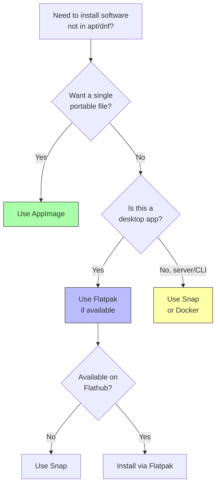

# 8. AppImage, Snap, and Flatpak

> [!info] Chapter Context
> The traditional package manager (APT, DNF) installs software that depends on system libraries. This causes "dependency hell" when an app needs a different version of `libssl` than the system provides. **AppImage**, **Snap**, and **Flatpak** solve this by bundling the app with its dependencies. This note compares all three.

Related: [[01 - Installing Apps/4. Ways to Install Apps in Linux]] | [[01 - Installing Apps/5. APT and dpkg]] | [[01 - Installing Apps/7. .tar.gz Files and Manual Installation]]

---

## 1. The Problem These Formats Solve

Traditional Linux packages (`apt`, `dnf`, etc.) share system libraries. App A depends on `libssl 1.1`; App B depends on `libssl 3`. The system cannot have both installed at the same time (in the same location). The package manager refuses to install one of them.

This is called **dependency hell**. The containerized package formats solve it by bundling each app with its own dependencies in a sandbox. Each app has its own `libssl`, `glibc`, etc.

| Format | Bundles deps? | Sandboxed? | Cross-distro? | Auto-updates? |
| :--- | :--- | :--- | :--- | :--- |
| AppImage | Yes | No (full system access) | Yes | No (mostly) |
| Snap | Yes | Yes (with exceptions) | Yes | Yes (forced) |
| Flatpak | Yes | Yes | Yes | No (manual) |

---

## 2. AppImage

AppImage is the simplest of the three. An `.AppImage` file is a single executable that contains the application and all its dependencies. You make it executable and run it — no installation, no root.

### 2.1 Installing and Running

```bash
chmod +x myapp-1.0-x86_64.AppImage
./myapp-1.0-x86_64.AppImage
```

That is it. The app runs.

### 2.2 System Integration

By default, the app does not appear in your application menu. To integrate it:

```bash
# Install AppImageLauncher (a helper tool that manages AppImages)
# https://github.com/TheAssassin/AppImageLauncher

# Or manually create a .desktop file
mkdir -p ~/.local/share/applications/
cat > ~/.local/share/applications/myapp.desktop << 'EOF'
[Desktop Entry]
Type=Application
Name=My App
Exec=/home/user/Applications/myapp-1.0-x86_64.AppImage
Icon=/home/user/Applications/myapp-icon.png
Categories=Utility;
EOF
```

After creating the `.desktop` file, the app appears in your application menu.

### 2.3 Where to Store AppImages

There is no standard location. Common choices:

- `~/Applications/` — A dedicated directory in your home folder.
- `~/opt/` — Like `/opt/`, but per-user.
- `/opt/` — System-wide (requires root to copy the file).

### 2.4 Pros and Cons

- **Pros**: No installation; no root; portable (single file); runs on any distro.
- **Cons**: No automatic updates; large file size; no system integration by default; no sandboxing (app has full user privileges).

---

## 3. Snap

Snap is Canonical's (Ubuntu's) containerized package format. Snaps run in a restricted environment with their own dependencies. The Snap Store (Canonical-operated) hosts snaps.

### 3.1 Installing Snap

On Ubuntu, snap is pre-installed. On other distros:

```bash
# Fedora
sudo dnf install snapd
sudo systemctl enable --now snapd.socket
sudo ln -s /var/lib/snapd/snap /snap

# Debian
sudo apt install snapd
sudo systemctl enable --now snapd.socket
```

### 3.2 Installing Snaps

```bash
sudo snap install code --classic       # VS Code (--classic = full system access)
sudo snap install chromium             # sandboxed
sudo snap install spotify
```

### 3.3 The `--classic` Flag

Snaps are sandboxed by default — they cannot access most of the filesystem. Some applications (IDEs, compilers) need full system access. For these, use `--classic`:

```bash
sudo snap install code --classic
sudo snap install go --classic
sudo snap install pycharm-community --classic
```

`--classic` snaps are not sandboxed — they have the same access as a traditional package. Only install `--classic` snaps from trusted publishers.

### 3.4 Managing Snaps

```bash
snap list                             # list installed snaps
snap find editor                      # search the Snap Store
sudo snap refresh code                # update one snap
sudo snap refresh                     # update all snaps
sudo snap remove code                 # remove a snap
snap info code                        # show detailed info
```

### 3.5 Auto-Updates

Snaps update automatically in the background. You cannot disable this by default (you can configure update times, but not disable updates entirely). This is controversial — some users want to control when updates happen.

### 3.6 Pros and Cons

- **Pros**: Cross-distribution; automatic updates; sandboxing; large Snap Store catalog.
- **Cons**: Larger than native packages (bundles deps); slower startup (especially first launch); forced auto-updates; `--classic` snaps defeat sandboxing; Snap Store is proprietary (Canonical-controlled).

---

## 4. Flatpak

Flatpak is the non-Canonical alternative to Snap. It is cross-distribution, sandboxed, and decentralized — anyone can host a Flatpak repository, though Flathub is the de facto standard.

### 4.1 Installing Flatpak

```bash
# Debian/Ubuntu
sudo apt install flatpak

# Fedora (usually pre-installed)
sudo dnf install flatpak

# Add the Flathub repository
flatpak remote-add --if-not-exists flathub https://flathub.org/repo/flathub.flatpakrepo
```

For desktop integration, also install the GNOME Software Flatpak plugin:

```bash
sudo apt install gnome-software-plugin-flatpak    # Debian/Ubuntu
```

### 4.2 Installing Flatpaks

```bash
flatpak install flathub com.visualstudio.Code
flatpak install flathub org.gimp.GIMP
flatpak install flathub com.spotify.Client
```

Note the application IDs — Flatpaks use reverse-DNS names (`com.visualstudio.Code`, `org.gimp.GIMP`).

### 4.3 Running Flatpaks

```bash
flatpak run com.visualstudio.Code
# Or, after install, just use the desktop launcher
```

### 4.4 Managing Flatpaks

```bash
flatpak list                                   # list installed
flatpak update                                 # update all
flatpak update com.visualstudio.Code           # update one
flatpak uninstall com.visualstudio.Code        # remove
flatpak info com.visualstudio.Code             # show info
flatpak search editor                          # search Flathub
```

### 4.5 Sandboxing and Permissions

Flatpaks are sandboxed. By default, an app can only access its own data and a few standard locations. To grant additional permissions:

```bash
flatpak override --user --filesystem=home com.visualstudio.Code
# Grants Code access to your entire home directory

flatpak override --user --show com.visualstudio.Code
# Show current overrides

# Use FlatSeal (a GUI app) for easier permission management
flatpak install flathub com.github.tchx84.Flatseal
```

### 4.6 Pros and Cons

- **Pros**: Cross-distribution; sandboxed; decentralized (anyone can host a repo); no forced updates; large Flathub catalog.
- **Cons**: Larger than native packages; some apps have permission issues with the sandbox; download sizes are big; not as integrated into Ubuntu as Snap.

---

## 5. Comparison Table

| Feature | AppImage | Snap | Flatpak |
| :--- | :--- | :--- | :--- |
| **Installation** | Make executable, run | `snap install` | `flatpak install` |
| **Root required?** | No | Yes (to install) | Yes (to install system-wide) or No (with `--user`) |
| **Bundles deps?** | Yes | Yes | Yes (with shared runtimes) |
| **Sandboxed?** | No | Yes (default) | Yes (default) |
| **Auto-updates?** | No | Yes (forced) | No (manual `flatpak update`) |
| **Cross-distro?** | Yes | Yes | Yes |
| **Repository** | None (download from project) | Snap Store (Canonical) | Flathub (or any) |
| **GUI integration** | Manual (`.desktop` file) | Automatic | Automatic (with plugin) |
| **Best for** | Single portable apps | Ubuntu integration, servers | Cross-distro desktop apps |

---

## 6. Which to Choose?



Personal recommendation:

- For desktop apps on a Linux workstation, prefer **Flatpak** (decentralized, no forced updates, well-sandboxed).
- For Ubuntu servers, **Snap** is convenient (auto-updates, large catalog).
- For single-file portable apps, **AppImage** is unbeatable (no installation, run from USB stick).
- For production servers and Docker base images, use the distribution's package manager (`apt`, `apk`) — Snap and Flatpak are not designed for server use.

---

## 7. Common Student Mistakes

> [!warning] Mistake 1 — Forgetting `chmod +x` for AppImages
> AppImages are not executable by default. Run `chmod +x myapp.AppImage` first.

> [!warning] Mistake 2 — Expecting Snap Updates to Be Controllable
> Snaps update automatically. If you need a specific version pinned, Snap is not the right choice.

> [!warning] Mistake 3 — Confusing Snap and Flatpak Application IDs
> Snaps use simple names (`code`, `spotify`). Flatpaks use reverse-DNS IDs (`com.visualstudio.Code`, `com.spotify.Client`).

> [!warning] Mistake 4 — Installing `--classic` Snaps Without Understanding
> `--classic` snaps have full system access — they are not sandboxed. Only install `--classic` snaps from trusted publishers.

> [!warning] Mistake 5 — Forgetting to Add Flathub
> After installing Flatpak, you must add the Flathub repository before you can install any apps:
> ```bash
> flatpak remote-add --if-not-exists flathub https://flathub.org/repo/flathub.flatpakrepo
> ```

> [!warning] Mistake 6 — Trying to Use Snap/Flatpak Inside Docker
> Snaps and Flatpaks are designed for desktop Linux, not containers. Use `apt`/`apk`/`dnf` for container base images.

---

## 8. Summary Checklist

- [ ] AppImage: single executable, no installation, no sandbox, no auto-updates.
- [ ] Snap: Canonical's format, sandboxed (default), forced auto-updates, `--classic` for full access.
- [ ] Flatpak: cross-distro, sandboxed, manual updates, decentralized (Flathub is the main repo).
- [ ] All three bundle dependencies, avoiding dependency hell.
- [ ] For desktop apps: prefer Flatpak (no forced updates, decentralized).
- [ ] For Ubuntu servers: Snap is convenient.
- [ ] For portable single-file apps: AppImage.
- [ ] For Docker/containers: use the distro's package manager, not Snap/Flatpak.

---

Previous: [[01 - Installing Apps/7. .tar.gz Files and Manual Installation]] | Next: [[02 - File System and Permissions/1. Paths, Inodes, and Links]]
