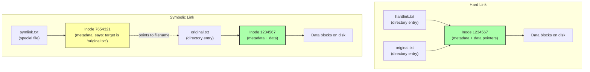

# 1. Paths, Inodes, and Links

> [!info] Chapter Context
> Linux files are organized in a single tree rooted at `/`. This note covers how paths work, what an **inode** is, and the difference between **hard links** and **symbolic (soft) links**. These concepts are foundational for understanding permissions, file system operations, and how Docker bind mounts work.

Related: [[01 - Installing Apps/3. The Filesystem Hierarchy Standard]] | [[02 - File System and Permissions/2. Permissions and Ownership]] | [[02 - File System and Permissions/3. Special Permission Bits]]

---

## 1. Paths

Every file and directory in Linux has a **path** — a string that identifies its location in the filesystem tree. There are two kinds of paths:

### 1.1 Absolute Paths

An absolute path starts with `/` (the root) and specifies the full location of a file. Examples:

- `/etc/nginx/nginx.conf`
- `/home/alice/projects/myapp/server.js`
- `/usr/bin/python3`

Absolute paths are unambiguous — they mean the same thing regardless of your current directory.

### 1.2 Relative Paths

A relative path does not start with `/`. It is interpreted relative to the **current working directory** (where you are now).

| Symbol | Meaning |
| :--- | :--- |
| `.` | The current directory. |
| `..` | The parent directory. |
| `~` | The current user's home directory (expanded by the shell). |
| `~alice` | alice's home directory. |
| (nothing) | The current directory (e.g., `myapp` is the same as `./myapp`). |

Examples (assuming you are in `/home/alice/projects`):

- `myapp/server.js` → `/home/alice/projects/myapp/server.js`
- `../documents/notes.md` → `/home/alice/documents/notes.md`
- `~/photos/cat.png` → `/home/alice/photos/cat.png`
- `./config.yml` → `/home/alice/projects/config.yml`

### 1.3 The Current Working Directory

```bash
pwd                          # print working directory
cd /tmp                      # change to /tmp
cd ..                        # go up one level
cd ~                         # go to home directory
cd                           # also goes to home directory (no argument)
cd -                         # go back to the previous directory
```

---

## 2. Inodes

Every file in a Linux filesystem has an associated **inode** (index node). The inode is a data structure that stores the file's metadata:

- File type (regular, directory, symlink, device, etc.).
- Permissions and ownership.
- Size.
- Timestamps (creation, modification, access).
- Number of hard links pointing to this inode.
- **Pointers to the actual data blocks on disk.**

What the inode does **NOT** store:

- The filename. (The filename is stored in the directory entry, not the inode.)

### 2.1 The Filename Is Just a Label

A directory is a list of (filename, inode number) pairs. The actual file metadata and data live in the inode. When you `ls /etc`, the kernel:

1. Reads the `/etc` directory's data block, which is a list of (name, inode) pairs.
2. For each inode, looks up the metadata.
3. Prints the filename, size, owner, etc.

This is why a single file can have multiple names (hard links) — multiple directory entries can point to the same inode.

### 2.2 Viewing Inodes

```bash
ls -i file.txt               # show inode number
ls -i /etc                   # show inode numbers for all files in /etc
stat file.txt                # show full file stats including inode
```

`stat` output:

```
  File: file.txt
  Size: 1234            Blocks: 8          IO Block: 4096   regular file
Device: 801h/2049d        Inode: 1234567     Links: 1
Access: (0644/-rw-r--r--)  Uid: ( 1000/ alice)   Gid: ( 1000/ alice)
Access: 2024-01-15 10:30:00.000000000 +0000
Modify: 2024-01-15 10:30:00.000000000 +0000
Change: 2024-01-15 10:30:00.000000000 +0000
 Birth: -
```

The `Inode: 1234567` is the file's inode number on this filesystem.

### 2.3 Inodes and Filesystems

Inode numbers are per-filesystem. File `/etc/passwd` on the root filesystem has inode `1234567`; file `/home/alice/file.txt` on a separate `/home` filesystem could also have inode `1234567` — they are different files on different filesystems.

This matters for hard links (next section) — you cannot hard-link across filesystems because the inode number is filesystem-local.

---

## 3. Hard Links

A **hard link** is a directory entry that points to an inode. When you create a hard link, you are creating a new filename for the same inode. Both names refer to the same data.

```bash
echo "hello" > original.txt
ln original.txt hardlink.txt

ls -li original.txt hardlink.txt
# 1234567 -rw-r--r-- 2 alice alice 6 Jan 15 10:30 hardlink.txt
# 1234567 -rw-r--r-- 2 alice alice 6 Jan 15 10:30 original.txt
```

Note the `2` in the link count column — both names point to the same inode, which has 2 hard links.

### 3.1 Hard Link Behavior

- Editing either file modifies the same data (because they are the same file).
- Deleting one name does not delete the data — the inode is only freed when the **last** hard link is deleted.
- Hard links cannot cross filesystem boundaries (because inode numbers are per-filesystem).
- Hard links cannot be made to directories (with rare exceptions, for filesystem-internal use).

### 3.2 When to Use Hard Links

Hard links are rarely used directly by users. They are useful for:

- **Backups** — Tools like `rsync --link-dest` create hard links to unchanged files, so multiple backups share storage but appear as full directory trees.
- **Saving space** — If you need the same large file in two locations, hard links avoid duplication.

For most use cases, **symbolic links** are more flexible.

---

## 4. Symbolic (Soft) Links

A **symbolic link** (symlink) is a special file that contains a path (a string) pointing to another file. When you access the symlink, the kernel follows the path and accesses the target.

```bash
ln -s original.txt symlink.txt
ls -l symlink.txt
# lrwxrwxrwx 1 alice alice 12 Jan 15 10:30 symlink.txt -> original.txt
```

The `l` at the start of the permissions indicates a symlink. The `->` shows the target.

### 4.1 Symlink Behavior

- Symlinks can point to files on different filesystems.
- Symlinks can point to directories.
- If the target is deleted, the symlink becomes a **dangling symlink** (it points to nothing).
- Symlinks have their own permissions (`lrwxrwxrwx` always), but the permissions of the target are what matter when accessing the target through the symlink.

### 4.2 Creating Symlinks

```bash
ln -s target linkname

# Examples
ln -s /opt/myapp/myapp /usr/local/bin/myapp       # symlink a binary into PATH
ln -s /etc/nginx/sites-available/myapp /etc/nginx/sites-enabled/myapp   # enable a site
ln -s ../shared/assets ./assets                    # relative symlink

# Force-create (overwrite existing)
ln -sf target linkname
```

### 4.3 Reading Symlinks

```bash
readlink symlink.txt             # show the target path
readlink -f symlink.txt          # follow all symlinks and show the final target
realpath symlink.txt             # same as readlink -f
ls -l symlink.txt                # shows the target in the listing
```

### 4.4 Symlinks vs Hard Links — Summary



| Property | Hard link | Symbolic link |
| :--- | :--- | :--- |
| Points to | Inode directly | Filename (path) |
| Crosses filesystems? | No | Yes |
| Works for directories? | No | Yes |
| If target deleted? | Data still accessible via other links | Dangling (broken) link |
| `ls -l` shows | Normal file | `lrwxrwxrwx ... -> target` |
| Created with | `ln target linkname` | `ln -s target linkname` |

---

## 5. Common Path Operations

```bash
# Get the absolute path of a file
realpath file.txt
readlink -f file.txt

# Get the directory part of a path
dirname /etc/nginx/nginx.conf        # /etc/nginx

# Get the filename part of a path
basename /etc/nginx/nginx.conf        # nginx.conf
basename /etc/nginx/nginx.conf .conf  # nginx (strip the extension)

# Find the path of a command
which python3                        # /usr/bin/python3
whereis python3                      # python3: /usr/bin/python3 /usr/lib/python3 /usr/share/man/man1/python3.1.gz
```

---

## 6. Common Student Mistakes

> [!warning] Mistake 1 — Forgetting That `cd` Without Arguments Goes Home
> `cd` (no argument) takes you to your home directory, not the previous directory. Use `cd -` to go back to the previous directory.

> [!warning] Mistake 2 — Confusing Absolute and Relative Paths in Scripts
> In a script, always use absolute paths for files you need to access. The script's current working directory may not be what you expect.

> [!warning] Mistake 3 — Trying to Hard-Link Across Filesystems
> `ln /home/alice/file /tmp/file` fails if `/home` and `/tmp` are on different filesystems. Use a symlink instead: `ln -s /home/alice/file /tmp/file`.

> [!warning] Mistake 4 — Forgetting `ln -s` Order
> `ln -s linkname target` is wrong — it creates a symlink called `target` pointing to `linkname` (which does not exist). The correct order is `ln -s target linkname` (think: "create a link to target, called linkname").

> [!warning] Mistake 5 — Expecting Symlink Permissions to Matter
> Symlinks always have `lrwxrwxrwx` permissions. This does not mean they are world-writable — the permissions of the target file are what matter when you access the target through the symlink.

> [!warning] Mistake 6 — Creating Circular Symlinks
> `ln -s a b; ln -s b a` creates a circular reference. Commands that follow symlinks (like `ls -L`) will loop forever or error out. Be careful with relative symlinks.

---

## 7. Summary Checklist

- [ ] Absolute paths start with `/`; relative paths are interpreted relative to the current directory.
- [ ] `.` is the current directory; `..` is the parent; `~` is the home directory.
- [ ] Every file has an **inode** that stores metadata and pointers to data blocks — but not the filename.
- [ ] A directory is a list of (filename, inode number) pairs.
- [ ] A **hard link** is another directory entry pointing to the same inode. Cannot cross filesystems or point to directories.
- [ ] A **symbolic link** is a special file containing a path to another file. Can cross filesystems and point to directories.
- [ ] If a symlink's target is deleted, the symlink becomes "dangling."
- [ ] `ln target linkname` creates a hard link; `ln -s target linkname` creates a symlink.
- [ ] Order matters: `ln -s target linkname` (target first, linkname second).

---

Previous: [[01 - Installing Apps/8. AppImage, Snap, and Flatpak]] | Next: [[02 - File System and Permissions/2. Permissions and Ownership]]
