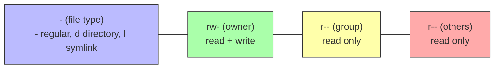

# 2. Permissions and Ownership

> [!info] Chapter Context
> Every file and directory in Linux has **permissions** that determine who can read, write, or execute it, and **ownership** that determines who the file belongs to. This note covers the `rwx` notation, the `chmod` and `chown` commands, and the special permission bits (setuid, setgid, sticky bit).

Related: [[02 - File System and Permissions/1. Paths, Inodes, and Links]] | [[02 - File System and Permissions/3. Special Permission Bits]] | [[05 - Users and Security/1. Users and Groups]]

---

## 1. The Three Permission Triplets

Every file has three sets of permissions, one each for:

- **Owner (user, u)** — The user who owns the file.
- **Group (g)** — The group that owns the file.
- **Others (o)** — Everyone else.

And three permission bits per set:

- **Read (r)** — For files: can read the contents. For directories: can list the files inside.
- **Write (w)** — For files: can modify the contents. For directories: can add or remove files.
- **Execute (x)** — For files: can run as a program. For directories: can `cd` into it.

When you run `ls -l file.txt`:

```
-rw-r--r-- 1 alice alice 1234 Jan 15 file.txt
```

The first 10 characters break down as:



### 1.1 Read the Permissions

- `-rw-r--r--` — Regular file. Owner can read/write. Group and others can only read.
- `drwxr-xr-x` — Directory. Owner can list/add/remove files. Group and others can list and `cd` into it, but cannot add/remove files.
- `-rwx------` — Regular file. Owner can read/write/execute. Group and others have no access.
- `-rw-------` — Private file. Only the owner can read/write.

---

## 2. Octal (Numeric) Notation

Permissions can also be represented as a 3-digit octal number. Each digit is the sum of:

- Read = 4
- Write = 2
- Execute = 1

| Symbolic | Octal | Meaning |
| :--- | :--- | :--- |
| `---` | 0 | No permissions |
| `--x` | 1 | Execute only |
| `-w-` | 2 | Write only |
| `-wx` | 3 | Write + execute |
| `r--` | 4 | Read only |
| `r-x` | 5 | Read + execute |
| `rw-` | 6 | Read + write |
| `rwx` | 7 | Read + write + execute |

So `chmod 755 file` means:

- Owner: 7 = rwx
- Group: 5 = r-x
- Others: 5 = r-x

`chmod 644 file` means:

- Owner: 6 = rw-
- Group: 4 = r--
- Others: 4 = r--

Common permission patterns:

| Octal | Symbolic | Typical use |
| :--- | :--- | :--- |
| `755` | `rwxr-xr-x` | Executables, directories (world-readable). |
| `700` | `rwx------` | Private directory (e.g., `~/.ssh/`). |
| `644` | `rw-r--r--` | Regular files (world-readable). |
| `600` | `rw-------` | Private files (e.g., `~/.ssh/id_rsa`). |
| `666` | `rw-rw-rw-` | World-writable file (almost always a bad idea). |
| `777` | `rwxrwxrwx` | World-writable directory (almost always a bad idea). |

---

## 3. `chmod` — Changing Permissions

### 3.1 Symbolic Notation

```bash
chmod u+x file             # add execute for owner
chmod g-w file             # remove write for group
chmod o=r file             # set others to read-only (replaces existing)
chmod ugo+rwx file         # add rwx for everyone (equivalent to a+ rwx)
chmod a+x file             # a = ugo (all); add execute for everyone
chmod u+x,g-w,o-r file     # multiple changes at once
```

### 3.2 Octal Notation

```bash
chmod 755 file             # rwxr-xr-x
chmod 644 file             # rw-r--r--
chmod 600 ~/.ssh/id_rsa    # rw------- (required for SSH keys)
chmod 700 ~/.ssh           # rwx------ (required for ~/.ssh directory)
```

### 3.3 Recursive Changes

```bash
chmod -R 755 /var/www      # apply to directory and all contents
```

> [!warning] `chmod -R` Is Dangerous
> Applying `chmod -R 755` to a directory makes every file executable — usually not what you want. To set directory and file permissions separately:
> ```bash
> find /var/www -type d -exec chmod 755 {} \;   # directories: 755
> find /var/www -type f -exec chmod 644 {} \;   # files: 644
> ```

### 3.4 The `X` (Capital) Shortcut

```bash
chmod u+X file             # add execute only if it is a directory OR already executable
chmod -R u+X /var/www      # makes directories executable but not regular files
```

`X` is useful in recursive chmods — it adds execute to directories (so you can `cd` into them) without making every file executable.

---

## 4. `chown` — Changing Ownership

```bash
sudo chown alice file.txt              # change owner to alice
sudo chown alice:developers file.txt   # change owner to alice, group to developers
sudo chown :developers file.txt        # change group only
sudo chown -R alice:alice /var/www     # recursive
```

The format is `chown [owner][:group] file`. Either owner or group can be omitted (but not both).

### 4.1 `chgrp` — Changing Group Only

```bash
sudo chgrp developers file.txt
# Equivalent to:
sudo chown :developers file.txt
```

`chgrp` is a separate command but does the same as `chown :group`.

---

## 5. Directory Permissions — A Common Confusion

Directory permissions work slightly differently from file permissions:

| Permission | Effect on a directory |
| :--- | :--- |
| `r` (read) | Can list the filenames inside (`ls`). Does NOT allow reading file contents. |
| `w` (write) | Can add, delete, or rename files inside. |
| `x` (execute) | Can `cd` into the directory and access files inside by name. |

### 5.1 The "Execute Without Read" Case

If a directory has `--x` (execute but not read), you can `cd` into it and access a file by name (if you know the name), but you cannot `ls` the directory to see what files are there.

```bash
mkdir -p /tmp/secret
echo "hello" > /tmp/secret/file.txt
chmod 711 /tmp/secret        # rwx--x--x

# As another user:
ls /tmp/secret               # Permission denied (cannot list)
cd /tmp/secret               # OK (can cd in)
cat /tmp/secret/file.txt     # OK (can access by name, IF file is readable)
```

This is how shared dropbox-style directories sometimes work — you can put files in but not see what others have put.

### 5.2 The "Read Without Execute" Case

If a directory has `r--` (read but not execute), you can `ls` the filenames but cannot `cd` in or access file contents.

### 5.3 Why Both `r` and `x` Are Usually Granted Together

For typical directories (like `/etc`), you want to both list files AND access them — so `r-x` is standard.

---

## 6. `umask` — Default Permissions for New Files

When you create a new file, the system uses a default permission and then **subtracts** the `umask`. The default for files is `666` (rw-rw-rw-); for directories, `777` (rwxrwxrwx). The umask is subtracted (bitwise, not numerically — bits are removed).

```bash
umask                       # show current umask (e.g., 022)
umask 077                   # set umask to 077
```

With `umask 022`:

- New files: `666 - 022 = 644` (rw-r--r--)
- New directories: `777 - 022 = 755` (rwxr-xr-x)

With `umask 077`:

- New files: `666 - 077 = 600` (rw-------)
- New directories: `777 - 077 = 700` (rwx------)

Set umask in `~/.bashrc` or `~/.profile` for it to persist.

> [!tip] Tight umask for Security
> On a production server, set `umask 077` so new files are private by default. You can grant access explicitly with `chmod` or `chgrp`.

---

## 7. The "Permission Denied" Checklist

When you get "Permission denied," check:

1. **Are you the owner?** If not, the "others" or "group" permissions apply.
2. **Is the file executable?** For scripts, you need `+x` (or run with `bash script.sh`).
3. **For directories**, do you have `+x`? You need it to `cd` or access files inside.
4. **Are you trying to write to a read-only file?** Check `ls -l`.
5. **Is the filesystem mounted read-only?** Check `mount | grep /path`.
6. **Is SELinux or AppArmor blocking you?** Check `ls -Z` (SELinux) or `dmesg` for AppArmor denials.

```bash
# Diagnose
ls -l file
id                              # see your UID, GID, and supplementary groups
stat file                       # see owner, group, permissions, and more
namei -l /path/to/file          # trace permissions on every component of the path
```

`namei -l` is invaluable for diagnosing "permission denied" on a deep path — it shows the permissions of every directory along the way.

---

## 8. Common Student Mistakes

> [!warning] Mistake 1 — Using `chmod 777` to "Fix" Permissions
> `chmod 777 file` makes the file world-writable. This is almost never the correct fix. Find the actual problem (wrong owner, missing execute bit, etc.) and apply the minimum necessary permission change.

> [!warning] Mistake 2 — Forgetting That Directories Need `+x`
> A directory with `rw-` permissions is useless — you cannot `cd` into it. Directories need `+x` to be accessible.

> [!warning] Mistake 3 — Forgetting to Make Scripts Executable
> A new shell script (`myapp.sh`) is not executable by default. Run `chmod +x myapp.sh` or invoke with `bash myapp.sh`.

> [!warning] Mistake 4 — `chmod -R 755` on a Directory Tree
> This makes every file executable. Use `find ... -type d -exec chmod 755` and `find ... -type f -exec chmod 644` separately.

> [!warning] Mistake 5 — Not Setting `umask` for Sensitive Directories
> If you create files in `/tmp` or a shared directory, they are world-readable by default. Use `umask 077` or set explicit permissions after creation.

> [!warning] Mistake 6 — Forgetting That `~/.ssh` Requires `700` and Keys Require `600`
> SSH refuses to use keys that are too permissive. `~/.ssh` must be `700`, `~/.ssh/id_rsa` must be `600`, and `~/.ssh/authorized_keys` must be `644` or `600`.

> [!warning] Mistake 7 — Confusing Owner and Group
> `chmod g+r` adds read for the **group**, not the owner. If you are the owner but not in the group, you use the owner permissions, not the group permissions.

---

## 9. Summary Checklist

- [ ] Every file has owner/group/others permissions, each with r/w/x.
- [ ] `ls -l` shows permissions as `-rw-r--r--`.
- [ ] Octal notation: r=4, w=2, x=1 (so `755` = rwxr-xr-x).
- [ ] `chmod` changes permissions; `chown` changes owner; `chgrp` changes group.
- [ ] Directory permissions: `r` = list, `w` = add/remove files, `x` = cd and access by name.
- [ ] `umask` sets default permissions for new files (subtracted from 666/777).
- [ ] `namei -l /path` traces permissions on every component of a path.
- [ ] Never use `chmod 777` as a quick fix; apply the minimum necessary permissions.

---

Previous: [[02 - File System and Permissions/1. Paths, Inodes, and Links]] | Next: [[02 - File System and Permissions/3. Special Permission Bits]]
