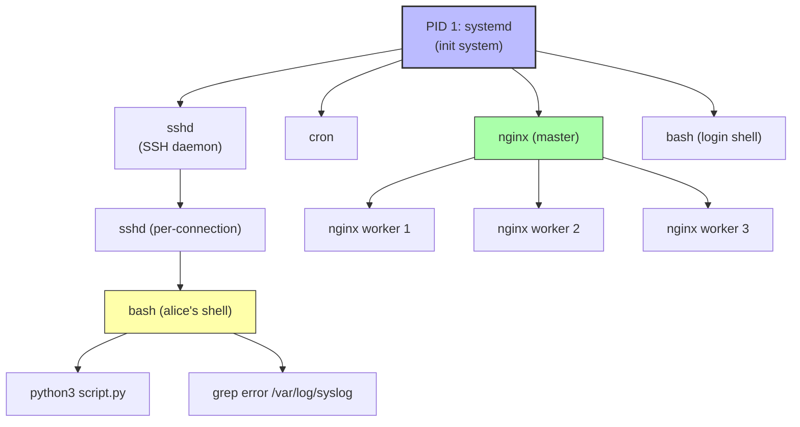

# 1. Processes and the Process Tree

> [!info] Chapter Context
> A **process** is a running program. Linux manages processes in a tree structure, with every process having a parent (except PID 1, the init system). This note covers the process tree, the `ps` and `top` commands, signals, and how to manage processes in the foreground and background.

Related: [[01 - Installing Apps/2. The Linux Kernel and User Space]] | [[03 - Processes and Services/2. Signals and Job Control]] | [[03 - Processes and Services/3. systemd and journalctl]] | [[03 - Processes and Services/4. nice and renice]]

---

## 1. What Is a Process

A **program** is a file on disk (e.g., `/usr/bin/python3`). A **process** is a running instance of that program. When you run `python3 script.py`, the kernel:

1. Reads the program file from disk.
2. Allocates memory for the process.
3. Creates a new process with a unique **PID** (Process ID).
4. Sets up the process tree (your shell is the parent).
5. Schedules the process to run on the CPU.

Every process has:

- **PID** — Unique process ID (1, 2, 3, ...).
- **PPID** — Parent process ID (the PID of the process that started it).
- **UID / GID** — The user and group running the process.
- **EUID / EGID** — Effective user/group (relevant for setuid binaries).
- **Exit code** — Set when the process terminates (0 = success, non-zero = error).
- **State** — Running, sleeping, stopped, zombie, etc.
- **Open file descriptors** — Files, sockets, pipes the process has open.
- **Environment variables** — Copied from the parent at fork time.
- **Current working directory** — Where the process "is" in the filesystem.

---

## 2. The Process Tree

Every process (except PID 1) has a parent. This creates a tree rooted at PID 1.



### 2.1 PID 1: The Init System

When Linux boots, the kernel starts a single process: PID 1. This is the **init system**. On modern Linux, this is `systemd` (on most distros) or `init` (on older systems). PID 1 is responsible for:

- Starting all other system services (networking, SSH, cron, etc.).
- Reaping orphaned zombie processes.
- Handling system shutdown.

When PID 1 dies, the kernel panics (because there is no init system). This is why PID 1 must be extremely reliable.

### 2.2 Orphans and Zombies

- **Orphan** — A process whose parent has died. The kernel reparents orphans to PID 1.
- **Zombie** — A process that has terminated but whose parent has not yet called `wait()` to retrieve its exit code. The kernel keeps the process table entry until the parent reaps it. PID 1 reaps orphaned zombies.

If a parent never reaps its children, zombies accumulate. Each zombie consumes a PID and some kernel memory. Eventually, you cannot start new processes (PID exhaustion).

---

## 3. Viewing Processes

### 3.1 `ps` — Process Snapshot

```bash
ps                            # processes in your current shell
ps aux                        # all processes, BSD-style (most common)
ps -ef                        # all processes, System V-style
ps -ef --forest               # show process tree
ps -e --forest                # tree view, alternative
ps aux | grep nginx           # filter for nginx
ps -u alice                   # processes owned by alice
ps -p 1234                    # process with PID 1234
ps -p 1234 -o pid,ppid,cmd    # custom output columns
```

The `ps aux` output:

```
USER       PID %CPU %MEM    VSZ   RSS TTY      STAT START   TIME COMMAND
root         1  0.0  0.0 168936 11428 ?        Ss   Jan01   0:23 /sbin/init
root         2  0.0  0.0      0     0 ?        S    Jan01   0:00 [kthreadd]
alice     1234  0.5  1.2 124200 25400 pts/0    R+   10:30   0:01 python3 script.py
```

Columns:

- `USER` — Owner.
- `PID` — Process ID.
- `%CPU`, `%MEM` — CPU and memory usage.
- `VSZ` — Virtual memory size (KB).
- `RSS` — Resident set size (KB of physical memory used).
- `TTY` — Terminal (or `?` for daemons).
- `STAT` — State (R=running, S=sleeping, D=uninterruptible sleep, T=stopped, Z=zombie).
- `START` — When the process started.
- `TIME` — Total CPU time used.
- `COMMAND` — The command line.

### 3.2 `top` and `htop` — Live Process View

```bash
top                           # live process view (built-in)
htop                          # nicer alternative (install with `apt install htop`)
```

In `top`:

- Press `P` to sort by CPU.
- Press `M` to sort by memory.
- Press `k` to kill a process.
- Press `q` to quit.

### 3.3 `pgrep` and `pkill` — Find and Signal by Name

```bash
pgrep nginx                   # list PIDs matching "nginx"
pgrep -a nginx                # also show the command line
pgrep -u alice                # processes owned by alice
pkill nginx                   # send SIGTERM to all "nginx" processes
pkill -9 nginx                # send SIGKILL
pkill -f "python script.py"   # match the full command line
```

---

## 4. Process States

| Code | State | Meaning |
| :--- | :--- | :--- |
| `R` | Running | Currently executing or waiting for CPU. |
| `S` | Sleeping | Waiting for an event (I/O, timer, signal). Most processes are here. |
| `D` | Uninterruptible sleep | Waiting for disk I/O. Cannot be killed (not even with SIGKILL) until the I/O completes. |
| `T` | Stopped | Suspended (e.g., by Ctrl+Z or `kill -STOP`). |
| `Z` | Zombie | Terminated but not yet reaped by parent. |
| `I` | Idle (kernel thread) | Kernel thread that is idle. |

A `+` after the state (e.g., `R+`) means the process is in the foreground process group of its terminal.

---

## 5. Foreground and Background

When you run a command in your shell, it runs in the **foreground** — your shell is blocked until it finishes. You can put a process in the **background** with `&`:

```bash
python3 long_script.py &       # runs in background, returns immediately
[1] 12345                      # job 1, PID 12345
```

### 5.1 Job Control

```bash
sleep 100                      # start in foreground
Ctrl+Z                         # suspend (SIGSTOP); the job is now stopped
bg                             # resume in background
fg                             # bring back to foreground
jobs                           # list background jobs
jobs -l                        # with PIDs
kill %1                        # kill job 1
```

### 5.2 Disowning

```bash
long_running_task &
disown                         # detach the job from the shell
# Now you can close the terminal without killing the job
```

Without `disown`, closing the terminal sends SIGHUP to all your background jobs, killing them.

> [!tip] Use `nohup` or `tmux` for Long-Running Tasks
> For long-running tasks that should survive terminal disconnects, prefer:
> - `nohup command &` — ignores SIGHUP, redirects output to `nohup.out`.
> - `tmux` or `screen` — run inside a terminal multiplexer that persists across disconnects.

---

## 6. `/proc/<pid>/` — The Process Filesystem

For every running process, the kernel exposes a directory at `/proc/<pid>/` containing live information:

```bash
ls /proc/1234/
# cmdline  cwd  environ  exe  fd  maps  mem  mounts  root  status  ...

cat /proc/1234/cmdline | tr '\0' ' '    # the command line
cat /proc/1234/environ | tr '\0' '\n'   # environment variables
ls -l /proc/1234/cwd                    # current working directory (symlink)
ls -l /proc/1234/exe                    # executable path (symlink)
ls -l /proc/1234/fd/                    # open file descriptors
cat /proc/1234/status                   # memory usage, UID, GID, threads, etc.
```

This is how `ps`, `top`, and other tools get their information — they read from `/proc`.

---

## 7. Killing Processes

```bash
kill 1234                     # send SIGTERM (default)
kill -15 1234                 # same as above (15 = SIGTERM)
kill -9 1234                  # send SIGKILL (force kill)
kill -HUP 1234                # send SIGHUP (often "reload config")
kill -l                       # list all signal names and numbers

# Kill by name:
pkill nginx
killall nginx                 # older alternative

# Kill all processes owned by a user:
sudo pkill -u alice
```

We cover signals in detail in [[03 - Processes and Services/2. Signals and Job Control]].

> [!warning] SIGKILL Is Not Graceful
> `kill -9` (SIGKILL) immediately terminates the process — no chance to clean up, flush buffers, or close files. Use SIGTERM (default `kill`) first; only use SIGKILL if the process does not respond.

---

## 8. Common Student Mistakes

> [!warning] Mistake 1 — Forgetting That Background Jobs Die When the Terminal Closes
> If you start a long task with `&` and close the terminal, it dies. Use `nohup`, `disown`, or `tmux` to survive disconnects.

> [!warning] Mistake 2 — Using `kill -9` as the Default
> `kill -9` is forceful. Use `kill` (SIGTERM) first to allow graceful shutdown. Only escalate to `kill -9` if SIGTERM does not work after a few seconds.

> [!warning] Mistake 3 — Confusing PID and Job Number
> `kill %1` kills job 1 (a shell concept). `kill 1234` kills PID 1234 (a kernel concept). They are different numbers.

> [!warning] Mistake 4 — Forgetting That `ps aux` Shows All Users
> `ps aux` shows every process on the system. `ps` (no arguments) shows only your shell's processes. To see only your processes, use `ps -u $USER`.

> [!warning] Mistake 5 — Not Knowing What PID 1 Is
> PID 1 is the init system (systemd on most distros). Killing PID 1 crashes the system. Containerized apps often run as PID 1 inside the container — they must handle signals properly (see [[03 - Docker/4. The Dockerfile]]).

> [!warning] Mistake 6 — Forgetting Zombies
> If your application forks child processes but never calls `wait()` to reap them, zombies accumulate. Eventually, PID exhaustion prevents new processes. This is why PID 1 must reap orphans.

---

## 9. Summary Checklist

- [ ] A process is a running program, identified by a unique PID.
- [ ] Every process has a parent (PPID), forming a tree rooted at PID 1 (systemd).
- [ ] `ps aux` lists all processes; `top` and `htop` show live views.
- [ ] Process states: R (running), S (sleeping), D (uninterruptible), T (stopped), Z (zombie).
- [ ] Orphans (parent died) are reparented to PID 1. Zombies (terminated, not reaped) consume PIDs.
- [ ] `&` runs in background; `Ctrl+Z` suspends; `bg`/`fg`/`jobs` manage background jobs.
- [ ] `disown` or `nohup` detaches a process from the terminal (survives disconnect).
- [ ] `/proc/<pid>/` exposes live process info (cmdline, environ, fd, status, etc.).
- [ ] `kill <pid>` sends SIGTERM (graceful); `kill -9 <pid>` sends SIGKILL (force).
- [ ] `pkill <name>` and `killall <name>` signal by name.

---

Previous: [[02 - File System and Permissions/3. Special Permission Bits]] | Next: [[03 - Processes and Services/2. Signals and Job Control]]
