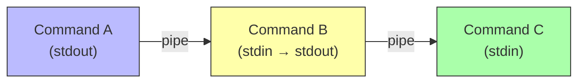

# 2. Pipelines and Redirection

> [!info] Chapter Context
> The Unix philosophy is "write programs that do one thing well, and connect them with pipes." This note covers **pipelines** (connecting commands with `|`) and **redirection** (sending output to files instead of the terminal). These are the most powerful shell features.

Related: [[04 - Shell and Text Tools/1. The Shell and Bash Basics]] | [[04 - Shell and Text Tools/4. grep, sed, and awk]] | [[04 - Shell and Text Tools/5. find and locate]]

---

## 1. Standard Streams — Recap

Every process has three standard streams (file descriptors):

| Stream | FD | Default | Used for |
| :--- | :--- | :--- | :--- |
| STDIN | 0 | Keyboard | Input. |
| STDOUT | 1 | Terminal | Normal output. |
| STDERR | 2 | Terminal | Error output. |

Redirection and piping manipulate these streams.

---

## 2. Output Redirection

### 2.1 Overwrite with `>`

```bash
ls > files.txt                 # write ls output to files.txt (overwrites)
echo "hello" > greeting.txt    # write "hello" to greeting.txt
```

If the file does not exist, it is created. If it exists, it is **truncated to zero length** before writing.

> [!warning] `>` Truncates Without Warning
> `ls > important-file.txt` destroys the contents of `important-file.txt`. Use `>>` to append instead.

### 2.2 Append with `>>`

```bash
ls >> files.txt                # append ls output to files.txt
echo "another line" >> greeting.txt
```

If the file does not exist, it is created. If it exists, the new output is appended to the end.

### 2.3 The `noclobber` Option

To prevent accidental overwrites:

```bash
set -o noclobber               # `>` will fail if the file exists
ls > files.txt                 # bash: files.txt: cannot overwrite existing file
ls >| files.txt                # `>|` overrides noclobber
set +o noclobber               # disable noclobber
```

---

## 3. Input Redirection

```bash
sort < unsorted.txt            # sort reads from unsorted.txt instead of keyboard
wc -l < file.txt               # count lines in file.txt
mysql < schema.sql             # run schema.sql in mysql
```

`<` redirects STDIN to read from a file instead of the keyboard.

---

## 4. STDERR Redirection

By default, errors go to the terminal along with normal output. To capture errors separately, redirect FD 2:

```bash
ls /nonexistent 2> errors.txt        # errors to errors.txt, normal output to terminal
ls /etc /nonexistent > out.txt 2> err.txt    # separate files
ls /etc /nonexistent > all.txt 2>&1          # both to the same file
ls /etc /nonexistent &> all.txt              # bash shorthand for `> all.txt 2>&1`
```

### 4.1 The Order of Redirections Matters

```bash
# Wrong: this redirects FD 2 to wherever FD 1 currently points (the terminal),
# then redirects FD 1 to all.txt. FD 2 still goes to the terminal.
ls /etc /nonexistent 2>&1 > all.txt

# Right: this redirects FD 1 to all.txt first, then FD 2 to wherever FD 1
# now points (all.txt). Both go to all.txt.
ls /etc /nonexistent > all.txt 2>&1
```

### 4.2 Discarding Output

```bash
ls > /dev/null                 # discard normal output
ls 2> /dev/null                # discard errors
ls &> /dev/null                # discard everything
```

`/dev/null` is a special device that discards anything written to it and returns EOF on read.

---

## 5. Pipelines

The pipe `|` connects one command's STDOUT to another command's STDIN:

```bash
ls | grep ".txt"               # list files, filter for .txt
ls | wc -l                     # count files in current directory
cat file.txt | grep error | wc -l    # count lines containing "error"
ps aux | sort -k 3 -rn | head -10    # top 10 processes by CPU
```



### 5.1 Pipes Are Concurrent

When you run `A | B`, both A and B start at the same time. A writes to the pipe; B reads from it. If A produces data faster than B can consume it, the pipe buffers it (typically 64 KB). If the buffer fills, A blocks until B drains it. If B exits before A finishes, A gets SIGPIPE on its next write and (usually) terminates.

### 5.2 Pipes and Subshells

Each command in a pipeline runs in a **subshell** (a separate process). Variables set in a pipeline do not affect the parent shell:

```bash
echo "hello" | read VAR
echo "$VAR"                    # (empty) — the VAR was set in a subshell, lost when the subshell exits
```

This is a common gotcha. To work around it:

```bash
VAR=$(echo "hello")            # use command substitution instead
echo "$VAR"                    # hello
```

### 5.3 The `PIPESTATUS` Array

In a pipeline `A | B | C`, the exit code of the whole pipeline is the exit code of C. To see each command's exit code:

```bash
ls /nonexistent | grep xyz | wc -l
echo "${PIPESTATUS[@]}"        # e.g., "2 1 0"
```

`PIPESTATUS` is a bash array; `${PIPESTATUS[0]}` is A's exit code, `[1]` is B's, etc.

### 5.4 `set -o pipefail`

By default, a pipeline's exit code is the last command's. If an earlier command fails, the pipeline still "succeeds." To make the pipeline fail if any command fails:

```bash
set -o pipefail
ls /nonexistent | grep xyz | wc -l
echo $?                        # non-zero (because ls failed)
```

This is critical in scripts where you want to detect failures in any stage of a pipeline.

---

## 6. Here-Documents and Here-Strings

### 6.1 Here-Doc (`<<`)

A here-doc feeds multi-line input to a command:

```bash
cat << 'EOF'
Hello,
this is a multi-line
message.
EOF
```

The delimiter (`EOF` here) can be any string. The shell reads until it sees a line containing only the delimiter.

- `<<EOF` (no quotes) — Variables and command substitutions are expanded.
- `<<'EOF'` (quoted) — Everything is literal, no expansion.

Common use case — feeding SQL to a database:

```bash
psql -U postgres << EOF
CREATE DATABASE myapp;
\c myapp
CREATE TABLE users (id serial PRIMARY KEY, name text);
EOF
```

### 6.2 Here-String (`<<<`)

A here-string is a one-line here-doc:

```bash
grep "hello" <<< "hello world"        # search "hello world" for "hello"
bc <<< "2 + 2"                        # 4
```

---

## 7. Process Substitution

Process substitution lets you treat a command's output as a file:

```bash
diff <(ls dir1) <(ls dir2)            # diff the listings of two directories
comm <(sort file1) <(sort file2)      # compare two sorted files
```

`<(command)` creates a temporary file-like object (actually `/dev/fd/63` or similar) that, when read, returns the output of `command`. This is incredibly useful for tools that expect file arguments.

---

## 8. tee — Write to a File and the Terminal

```bash
ls | tee files.txt                    # display ls output AND save to files.txt
ls | tee -a files.txt                 # append instead of overwrite
ls | tee file1.txt file2.txt          # write to multiple files
sudo ls /root | tee root-files.txt    # capture root-only output to a file
```

`tee` is useful when you want to see output in the terminal AND save it to a file. It is also useful for writing to files that require root, when the command itself does not:

```bash
echo "config" | sudo tee /etc/myapp.conf > /dev/null
```

---

## 9. Common Pipeline Patterns

### 9.1 Search and Count

```bash
grep "ERROR" /var/log/syslog | wc -l
grep -c "ERROR" /var/log/syslog        # equivalent (built-in -c)
```

### 9.2 Top N by Some Criterion

```bash
ps aux | sort -k 3 -rn | head -10      # top 10 by CPU (column 3, reverse numeric)
du -sh /var/* | sort -rh | head -10    # top 10 largest directories in /var
```

### 9.3 Find Files and Act on Them

```bash
find . -name "*.log" -exec grep "ERROR" {} \;
find . -name "*.log" | xargs grep "ERROR"
```

### 9.4 Extract and Transform

```bash
# Extract the 2nd column of a CSV, sort, get unique values, count
cut -d, -f2 data.csv | sort | uniq -c | sort -rn
```

### 9.5 Filter, Transform, Save

```bash
cat access.log | grep " 404 " | awk '{print $7}' | sort | uniq -c | sort -rn | head -20 > top-404s.txt
```

---

## 10. Common Student Mistakes

> [!warning] Mistake 1 — Redirection Order
> `cmd 2>&1 > file` does NOT send everything to file. It sends FD 2 to the terminal (where FD 1 currently points), then FD 1 to file. Use `cmd > file 2>&1` or `cmd &> file`.

> [!warning] Mistake 2 — Overwriting Files with `>`
> `cmd > important.txt` destroys the existing contents. Use `>>` to append, or `set -o noclobber` to prevent accidental overwrites.

> [!warning] Mistake 3 — Forgetting That Pipe Stages Run in Subshells
> Variables set in a pipeline stage do not affect the parent shell. Use command substitution `$(...)` if you need to capture output.

> [!warning] Mistake 4 — Not Using `set -o pipefail` in Scripts
> By default, a pipeline "succeeds" if the last command succeeds, even if earlier commands failed. Use `set -o pipefail` in scripts to detect any failure.

> [!warning] Mistake 5 — Using `cat file | grep` Instead of `grep file`
> `cat file | grep pattern` is a useless use of cat. Just do `grep pattern file`. (This is such a common mistake it has its own acronym: UUOC.)

> [!warning] Mistake 6 — Forgetting `tee` When You Need Both Display and File
> `cmd > file` shows nothing in the terminal. Use `cmd | tee file` to see output and save it.

---

## 11. Summary Checklist

- [ ] Three standard streams: STDIN (0), STDOUT (1), STDERR (2).
- [ ] `>` overwrites; `>>` appends; `<` redirects input.
- [ ] `2>` redirects STDERR; `2>&1` redirects STDERR to wherever STDOUT points.
- [ ] `&>` (bash) redirects both STDOUT and STDERR.
- [ ] `/dev/null` discards output.
- [ ] Pipes `|` connect one command's STDOUT to another's STDIN; commands run concurrently.
- [ ] `PIPESTATUS` array shows each pipeline stage's exit code.
- [ ] `set -o pipefail` makes a pipeline fail if any stage fails.
- [ ] Here-docs (`<<EOF`) feed multi-line input; here-strings (`<<<`) feed single-line input.
- [ ] Process substitution `<(cmd)` treats a command's output as a file.
- [ ] `tee` writes to a file AND the terminal.

---

Previous: [[04 - Shell and Text Tools/1. The Shell and Bash Basics]] | Next: [[04 - Shell and Text Tools/3. tar and Archive Tools]]
