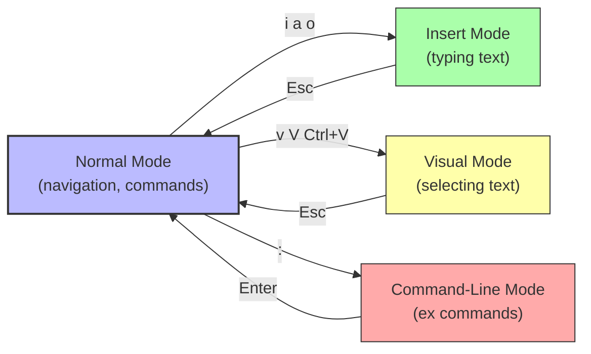

# 6. vim and nano Editors

> [!info] Chapter Context
> On a Linux server (especially via SSH), you often need to edit config files without a GUI. The two most common terminal editors are **nano** (beginner-friendly) and **vim** (powerful, steeper learning curve). This note covers both, with the everyday commands you need.

Related: [[04 - Shell and Text Tools/1. The Shell and Bash Basics]] | [[03 - Processes and Services/3. systemd and journalctl]]

---

## 1. nano — The Beginner Editor

`nano` is a simple, modeless editor. What you type appears in the file. Commands are at the bottom of the screen, prefixed with `^` (Ctrl).

### 1.1 Opening and Saving

```bash
nano file.txt                       # open file.txt (creates if it does not exist)
nano +10 file.txt                   # open at line 10
nano -B file.txt                    # create a backup before saving
```

| Shortcut | Action |
| :--- | :--- |
| `Ctrl+O` | Save (write out). Prompts for filename; press Enter to confirm. |
| `Ctrl+X` | Exit. Prompts to save if there are unsaved changes. |
| `Ctrl+G` | Help. |
| `Ctrl+K` | Cut the current line (or selected text). |
| `Ctrl+U` | Paste (uncut) the cut text. |
| `Ctrl+W` | Search. |
| `Ctrl+\` | Search and replace. |
| `Ctrl+_` | Go to line number. |
| `Alt+G` | Go to line (alternative). |
| `Ctrl+A` | Move to start of line. |
| `Ctrl+E` | Move to end of line. |
| `Ctrl+Y` | Page up. |
| `Ctrl+V` | Page down. |

nano is the default editor on Ubuntu and Debian. It is the right choice for quick edits and for users who do not want to learn vim.

---

## 2. vim — The Powerful Editor

vim (Vi IMproved) is a modal editor. It has multiple modes:

- **Normal mode** — For navigation and commands (default when you open a file).
- **Insert mode** — For typing text (entered with `i`, `a`, `o`, etc.).
- **Visual mode** — For selecting text (entered with `v`, `V`, or `Ctrl+V`).
- **Command-line mode** — For ex commands like save, quit, search (entered with `:`).

### 2.1 The Modal Confusion

The #1 confusion for new vim users: you start in Normal mode, not Insert mode. If you try to type immediately, your keystrokes are interpreted as commands, often with surprising results. Press `i` first to enter Insert mode, then type. Press `Esc` to return to Normal mode.



### 2.2 The Minimum You Need to Know

If you only memorize five things:

1. Press `i` to enter Insert mode and start typing.
2. Press `Esc` to return to Normal mode.
3. To save and quit: `Esc`, then `:wq`, then `Enter`.
4. To quit without saving: `Esc`, then `:q!`, then `Enter`.
5. To move around in Normal mode: arrow keys work (for beginners), or `h` `j` `k` `l` (vim-style).

### 2.3 Movement (Normal Mode)

| Key | Action |
| :--- | :--- |
| `h` `j` `k` `l` | Left, down, up, right. |
| `0` | Start of line. |
| `^` | First non-blank character of line. |
| `$` | End of line. |
| `w` | Next word. |
| `b` | Previous word. |
| `gg` | First line of file. |
| `G` | Last line of file. |
| `:42` | Go to line 42. |
| `Ctrl+d` | Half page down. |
| `Ctrl+u` | Half page up. |
| `Ctrl+f` | Full page down. |
| `Ctrl+b` | Full page up. |

### 2.4 Editing (Normal Mode)

| Key | Action |
| :--- | :--- |
| `i` | Insert before cursor. |
| `a` | Insert after cursor. |
| `I` | Insert at start of line. |
| `A` | Insert at end of line. |
| `o` | Open a new line below and insert. |
| `O` | Open a new line above and insert. |
| `x` | Delete character under cursor. |
| `dd` | Delete (cut) current line. |
| `dw` | Delete word. |
| `D` | Delete to end of line. |
| `u` | Undo. |
| `Ctrl+r` | Redo. |
| `yy` | Yank (copy) current line. |
| `p` | Paste after cursor. |
| `P` | Paste before cursor. |
| `r<char>` | Replace single character. |
| `cw` | Change word (delete and enter Insert mode). |

### 2.5 Searching

| Key | Action |
| :--- | :--- |
| `/pattern` | Search forward. Press `Enter` to start, `n` for next match, `N` for previous. |
| `?pattern` | Search backward. |
| `*` | Search for the word under the cursor. |
| `:s/old/new/g` | Replace all "old" with "new" on current line. |
| `:%s/old/new/g` | Replace all "old" with "new" in the whole file. |
| `:%s/old/new/gc` | Same, but confirm each replacement. |

### 2.6 Command-Line Mode (`:`)

| Command | Action |
| :--- | :--- |
| `:w` | Save. |
| `:q` | Quit (fails if unsaved changes). |
| `:wq` or `:x` | Save and quit. |
| `:q!` | Quit without saving (force). |
| `:w filename` | Save as filename. |
| `:set number` | Show line numbers. |
| `:set paste` | Disable auto-indent (for pasting). |
| `:set nopaste` | Re-enable auto-indent. |
| `:!command` | Run a shell command. |
| `:%!sort` | Pipe the whole file through `sort`. |

### 2.7 Visual Mode

| Key | Action |
| :--- | :--- |
| `v` | Start character-wise selection. |
| `V` | Start line-wise selection. |
| `Ctrl+V` | Start block-wise selection (rectangular). |
| (after selecting) `d` | Delete. |
| (after selecting) `y` | Yank (copy). |
| (after selecting) `>` | Indent. |
| (after selecting) `<` | Unindent. |

### 2.8 Configuration: `~/.vimrc`

```vim
" Show line numbers
set number

" Use spaces instead of tabs
set expandtab
set tabstop=4
set shiftwidth=4

" Highlight search matches
set hlsearch
set incsearch

" Enable syntax highlighting
syntax on

" Show matching brackets
set showmatch

" Enable mouse
set mouse=a
```

---

## 3. Setting the Default Editor

Some commands (like `visudo`, `crontab -e`, `git commit`) open your default editor. Set it with:

```bash
# Set vim as the default
export EDITOR=vim
export VISUAL=vim

# Set nano as the default
export EDITOR=nano
export VISUAL=nano
```

Add to `~/.bashrc` to make permanent. On Debian/Ubuntu, you can also use:

```bash
sudo update-alternatives --config editor
```

---

## 4. When to Use Which

- **nano** — Quick edits, beginners, simple config files.
- **vim** — Anything complex (multiple files, large files, regex search-and-replace, scripting).
- **emacs** — A third option (not covered here); a full environment, not just an editor.
- **VS Code (via SSH)** — For serious development work, use VS Code's "Remote - SSH" extension to edit files on a remote server with a full GUI editor.

---

## 5. Common Student Mistakes

> [!warning] Mistake 1 — Typing in vim Before Pressing `i`
> vim starts in Normal mode. Press `i` (or `a`, `o`) to enter Insert mode first.

> [!warning] Mistake 2 — Forgetting to Press `Esc` Before `:wq`
> The `:` command only works in Normal mode. Press `Esc` first to ensure you are in Normal mode.

> [!warning] Mistake 3 — Trying to Quit vim by Closing the Terminal
> This leaves vim running in the background (or kills it without saving). Always quit with `:wq` or `:q!`.

> [!warning] Mistake 4 — Forgetting `:%s/old/new/g` for Global Replace
> `:s/old/new/` only replaces the first occurrence on the current line. Use `:%s/old/new/g` for the whole file.

> [!warning] Mistake 5 — Using `Ctrl+S` in vim
> `Ctrl+S` is "save" in GUI editors, but in a terminal it freezes the output (XOFF). To unfreeze, press `Ctrl+Q`. To save in vim, use `:w`.

> [!warning] Mistake 6 — Forgetting to `set paste` Before Pasting
> vim's auto-indent mangles pasted text. Run `:set paste` before pasting, then `:set nopaste` after.

---

## 6. Summary Checklist

- [ ] **nano** is modeless; what you type appears. `Ctrl+O` save, `Ctrl+X` exit.
- [ ] **vim** is modal: Normal (commands), Insert (typing), Visual (selecting), Command-line (`:`).
- [ ] In vim: `i` to insert, `Esc` to return to Normal, `:wq` to save and quit, `:q!` to force-quit.
- [ ] Movement: `h j k l` (or arrows), `gg` first line, `G` last line, `:N` line N.
- [ ] `dd` delete line, `yy` yank line, `p` paste, `u` undo, `Ctrl+r` redo.
- [ ] `/pattern` search; `n` next, `N` previous; `:%s/old/new/g` global replace.
- [ ] Configure vim in `~/.vimrc`.
- [ ] Set default editor with `export EDITOR=vim` (or `nano`) in `~/.bashrc`.

---

Previous: [[04 - Shell and Text Tools/5. find and locate]] | Next: [[05 - Users and Security/1. Users and Groups]]
