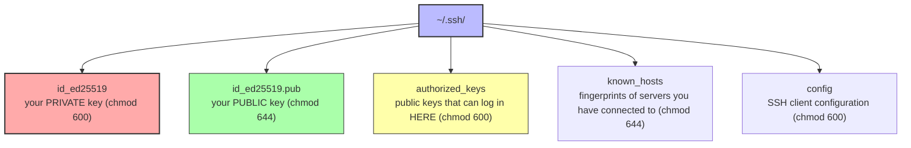

# 3. SSH and Key Management

> [!info] Chapter Context
> **SSH** (Secure Shell) is how you connect to remote Linux servers securely. This note covers the SSH client, key generation, the `~/.ssh/` directory, `ssh-agent`, `scp`, `rsync`, and hardening the SSH server.

Related: [[05 - Users and Security/2. sudo and Privilege Escalation]] | [[02 - File System and Permissions/2. Permissions and Ownership]] | [[06 - Networking/1. Networking Fundamentals]]

---

## 1. SSH Basics

SSH lets you log into a remote machine and run commands as if you were sitting at its keyboard. All traffic (including the password) is encrypted.

```bash
ssh alice@server.example.com              # log in as alice
ssh alice@192.168.1.100                   # by IP
ssh server                                # uses ~/.ssh/config (see below)
ssh -p 2222 alice@server                  # non-default port
ssh alice@server "uname -a"               # run one command and exit
ssh -t alice@server "tmux attach"         # force a TTY (needed for tmux, screen)
```

---

## 2. SSH Key Authentication

Password authentication is vulnerable to brute force. **Key authentication** is more secure and more convenient.

### 2.1 Generating a Key Pair

```bash
ssh-keygen -t ed25519                              # modern, recommended (Elliptic Curve)
ssh-keygen -t rsa -b 4096                          # older, still widely supported
ssh-keygen -t ed25519 -C "alice@laptop"            # with a comment
ssh-keygen -t ed25519 -f ~/.ssh/myapp_key          # save to a specific file
```

You will be prompted for:

- **File location** — Default is `~/.ssh/id_ed25519` (private key) and `~/.ssh/id_ed25519.pub` (public key).
- **Passphrase** — Optional but recommended. Encrypts the private key on disk. Even if someone steals the private key file, they cannot use it without the passphrase.

> [!tip] Prefer `ed25519`
> `ed25519` keys are smaller, faster, and at least as secure as RSA-4096. Use RSA only if you need compatibility with very old systems.

### 2.2 The Key Pair

- **Private key** (`~/.ssh/id_ed25519`) — Stays on your laptop. NEVER share it. NEVER commit it to Git.
- **Public key** (`~/.ssh/id_ed25519.pub`) — Goes on the remote server in `~/.ssh/authorized_keys`. Can be shared freely.

### 2.3 Copying Your Public Key to a Server

```bash
ssh-copy-id alice@server.example.com              # the easy way
ssh-copy-id -i ~/.ssh/myapp_key.pub alice@server  # specific key

# Manual way (if ssh-copy-id is not available)
cat ~/.ssh/id_ed25519.pub | ssh alice@server "mkdir -p ~/.ssh && cat >> ~/.ssh/authorized_keys"
```

After this, you can SSH without a password (assuming your private key has no passphrase, or you have unlocked it with `ssh-agent`).

### 2.4 The `~/.ssh/` Directory

The `~/.ssh/` directory contains:



> [!danger] SSH Is Picky About Permissions
> If `~/.ssh` is not `700`, or `id_ed25519` is not `600`, or `authorized_keys` is not `600`, SSH refuses to use them (security feature). Fix with:
> ```bash
> chmod 700 ~/.ssh
> chmod 600 ~/.ssh/id_ed25519 ~/.ssh/authorized_keys ~/.ssh/config
> chmod 644 ~/.ssh/id_ed25519.pub ~/.ssh/known_hosts
> ```

---

## 3. The SSH Client Config File

`~/.ssh/config` lets you define aliases for hosts, so you do not have to type the full command every time:

```
# ~/.ssh/config

Host myserver
    HostName server.example.com
    User alice
    Port 2222
    IdentityFile ~/.ssh/myapp_key

Host github.com
    User git
    IdentityFile ~/.ssh/github_key

Host *.internal
    User admin
    StrictHostKeyChecking no
    UserKnownHostsFile /dev/null
```

Now you can:

```bash
ssh myserver                # equivalent to: ssh -p 2222 -i ~/.ssh/myapp_key alice@server.example.com
ssh web01.internal          # uses the *.internal settings
```

---

## 4. `ssh-agent` and Key Passphrases

If your private key has a passphrase, you would have to type it every time you SSH. `ssh-agent` caches the unlocked key in memory for the duration of your session.

```bash
eval "$(ssh-agent -s)"              # start the agent
ssh-add ~/.ssh/id_ed25519           # add the key (prompts for passphrase once)
ssh alice@server                    # no passphrase needed
```

On macOS, the agent is built into Keychain. On Linux, you typically use `keychain` or a desktop environment's agent.

### 4.1 Agent Forwarding

Agent forwarding lets you SSH from server A to server B using the key on your laptop, without copying the private key to server A.

```
# ~/.ssh/config
Host serverA
    ForwardAgent yes
```

```bash
ssh serverA                 # logs into A
ssh serverB                 # from A, logs into B using your laptop's key (via agent forwarding)
```

> [!warning] Agent Forwarding Security Risk
> Agent forwarding lets the remote server (A) use your SSH agent. If A is compromised, the attacker can use your agent to authenticate to other servers as you. Only enable forwarding for trusted servers.

---

## 5. Copying Files: `scp` and `rsync`

### 5.1 `scp` — Simple Copy

```bash
scp file.txt alice@server:/home/alice/                # local → remote
scp alice@server:/var/log/syslog ./                   # remote → local
scp -r mydir/ alice@server:/home/alice/               # recursive (directory)
scp -P 2222 file.txt alice@server:~/                  # non-default port (capital P)
scp alice@server:~/file.txt bob@other-server:~/       # remote → remote (via your laptop)
```

### 5.2 `rsync` — Efficient Sync

`rsync` is more powerful than `scp`:

- Only transfers the differences (incremental sync).
- Supports `--exclude`, `--include` patterns.
- Resumes interrupted transfers.
- Preserves permissions, ownership, timestamps.

```bash
rsync -avz mydir/ alice@server:/home/alice/mydir/     # archive, verbose, compress
rsync -avz --delete mydir/ alice@server:/home/alice/mydir/   # delete files on remote that no longer exist locally
rsync -avz --exclude='*.pyc' --exclude='__pycache__' mydir/ alice@server:/home/alice/mydir/
rsync -avz -e "ssh -p 2222" mydir/ alice@server:~/mydir/    # non-default port
```

> [!warning] Trailing Slash Matters in `rsync`
> - `rsync mydir/ remote:` copies the CONTENTS of `mydir` to `remote:`.
> - `rsync mydir remote:` copies the `mydir` directory itself to `remote:mydir`.
>
> This is the #1 `rsync` gotcha.

---

## 6. Hardening the SSH Server

On a production server, edit `/etc/ssh/sshd_config`:

```ini
# Disable root login
PermitRootLogin no

# Disable password authentication (key-only)
PasswordAuthentication no
PubkeyAuthentication yes

# Reduce the login grace period
LoginGraceTime 30

# Limit who can SSH in
AllowUsers alice bob

# Change the port (security through obscurity; reduces automated attacks)
Port 2222

# Disable X11 forwarding if not needed
X11Forwarding no

# Disable empty passwords
PermitEmptyPasswords no

# Limit authentication attempts
MaxAuthTries 3
```

After editing, validate and restart:

```bash
sudo sshd -t                          # validate config
sudo systemctl restart sshd
```

### 6.1 `fail2ban` for Brute-Force Protection

`fail2ban` monitors logs and bans IPs that fail to authenticate repeatedly:

```bash
sudo apt install fail2ban
sudo systemctl enable --now fail2ban
```

Default config bans an IP for 10 minutes after 5 failed SSH attempts.

---

## 7. SSH Tunneling

SSH can tunnel traffic through an encrypted connection, useful for accessing services on a remote network.

### 7.1 Local Port Forwarding

```bash
ssh -L 8080:localhost:80 alice@server
# Forwards localhost:8080 on your laptop → port 80 on `server`
```

Now `curl http://localhost:8080` on your laptop hits Nginx on `server`.

Use case: access a remote database that only listens on `localhost` of the server.

### 7.2 Remote Port Forwarding

```bash
ssh -R 8080:localhost:80 alice@server
# Forwards port 8080 on `server` → port 80 on your laptop
```

Use case: expose a local development server to someone on the remote network.

### 7.3 Dynamic Port Forwarding (SOCKS Proxy)

```bash
ssh -D 1080 alice@server
# SOCKS proxy on localhost:1080, tunneled through `server`
```

Configure your browser to use SOCKS5 at `localhost:1080`, and all your traffic goes through `server`.

---

## 8. Common Student Mistakes

> [!warning] Mistake 1 — Wrong Permissions on `~/.ssh`
> SSH refuses to use keys if permissions are too open. `~/.ssh` must be `700`, private keys `600`, `authorized_keys` `600`.

> [!warning] Mistake 2 — Committing a Private Key to Git
> NEVER commit `~/.ssh/id_*` (without `.pub`) to Git. Add `~/.ssh/id_*` to `.gitignore`. If you accidentally commit a private key, generate a new key pair and remove the old one from all servers.

> [!warning] Mistake 3 — Forgetting to Copy the Public Key to the Server
> `ssh-keygen` creates the key pair on your laptop. To use it, you must copy the PUBLIC key to `~/.ssh/authorized_keys` on the server. Use `ssh-copy-id`.

> [!warning] Mistake 4 — Using Password Authentication in Production
> Passwords are vulnerable to brute force. Use key authentication. Set `PasswordAuthentication no` in `sshd_config`.

> [!warning] Mistake 5 — Enabling Root Login over SSH
> `PermitRootLogin yes` lets attackers brute-force the root password. Set `PermitRootLogin no`. Use `sudo` for admin tasks.

> [!warning] Mistake 6 — Confusing `scp`'s `-P` (port) with `ssh`'s `-p`
> `scp -P 2222 ...` (capital P); `ssh -p 2222 ...` (lowercase p). Easy to mix up.

> [!warning] Mistake 7 — Forgetting the Trailing Slash in `rsync`
> `rsync dir/ remote:` copies the contents of `dir`. `rsync dir remote:` copies `dir` itself. Always check the trailing slash.

---

## 9. Summary Checklist

- [ ] `ssh user@host` connects to a remote server.
- [ ] Generate keys with `ssh-keygen -t ed25519` (preferred) or `ssh-keygen -t rsa -b 4096`.
- [ ] Private key stays on your laptop (`chmod 600`); public key goes in `~/.ssh/authorized_keys` on the server.
- [ ] Use `ssh-copy-id` to copy your public key to a server.
- [ ] `~/.ssh/` must be `700`; private keys and `authorized_keys` must be `600`.
- [ ] `~/.ssh/config` lets you define host aliases (so you do not type the full command every time).
- [ ] `ssh-agent` caches unlocked keys; `ssh-add` adds a key to the agent.
- [ ] `scp` for simple copies; `rsync` for efficient syncs (mind the trailing slash!).
- [ ] Harden the server: `PermitRootLogin no`, `PasswordAuthentication no`, `fail2ban`.
- [ ] SSH tunneling: `-L` (local forward), `-R` (remote forward), `-D` (SOCKS proxy).

---

Previous: [[05 - Users and Security/2. sudo and Privilege Escalation]] | Next: [[06 - Networking/1. Networking Fundamentals]]
