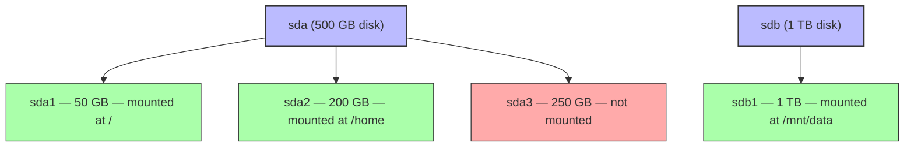

# 1. Disk Usage and Filesystems

> [!info] Chapter Context
> Disk space runs out. This note covers `df` (filesystem usage), `du` (directory usage), `mount` (filesystem management), and `/etc/fstab` (persistent mounts). These are the everyday tools for managing disk on a Linux server.

Related: [[06 - Networking/1. Networking Fundamentals]] | [[01 - Installing Apps/3. The Filesystem Hierarchy Standard]] | [[08 - Automation/1. Cron and systemd Timers]]

---

## 1. `df` — Filesystem Disk Space

```bash
df                              # all mounted filesystems
df -h                           # human-readable (KB, MB, GB)
df -h /                         # just the filesystem containing /
df -h /var                      # how much space does /var have?
df -T                           # show filesystem type (ext4, xfs, tmpfs, etc.)
df -i                           # show inode usage (see below)
df -x tmpfs -x devtmpfs         # exclude pseudo-filesystems
```

Output:

```
Filesystem      Size  Used Avail Use% Mounted on
/dev/sda1        50G   20G   28G  42% /
/dev/sda2       200G  150G   40G  79% /home
tmpfs           2.0G  1.2G  800M  60% /tmp
```

- `Size` — Total size of the filesystem.
- `Used` — How much is used.
- `Avail` — How much is free.
- `Use%` — Percentage used.
- `Mounted on` — Where the filesystem is mounted in the directory tree.

> [!tip] Monitor `Use%`
> If `Use%` goes above 90%, the filesystem is dangerously full. Many services (MySQL, Docker) behave unpredictably when disk is full. Set up monitoring (CloudWatch, Prometheus) to alert at 80%.

### 1.1 Inode Usage

```bash
df -i                           # show inode usage
```

```
Filesystem      Inodes IUsed IFree IUse% Mounted on
/dev/sda1        3.2M  200K  3.0M    7% /
```

Every file consumes one inode. If you run out of inodes (IUse% = 100%), you cannot create new files even if you have disk space. This happens with workloads that create millions of tiny files (e.g., mail servers, cache directories).

---

## 2. `du` — Directory Disk Usage

```bash
du -sh /var                     # total size of /var (human-readable, summary)
du -sh /var/*                   # size of each subdirectory of /var
du -h /var/log | sort -rh | head -10    # 10 largest items in /var/log
du -sh --max-depth=1 /          # top-level directories with sizes
du -ah /var/log | sort -rh | head -20   # 20 largest files in /var/log
du -sh --exclude='*.log' .      # exclude .log files
du -csh /home/alice /home/bob   # multiple directories with grand total
```

- `-s` — Summary (do not recurse into subdirectories).
- `-h` — Human-readable.
- `-a` — All files (not just directories).
- `-c` — Grand total at the end.
- `--max-depth=N` — Recurse N levels deep.
- `--exclude=PATTERN` — Exclude matching files.

### 2.1 Finding the Largest Files

```bash
# Largest files in the current directory tree
find . -type f -exec du -h {} + 2>/dev/null | sort -rh | head -20

# Largest directories
du -h --max-depth=2 / 2>/dev/null | sort -rh | head -20

# Largest items in /var
sudo du -sh /var/* 2>/dev/null | sort -rh | head -10
```

---

## 3. `mount` and `umount`

### 3.1 Viewing Mounted Filesystems

```bash
mount                           # list all mounted filesystems
findmnt                         # nicer tree view
lsblk                           # list block devices and their mount points
```

### 3.2 Mounting a Filesystem

```bash
sudo mount /dev/sdb1 /mnt/data              # mount /dev/sdb1 at /mnt/data
sudo mount -t ext4 /dev/sdb1 /mnt/data      # specify filesystem type
sudo mount -o ro /dev/sdb1 /mnt/data        # read-only
sudo mount -o remount,rw /                  # remount / as read-write (e.g., after a crash)
sudo mount -t nfs server:/share /mnt/nfs    # NFS mount
sudo mount -t tmpfs -o size=1G tmpfs /mnt/ramdisk   # RAM-backed filesystem
```

### 3.3 Unmounting

```bash
sudo umount /mnt/data                       # unmount
sudo umount -l /mnt/data                    # lazy unmount (detaches now, cleans up when busy)
sudo umount -f /mnt/data                    # force unmount (NFS)
```

If you get "target is busy", something is using the filesystem:

```bash
sudo lsof +D /mnt/data                      # find processes using files in /mnt/data
sudo fuser -v /mnt/data                     # alternative
```

Kill the processes, then unmount.

---

## 4. `/etc/fstab` — Persistent Mounts

`/etc/fstab` defines filesystems that should be mounted at boot:

```
# <device>           <mount point>  <type>  <options>          <dump> <pass>
/dev/sda1            /              ext4    errors=remount-ro  0      1
/dev/sda2            /home          ext4    defaults           0      2
/dev/sdb1            /mnt/data      ext4    defaults           0      2
tmpfs                /tmp           tmpfs   defaults,size=2G   0      0
server:/share        /mnt/nfs       nfs     defaults           0      0
```

Fields:

1. **Device** — Block device (`/dev/sdb1`), UUID (`UUID=abc-123`), label (`LABEL=data`), or network path (`server:/share`).
2. **Mount point** — Where to mount it.
3. **Type** — `ext4`, `xfs`, `tmpfs`, `nfs`, etc.
4. **Options** — `defaults`, `ro` (read-only), `noexec` (no executables), `nosuid`, `size=2G` (for tmpfs), etc.
5. **Dump** — Whether the `dump` utility should back it up (mostly obsolete; use `0`).
6. **Pass** — Order of `fsck` at boot (`0` = do not check, `1` = first, `2` = after `/`).

### 4.1 Using UUIDs (Recommended)

Device names (`/dev/sdb1`) can change between reboots. UUIDs are stable:

```bash
sudo blkid                                   # list devices and their UUIDs
```

```
/dev/sda1: UUID="abc-123-def" TYPE="ext4"
/dev/sdb1: UUID="ghi-456-jkl" TYPE="ext4"
```

Use the UUID in `/etc/fstab`:

```
UUID=abc-123-def    /               ext4    errors=remount-ro  0  1
UUID=ghi-456-jkl    /mnt/data       ext4    defaults           0  2
```

### 4.2 Testing fstab Changes

```bash
sudo mount -a                                # mount everything in fstab (without rebooting)
sudo umount /mnt/data && sudo mount /mnt/data    # remount just one entry
```

> [!danger] Test fstab Changes Before Rebooting
> A syntax error in `/etc/fstab` can prevent the system from booting. After editing, always run `sudo mount -a` to test. If it works, the system will boot normally.

---

## 5. `lsblk` — Block Devices

```bash
lsblk                                        # tree view of block devices
lsblk -f                                     # with filesystem info
lsblk -o NAME,SIZE,TYPE,MOUNTPOINT,UUID      # custom columns
```

Output (showing the disk layout):



This shows physical disks (`sda`, `sdb`), their partitions (`sda1`, `sda2`, etc.), and where they are mounted.

---

## 6. Common Disk Scenarios

### 6.1 "Disk Full"

```bash
df -h                            # find which filesystem is full
sudo du -sh /var/* | sort -rh | head -10    # find the biggest directories
sudo du -ah /var/log | sort -rh | head -20  # find the biggest files
```

Common culprits:

- **`/var/log`** — Old logs not rotated.
- **`/var/lib/docker`** — Old Docker images and containers. Run `docker system prune -a`.
- **`/tmp`** — Temporary files not cleaned up.
- **`/var/cache/apt`** — APT package cache. Run `sudo apt clean`.
- **`~/.cache`** — Per-user caches (pip, npm, etc.).

### 6.2 "Inode Exhaustion"

```bash
df -i                            # check inode usage
sudo find / -xdev -printf '%h\n' | cut -d/ -f1-3 | sort | uniq -c | sort -rn | head   # find directories with the most files
```

Common culprits: mail spools, session caches, container overlay layers.

### 6.3 Attaching a New Disk (Cloud)

On AWS, after attaching an EBS volume:

```bash
lsblk                            # see the new device (e.g., /dev/xvdf)
sudo mkfs.ext4 /dev/xvdf         # format it (ONLY if it is a new, empty volume!)
sudo mkdir /mnt/data
sudo mount /dev/xvdf /mnt/data   # mount it

# Add to /etc/fstab for persistence
echo "/dev/xvdf /mnt/data ext4 defaults 0 2" | sudo tee -a /etc/fstab
```

> [!danger] `mkfs` Erases the Disk
> `mkfs.ext4 /dev/xvdf` formats the disk, destroying any existing data. Only do this on a NEW, empty disk. If the disk already has data you want to keep, do NOT format it — just mount it.

---

## 7. Common Student Mistakes

> [!warning] Mistake 1 — Editing `/etc/fstab` Without Testing
> A typo in `/etc/fstab` can prevent the system from booting. Always test with `sudo mount -a` after editing.

> [!warning] Mistake 2 — Formatting a Disk That Has Data
> `mkfs.ext4 /dev/sdb1` erases everything on `/dev/sdb1`. Double-check the device name with `lsblk` before formatting.

> [!warning] Mistake 3 — Forgetting to Use UUIDs in `/etc/fstab`
> Device names (`/dev/sdb1`) can change between reboots. UUIDs are stable. Use `sudo blkid` to find the UUID.

> [!warning] Mistake 4 — Forgetting to Clean Up Docker
> `docker system df` shows Docker's disk usage. `docker system prune -a` cleans up unused images, containers, networks. If `/var/lib/docker` fills up, Docker stops working.

> [!warning] Mistake 5 — Using `du` Without `sudo`
> `du /var/log` may produce many "Permission denied" errors. Use `sudo du -sh /var/log`.

> [!warning] Mistake 6 — Forgetting That `df` Shows Filesystem-Level Usage
> `df` shows total filesystem usage. `du` shows the size of a directory. They may disagree because `du` counts only files it can see (some may be deleted but still held open by a process).

---

## 8. Summary Checklist

- [ ] `df -h` shows filesystem disk usage; `df -i` shows inode usage.
- [ ] `du -sh <dir>` shows directory size; `du -h | sort -rh | head` finds the largest items.
- [ ] `mount` mounts a filesystem; `umount` unmounts. `findmnt` shows a tree view.
- [ ] `lsblk` shows block devices and their partitions.
- [ ] `/etc/fstab` defines persistent mounts. Test changes with `sudo mount -a`.
- [ ] Use UUIDs (not device names) in `/etc/fstab` for stability.
- [ ] Monitor `Use%` in `df -h` — alert at 80%, critical at 90%.
- [ ] Common disk-full culprits: `/var/log`, `/var/lib/docker`, `/tmp`, `~/.cache`.
- [ ] `mkfs` formats a disk, erasing all data — double-check the device before formatting.

---

Previous: [[06 - Networking/1. Networking Fundamentals]] | Next: [[08 - Automation/1. Cron and systemd Timers]]
