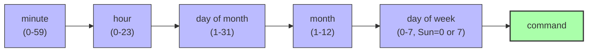

# 1. Cron and systemd Timers

> [!info] Chapter Context
> Cron and systemd timers are how you run tasks on a schedule: backups, log rotation, certificate renewal, daily reports. This note covers `cron` (the classic scheduler) and `systemd` timers (the modern alternative).

Related: [[03 - Processes and Services/3. systemd and journalctl]] | [[07 - Disk and Storage/1. Disk Usage and Filesystems]] | [[04 - Shell and Text Tools/1. The Shell and Bash Basics]]

---

## 1. Cron

`cron` is the classic Linux scheduler. It runs commands at specified times, defined in a `crontab` (cron table).

### 1.1 The Crontab Format

Each line in a crontab has five time fields followed by a command:



Examples:

```cron
# Every day at 3:30 AM
30 3 * * * /usr/local/bin/backup.sh

# Every 15 minutes
*/15 * * * * /usr/local/bin/check-health.sh

# Every Monday at 9 AM
0 9 * * 1 /usr/local/bin/weekly-report.sh

# On the 1st of every month at midnight
0 0 1 * * /usr/local/bin/monthly-cleanup.sh

# Every weekday (Mon-Fri) at 6 PM
0 18 * * 1-5 /usr/local/bin/end-of-day.sh

# At 8 AM and 8 PM
0 8,20 * * * /usr/local/bin/twice-a-day.sh

# Every minute (DO NOT DO THIS in production)
* * * * * /usr/local/bin/every-minute.sh
```

### 1.2 Special Strings

```cron
@reboot       # run once at startup
@yearly       # 0 0 1 1 *    (Jan 1, midnight)
@annually     # same as @yearly
@monthly     # 0 0 1 * *     (1st of month, midnight)
@weekly       # 0 0 * * 0     (Sunday, midnight)
@daily        # 0 0 * * *     (every day, midnight)
@midnight     # same as @daily
@hourly       # 0 * * * *     (every hour, on the hour)
```

### 1.3 Managing Crontabs

```bash
crontab -l                         # list your crontab
crontab -e                         # edit your crontab (opens $EDITOR)
crontab -r                         # remove your crontab
sudo crontab -l -u alice           # list alice's crontab
sudo crontab -e -u alice           # edit alice's crontab
```

There are also system-wide crontab files:

- `/etc/crontab` — System crontab (with an extra "user" column).
- `/etc/cron.d/` — Additional system crontab files (e.g., placed by packages).
- `/etc/cron.hourly/`, `/etc/cron.daily/`, `/etc/cron.weekly/`, `/etc/cron.monthly/` — Drop a script here to run it at the corresponding interval.

### 1.4 The `/etc/crontab` User Column

System crontabs (`/etc/crontab` and `/etc/cron.d/*`) have an extra column for the user:

```
# minute hour dom mon dow user  command
30 3 * * * root /usr/local/bin/backup.sh
0 * * * * alice /usr/local/bin/hourly-task.sh
```

Personal crontabs (created with `crontab -e`) do NOT have this column — they run as the user who owns the crontab.

### 1.5 Cron Environment

Cron runs with a minimal environment — not your shell's environment. This means:

- `$PATH` is usually `/usr/bin:/bin` (not your full PATH).
- Your aliases and functions are not loaded.
- Your `~/.bashrc` is NOT sourced.

Best practice: use absolute paths in cron commands and set env vars explicitly:

```cron
# Set PATH at the top of the crontab
PATH=/usr/local/sbin:/usr/local/bin:/usr/sbin:/usr/bin:/sbin:/bin

# Or use absolute paths everywhere
30 3 * * * /usr/local/bin/backup.sh >> /var/log/backup.log 2>&1

# Or source a profile explicitly
30 3 * * * /bin/bash -l -c '/usr/local/bin/backup.sh'
```

### 1.6 Cron Logs

Cron logs to `/var/log/syslog` (Debian/Ubuntu) or `/var/log/cron` (RHEL). View with:

```bash
grep CRON /var/log/syslog
journalctl -t cron
```

If a cron job does not run, check the logs first.

---

## 2. systemd Timers

systemd timers are the modern alternative to cron. They are more flexible and integrate with `journalctl` for logging.

### 2.1 Creating a Timer

A timer consists of two files:

1. A `.service` file (defines what to run).
2. A `.timer` file (defines when to run it).

#### The Service File

```ini
# /etc/systemd/system/backup.service
[Unit]
Description=Nightly Backup

[Service]
Type=oneshot
ExecStart=/usr/local/bin/backup.sh
```

#### The Timer File

```ini
# /etc/systemd/system/backup.timer
[Unit]
Description=Run backup daily at 3:30 AM

[Timer]
OnCalendar=*-*-* 03:30:00
Persistent=true

[Install]
WantedBy=timers.target
```

`OnCalendar` accepts cron-like expressions. `Persistent=true` means "if the system was off at the scheduled time, run the job when the system boots."

### 2.2 Enabling the Timer

```bash
sudo systemctl daemon-reload
sudo systemctl enable --now backup.timer
systemctl list-timers                          # see all active timers
systemctl list-timers --all                    # include inactive
systemctl status backup.timer                  # check the timer
journalctl -u backup.service                   # see logs from past runs
```

### 2.3 Timer Types

- **`OnCalendar=`** — Calendar-based (like cron). Examples: `daily`, `weekly`, `monthly`, `*-*-* 03:30:00`, `Mon *-*-* 09:00:00`.
- **`OnBootSec=10min`** — 10 minutes after boot.
- **`OnUnitActiveSec=1h`** — 1 hour after the last activation (like `@hourly`).
- **`OnUnitInactiveSec=5min`** — 5 minutes after the last run finished.
- **`Monotonic` timers** — Based on system uptime, not wall clock.

### 2.4 Advantages Over Cron

- **Integrated logging** — All output goes to journald; view with `journalctl -u backup.service`.
- **No more "minimized environment" surprises** — The service file can set `Environment=`, `WorkingDirectory=`, `User=`, etc.
- **Dependencies** — The service can `After=network.target` to ensure networking is up.
- **Missed runs** — `Persistent=true` runs missed jobs when the system boots.
- **`systemctl list-timers`** — See all timers and their next run time in one place.
- **No more "cron didn't run"** — If a job fails, you can see why with `systemctl status` and `journalctl`.

---

## 3. Common Scheduled Tasks

### 3.1 Backup

```cron
# crontab
0 2 * * * /usr/local/bin/backup.sh >> /var/log/backup.log 2>&1
```

Or as a systemd timer:

```ini
# /etc/systemd/system/backup.timer
[Timer]
OnCalendar=*-*-* 02:00:00
Persistent=true
```

### 3.2 Log Rotation

Most distros have `logrotate` set up via `/etc/cron.daily/logrotate`. The config is in `/etc/logrotate.conf` and `/etc/logrotate.d/`. You usually do not need to touch this.

### 3.3 Certificate Renewal (Let's Encrypt)

`certbot` installs its own systemd timer or cron job to renew certificates automatically:

```bash
systemctl list-timers | grep certbot
```

### 3.4 System Updates (Unattended Upgrades)

On Debian/Ubuntu, `unattended-upgrades` installs security updates automatically:

```bash
sudo apt install unattended-upgrades
sudo dpkg-reconfigure -plow unattended-upgrades
```

Config in `/etc/apt/apt.conf.d/50unattended-upgrades`.

---

## 4. Cron vs systemd Timers — When to Use Which

```mermaid
flowchart TD
    Start["Need to run a scheduled task?"]
    Start --> System{Is this a system-level<br/>task (root, server)?}
    System -->|Yes, modern system| SystemdTimer["Use a systemd timer<br/>(better logging, dependencies)"]
    System -->|Yes, legacy or simple| Cron["Use /etc/cron.d/<br/>or /etc/crontab"]
    System -->|No, personal user task| UserCron["Use crontab -e<br/>(personal crontab)"]

    style SystemdTimer fill:#afa,stroke:#333,stroke-width:2px
    style Cron fill:#ffa,stroke:#333
    style UserCron fill:#bbf,stroke:#333
```

For new infrastructure, prefer systemd timers. For quick personal tasks, `crontab -e` is still fine. For compatibility with existing cron-based tooling, use cron.

---

## 5. Common Student Mistakes

> [!warning] Mistake 1 — Forgetting That Cron Has a Minimal Environment
> Cron does not load your `~/.bashrc`. Use absolute paths and set env vars explicitly. `PATH=/usr/local/bin:/usr/bin:/bin` at the top of the crontab is a common fix.

> [!warning] Mistake 2 — Not Redirecting Output
> If a cron job produces output and you do not redirect it, cron emails it to the local root user (or the crontab owner). Many systems do not have local email set up, so the output is lost. Always redirect: `command >> /var/log/myjob.log 2>&1`.

> [!warning] Mistake 3 — Forgetting the User Column in `/etc/crontab`
> `/etc/crontab` and `/etc/cron.d/*` have a user column between the time fields and the command. Personal crontabs (from `crontab -e`) do NOT. Mixing these up causes "command not found" errors (the user is interpreted as part of the command).

> [!warning] Mistake 4 — Using `*` in the Wrong Field
> `* * * * *` runs every minute. `0 * * * *` runs at the top of every hour. Test your expression with a tool like [crontab.guru](https://crontab.guru/) before deploying.

> [!warning] Mistake 5 — Not Running `systemctl daemon-reload` After Creating systemd Units
> systemd caches unit files. After creating or editing a `.timer` or `.service` file, run `sudo systemctl daemon-reload` so systemd picks up the changes.

> [!warning] Mistake 6 — Forgetting `Persistent=true` for systemd Timers
> Without `Persistent=true`, a timer that was missed (because the system was off) does NOT run later. For "daily backup" timers, you usually want `Persistent=true` so a missed backup runs at the next boot.

---

## 6. Summary Checklist

- [ ] Cron format: `minute hour dom mon dow command` (5 time fields + command).
- [ ] Personal crontabs (from `crontab -e`) do NOT have a user column; system crontabs DO.
- [ ] Cron has a minimal environment — use absolute paths, set env vars explicitly.
- [ ] Always redirect cron output: `command >> /var/log/myjob.log 2>&1`.
- [ ] System-wide cron: `/etc/crontab`, `/etc/cron.d/`, `/etc/cron.{hourly,daily,weekly,monthly}/`.
- [ ] systemd timers: a `.service` (what to run) + a `.timer` (when to run).
- [ ] `OnCalendar=` for cron-like schedules; `Persistent=true` for missed runs.
- [ ] `systemctl list-timers` shows all active timers.
- [ ] Prefer systemd timers for new infrastructure (better logging, dependencies).
- [ ] Test cron expressions with [crontab.guru](https://crontab.guru/).

---

Previous: [[07 - Disk and Storage/1. Disk Usage and Filesystems]] | Next: [[Quizzes/Quiz 1 - Fundamentals]]
