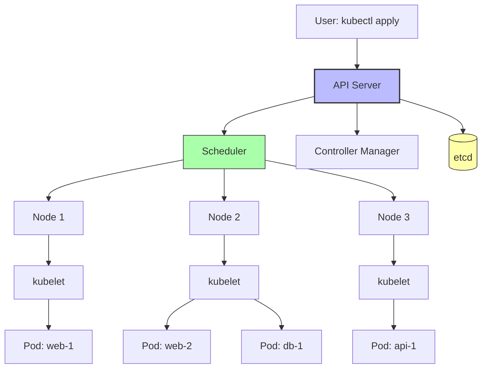

# 1. What Is Kubernetes

> [!info] Chapter Context
> Kubernetes (K8s) is the de facto standard for orchestrating containers at scale. It schedules containers across a cluster of machines, handles failover, scales them up/down, and provides networking, storage, and secret management. This chapter is built on top of the Docker chapter — you should understand containers before learning Kubernetes.

Related: [[03 - Docker/1. What is Docker]] | [[2. Kubernetes Architecture]] | [[15 - Architecture Patterns/1. Microservices]]

---

## 1. Why Kubernetes Exists

Docker (covered in [[03 - Docker/1. What is Docker]]) lets you run a single container on a single machine. But production applications have many containers across many machines:

- A web frontend (5 replicas for high traffic).
- A backend API (10 replicas).
- A database (1 primary + 2 replicas).
- A cache (3 Redis instances).
- Background workers (4 replicas).

Managing this manually raises questions:

- Which machine does each container run on?
- What if a machine fails?
- How do containers find each other?
- How do you scale up during traffic spikes?
- How do you roll out a new version without downtime?
- How do you roll back if the new version is broken?

**Kubernetes** answers these questions. It is a container orchestrator — it manages containers across a cluster of machines, handling scheduling, scaling, failover, networking, and updates.



---

## 2. Kubernetes vs. Docker Compose

| Aspect | Docker Compose | Kubernetes |
| :--- | :--- | :--- |
| Scale | Single host | Cluster of hosts |
| Failover | None | Automatic rescheduling on node failure |
| Scaling | Manual (or limited `--scale`) | Horizontal Pod Autoscaler, Cluster Autoscaler |
| Networking | Single-host bridge | Cross-host overlay (CNI) |
| Service discovery | DNS by service name | DNS by service name (similar) |
| Rolling updates | Manual | Built-in (Deployments) |
| Storage | Volumes, bind mounts | PersistentVolumes, StorageClasses |
| Secrets | Docker secrets | Kubernetes Secrets |
| Complexity | Simple | Complex |

Use Docker Compose for development and small single-host deployments. Use Kubernetes for production multi-host deployments.

---

## 3. Core Concepts

### 3.1 Cluster

A Kubernetes cluster is a set of machines (physical or virtual) running Kubernetes. It consists of:

- **Control plane** (master nodes) — Manages the cluster.
- **Worker nodes** — Run your containers.

### 3.2 Node

A node is a single machine in the cluster. Each node runs:

- **kubelet** — Talks to the control plane, manages containers on this node.
- **kube-proxy** — Handles networking (services, load balancing).
- **Container runtime** — containerd or Docker (Kubernetes 1.24+ uses containerd directly).

### 3.3 Pod

A **Pod** is the smallest deployable unit in Kubernetes. A pod contains one or more containers that share networking and storage. Most pods contain a single container, but sidecar patterns (multiple containers) are common.

```yaml
apiVersion: v1
kind: Pod
metadata:
  name: nginx
spec:
  containers:
    - name: nginx
      image: nginx:1.25
      ports:
        - containerPort: 80
```

Pods are ephemeral — they can be created, destroyed, and rescheduled at any time. Do not rely on a pod's identity; use **Services** (below) for stable networking.

### 3.4 Deployment

A **Deployment** manages a set of identical pods. It ensures N replicas are running, handles rolling updates, and supports rollbacks.

```yaml
apiVersion: apps/v1
kind: Deployment
metadata:
  name: nginx-deployment
spec:
  replicas: 3
  selector:
    matchLabels:
      app: nginx
  template:
    metadata:
      labels:
        app: nginx
    spec:
      containers:
        - name: nginx
          image: nginx:1.25
          ports:
            - containerPort: 80
```

This creates 3 nginx pods. If you change `image: nginx:1.26`, Kubernetes performs a rolling update — gradually replacing old pods with new ones.

### 3.5 Service

A **Service** provides a stable network identity (IP and DNS name) for a set of pods. As pods come and go, the Service routes traffic to healthy pods.

```yaml
apiVersion: v1
kind: Service
metadata:
  name: nginx-service
spec:
  selector:
    app: nginx
  ports:
    - port: 80
      targetPort: 80
  type: ClusterIP
```

Service types:

- **ClusterIP** (default) — Reachable only from within the cluster.
- **NodePort** — Exposed on each node's IP at a static port (30000-32767).
- **LoadBalancer** — Provisions a cloud load balancer (ELB on AWS) that routes to the service.
- **ExternalName** — DNS alias to an external service.

### 3.6 ConfigMap and Secret

- **ConfigMap** — Non-sensitive configuration (e.g., a config file).
- **Secret** — Sensitive data (passwords, tokens). Base64-encoded (not encrypted by default — enable encryption at rest for true security).

```yaml
apiVersion: v1
kind: ConfigMap
metadata:
  name: app-config
data:
  config.yaml: |
    database:
      host: db.example.com
      port: 5432
```

```yaml
apiVersion: v1
kind: Secret
metadata:
  name: db-password
type: Opaque
data:
  password: cGFzc3dvcmQxMjM=   # base64-encoded "password123"
```

### 3.7 Ingress

An **Ingress** exposes HTTP/HTTPS routes from outside the cluster to services within it. It provides name-based virtual hosting, TLS termination, and path-based routing.

```yaml
apiVersion: networking.k8s.io/v1
kind: Ingress
metadata:
  name: app-ingress
spec:
  rules:
    - host: api.example.com
      http:
        paths:
          - path: /
            pathType: Prefix
            backend:
              service:
                name: api-service
                port:
                  number: 80
```

Ingress requires an **Ingress Controller** (e.g., Nginx Ingress Controller, Traefik, AWS Load Balancer Controller) to actually route traffic.

---

## 4. The Kubernetes API

Everything in Kubernetes is an API resource. You create, read, update, and delete resources via the API (typically with `kubectl`).

Common resources:

- Pods, Deployments, ReplicaSets, StatefulSets, DaemonSets, Jobs, CronJobs
- Services, Endpoints, Ingress
- ConfigMaps, Secrets
- PersistentVolumes, PersistentVolumeClaims, StorageClasses
- Namespaces, ServiceAccounts, Roles, RoleBindings
- HorizontalPodAutoscalers, PodDisruptionBudgets

Each resource has a YAML or JSON manifest. You submit manifests with `kubectl apply -f file.yaml`.

---

## 5. `kubectl` — The CLI

```bash
kubectl get pods                       # list pods in the current namespace
kubectl get pods -A                    # list pods in all namespaces
kubectl get deployments
kubectl get svc                        # list services
kubectl describe pod nginx             # detailed info about a pod
kubectl logs nginx                     # logs from a pod
kubectl logs -f nginx                  # follow logs
kubectl exec -it nginx -- sh           # open a shell in a pod
kubectl apply -f deployment.yaml       # create/update resources from a file
kubectl delete -f deployment.yaml      # delete resources from a file
kubectl delete pod nginx               # delete a pod
kubectl scale deployment nginx --replicas=5    # scale a deployment
kubectl rollout status deployment nginx        # watch a rolling update
kubectl rollout undo deployment nginx          # rollback
kubectl port-forward svc/nginx 8080:80        # forward a local port to a service
kubectl get events --sort-by='.lastTimestamp' # see recent events
```

---

## 6. Managed Kubernetes on AWS: EKS

Running Kubernetes yourself is complex. **Amazon EKS** (Elastic Kubernetes Service) is AWS's managed Kubernetes offering. AWS manages the control plane; you manage the worker nodes (or use Fargate for serverless nodes).

We cover EKS in [[5. EKS and Managed Kubernetes]].

---

## 7. Common Student Mistakes

> [!warning] Mistake 1 — Treating Pods as Persistent
> Pods are ephemeral. Do not store state in a pod. Use PersistentVolumes for storage, databases for state.

> [!warning] Mistake 2 — Deploying Without a Deployment
> Creating a Pod directly (without a Deployment) means it is not restarted if it dies. Always use a Deployment (or StatefulSet, DaemonSet).

> [!warning] Mistake 3 — Forgetting Services
> Pods have random IPs that change. Use a Service for stable networking.

> [!warning] Mistake 4 — Storing Secrets in ConfigMaps
> ConfigMaps are not encrypted. Use Secrets (and enable encryption at rest for real security).

> [!warning] Mistake 5 — Not Using Namespaces
> Namespaces isolate resources. Use them to separate dev/staging/prod, or to separate teams.

> [!warning] Mistake 6 — Manually Editing Resources
> If you `kubectl edit` a resource, your changes are lost when you re-apply the YAML. Always edit the YAML and `kubectl apply`.

---

## 8. Summary Checklist

- [ ] Kubernetes orchestrates containers across a cluster of machines.
- [ ] A cluster has a control plane (masters) and worker nodes.
- [ ] Pod = smallest unit; contains one or more containers.
- [ ] Deployment = manages N identical pod replicas; handles rolling updates.
- [ ] Service = stable network identity for a set of pods.
- [ ] ConfigMap = non-sensitive config; Secret = sensitive data.
- [ ] Ingress = HTTP/HTTPS routing from outside the cluster.
- [ ] Everything is an API resource; managed via `kubectl`.
- [ ] EKS is AWS's managed Kubernetes.
- [ ] Pods are ephemeral; never store state in a pod.

---

Previous: [[02 - AWS CLI and SDKs/4. AWS CLI Best Practices]] | Next: [[2. Kubernetes Architecture]]
