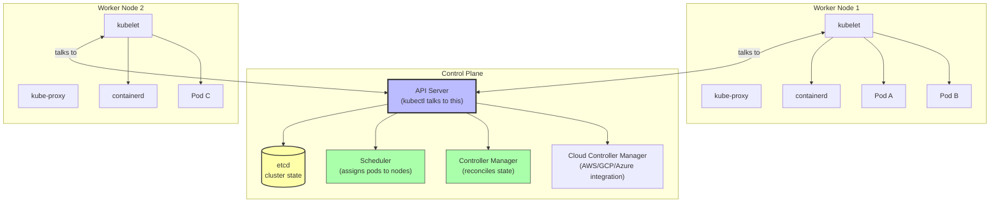
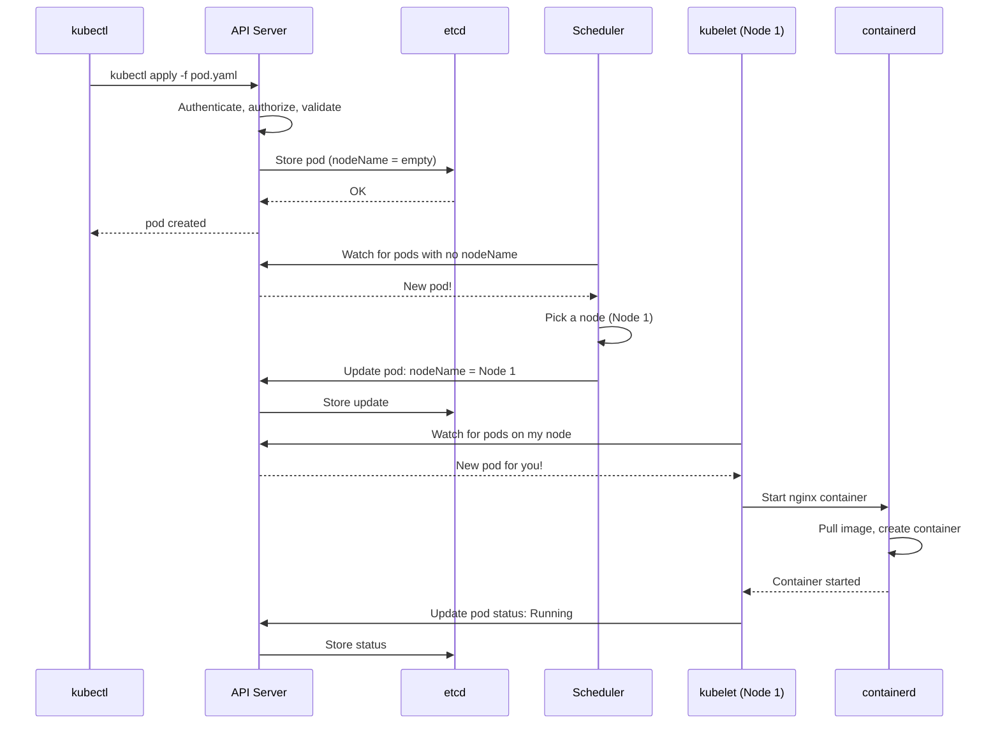

# 2. Kubernetes Architecture

> [!info] Chapter Context
> Understanding Kubernetes internals helps you debug issues, design efficient deployments, and pass interviews. This note covers the control plane, worker nodes, the API server, etcd, the scheduler, controllers, and the CNI.

Related: [[1. What Is Kubernetes]] | [[3. Pods, Deployments, and Services]] | [[5. EKS and Managed Kubernetes]]

---

## 1. The Two Halves of a Cluster



---

## 2. Control Plane Components

The control plane manages the cluster. It is the "brain."

### 2.1 API Server

The API server is the front-end for the Kubernetes control plane. All components (kubectl, scheduler, controllers, kubelets) talk to it. It:

- Validates and processes REST requests.
- Authenticates and authorizes requests.
- Reads from and writes to etcd.
- Watches for changes and notifies subscribers.

When you `kubectl get pods`, the request goes: kubectl → API server → etcd → API server → kubectl.

### 2.2 etcd

**etcd** is a distributed key-value store that holds the cluster's state. Every pod, service, deployment, configmap, secret — they all live in etcd.

- Highly available (typically 3 or 5 nodes for quorum).
- Strongly consistent (uses Raft consensus).
- The source of truth — if etcd is lost and there is no backup, the cluster is gone.

> [!danger] Back Up etcd
> If you run your own Kubernetes cluster (not EKS), you must back up etcd. EKS backs up etcd for you (managed).

### 2.3 Scheduler

The scheduler watches for newly created pods with no assigned node, and assigns them a node based on:

- Resource requests (CPU, memory).
- Affinity/anti-affinity rules.
- Taints and tolerations.
- Node selectors.
- Volume bindings.

The scheduler does not run the pod — it just sets `pod.spec.nodeName`. The kubelet on that node then notices and starts the containers.

### 2.4 Controller Manager

Controllers are reconciliation loops: "watch the desired state, compare to the actual state, take action to make them match."

Examples:

- **ReplicaSet controller** — Ensures N replicas of a pod are running. If one dies, it creates a new one.
- **Deployment controller** — Manages ReplicaSets; handles rolling updates.
- **Node controller** — Watches node health; marks nodes as NotReady.
- **Service controller** — Manages load balancers for LoadBalancer-type services.
- **Endpoint controller** — Maintains the list of pods behind a service.

### 2.5 Cloud Controller Manager

Integrates with the cloud provider (AWS, GCP, Azure). Handles:

- Node lifecycle (registering EC2 instances as nodes).
- Load balancers (provisioning ELBs for LoadBalancer services).
- Routes (configuring cloud routing for services).
- Volumes (provisioning EBS, EFS for PersistentVolumes).

On EKS, the cloud controller manager runs as the `aws-cloud-provider` and the AWS Load Balancer Controller.

---

## 3. Worker Node Components

### 3.1 kubelet

The kubelet runs on every worker node. It:

- Registers the node with the API server.
- Watches for pods assigned to this node.
- Tells the container runtime to start/stop containers.
- Reports pod status back to the API server.
- Performs liveness and readiness probes.
- Mounts volumes.

### 3.2 kube-proxy

kube-proxy manages networking rules on each node. It:

- Maintains iptables or IPVS rules for services.
- Load-balances traffic to service backends (pods).
- Handles cluster-internal DNS resolution (indirectly, via CoreDNS).

### 3.3 Container Runtime

The container runtime runs containers. Kubernetes 1.24+ uses **containerd** directly (no longer Docker). Older clusters may use Docker via the **Dockershim** (removed in 1.24).

The runtime must be CRI-compatible (Container Runtime Interface). Options:

- **containerd** — Default; lightweight; what EKS uses.
- **CRI-O** — Used by Red Hat OpenShift.
- **Docker** — No longer directly supported (since 1.24); use containerd.

### 3.4 CNI (Container Network Interface) Plugin

Provides pod-to-pod networking across nodes. Without a CNI, pods on different nodes cannot talk to each other. Common CNIs:

- **Calico** — Popular; supports network policies.
- **Flannel** — Simple; no network policies.
- **Cilium** — Uses eBPF; high performance; advanced observability.
- **AWS VPC CNI** — Used by EKS; assigns each pod a real VPC IP.

---

## 4. How a Pod Gets Created



---

## 5. The Reconciliation Loop

The fundamental pattern in Kubernetes is the **reconciliation loop**:

1. **Desired state** — Declared in YAML (e.g., "3 replicas of nginx").
2. **Actual state** — Observed from the cluster (e.g., "2 replicas running").
3. **Reconcile** — A controller takes action to make actual match desired (e.g., "create 1 more pod").

This loop runs continuously. If a pod dies, the ReplicaSet controller notices and creates a replacement. If a node fails, the pods are rescheduled elsewhere. If you change the desired state (e.g., scale to 5), the controller creates new pods.

This is what makes Kubernetes "declarative" — you describe what you want, and Kubernetes figures out how to get there.

---

## 6. Namespaces

A namespace is a logical grouping of resources within a cluster. Use namespaces to:

- Separate environments (dev, staging, prod).
- Separate teams (frontend, backend, data).
- Apply resource quotas per namespace.
- Apply RBAC policies per namespace.

```bash
kubectl get pods -n kube-system       # pods in the kube-system namespace
kubectl get pods -A                   # pods in all namespaces
kubectl create namespace my-app
kubectl config set-context --current --namespace=my-app   # switch default namespace
```

Some resources (Nodes, PersistentVolumes, StorageClasses) are not namespaced — they are cluster-scoped.

---

## 7. Common Student Mistakes

> [!warning] Mistake 1 — Confusing the Control Plane with Worker Nodes
> The control plane (API server, etcd, scheduler, controllers) manages the cluster. Worker nodes run your containers. The control plane does not run user containers (in most setups).

> [!warning] Mistake 2 — Forgetting That etcd Is the Source of Truth
> Every resource is stored in etcd. If etcd is lost without a backup, the cluster is gone. Back it up.

> [!warning] Mistake 3 — Thinking the Scheduler Runs Pods
> The scheduler only assigns pods to nodes. The kubelet on the assigned node actually starts the containers.

> [!warning] Mistake 4 — Not Understanding Reconciliation
> Kubernetes is declarative. You say "I want 3 nginx pods"; the controllers ensure that is the case. If you manually delete a pod, a new one is created.

> [!warning] Mistake 5 — Confusing CRI, CNI, and CSI
> - **CRI** (Container Runtime Interface) — Runs containers (containerd).
> - **CNI** (Container Network Interface) — Pod networking (Calico, AWS VPC CNI).
> - **CSI** (Container Storage Interface) — Persistent storage (EBS CSI driver).

---

## 8. Summary Checklist

- [ ] Control plane: API server, etcd, scheduler, controller manager, cloud controller manager.
- [ ] Worker node: kubelet, kube-proxy, container runtime (containerd), CNI plugin.
- [ ] The API server is the front-end; all components talk to it.
- [ ] etcd stores the cluster state; back it up.
- [ ] The scheduler assigns pods to nodes; the kubelet actually runs them.
- [ ] Controllers are reconciliation loops: desired state → actual state → reconcile.
- [ ] Namespaces isolate resources.
- [ ] CRI = container runtime, CNI = networking, CSI = storage.

---

Previous: [[1. What Is Kubernetes]] | Next: [[3. Pods, Deployments, and Services]]
