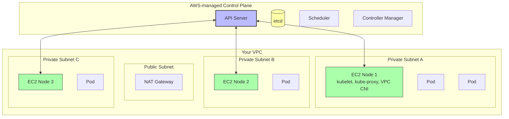

# 5. EKS and Managed Kubernetes

> [!info] Chapter Context
> Amazon EKS (Elastic Kubernetes Service) is AWS's managed Kubernetes offering. AWS manages the control plane; you manage the worker nodes (or use Fargate). This note covers EKS architecture, the AWS Load Balancer Controller, ECR integration, and how to deploy an app to EKS.

Related: [[4. ConfigMaps, Secrets, and Storage]] | [[6. Helm and Package Management]] | [[12 - AWS Networking/1. VPC Fundamentals]]

---

## 1. What EKS Manages vs. What You Manage

| Component | Managed by AWS | Managed by You |
| :--- | :--- | :--- |
| Control plane (API server, etcd, scheduler) | ✓ | |
| Control plane scaling, patching, HA | ✓ | |
| Worker nodes (EC2 instances) | | ✓ |
| Node OS (Bottlerocket, Amazon Linux, Ubuntu) | | ✓ |
| Node patching | | ✓ (or use managed node groups with auto-upgrade) |
| Container runtime (containerd) | | ✓ (installed by EKS-optimized AMI) |
| Networking (VPC CNI) | | ✓ (installed as add-on) |
| Storage (EBS CSI driver) | | ✓ (installed as add-on) |
| Cluster autoscaling | | ✓ (Cluster Autoscaler or Karpenter) |
| Ingress controller | | ✓ |
| Monitoring | | ✓ (CloudWatch Container Insights, Prometheus) |

EKS removes the burden of managing etcd and the control plane, but you still manage the worker nodes and most add-ons.

---

## 2. EKS Architecture



Key points:

- The control plane runs in an AWS-managed VPC (separate from yours).
- Worker nodes run in your VPC, in private subnets.
- The control plane and worker nodes communicate via cross-account VPC peering (managed by EKS).
- Pod IPs come from your VPC subnets (the AWS VPC CNI assigns each pod a real VPC IP).

---

## 3. Creating an EKS Cluster

### 3.1 With `eksctl` (Recommended)

`eksctl` is the official CLI for creating and managing EKS clusters.

```bash
# Install eksctl
brew install eksctl       # macOS
# Or: https://eksctl.io/installation/

# Create a cluster (with default settings)
eksctl create cluster \
  --name my-cluster \
  --region us-east-1 \
  --node-type t3.medium \
  --nodes 3 \
  --nodes-min 1 \
  --nodes-max 5

# This takes 15-20 minutes.
```

### 3.2 With Terraform

For production, use Terraform or the AWS CDK:

```hcl
module "eks" {
  source  = "terraform-aws-modules/eks/aws"
  version = "~> 20.0"

  cluster_name    = "my-cluster"
  cluster_version = "1.29"

  vpc_id     = module.vpc.vpc_id
  subnet_ids = module.vpc.private_subnets

  eks_managed_node_groups = {
    default = {
      instance_types = ["t3.medium"]
      min_size       = 1
      max_size       = 5
      desired_size   = 3
    }
  }
}
```

---

## 4. EKS Add-ons

EKS add-ons are managed Kubernetes components. Install them after creating the cluster:

```bash
# VPC CNI (networking)
aws eks create-addon --cluster-name my-cluster --addon-name vpc-cni

# EBS CSI driver (storage)
aws eks create-addon --cluster-name my-cluster --addon-name aws-ebs-csi-driver \
  --service-account-role-arn arn:aws:iam::123456789012:role/ebs-csi-role

# CoreDNS (DNS)
aws eks create-addon --cluster-name my-cluster --addon-name coredns

# kube-proxy
aws eks create-addon --cluster-name my-cluster --addon-name kube-proxy
```

---

## 5. The AWS Load Balancer Controller

The AWS Load Balancer Controller provisions AWS load balancers for Kubernetes Services and Ingresses:

- `type: LoadBalancer` service → provisions an NLB.
- `Ingress` resource → provisions an ALB.

Install with Helm:

```bash
helm repo add eks https://aws.github.io/eks-charts
helm install aws-load-balancer-controller eks/aws-load-balancer-controller \
  -n kube-system \
  --set clusterName=my-cluster \
  --set serviceAccount.create=true \
  --set serviceAccount.name=aws-load-balancer-controller
```

### 5.1 ALB Ingress Example

```yaml
apiVersion: networking.k8s.io/v1
kind: Ingress
metadata:
  name: app-ingress
  annotations:
    kubernetes.io/ingress.class: alb
    alb.ingress.kubernetes.io/scheme: internet-facing
    alb.ingress.kubernetes.io/target-type: ip
spec:
  rules:
    - host: api.example.com
      http:
        paths:
          - path: /
            pathType: Prefix
            backend:
              service:
                name: api-service
                port:
                  number: 80
```

This creates an ALB with a listener for `api.example.com` routing to the `api-service` pods.

---

## 6. ECR Integration

EKS pulls images from ECR. The EKS worker nodes need permission to pull from ECR:

- The worker node IAM role must have the `AmazonEC2ContainerRegistryReadOnly` policy.
- For private repos, create a Kubernetes `imagePullSecret` of type `docker-registry`.

```bash
# Create an image pull secret
kubectl create secret docker-registry ecr-secret \
  --docker-server=123456789012.dkr.ecr.us-east-1.amazonaws.com \
  --docker-username=AWS \
  --docker-password=$(aws ecr get-login-password) \
  --docker-email=unused

# Use it in a pod
# (in the pod spec):
#   imagePullSecrets:
#     - name: ecr-secret
```

For EKS, the worker node role usually has ECR access, so you don't need an imagePullSecret unless you're pulling from another account's ECR.

---

## 7. EKS Fargate

EKS Fargate is serverless Kubernetes — no worker nodes to manage. Each pod runs on its own Fargate container.

```bash
# Create a Fargate profile
eksctl create fargateprofile \
  --cluster my-cluster \
  --name default \
  --namespace default
```

Pods in the `default` namespace now run on Fargate. You pay per pod-second.

### 7.1 Trade-offs

- **Pros:** No node management, no idle capacity costs, per-pod isolation.
- **Cons:** Higher per-pod cost, no DaemonSets (no per-node log collectors), longer pod startup time.

Use Fargate for low-traffic or bursty workloads. Use EC2 worker nodes for steady, high-traffic workloads where you want to maximize utilization.

---

## 8. Cluster Autoscaling

### 8.1 Cluster Autoscaler

The classic Cluster Autoscaler watches for pending pods (pods that cannot be scheduled because nodes are full) and adds nodes to the node group.

```bash
helm repo add autoscaler https://kubernetes.github.io/autoscaler
helm install cluster-autoscaler autoscaler/cluster-autoscaler \
  -n kube-system \
  --set autoDiscovery.clusterName=my-cluster \
  --set rbac.serviceAccount.create=true
```

### 8.2 Karpenter

Karpenter is AWS's newer, faster autoscaler. It provisions any instance type (not just the ones in a node group) based on pod requirements.

```bash
helm install karpenter oci://public.ecr.aws/karpenter/karpenter \
  -n kube-system \
  --set clusterName=my-cluster
```

Karpenter is recommended for new EKS clusters.

---

## 9. Deploying an App to EKS

```bash
# 1. Build and push the image
docker build -t myapp:1.0 .
docker tag myapp:1.0 123456789012.dkr.ecr.us-east-1.amazonaws.com/myapp:1.0
docker push 123456789012.dkr.ecr.us-east-1.amazonaws.com/myapp:1.0

# 2. Apply the manifests
kubectl apply -f deployment.yaml
kubectl apply -f service.yaml
kubectl apply -f ingress.yaml

# 3. Get the ALB URL
kubectl get ingress
# NAME           CLASS   HOSTS              ADDRESS                                          PORTS
# app-ingress    alb     api.example.com    k8s-default-apping-1234567890.us-east-1.elb.amazonaws.com   80

# 4. Add a DNS record (Route 53) pointing api.example.com to the ALB
```

---

## 10. Common Student Mistakes

> [!warning] Mistake 1 — Running EKS Worker Nodes in Public Subnets
> Worker nodes should be in private subnets. Only the load balancers (ALB/NLB) need public subnets.

> [!warning] Mistake 2 — Forgetting the EBS CSI Driver
> Without the EBS CSI driver, PersistentVolumeClaims for EBS volumes fail to provision. Install it as an add-on.

> [!warning] Mistake 3 — Not Using IRSA (IAM Roles for Service Accounts)
> Don't give the worker node IAM role broad permissions. Use IRSA to give each Kubernetes ServiceAccount its own IAM role with narrow permissions.

> [!warning] Mistake 4 — Forgetting to Patch Worker Nodes
> EKS-managed node groups can auto-upgrade, but by default they don't. Configure auto-upgrade or patch manually.

> [!warning] Mistake 5 — Using Fargate for Everything
> Fargate is expensive for steady-state workloads. Use EC2 worker nodes for high-traffic apps.

> [!warning] Mistake 6 — Not Using the AWS Load Balancer Controller
> The default `type: LoadBalancer` creates a Classic Load Balancer (deprecated). Install the AWS Load Balancer Controller for ALB/NLB.

---

## 11. Summary Checklist

- [ ] EKS manages the control plane; you manage worker nodes and add-ons.
- [ ] Create clusters with `eksctl` (development) or Terraform (production).
- [ ] Install add-ons: VPC CNI, EBS CSI driver, CoreDNS, kube-proxy.
- [ ] AWS Load Balancer Controller provisions ALBs (for Ingress) and NLBs (for LoadBalancer services).
- [ ] Worker nodes need ECR pull permission (usually via the node IAM role).
- [ ] EKS Fargate is serverless; good for low-traffic, bad for steady-state.
- [ ] Cluster Autoscaler or Karpenter for auto-scaling nodes (Karpenter is preferred).
- [ ] Use IRSA to give each ServiceAccount its own IAM role.

---

Previous: [[4. ConfigMaps, Secrets, and Storage]] | Next: [[6. Helm and Package Management]]
