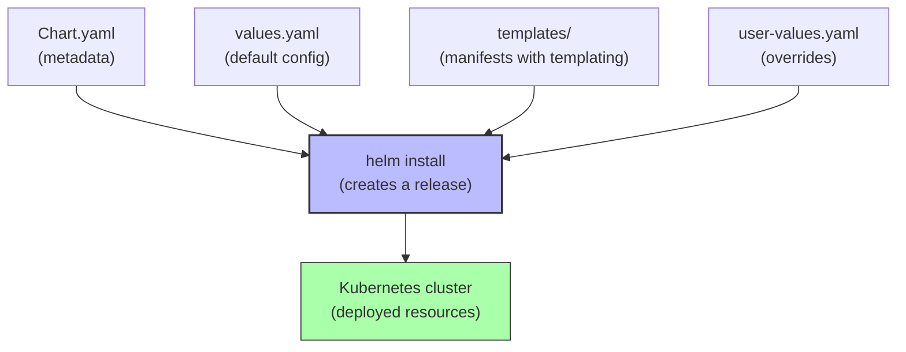
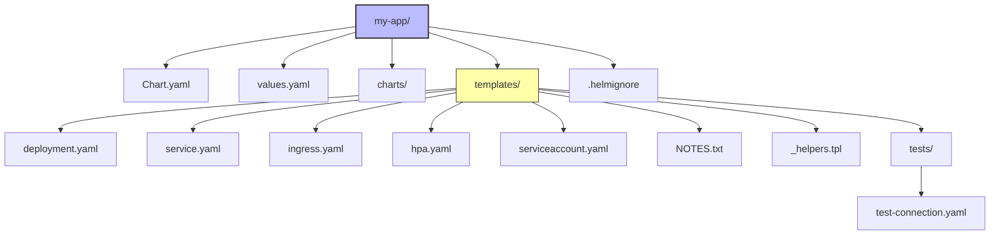

# 6. Helm and Package Management

> [!info] Chapter Context
> Deploying raw YAML manifests works for small apps, but for complex applications (with many resources, configurable values, versioning), you need a package manager. **Helm** is the Kubernetes package manager. This note covers Helm charts, values, repositories, and best practices.

Related: [[5. EKS and Managed Kubernetes]] | [[14 - Infrastructure as Code/1. IaC Fundamentals]]

---

## 1. What Helm Is

Helm is to Kubernetes what `apt` is to Debian, or `brew` is to macOS. It packages Kubernetes manifests into a **chart** — a versioned, configurable bundle.

A Helm chart is a directory containing:

- `Chart.yaml` — Chart metadata (name, version, description).
- `values.yaml` — Default configuration values.
- `templates/` — Kubernetes manifests with templating.
- `charts/` — Dependent charts.
- `templates/_helpers.tpl` — Reusable template functions.



---

## 2. Installing Helm

```bash
# macOS
brew install helm

# Linux
curl https://raw.githubusercontent.com/helm/helm/main/scripts/get-helm-3 | bash

# Windows
winget install Helm.Helm
```

Verify:

```bash
helm version
```

---

## 3. Using Existing Charts

### 3.1 Adding a Repository

```bash
helm repo add bitnami https://charts.bitnami.com/bitnami
helm repo update
helm search repo nginx
```

### 3.2 Installing a Chart

```bash
# Install with default values
helm install my-nginx bitnami/nginx

# Install with a custom release name and namespace
helm install my-nginx bitnami/nginx -n web --create-namespace

# Install with custom values
helm install my-nginx bitnami/nginx -f my-values.yaml

# Install with values on the command line
helm install my-nginx bitnami/nginx --set replicaCount=3 --set service.type=LoadBalancer
```

### 3.3 Managing Releases

```bash
helm list                       # list installed releases
helm list -A                    # all namespaces
helm status my-nginx            # status of a release
helm get values my-nginx        # see the values used
helm upgrade my-nginx bitnami/nginx -f my-values.yaml   # upgrade
helm rollback my-nginx 1        # rollback to revision 1
helm uninstall my-nginx         # remove
helm history my-nginx           # revision history
```

---

## 4. Creating a Chart

```bash
helm create my-app
```

This generates a directory structure:



### 4.1 `Chart.yaml`

```yaml
apiVersion: v2
name: my-app
description: A Helm chart for my app
type: application
version: 0.1.0           # chart version
appVersion: "1.0.0"      # app version
```

### 4.2 `values.yaml`

```yaml
replicaCount: 1
image:
  repository: my-app
  tag: "1.0.0"
  pullPolicy: IfNotPresent

service:
  type: ClusterIP
  port: 80

ingress:
  enabled: false
  host: my-app.example.com

resources:
  requests:
    cpu: 100m
    memory: 128Mi
  limits:
    cpu: 500m
    memory: 512Mi

env:
  LOG_LEVEL: info
```

### 4.3 `templates/deployment.yaml`

```yaml
apiVersion: apps/v1
kind: Deployment
metadata:
  name: {{ .Release.Name }}
  labels:
    app: {{ .Release.Name }}
spec:
  replicas: {{ .Values.replicaCount }}
  selector:
    matchLabels:
      app: {{ .Release.Name }}
  template:
    metadata:
      labels:
        app: {{ .Release.Name }}
    spec:
      containers:
        - name: {{ .Chart.Name }}
          image: "{{ .Values.image.repository }}:{{ .Values.image.tag }}"
          ports:
            - containerPort: 80
          env:
            - name: LOG_LEVEL
              value: {{ .Values.env.LOG_LEVEL | quote }}
          resources:
            {{- toYaml .Values.resources | nindent 12 }}
```

### 4.4 Template Functions

Helm uses Go templates with Sprig functions. Common functions:

- `{{ .Values.foo }}` — Access a value.
- `{{ .Values.foo | quote }}` — Quote a string.
- `{{ .Values.foo | default "bar" }}` — Default value.
- `{{ if .Values.ingress.enabled }}...{{ end }}` — Conditional.
- `{{ range .Values.env }}...{{ end }}` — Loop.
- `{{ toYaml .Values.resources | nindent 12 }}` — Convert to YAML and indent.
- `{{ include "my-app.name" . }}` — Call a helper from `_helpers.tpl`.

---

## 5. Validating and Debugging

```bash
# Render the templates without installing
helm template my-app ./my-app -f my-values.yaml

# Lint a chart
helm lint ./my-app

# Dry-run install (shows what would be installed)
helm install my-app ./my-app --dry-run --debug

# See the rendered manifests of an installed release
helm get manifest my-app
```

---

## 6. Helm Chart Repositories

### 6.1 OCI Registries (Modern)

Helm 3+ supports OCI registries (like ECR, Harbor) for charts:

```bash
# Authenticate to ECR
aws ecr get-login-password | helm registry login \
  --username AWS --password-stdin 123456789012.dkr.ecr.us-east-1.amazonaws.com

# Push a chart
helm package ./my-app
helm push my-app-0.1.0.tgz oci://123456789012.dkr.ecr.us-east-1.amazonaws.com/

# Pull and install
helm install my-app oci://123456789012.dkr.ecr.us-east-1.amazonaws.com/my-app --version 0.1.0
```

### 6.2 Classic HTTP Repositories

```bash
# Add a chart repository
helm repo add stable https://charts.helm.sh/stable

# Search
helm search repo stable/

# Install
helm install my-release stable/nginx-ingress
```

---

## 7. Common Helm Charts You'll Use

- **`ingress-nginx`** — Nginx Ingress Controller.
- **`aws-load-balancer-controller`** — AWS ALB/NLB controller.
- **`cert-manager`** — Automatic TLS certificate management (Let's Encrypt).
- **`external-secrets`** — Sync secrets from AWS Secrets Manager.
- **`cluster-autoscaler`** / **`karpenter`** — Node autoscaling.
- **`prometheus`** / **`grafana`** — Monitoring.
- **`fluent-bit`** — Log forwarding.

---

## 8. Helm vs. Kustomize

**Kustomize** is a templating-free alternative to Helm, built into `kubectl`. You write plain YAML "patches" that overlay a base.

- **Helm** — Templates with variables, versioning, repositories. Best for distributable charts.
- **Kustomize** — Plain YAML overlays. Best for environment-specific customization of a single app.

```bash
# Kustomize example
kubectl apply -k overlays/production/
```

Use Helm when you want a distributable package. Use Kustomize when you want environment-specific overlays without templating.

---

## 9. Common Student Mistakes

> [!warning] Mistake 1 — Hardcoding Values in Templates
> Use `values.yaml` and `{{ .Values.* }}`. Don't hardcode image tags or replica counts in templates.

> [!warning] Mistake 2 — Not Versioning Charts
> Bump the `version` in `Chart.yaml` for every change. Helm uses this for upgrades and rollbacks.

> [!warning] Mistake 3 — Forgetting to Lint
> `helm lint ./my-app` catches syntax errors before installation. Always lint.

> [!warning] Mistake 4 — Using `--set` for Complex Values
> `--set` is fine for simple values. For complex structures, use `-f values.yaml`.

> [!warning] Mistake 5 — Not Using `helm template` for Debugging
> `helm template` renders the YAML without installing. Use it to debug templates.

> [!warning] Mistake 6 — Mixing Helm and Manual Changes
> If you `kubectl edit` a resource managed by Helm, your changes are lost on the next `helm upgrade`. Use `helm upgrade` to make changes.

---

## 10. Summary Checklist

- [ ] Helm is the Kubernetes package manager. Charts are versioned, configurable packages.
- [ ] Chart structure: `Chart.yaml`, `values.yaml`, `templates/`.
- [ ] `helm install`, `helm upgrade`, `helm rollback`, `helm uninstall`.
- [ ] Templates use Go template syntax with Sprig functions.
- [ ] Validate with `helm lint` and `helm template`.
- [ ] Modern chart distribution: OCI registries (ECR). Legacy: HTTP repositories.
- [ ] Common charts: ingress-nginx, cert-manager, external-secrets, cluster-autoscaler, prometheus.
- [ ] Helm vs. Kustomize: Helm for distributable charts, Kustomize for environment overlays.

---

Previous: [[5. EKS and Managed Kubernetes]] | Next: [[06 - LocalStack/1. Installing LocalStack]]
