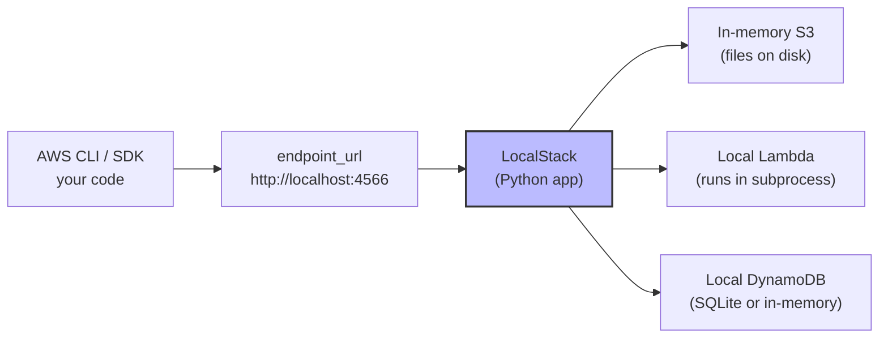

# 1. Installing LocalStack

> [!info] Chapter Context
> LocalStack is a local AWS emulator. It runs the same APIs as AWS (S3, Lambda, DynamoDB, SQS, etc.) on your machine, so you can develop and test cloud applications without an AWS account. This note covers installation, configuration, and the LocalStack-vs-AWS differences you need to know.

Related: [[02 - AWS CLI and SDKs/1. The AWS CLI]] | [[2. LocalStack Architecture]] | [[3. LocalStack vs AWS]]

---

## 1. What LocalStack Is

LocalStack is a Python application that emulates AWS APIs locally. It listens on a port (default `4566`) and responds to the same HTTP requests as real AWS. Your code (CLI, SDK) talks to LocalStack exactly as it would to AWS — you just point it at `http://localhost:4566` instead of `https://aws.amazon.com`.



LocalStack supports most AWS services, including:

- **Compute** — Lambda, ECS (limited), Step Functions.
- **Storage** — S3.
- **Databases** — DynamoDB.
- **Messaging** — SNS, SQS, EventBridge (limited).
- **Networking** — Route 53, CloudFront (limited), API Gateway.
- **Security** — IAM, STS, Cognito (limited).
- **Monitoring** — CloudWatch Logs and Metrics.

The free "Community" edition covers the basics. The paid "Pro" edition adds advanced services (e.g., full ECS, ElastiCache, MSK).

---

## 2. Installation

### 2.1 With Docker (Recommended)

LocalStack runs in a Docker container. Prerequisite: [[03 - Docker/1. What is Docker]].

```bash
docker run --rm -d \
  --name localstack \
  -p 4566:4566 \
  -p 4510-4559:4510-4559 \
  -v /var/run/docker.sock:/var/run/docker.sock \
  -e SERVICES=s3,lambda,dynamodb,sqs,sns \
  localstack/localstack
```

- `-p 4566:4566` — The main entry point.
- `-p 4510-4559:4510-4559` — Per-service ports (optional; most use the unified `4566`).
- `-v /var/run/docker.sock:/var/run/docker.sock` — Lets LocalStack run containers (needed for Lambda).
- `-e SERVICES=...` — Limit to specific services (faster startup).

### 2.2 With `localstack` CLI (Python)

```bash
pip install localstack
localstack start --docker
```

### 2.3 Without Docker (Less Common)

```bash
pip install localstack
localstack start   # runs LocalStack directly (no Docker)
```

Requires installing dependencies for each service you want to emulate. Not recommended.

### 2.4 Verify

```bash
curl http://localhost:4566/_localstack/health
```

Returns JSON listing running services:

```json
{
  "services": {
    "s3": "running",
    "lambda": "running",
    "dynamodb": "running",
    "sqs": "running",
    "sns": "running"
  },
  "features": {}
}
```

---

## 3. Configuring the AWS CLI for LocalStack

### 3.1 Set the Endpoint URL

```bash
# One-off
aws --endpoint-url=http://localhost:4566 s3 ls

# As a profile (recommended)
aws configure set region us-east-1 --profile localstack
aws configure set aws_access_key_id test --profile localstack
aws configure set aws_secret_access_key test --profile localstack
aws configure set endpoint_url http://localhost:4566 --profile localstack

# Now use the profile
aws s3 ls --profile localstack
```

### 3.2 Using `awslocal` (Convenience Wrapper)

`awslocal` is a wrapper around `aws` that automatically adds `--endpoint-url`.

```bash
pip install awscli-local

awslocal s3 ls
awslocal s3 mb s3://my-bucket
awslocal lambda list-functions
```

### 3.3 Using Boto3

```python
import boto3

# Option 1: Set endpoint_url explicitly
s3 = boto3.client(
    's3',
    endpoint_url='http://localhost:4566',
    aws_access_key_id='test',
    aws_secret_access_key='test',
    region_name='us-east-1'
)

# Option 2: Use a profile (set in ~/.aws/config with endpoint_url)
session = boto3.Session(profile_name='localstack')
s3 = session.client('s3')

# Option 3: Set environment variable
import os
os.environ['AWS_ENDPOINT_URL'] = 'http://localhost:4566'
s3 = boto3.client('s3')   # uses endpoint from env
```

---

## 4. Using LocalStack with Docker Compose

For projects that use LocalStack alongside your app, use Docker Compose:

```yaml
version: "3.9"

services:
  localstack:
    image: localstack/localstack:latest
    ports:
      - "4566:4566"
    environment:
      - SERVICES=s3,lambda,dynamodb,sqs,sns
      - DEBUG=1
      - DATA_DIR=/var/lib/localstack
    volumes:
      - localstack-data:/var/lib/localstack
      - /var/run/docker.sock:/var/run/docker.sock

  app:
    build: ./app
    environment:
      - AWS_ENDPOINT_URL=http://localstack:4566
      - AWS_ACCESS_KEY_ID=test
      - AWS_SECRET_ACCESS_KEY=test
      - AWS_DEFAULT_REGION=us-east-1
    depends_on:
      - localstack

volumes:
  localstack-data:
```

The `app` container talks to LocalStack via the docker network.

---

## 5. LocalStack-Specific Features

### 5.1 Persistence

By default, LocalStack data is lost when the container stops. Enable persistence with:

```bash
docker run -d -p 4566:4566 \
  -e DATA_DIR=/var/lib/localstack \
  -v localstack-data:/var/lib/localstack \
  localstack/localstack
```

### 5.2 Lambda Execution

LocalStack can execute Lambda functions in two ways:

- **Container mode** (default) — Each Lambda runs in its own Docker container. Realistic but slower.
- **Host mode** — Lambdas run as local processes. Faster, less realistic.

For container mode, mount the Docker socket:

```bash
-v /var/run/docker.sock:/var/run/docker.sock
```

### 5.3 Preloading Data

You can pre-populate LocalStack with seed data using init scripts in `/docker-entrypoint-initaws.d/`:

```bash
mkdir -p init-scripts
cat > init-scripts/01-create-bucket.sh << 'EOF'
awslocal s3 mb s3://my-bucket
awslocal s3 cp /data/file.txt s3://my-bucket/
EOF

docker run -d -p 4566:4566 \
  -v $(pwd)/init-scripts:/docker-entrypoint-initaws.d \
  localstack/localstack
```

Scripts run in alphabetical order on container startup.

---

## 6. What Works and What Doesn't

### 6.1 Works Well

- S3 — Full support; objects persist on disk.
- DynamoDB — Full support; uses DynamoDB Local under the hood.
- SQS, SNS — Full support.
- Lambda — Full support (Pro edition for some features).
- IAM — Basic support (users, roles, policies).
- CloudFormation (limited) — Pro edition for full support.
- Route 53 — Basic support.
- CloudWatch Logs — Basic support.

### 6.2 Limited or Unsupported

- EC2 — Mostly unsupported (you don't need real VMs locally).
- VPC, subnets, route tables — Limited; networking is not really emulated.
- RDS — Limited (use a real Postgres container instead).
- EKS — Not supported (use `kind` or `minikube` instead).
- CloudFront — Limited.
- AWS Organizations, Control Tower — Not supported.

For unsupported services, run a real local equivalent in Docker (e.g., Postgres for RDS, Redis for ElastiCache).

---

## 7. Common Student Mistakes

> [!warning] Mistake 1 — Forgetting to Set the Endpoint URL
> Without `--endpoint-url`, the CLI talks to real AWS (and may fail with auth errors). Always set the endpoint.

> [!warning] Mistake 2 — Using Real AWS Credentials
> For LocalStack, use `test` / `test`. Don't use your real AWS keys.

> [!warning] Mistake 3 — Expecting LocalStack to Emulate Everything
> LocalStack focuses on application-level services. EC2, VPC, and RDS are not really emulatable. Use real local equivalents (Docker containers).

> [!warning] Mistake 4 — Not Persisting Data
> Without `DATA_DIR`, data is lost on restart. Set up persistence for development environments.

> [!warning] Mistake 5 — Forgetting to Mount the Docker Socket
> Lambda functions need Docker-in-Docker. Mount `/var/run/docker.sock` or Lambda execution fails.

> [!warning] Mistake 6 — Treating LocalStack as Production
> LocalStack is for development and testing. Behaviors may differ slightly from real AWS. Always test on real AWS before production.

---

## 8. Summary Checklist

- [ ] LocalStack emulates AWS APIs locally on port 4566.
- [ ] Install with Docker: `docker run -p 4566:4566 localstack/localstack`.
- [ ] Configure the CLI with `--endpoint-url=http://localhost:4566` or a `localstack` profile.
- [ ] Use `awslocal` as a convenience wrapper.
- [ ] With Boto3: pass `endpoint_url='http://localhost:4566'` or use the `AWS_ENDPOINT_URL` env var.
- [ ] Use Docker Compose to run LocalStack alongside your app.
- [ ] Persist data with `DATA_DIR=/var/lib/localstack`.
- [ ] Mount `/var/run/docker.sock` for Lambda execution.
- [ ] Use init scripts to pre-populate data.
- [ ] Unsupported services: use real local equivalents (Postgres, Redis).

---

Previous: [[05 - Kubernetes/6. Helm and Package Management]] | Next: [[2. LocalStack Architecture]]
