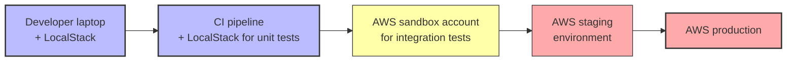

# 3. LocalStack vs AWS

> [!info] Chapter Context
> When should you use LocalStack, and when do you need real AWS? This note compares the two across cost, fidelity, performance, and use cases.

Related: [[1. Installing LocalStack]] | [[2. LocalStack Architecture]] | [[16 - Projects/1. Project 1 - Dropbox Clone]]

---

## 1. Feature Comparison

| Aspect | LocalStack | Real AWS |
| :--- | :--- | :--- |
| Cost | Free (Community); paid (Pro) | Pay per use |
| Speed | Instant (local) | Network latency |
| Fidelity | Subset of AWS APIs | 100% |
| IAM enforcement | Partial | Full |
| Cross-region | No | Yes |
| VPC/networking | Not emulated | Full |
| EC2 | Not emulated | Full |
| RDS | Not emulated (use real Postgres) | Full |
| EKS | Not emulated (use kind) | Full |
| Persistence | Optional (DATA_DIR) | Always |
| Multi-tenant | No | Yes |
| Scaling | Single machine | Auto |

---

## 2. When to Use LocalStack

### 2.1 Local Development

- Building an app that uses S3, DynamoDB, Lambda, SQS, SNS.
- You want fast iteration without deploying to AWS each time.
- You don't want to manage AWS credentials on every developer's machine.

### 2.2 CI/CD Testing

- Run integration tests in CI without spinning up real AWS resources.
- Faster and cheaper than using AWS in CI.
- No flaky tests due to AWS API rate limits.

### 2.3 Learning AWS

- Practice with AWS APIs without an AWS account.
- No risk of accidentally incurring charges.
- No need to set up billing alarms.

### 2.4 Demos and Workshops

- Show AWS code running without AWS credentials.
- Each participant runs LocalStack locally.

---

## 3. When to Use Real AWS

### 3.1 Production

LocalStack is for development and testing. Production must use real AWS.

### 3.2 Performance Testing

LocalStack does not have the same performance characteristics as AWS. Lambda cold starts, DynamoDB throughput, S3 latency — all differ. Performance-test on real AWS.

### 3.3 IAM and Security Testing

LocalStack's IAM is partial. For real authorization testing, use real AWS (with a sandbox account).

### 3.4 Networking

VPCs, subnets, security groups, NAT, peering — none are emulated. Test networking on real AWS.

### 3.5 Services Not Supported by LocalStack

EC2, RDS, EKS, CloudFront (full), ElastiCache (Community edition), and others. Use real AWS (or local equivalents like Postgres in Docker).

### 3.6 Multi-Region Architectures

LocalStack is single-region. Cross-region replication, latency-based routing — test on real AWS.

---

## 4. Hybrid Workflow: Develop Locally, Test on AWS

The recommended workflow:

1. **Develop** — Run your app and LocalStack locally. Iterate fast.
2. **Unit test** — Run unit tests against LocalStack in CI.
3. **Integration test** — Run integration tests against a real AWS sandbox account (a separate account used only for testing).
4. **Staging** — Deploy to a staging environment on real AWS.
5. **Production** — Deploy to production AWS.

---

## 5. Cost Comparison

| Setup | Cost |
| :--- | :--- |
| LocalStack Community | Free |
| LocalStack Pro | $35/user/month (or per-user) |
| AWS sandbox account (small) | $5-50/month depending on usage |
| AWS staging environment | $50-500/month |
| AWS production | Varies widely |

For learning, LocalStack Community is free. For professional development teams, LocalStack Pro is often cheaper than a real AWS dev environment per developer.

---

## 6. Common Student Mistakes

> [!warning] Mistake 1 — Using LocalStack for Production
> LocalStack is for development only. Production must use real AWS.

> [!warning] Mistake 2 — Trusting LocalStack for Performance Numbers
> LocalStack's performance does not match AWS. Don't optimize based on LocalStack timings.

> [!warning] Mistake 3 — Forgetting to Test on Real AWS Before Production
> LocalStack may not catch all AWS-specific behaviors. Always test on real AWS (at least in staging) before production.

> [!warning] Mistake 4 — Expecting IAM to Be a Security Boundary
> LocalStack's IAM is partial. Do not rely on it for security testing.

> [!warning] Mistake 5 — Trying to Emulate Everything with LocalStack
> EC2, RDS, EKS are not emulated. Use real Docker containers (Postgres, Redis) for these.

---

## 7. Summary Checklist

- [ ] Use LocalStack for local development, CI testing, learning, demos.
- [ ] Use real AWS for production, performance testing, IAM/security testing, networking, multi-region.
- [ ] Recommended workflow: develop with LocalStack → unit test with LocalStack in CI → integration test on real AWS sandbox → staging → production.
- [ ] LocalStack Community is free; Pro is paid for advanced services.
- [ ] Don't use LocalStack performance numbers as a basis for optimization.
- [ ] Always test on real AWS before production.

---

Previous: [[2. LocalStack Architecture]] | Next: [[07 - Identity and Security/1. IAM Overview]]
