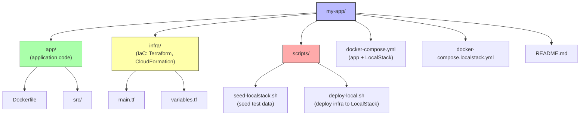

# 4. LocalStack Projects and Patterns

> [!info] Chapter Context
> This note collects practical patterns for using LocalStack in real projects: project structure, seed data, CI integration, and integration with your application code.

Related: [[1. Installing LocalStack]] | [[3. LocalStack vs AWS]] | [[14 - Infrastructure as Code/2. Terraform Fundamentals]]

---

## 1. Project Structure

A typical project using LocalStack:



---

## 2. The `docker-compose.yml` Pattern

```yaml
version: "3.9"

services:
  localstack:
    image: localstack/localstack:latest
    ports:
      - "4566:4566"
    environment:
      - SERVICES=s3,dynamodb,lambda,sqs,sns,iam,sts
      - DATA_DIR=/var/lib/localstack
      - DEBUG=1
      - LAMBDA_EXECUTOR=docker
    volumes:
      - localstack-data:/var/lib/localstack
      - /var/run/docker.sock:/var/run/docker.sock
      - ./scripts/seed:/docker-entrypoint-initaws.d
    healthcheck:
      test: ["CMD", "curl", "-f", "http://localhost:4566/_localstack/health"]
      interval: 5s
      timeout: 3s
      retries: 10

  app:
    build: ./app
    environment:
      - AWS_ENDPOINT_URL=http://localstack:4566
      - AWS_ACCESS_KEY_ID=test
      - AWS_SECRET_ACCESS_KEY=test
      - AWS_DEFAULT_REGION=us-east-1
      - S3_BUCKET=my-bucket
      - DYNAMODB_TABLE=users
    depends_on:
      localstack:
        condition: service_healthy

volumes:
  localstack-data:
```

---

## 3. Seed Scripts

Place seed scripts in `scripts/seed/` (mounted to `/docker-entrypoint-initaws.d/` in the container). LocalStack runs them on startup, alphabetically.

### 3.1 Example: `01-create-resources.sh`

```bash
#!/bin/bash
set -e

# Create an S3 bucket
awslocal s3 mb s3://my-bucket

# Create a DynamoDB table
awslocal dynamodb create-table \
  --table-name users \
  --attribute-definitions AttributeName=id,AttributeType=S \
  --key-schema AttributeName=id,KeyType=HASH \
  --billing-mode PAY_PER_REQUEST

# Create an SQS queue
awslocal sqs create-queue --queue-name my-queue

# Create an SNS topic
awslocal sns create-topic --name my-topic

# Subscribe the queue to the topic
QUEUE_ARN=$(awslocal sqs get-queue-url --queue-name my-queue --query 'QueueUrl' --output text)
awslocal sns subscribe \
  --topic-arn arn:aws:sns:us-east-1:000000000000:my-topic \
  --protocol sqs \
  --notification-endpoint "$QUEUE_ARN"
```

### 3.2 Example: `02-seed-data.sh`

```bash
#!/bin/bash
set -e

# Add a few users to DynamoDB
awslocal dynamodb put-item \
  --table-name users \
  --item '{"id":{"S":"1"},"name":{"S":"Alice"},"email":{"S":"alice@example.com"}}'

awslocal dynamodb put-item \
  --table-name users \
  --item '{"id":{"S":"2"},"name":{"S":"Bob"},"email":{"S":"bob@example.com"}}'

# Upload a file to S3
echo "Hello, world!" > /tmp/hello.txt
awslocal s3 cp /tmp/hello.txt s3://my-bucket/hello.txt
```

Make scripts executable:

```bash
chmod +x scripts/seed/*.sh
```

---

## 4. Deploying Infrastructure with Terraform

LocalStack works with Terraform via the `localstack` provider or by setting endpoints.

### 4.1 With Endpoints in `~/.aws/config`

```ini
[profile localstack]
region = us-east-1
endpoint_url = http://localhost:4566
```

```hcl
# main.tf
provider "aws" {
  profile = "localstack"
  region  = "us-east-1"

  s3_use_path_style = true  # required for LocalStack S3
  skip_credentials_validation = true
  skip_metadata_api_check = true
  skip_requesting_account_id = true
}

resource "aws_s3_bucket" "my_bucket" {
  bucket = "my-bucket"
}

resource "aws_dynamodb_table" "users" {
  name         = "users"
  billing_mode = "PAY_PER_REQUEST"
  hash_key     = "id"

  attribute {
    name = "id"
    type = "S"
  }
}
```

Apply:

```bash
export AWS_PROFILE=localstack
terraform init
terraform apply
```

### 4.2 With `tflocal` (Convenience Wrapper)

```bash
pip install terraform-local

# Use tflocal instead of terraform
tflocal init
tflocal apply
```

`tflocal` automatically configures the endpoint and the necessary skips.

---

## 5. Integration Testing in CI

### 5.1 GitHub Actions Example

```yaml
# .github/workflows/test.yml
name: Test

on: [push, pull_request]

jobs:
  integration-test:
    runs-on: ubuntu-latest
    steps:
      - uses: actions/checkout@v4

      - uses: actions/setup-python@v5
        with:
          python-version: '3.11'

      - name: Install dependencies
        run: |
          pip install awscli-local awscli boto3
          pip install -r app/requirements.txt

      - name: Start LocalStack
        run: |
          docker run -d -p 4566:4566 \
            -v /var/run/docker.sock:/var/run/docker.sock \
            -v $(pwd)/scripts/seed:/docker-entrypoint-initaws.d \
            localstack/localstack

      - name: Wait for LocalStack
        run: |
          for i in {1..30}; do
            curl -sf http://localhost:4566/_localstack/health && break
            sleep 1
          done

      - name: Run tests
        run: pytest tests/integration/
        env:
          AWS_ENDPOINT_URL: http://localhost:4566
          AWS_ACCESS_KEY_ID: test
          AWS_SECRET_ACCESS_KEY: test
          AWS_DEFAULT_REGION: us-east-1
```

---

## 6. Common Patterns

### 6.1 Switching Between LocalStack and AWS

Use environment variables:

```python
import os
import boto3

def get_s3_client():
    endpoint = os.environ.get('AWS_ENDPOINT_URL')
    if endpoint:
        return boto3.client('s3', endpoint_url=endpoint)
    return boto3.client('s3')
```

Set `AWS_ENDPOINT_URL=http://localhost:4566` in dev/test; leave it unset in production.

### 6.2 Cleanup Between Test Runs

```python
import boto3

def reset_localstack():
    """Delete all S3 buckets and DynamoDB tables (for tests)."""
    s3 = boto3.client('s3', endpoint_url='http://localhost:4566')
    for bucket in s3.list_buckets()['Buckets']:
        objects = s3.list_objects_v2(Bucket=bucket['Name']).get('Contents', [])
        for obj in objects:
            s3.delete_object(Bucket=bucket['Name'], Key=obj['Key'])
        s3.delete_bucket(Bucket=bucket['Name'])

    ddb = boto3.client('dynamodb', endpoint_url='http://localhost:4566')
    for table in ddb.list_tables()['TableNames']:
        ddb.delete_table(TableName=table)
```

Or use the LocalStack reset endpoint:

```bash
curl -X POST http://localhost:4566/_localstack/state/reset
```

---

## 7. Common Student Mistakes

> [!warning] Mistake 1 — Forgetting to Wait for LocalStack to Be Ready
> Tests fail if they start before LocalStack is ready. Use a health check (`curl /_localstack/health`) with retries.

> [!warning] Mistake 2 — Not Cleaning Up Between Tests
> State accumulates between test runs. Clean up at the start or end of each test.

> [!warning] Mistake 3 — Hardcoding `localhost:4566` in Application Code
> Use an environment variable (`AWS_ENDPOINT_URL`). The same code should work in production (without the env var).

> [!warning] Mistake 4 — Forgetting to Make Seed Scripts Executable
> `chmod +x scripts/seed/*.sh`. Otherwise LocalStack skips them.

> [!warning] Mistake 5 — Forgetting Path-Style S3 in Terraform
> LocalStack S3 requires path-style addressing (`http://localhost:4566/my-bucket`) instead of virtual-host-style (`http://my-bucket.localhost:4566`). Set `s3_use_path_style = true` in the provider.

---

## 8. Summary Checklist

- [ ] Use a project structure that separates app code, infrastructure, and scripts.
- [ ] Use `docker-compose.yml` to run LocalStack + app together.
- [ ] Use seed scripts (in `/docker-entrypoint-initaws.d/`) to populate LocalStack on startup.
- [ ] Use `tflocal` for Terraform integration.
- [ ] Use environment variables (`AWS_ENDPOINT_URL`) to switch between LocalStack and AWS.
- [ ] In CI: start LocalStack, wait for it to be ready, then run tests.
- [ ] Clean up state between test runs (delete buckets, tables).

---

Previous: [[3. LocalStack vs AWS]] | Next: [[07 - Identity and Security/1. IAM Overview]]
