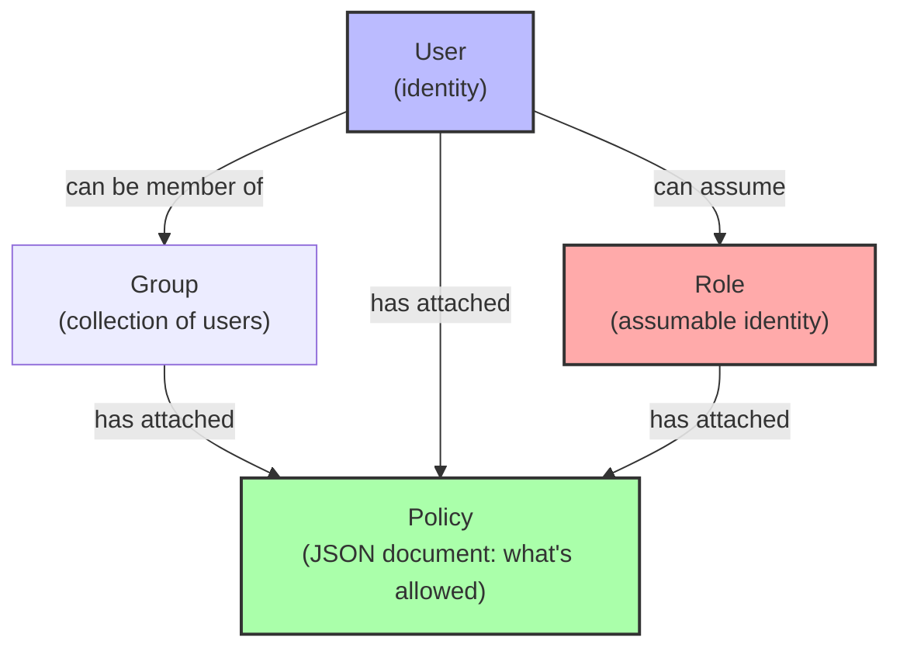
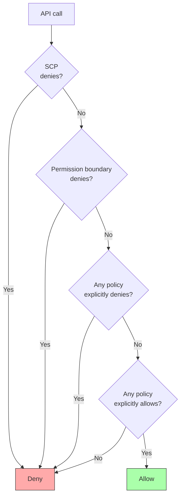

# 1. IAM Overview

> [!info] Chapter Context
> AWS IAM (Identity and Access Management) controls who can do what in your AWS account. It is the most important AWS service to understand — every other service relies on it for access control. This note covers the IAM data model, the policy evaluation logic, and the core concepts you must know.

Related: [[06 - LocalStack/1. Installing LocalStack]] | [[2. IAM Users, Groups, and Roles]] | [[3. IAM Policies]]

---

## 1. The IAM Data Model

IAM has four core entities:



### 1.1 User

A long-lived identity for a person or application. Has:

- A unique name.
- Credentials (password for Console login; access keys for API/CLI).
- Attached policies (what they can do).
- Group memberships.

### 1.2 Group

A collection of users. Users inherit the group's policies. Useful for organizing by team (e.g., "Developers", "Admins").

### 1.3 Role

An identity that can be **assumed** by:

- An IAM user (in the same or another account).
- An AWS service (EC2, Lambda, ECS, etc.).
- A federated user (via SAML or OIDC).

Roles issue **temporary credentials** (via STS). They are the preferred way to grant access — no long-lived keys to manage.

### 1.4 Policy

A JSON document that defines what actions are allowed or denied on what resources. Attached to users, groups, or roles.

---

## 2. Anatomy of a Policy

```json
{
  "Version": "2012-10-17",
  "Statement": [
    {
      "Effect": "Allow",
      "Action": [
        "s3:GetObject",
        "s3:PutObject"
      ],
      "Resource": "arn:aws:s3:::my-bucket/*"
    },
    {
      "Effect": "Deny",
      "Action": "s3:DeleteObject",
      "Resource": "arn:aws:s3:::my-bucket/*"
    }
  ]
}
```

### 2.1 The Fields

- **`Version`** — Always `"2012-10-17"` (the current policy language version).
- **`Statement`** — An array of statements. Each is one permission rule.
- **`Effect`** — `"Allow"` or `"Deny"`. Deny always wins.
- **`Action`** — A list of AWS API actions (e.g., `s3:GetObject`, `ec2:RunInstances`). Wildcards allowed (`s3:*`, `*`).
- **`Resource`** — The ARN(s) of the resource(s) the action applies to. Wildcards allowed (`*`).
- **`Condition`** (optional) — Conditions under which the statement applies (e.g., source IP, time of day, MFA present).
- **`Principal`** (in resource-based policies only) — Who the policy applies to.

### 2.2 ARNs (Amazon Resource Names)

ARNs uniquely identify AWS resources. Format:

```
arn:aws:service:region:account-id:resource
```

Examples:

- `arn:aws:s3:::my-bucket` — A bucket (no region or account; S3 buckets are globally unique).
- `arn:aws:s3:::my-bucket/*` — All objects in the bucket.
- `arn:aws:dynamodb:us-east-1:123456789012:table/users` — A DynamoDB table.
- `arn:aws:lambda:us-east-1:123456789012:function:my-func` — A Lambda function.
- `arn:aws:iam::123456789012:role/MyRole` — An IAM role.
- `*` — All resources.

---

## 3. Policy Types

### 3.1 Identity-Based Policies

Attached to users, groups, or roles. They say "this identity can do X."

```json
{
  "Effect": "Allow",
  "Action": "s3:GetObject",
  "Resource": "arn:aws:s3:::my-bucket/*"
}
```

### 3.2 Resource-Based Policies

Attached to resources (S3 buckets, SNS topics, SQS queues, Lambda functions, KMS keys). They say "this resource can be accessed by X."

```json
{
  "Effect": "Allow",
  "Principal": {"AWS": "arn:aws:iam::123456789012:root"},
  "Action": "s3:GetObject",
  "Resource": "arn:aws:s3:::my-bucket/*"
}
```

Resource-based policies can grant access to identities in **other AWS accounts** — that's their main use case.

### 3.3 Trust Policies

A special resource-based policy on a role, defining who can assume the role.

```json
{
  "Version": "2012-10-17",
  "Statement": [
    {
      "Effect": "Allow",
      "Principal": {"Service": "ec2.amazonaws.com"},
      "Action": "sts:AssumeRole"
    }
  ]
}
```

This role can be assumed by EC2 (instances with this role attached).

### 3.4 Permission Boundaries

A maximum-permissions policy on a role or user. Even if an attached policy grants more, the boundary caps it. Used for delegation (let a developer create roles, but only with bounded permissions).

### 3.5 SCPs (Service Control Policies)

In AWS Organizations, SCPs set the maximum permissions for an entire account or organizational unit. Even the root user is limited by SCPs.

---

## 4. Policy Evaluation Logic

When you make an API call, IAM evaluates all applicable policies in this order:



Key rules:

1. **Default deny** — Without an explicit allow, the request is denied.
2. **Explicit deny wins** — Any explicit deny overrides any allow.
3. **Explicit allow required** — At least one policy must explicitly allow the action.
4. **Permission boundaries and SCPs cap** — Even if an allow exists, the boundary/SCP can prevent it.

---

## 5. Common Managed Policies

AWS provides many managed policies. Common ones:

- **`AdministratorAccess`** — Full access to everything. Use sparingly.
- **`PowerUserAccess`** — Everything except IAM (cannot create users/roles).
- **`AmazonS3ReadOnlyAccess`** — Read all S3 buckets.
- **`AmazonEC2FullAccess`** — Full EC2 access.
- **`AWSLambdaBasicExecutionRole`** — Allow Lambda to write CloudWatch Logs.

For production, write **custom policies** with least privilege. Use IAM Access Analyzer to identify unused permissions.

---

## 6. The Root Account

The root account is the email/password you used to create the AWS account. It has unlimited access. Best practices:

- **Lock it down** — Enable MFA. Do not create access keys. Do not use it for daily work.
- **Use it for** — Account setup, billing, closing the account, recovering a locked-out admin.
- **Do not use it for** — Daily operations, application code, anything that could be automated.

```bash
# Check root account access keys (should be empty)
aws iam get-account-summary | jq '.SummaryMap.Users'  # number of users
aws iam generate-credential-report --output text | ... # detailed report
```

---

## 7. Common Student Mistakes

> [!warning] Mistake 1 — Using `AdministratorAccess` for Everything
> Apply least privilege. Use IAM Access Analyzer to identify unused permissions.

> [!warning] Mistake 2 — Creating Access Keys for Every User
> Prefer roles (assumed via STS) for applications. Reserve access keys for cases where roles aren't possible.

> [!warning] Mistake 3 — Using the Root Account for Daily Work
> Lock down the root account. Use IAM users or roles for everything.

> [!warning] Mistake 4 — Forgetting That Deny Wins
> An explicit deny in any policy overrides all allows. Use deny to enforce security boundaries.

> [!warning] Mistake 5 — Confusing Resource ARNs
> `arn:aws:s3:::my-bucket` is the bucket. `arn:aws:s3:::my-bucket/*` is the objects in the bucket. They are different resources.

> [!warning] Mistake 6 — Forgetting Cross-Account Access Requires Both Sides
> To allow account B to read an S3 bucket in account A: (1) account A's bucket policy must allow account B, AND (2) account B's IAM user/role must allow s3:GetObject on the bucket. Both sides must allow.

---

## 8. Summary Checklist

- [ ] IAM entities: users, groups, roles, policies.
- [ ] Policies are JSON documents with Effect, Action, Resource, Condition.
- [ ] ARNs uniquely identify resources: `arn:aws:service:region:account:resource`.
- [ ] Policy types: identity-based, resource-based, trust policies, permission boundaries, SCPs.
- [ ] Evaluation: default deny → check explicit deny (wins) → check explicit allow.
- [ ] Roles issue temporary credentials via STS; preferred over long-lived keys.
- [ ] Lock down the root account (MFA, no access keys).
- [ ] Cross-account access requires both sides to allow.

---

Previous: [[06 - LocalStack/4. LocalStack Projects and Patterns]] | Next: [[2. IAM Users, Groups, and Roles]]
