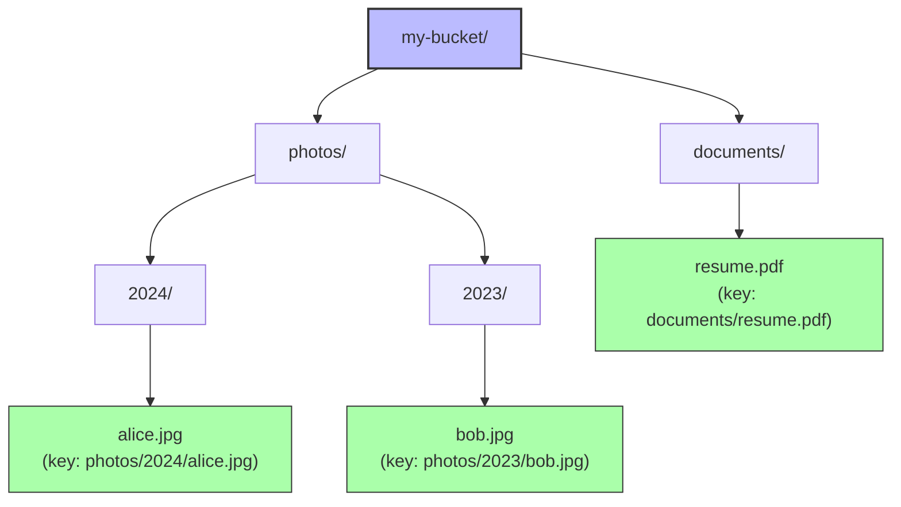

# 1. S3 Fundamentals

> [!info] Chapter Context
> Amazon S3 (Simple Storage Service) is object storage — you store files ("objects") in "buckets." S3 is infinite-scale, highly durable (11 nines), and the foundation of many AWS architectures. This note covers S3 concepts, operations, storage classes, and best practices.

Related: [[07 - Identity and Security/5. Secrets Management in AWS]] | [[2. S3 Operations and CLI]] | [[3. S3 Permissions and Security]] | [[4. Presigned URLs and Static Website Hosting]]

---

## 1. What S3 Is

S3 is an **object store**. You store arbitrary files (images, videos, JSON, backups) as "objects" in "buckets." Each object can be up to 5 TB. S3 is:

- **Infinitely scalable** — No capacity planning; S3 handles trillions of objects.
- **Highly durable** — 99.999999999% (11 nines) durability. Data is replicated across 3+ AZs.
- **Eventually consistent for overwrites, strongly consistent for new objects** — As of December 2020, S3 is strongly consistent for all reads (after a write, any subsequent read returns the new data).
- **Pay-as-you-go** — $0.023/GB/month for standard storage, plus per-request fees.

### 1.1 Buckets and Objects

- **Bucket** — A container for objects. Bucket names are globally unique (across all AWS accounts). You create a bucket in a specific region.
- **Object** — A file plus metadata. Identified by a key (the path) within a bucket.
- **Key** — The path of an object (e.g., `photos/2024/alice.jpg`). S3 has no real directories; the slashes are just part of the key.
- **Value** — The file contents (0 bytes to 5 TB).
- **Metadata** — Name-value pairs (e.g., `Content-Type`, `Cache-Control`).

### 1.2 The S3 Data Model

S3 is a **flat namespace**. There are no real folders. The AWS Console shows "folders" based on `/` in keys, but they are just prefixes — S3 does not actually have folder objects.

Example: a bucket `my-bucket` with these object keys:



Each leaf above is one object. The "folders" (`photos/`, `2024/`) do not exist as separate entities — they are just prefixes of keys.

---

## 2. Storage Classes

S3 offers multiple storage classes with different price/durability/availability tradeoffs:

| Class | Use case | Price (relative) | Retrieval |
| :--- | :--- | :--- | :--- |
| **Standard** | Frequent access | 1x | Instant |
| **Intelligent-Tiering** | Unknown access patterns | 1x + monitoring fee | Instant |
| **Standard-IA** | Infrequent access | 0.5x | Instant |
| **One-Zone-IA** | Infrequent, non-critical | 0.2x | Instant (single AZ) |
| **Glacier Instant Retrieval** | Archive, instant access | 0.2x | Milliseconds |
| **Glacier Flexible Retrieval** | Archive | 0.1x | Minutes to hours |
| **Glacier Deep Archive** | Long-term archive | 0.03x | Hours |
| **Reduced Redundancy (RRS)** | Reproducible data (deprecated) | 0.6x | Instant |

Use **lifecycle policies** to automatically transition objects between classes:

- Standard (first 30 days) → Standard-IA (30-90 days) → Glacier (90-365 days) → Deep Archive (365+ days).

---

## 3. Creating a Bucket

### 3.1 With the CLI

```bash
aws s3 mb s3://my-unique-bucket-name --region us-east-1
```

> [!warning] Bucket Names Are Globally Unique
> S3 bucket names are shared across all AWS accounts. If `my-bucket` is taken (in any account), you cannot create it. Use a unique name (e.g., `my-app-bucket-12345`).

### 3.2 Bucket Properties

When creating a bucket, consider:

- **Region** — Pick the closest to your users. Cross-region access incurs latency and data transfer fees.
- **Block Public Access** — Enabled by default since 2023. Keep it enabled unless you specifically need public access.
- **Versioning** — Keeps all versions of an object (including deletes). Useful for recovery; increases storage cost.
- **Encryption** — SSE-S3 (AWS-managed key, default), SSE-KMS (customer-managed key), SSE-C (customer-provided key).
- **Object Lock** — WORM (write-once-read-many) for compliance.

---

## 4. Basic Operations

### 4.1 Upload and Download

```bash
# Upload a file
aws s3 cp file.txt s3://my-bucket/file.txt

# Download a file
aws s3 cp s3://my-bucket/file.txt .

# Sync a directory
aws s3 sync ./local-dir s3://my-bucket/prefix/

# Recursive upload
aws s3 cp ./local-dir s3://my-bucket/prefix/ --recursive
```

### 4.2 List

```bash
# List buckets
aws s3 ls

# List objects in a bucket
aws s3 ls s3://my-bucket/

# List a "folder"
aws s3 ls s3://my-bucket/photos/2024/

# With size and timestamp
aws s3 ls s3://my-bucket/ --recursive --human-readable --summarize
```

### 4.3 Delete

```bash
# Delete an object
aws s3 rm s3://my-bucket/file.txt

# Delete a "folder" (all objects with prefix)
aws s3 rm s3://my-bucket/photos/ --recursive

# Empty a bucket
aws s3 rm s3://my-bucket/ --recursive

# Delete the bucket (must be empty)
aws s3 rb s3://my-bucket
```

### 4.4 Move and Rename

```bash
# Move (copy + delete)
aws s3 mv s3://my-bucket/old.txt s3://my-bucket/new.txt

# Copy
aws s3 cp s3://my-bucket/file.txt s3://other-bucket/file.txt
```

---

## 5. Versioning

When versioning is enabled, S3 keeps every version of every object.

```bash
# Enable versioning
aws s3api put-bucket-versioning --bucket my-bucket \
  --versioning-configuration Status=Enabled

# List all versions of an object
aws s3api list-object-versions --bucket my-bucket --prefix file.txt

# Get a specific version
aws s3api get-object --bucket my-bucket --key file.txt --version-id abc123 file.txt

# Delete a specific version (permanently)
aws s3api delete-object --bucket my-bucket --key file.txt --version-id abc123
```

With versioning:

- A regular `delete` adds a "delete marker" (the object is hidden but not gone).
- To restore, delete the delete marker.
- To permanently delete, delete the specific version.

---

## 6. Lifecycle Policies

Automatically transition objects between storage classes or delete them based on age:

```json
{
  "Rules": [
    {
      "ID": "Archive old logs",
      "Status": "Enabled",
      "Filter": {"Prefix": "logs/"},
      "Transitions": [
        {"Days": 30, "StorageClass": "STANDARD_IA"},
        {"Days": 90, "StorageClass": "GLACIER"},
        {"Days": 365, "StorageClass": "DEEP_ARCHIVE"}
      ],
      "Expiration": {"Days": 2555}
    }
  ]
}
```

Apply with:

```bash
aws s3api put-bucket-lifecycle-configuration --bucket my-bucket \
  --lifecycle-configuration file://lifecycle.json
```

---

## 7. Common Student Mistakes

> [!warning] Mistake 1 — Using Bucket Names That Already Exist
> S3 bucket names are globally unique. If `my-bucket` is taken, you cannot use it. Add a suffix (e.g., `my-bucket-20240115`).

> [!warning] Mistake 2 — Forgetting to Enable Versioning Before You Need It
> Versioning cannot recover objects deleted before it was enabled. Enable it on day one for important buckets.

> [!warning] Mistake 3 — Storing All Objects in Standard Class
> Standard is the most expensive. Use lifecycle rules to transition old objects to IA/Glacier.

> [!warning] Mistake 4 — Forgetting That S3 Has No Real Folders
> `photos/2024/alice.jpg` is one key, not a folder hierarchy. Tools that show "folders" (Console, `aws s3 ls`) are just grouping by prefix.

> [!warning] Mistake 5 — Allowing Public Access Accidentally
> Bucket policies can accidentally expose data. Use IAM Access Analyzer to find publicly accessible buckets. Block Public Access is on by default since 2023 — keep it that way unless you have a specific reason.

> [!warning] Mistake 6 — Forgetting Cross-Region Replication Costs
> Cross-region replication incurs data transfer fees. Only replicate when needed (DR, compliance).

---

## 8. Summary Checklist

- [ ] S3 is object storage: buckets contain objects, identified by keys.
- [ ] 11 nines durability; data replicated across 3+ AZs.
- [ ] Bucket names are globally unique; created in a specific region.
- [ ] Storage classes: Standard, IA, Glacier, Deep Archive. Use lifecycle rules to transition.
- [ ] Versioning keeps all versions; enable on day one for important buckets.
- [ ] S3 has no real folders; the `/` is part of the key.
- [ ] Block Public Access is on by default; keep it that way unless needed.
- [ ] Lifecycle policies automate transitions and expiration.

---

Previous: [[07 - Identity and Security/5. Secrets Management in AWS]] | Next: [[2. S3 Operations and CLI]]
