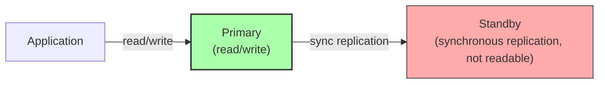
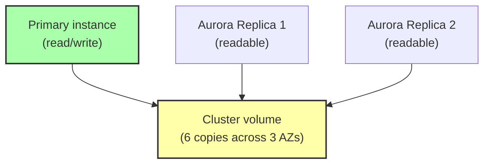

# 2. RDS and Relational Databases

> [!info] Chapter Context
> Amazon RDS (Relational Database Service) is AWS's managed SQL database offering. It supports MySQL, PostgreSQL, MariaDB, Oracle, SQL Server, and AWS's own Aurora. This note covers RDS concepts, Multi-AZ, read replicas, Aurora, and operational best practices.

Related: [[1. Database Fundamentals]] | [[3. DynamoDB Fundamentals]] | [[07 - Identity and Security/5. Secrets Management in AWS]]

---

## 1. What RDS Is

RDS is a **managed** relational database service. AWS manages:

- The hardware.
- The OS.
- The database engine installation and patching.
- Backups (automated and manual).
- Multi-AZ replication.
- Scaling (storage and compute).

You manage:

- The database schema and queries.
- Database users and permissions.
- Performance tuning (indexes, query optimization).
- Connection pooling.

### 1.1 Supported Engines

- **MySQL** — Open source; the most popular.
- **PostgreSQL** — Open source; feature-rich (JSON, full-text search, extensions).
- **MariaDB** — MySQL fork; mostly compatible.
- **Oracle** — Commercial; bring-your-own-license.
- **SQL Server** — Commercial.
- **Aurora** — AWS proprietary; MySQL and PostgreSQL-compatible; better performance.

---

## 2. Creating an RDS Instance

### 2.1 With the CLI

```bash
aws rds create-db-instance \
  --db-instance-identifier mydb \
  --db-instance-class db.t3.micro \
  --engine postgres \
  --master-username admin \
  --master-user-password 'UseAStrongPassword123!' \
  --allocated-storage 20 \
  --backup-retention-period 7 \
  --multi-az \
  --publicly-accessible false \
  --vpc-security-group-ids sg-12345 \
  --db-subnet-group-name my-subnet-group
```

### 2.2 Important Settings

- **DB instance class** — Compute and memory size (`db.t3.micro`, `db.r6g.large`, etc.).
- **Allocated storage** — Disk size (20 GB to 64 TB).
- **Multi-AZ** — Whether to deploy a synchronous standby in another AZ.
- **Backup retention** — Days of automated backups (1-35).
- **Publicly accessible** — Almost always `false`. Access via VPC only.
- **Security groups** — Control which EC2/Lambda/etc. can connect.
- **DB subnet group** — Which subnets the DB can be placed in.

### 2.3 Connecting

```bash
# Get the endpoint
aws rds describe-db-instances --db-instance-identifier mydb \
  --query 'DBInstances[0].Endpoint.Address' --output text
# mydb.abc123.us-east-1.rds.amazonaws.com

# Connect with psql
psql -h mydb.abc123.us-east-1.rds.amazonaws.com -U admin -d postgres
```

The endpoint is a DNS name that resolves to the current primary. If Multi-AZ fails over, the endpoint updates to point to the new primary (so your app keeps working).

---

## 3. Multi-AZ

Multi-AZ deploys a **synchronous standby** in another AZ. Writes go to the primary; the standby receives a copy. If the primary fails, RDS promotes the standby (typically 60-120 seconds of downtime).



> [!warning] Multi-AZ Is Not for Read Scaling
> The standby is not readable (in standard Multi-AZ). It exists for high availability only. For read scaling, use Read Replicas.

Multi-AZ is enabled per-instance. You can enable it on an existing instance (with some downtime while the standby is provisioned).

---

## 4. Read Replicas

A read replica is an asynchronous copy of the primary, used for read scaling.

```bash
aws rds create-db-instance-read-replica \
  --db-instance-identifier mydb-replica \
  --source-db-instance-identifier mydb
```

Use cases:

- Offload read traffic (analytics, reporting).
- Cross-region read replicas for disaster recovery or low-latency global reads.

Read replicas can be promoted to standalone databases (breaking the replication). This is useful for cross-region failover.

### 4.1 Read Replicas vs. Multi-AZ

| Feature | Multi-AZ | Read Replicas |
| :--- | :--- | :--- |
| Purpose | High availability | Read scaling |
| Replication | Synchronous | Asynchronous |
| Standby readable? | No | Yes |
| Failover | Automatic | Manual (promote) |
| Same region? | Yes | Either |

---

## 5. Aurora

Aurora is AWS's proprietary database, MySQL- and PostgreSQL-compatible. It has several advantages over standard RDS:

### 5.1 Architecture

Aurora separates compute (the instance) from storage (a distributed, replicated cluster volume).



- The storage is automatically replicated across 3 AZs (6 copies).
- Replicas share the same storage; they don't need to replay a log.
- Failover is fast (typically <30 seconds) — a replica is promoted to primary.

### 5.2 Aurora Serverless

Aurora Serverless scales compute automatically based on load. Good for intermittent workloads. v2 is recommended (scales to zero in some configurations).

### 5.3 Aurora Global Database

Cross-region replication with typical <1 second lag. Read-only secondary clusters in other regions; can be promoted to read-write on disaster recovery.

---

## 6. Backups

### 6.1 Automated Backups

- Daily full snapshot + continuous transaction logs.
- Retention: 1-35 days.
- Restore to any point in time within the retention window (PITR — Point-in-Time Recovery).

### 6.2 Manual Snapshots

- Taken on demand; retained until you delete them.
- Useful for long-term retention (e.g., quarterly archives).

### 6.3 Restoring

Restoring creates a **new** RDS instance from a snapshot. You cannot restore "in place" — the original instance is unchanged.

```bash
aws rds restore-db-instance-from-db-snapshot \
  --db-instance-identifier mydb-restored \
  --db-snapshot-identifier mydb-2024-01-15
```

---

## 7. Security

### 7.1 Network Isolation

- Deploy RDS in **private subnets** (not publicly accessible).
- Use security groups to allow traffic only from your app (EC2, ECS, Lambda).

### 7.2 Authentication

- Username/password (default).
- **IAM database authentication** — Use IAM tokens instead of passwords (MySQL, PostgreSQL). 15-minute tokens.
- **Kerberos** (for SQL Server).

### 7.3 Encryption

- **Encryption at rest** — Enable when creating the instance (uses KMS). Cannot be added later; you must create a new encrypted instance and migrate.
- **Encryption in transit** — Use TLS. The endpoint supports it; require it via parameter group (`rds.force_ssl=1` for PostgreSQL).

### 7.4 Secrets

Use **AWS Secrets Manager** for the database password. Enable automatic rotation (RDS rotation template). Your app fetches the secret at startup.

---

## 8. Performance

### 8.1 Choose the Right Instance Class

- **T3 / T4g** — Burstable; for dev/low-traffic.
- **M5 / M6g** — General purpose.
- **R5 / R6g** — Memory-optimized; for in-memory databases and large working sets.
- **X1e** — Extreme memory; for huge in-memory databases.

### 8.2 Storage Types

- **gp2 / gp3** — General purpose SSD; good for most workloads.
- **io1 / io2** — Provisioned IOPS; for high-performance OLTP.
- **st1** — Throughput-optimized HDD; for data warehouses.

### 8.3 Performance Insights

RDS Performance Insights is a built-in tool that shows you which queries are consuming the most resources. Use it to identify slow queries.

```bash
aws pi describe-dimension-keys \
  --service-type RDS \
  --identifier db-ABC123 \
  --start-time 2024-01-15T00:00:00Z \
  --end-time 2024-01-15T01:00:00Z \
  --metric db.load.avg \
  --group-by '{"Group": "db.query", "Dimension": "db.query.id"}'
```

### 8.4 RDS Proxy

RDS Proxy is a managed connection pooler. It:

- Reduces connection overhead (especially for Lambda, which opens many connections).
- Handles failover gracefully.
- Pools connections across Lambda invocations.

```bash
aws rds create-db-proxy \
  --db-proxy-name my-proxy \
  --engine-family POSTGRESQL \
  --auth '[{"AuthScheme":"SECRETS","SecretArn":"arn:aws:secretsmanager:...","IAMAuth":"DISABLED"}]' \
  --role-arn arn:aws:iam::123456789012:role/rds-proxy-role \
  --vpc-subnet-ids subnet-1 subnet-2 subnet-3 \
  --vpc-security-group-ids sg-12345
```

---

## 9. Common Student Mistakes

> [!warning] Mistake 1 — Making RDS Publicly Accessible
> RDS should be in private subnets. Use security groups to allow only your app to connect. Setting `--publicly-accessible true` exposes your database to the internet.

> [!warning] Mistake 2 — Single-AZ for Production
> A single-AZ RDS instance has no failover. Use Multi-AZ for production.

> [!warning] Mistake 3 — Forgetting to Enable Encryption at Creation
> Encryption cannot be added to an existing instance. You must create a new encrypted instance and migrate.

> [!warning] Mistake 4 — Not Using Connection Pooling with Lambda
> Lambda opens many connections (one per concurrent invocation). Use RDS Proxy to avoid exhausting `max_connections`.

> [!warning] Mistake 5 — Storing Passwords in Environment Variables
> Use Secrets Manager with automatic rotation. Your app fetches the password at startup.

> [!warning] Mistake 6 — Using RDS for Analytics
> RDS is for OLTP (transactional). For analytics (OLAP), use Redshift or Athena.

---

## 10. Summary Checklist

- [ ] RDS is managed SQL: AWS handles hardware, OS, engine, backups; you manage schema and queries.
- [ ] Engines: MySQL, PostgreSQL, MariaDB, Oracle, SQL Server, Aurora.
- [ ] Multi-AZ: synchronous standby for high availability (not for read scaling).
- [ ] Read Replicas: asynchronous copies for read scaling.
- [ ] Aurora: separated compute/storage; fast failover; replicas share storage.
- [ ] Aurora Serverless: auto-scaling compute.
- [ ] Backups: automated (1-35 days, PITR) + manual snapshots.
- [ ] Security: private subnets, security groups, encryption at rest + in transit, IAM DB auth, Secrets Manager.
- [ ] RDS Proxy: managed connection pooling (essential for Lambda).
- [ ] Performance Insights: identify slow queries.

---

Previous: [[1. Database Fundamentals]] | Next: [[3. DynamoDB Fundamentals]]
