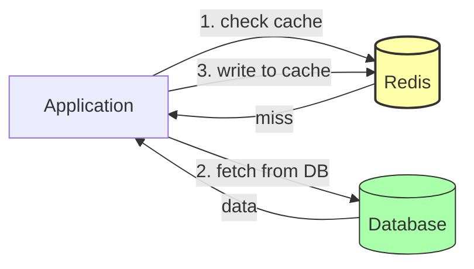
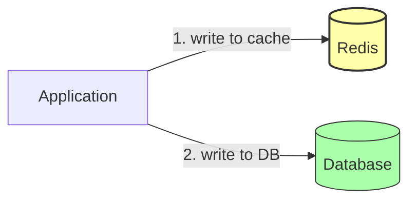

# 4. ElastiCache and In-Memory Stores

> [!info] Chapter Context
> In-memory stores (Redis, Memcached) are 1000x faster than disk-based databases. They power caching, session storage, leaderboards, real-time analytics, and more. AWS ElastiCache is the managed service for Redis and Memcached.

Related: [[3. DynamoDB Fundamentals]] | [[10 - Event Driven Systems/1. Events and Pub-Sub]] | [[15 - Architecture Patterns/1. Microservices]]

---

## 1. Why In-Memory Stores

Memory is 100,000x faster than disk. An in-memory store keeps data in RAM, enabling microsecond latency.

Use cases:

- **Caching** — Store frequently accessed data to avoid hitting the database.
- **Session storage** — User sessions in a web app.
- **Real-time leaderboards** — Sorted sets in Redis.
- **Rate limiting** — Count requests per user per minute.
- **Pub/sub** — Message broadcasting.
- **Job queues** — Redis lists, streams.

---

## 2. Redis vs. Memcached

ElastiCache supports two engines:

| Feature | Redis | Memcached |
| :--- | :--- | :--- |
| Data structures | Strings, lists, sets, hashes, sorted sets, streams | Strings only |
| Persistence | Yes (RDB snapshots, AOF) | No |
| Replication | Yes (primary + replicas) | No |
| Clustering | Yes (sharded) | Yes (client-side sharding) |
| Transactions | Yes (MULTI/EXEC) | No |
| Pub/sub | Yes | No |
| TLS | Yes | Yes (recent versions) |
| Use case | Most use cases | Simple cache only |

For new projects, **use Redis**. Memcached is simpler but Redis has more features and is more popular.

---

## 3. Creating an ElastiCache Cluster

### 3.1 Redis (Cluster Mode Disabled)

A single primary + read replicas.

```bash
aws elasticache create-replication-group \
  --replication-group-id my-redis \
  --replication-group-description "My Redis" \
  --engine redis \
  --cache-node-type cache.t3.micro \
  --num-cache-clusters 2 \
  --automatic-failover-enabled \
  --cache-subnet-group-name my-subnet-group \
  --security-group-ids sg-12345 \
  --snapshot-retention-limit 7
```

### 3.2 Redis (Cluster Mode Enabled)

Sharded cluster; each shard has a primary + replicas.

```bash
aws elasticache create-replication-group \
  --replication-group-id my-redis-cluster \
  --replication-group-description "My sharded Redis" \
  --engine redis \
  --cache-node-type cache.t3.micro \
  --num-node-groups 3 \
  --replicas-per-node-group 2 \
  --automatic-failover-enabled \
  --cache-subnet-group-name my-subnet-group \
  --security-group-ids sg-12345
```

### 3.3 Memcached

```bash
aws elasticache create-cache-cluster \
  --cache-cluster-id my-memcached \
  --engine memcached \
  --cache-node-type cache.t3.micro \
  --num-cache-nodes 3 \
  --cache-subnet-group-name my-subnet-group \
  --security-group-ids sg-12345
```

---

## 4. Connecting to Redis

Get the endpoint:

```bash
aws elasticache describe-replication-groups \
  --replication-group-id my-redis \
  --query 'ReplicationGroups[0].PrimaryEndPoint' --output table
```

Connect with `redis-cli`:

```bash
redis-cli -h my-redis.abc123.0001.use1.cache.amazonaws.com -p 6379
> SET mykey "hello"
> GET mykey
"hello"
```

With TLS:

```bash
redis-cli -h my-redis.abc123.0001.use1.cache.amazonaws.com -p 6379 --tls --cacert ca.pem
```

With Python (`redis-py`):

```python
import redis

r = redis.Redis(
    host='my-redis.abc123.0001.use1.cache.amazonaws.com',
    port=6379,
    ssl=True,
    decode_responses=True
)

r.set('mykey', 'hello')
print(r.get('mykey'))   # hello
```

---

## 5. Common Redis Patterns

### 5.1 Caching

```python
def get_user(user_id):
    # Try cache first
    cached = r.get(f'user:{user_id}')
    if cached:
        return json.loads(cached)

    # Cache miss: fetch from DB
    user = db.get_user(user_id)

    # Cache for 5 minutes
    r.setex(f'user:{user_id}', 300, json.dumps(user))
    return user
```

### 5.2 Session Storage

```python
import uuid

def create_session(user_id):
    session_id = str(uuid.uuid4())
    r.setex(f'session:{session_id}', 3600, json.dumps({'user_id': user_id}))
    return session_id

def get_session(session_id):
    data = r.get(f'session:{session_id}')
    return json.loads(data) if data else None
```

### 5.3 Rate Limiting

```python
def check_rate_limit(user_id, limit=100, window=60):
    key = f'rate:{user_id}'
    count = r.incr(key)
    if count == 1:
        r.expire(key, window)
    return count <= limit
```

### 5.4 Leaderboard (Sorted Set)

```python
# Add a score
r.zadd('leaderboard', {'alice': 1500, 'bob': 2000, 'carol': 1800})

# Get top 10
top10 = r.zrevrange('leaderboard', 0, 9, withscores=True)

# Get a user's rank
rank = r.zrevrank('leaderboard', 'alice')
```

### 5.5 Pub/Sub

```python
# Publisher
r.publish('events', 'something happened')

# Subscriber (in another process)
pubsub = r.pubsub()
pubsub.subscribe('events')
for message in pubsub.listen():
    print(message['data'])
```

---

## 6. Caching Patterns

### 6.1 Cache-Aside (Lazy Loading)



- The app checks the cache first.
- On a miss, the app fetches from the DB and writes to the cache.
- Pros: Simple; cache contains only what's accessed.
- Cons: Cache miss penalty (DB read + cache write); stale data possible.

### 6.2 Write-Through



- The app writes to the cache and DB simultaneously.
- Pros: Cache is always up to date.
- Cons: Write latency (two writes); cache may contain unused data.

### 6.3 Write-Behind (Write-Back)

- The app writes to the cache only.
- A background process syncs the cache to the DB.
- Pros: Very fast writes.
- Cons: Data loss if the cache fails before sync; complex.

For most use cases, **cache-aside** is sufficient.

---

## 7. Cache Eviction Policies

When Redis runs out of memory, it evicts keys based on the configured policy:

- **noeviction** — Reject writes when full (errors).
- **allkeys-lru** — Evict the least recently used key (any key).
- **allkeys-lfu** — Evict the least frequently used key.
- **volatile-lru** — Evict the LRU key among those with a TTL.
- **volatile-ttl** — Evict the key with the shortest TTL.
- **allkeys-random** — Evict a random key.

For caching, use `allkeys-lru` or `allkeys-lfu`. For sessions, use `volatile-lru` (only evict keys with TTLs).

---

## 8. Common Student Mistakes

> [!warning] Mistake 1 — Treating Redis as Persistent Storage
> Redis is in-memory. Without persistence (RDB/AOF), data is lost on restart. Use Redis as a cache, not as your primary database.

> [!warning] Mistake 2 — Forgetting to Set TTLs
> Without TTLs, the cache grows forever. Set TTLs based on how stale data can be.

> [!warning] Mistake 3 — Cache Stampede
> When many requests miss the cache simultaneously (e.g., after a restart), they all hit the DB. Use locking or "dogpile prevention" to avoid this.

> [!warning] Mistake 4 — Storing Large Values
> Redis is single-threaded. A large value (>1 MB) blocks all other operations. Keep values small (<100 KB).

> [!warning] Mistake 5 — Using Memcached When You Need Persistence
> Memcached has no persistence. Use Redis if data must survive restarts.

> [!warning] Mistake 6 — Forgetting to Use TLS
> Redis traffic is plaintext by default. Enable TLS (in-transit encryption) for production.

---

## 9. Summary Checklist

- [ ] ElastiCache is managed Redis or Memcached. Use Redis for new projects.
- [ ] Use cases: caching, session storage, leaderboards, rate limiting, pub/sub, queues.
- [ ] Redis data structures: strings, lists, sets, hashes, sorted sets, streams.
- [ ] Caching patterns: cache-aside (most common), write-through, write-behind.
- [ ] Set TTLs to prevent unbounded growth.
- [ ] Choose the right eviction policy (`allkeys-lru` for caching).
- [ ] Use TLS for production.
- [ ] Don't treat Redis as persistent storage without enabling persistence.

---

Previous: [[3. DynamoDB Fundamentals]] | Next: [[10 - Event Driven Systems/1. Events and Pub-Sub]]
