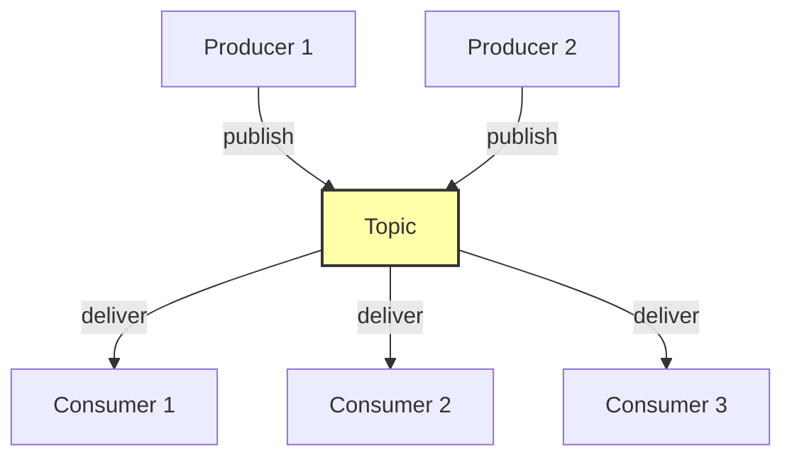
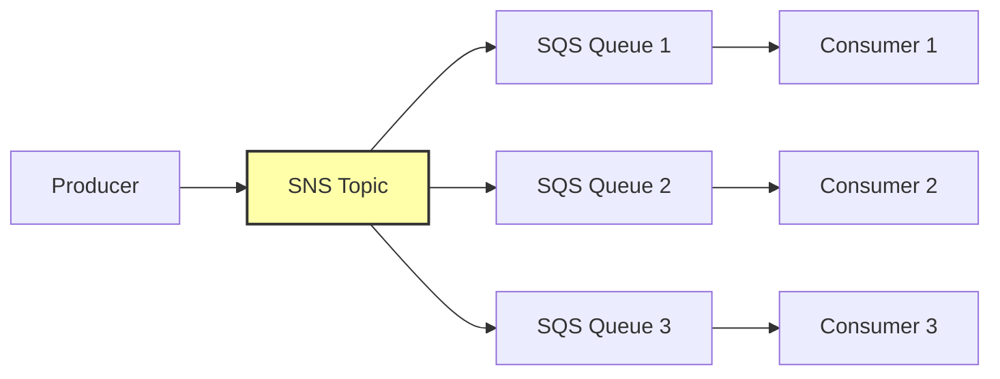

# 1. Events and Pub-Sub

> [!info] Chapter Context
> Event-driven architecture (EDA) decouples producers from consumers via events. This note covers the pub-sub pattern, event sourcing, and the AWS building blocks (SNS, EventBridge, SQS, Kinesis).

Related: [[09 - Databases/4. ElastiCache and In-Memory Stores]] | [[2. SNS Fundamentals]] | [[3. SQS Fundamentals]] | [[15 - Architecture Patterns/2. Event Driven Architecture]]

---

## 1. What Is an Event

An **event** is a record of something that happened: "user signed up," "file uploaded," "order placed." An event has:

- A **type** (e.g., `user.created`).
- A **source** (who produced it).
- A **timestamp**.
- A **payload** (the data: user ID, file path, order details).

Events are **immutable** — they describe what already happened; you cannot change them.

---

## 2. The Pub-Sub Pattern

**Publish-Subscribe** (pub-sub) decouples producers from consumers:

- **Producers** publish events to a topic, without knowing who consumes them.
- **Consumers** subscribe to topics, without knowing who produces events.
- A **broker** (SNS, EventBridge, Kafka) routes events.



Benefits:

- **Decoupling** — Producers don't know about consumers.
- **Scalability** — Add consumers without changing producers.
- **Resilience** — A consumer being down doesn't block the producer.

---

## 3. Event Sourcing

In traditional CRUD, we store the current state. In **event sourcing**, we store the sequence of events that led to the current state. The current state is derived by replaying the events.

Example: a bank account.

- **CRUD**: A `balance` column updated on each transaction.
- **Event sourcing**: An `events` table with rows like `Deposited $100`, `Withdrew $50`. The balance is computed by summing.

Event sourcing benefits:

- **Audit trail** — Every change is recorded.
- **Time travel** — Reconstruct the state at any point in time.
- **Replay** — Re-process events to rebuild read models.

Tradeoffs:

- **Complexity** — Rebuilding state from events is non-trivial.
- **Storage** — Event logs grow indefinitely (use snapshots).
- **Schema evolution** — Old events must remain replayable.

AWS services for event sourcing: DynamoDB Streams, Kinesis Data Streams, EventBridge.

---

## 4. AWS Event-Driven Building Blocks

| Service | Role | Throughput | Persistence |
| :--- | :--- | :--- | :--- |
| **SNS** | Pub/sub messaging | High | No (fire-and-forget) |
| **EventBridge** | Event bus (managed) | Medium | No (delivers to targets) |
| **SQS** | Queue (point-to-point) | High | Yes (until consumed) |
| **Kinesis Data Streams** | Real-time streaming | Very high | Yes (1-365 days) |
| **DynamoDB Streams** | DB change capture | Per-table | Yes (24 hours) |
| **IoT Core** | IoT messaging | High | No |

---

## 5. When to Use Each

- **SNS** — One-to-many fan-out (one event, multiple subscribers).
- **SQS** — Point-to-point queue (decouple producer from consumer, handle load spikes).
- **EventBridge** — AWS service events (EC2 state changes, S3 object creation), scheduled events, custom event buses.
- **Kinesis** — High-volume streaming (logs, clickstream, telemetry).
- **DynamoDB Streams** — React to DB changes (aggregation, replication, notifications).

---

## 6. Common Patterns

### 6.1 Fan-Out (SNS + SQS)

A producer publishes to SNS. SNS fans out to multiple SQS queues. Each consumer reads from its own queue.



Each consumer has its own queue, so:
- Consumers can be down without losing messages (the queue buffers).
- Consumers can process at their own pace.
- One slow consumer doesn't block others.

### 6.2 Event-Driven Lambda

A producer (S3, DynamoDB, SNS, EventBridge) triggers a Lambda function. The function processes the event.

```
S3 PUT -> Lambda (generate thumbnail)
DynamoDB Update -> Lambda (update aggregation)
EventBridge (scheduled) -> Lambda (daily report)
```

Covered in [[11 - Serverless Computing/2. Lambda Fundamentals]].

### 6.3 Saga Pattern

For multi-step business processes (e.g., e-commerce order): each step emits an event that triggers the next step. If a step fails, compensation events roll back previous steps.

Covered in [[15 - Architecture Patterns/3. Saga Pattern]].

---

## 7. Common Student Mistakes

> [!warning] Mistake 1 — Confusing SNS and SQS
> SNS is pub-sub (push, multiple subscribers). SQS is a queue (pull, single consumer per message). Use SNS for fan-out, SQS for decoupled processing.

> [!warning] Mistake 2 — Using SNS for Long-Running Work
> SNS does not persist messages. If a subscriber is down, messages may be lost. Use SQS as a buffer.

> [!warning] Mistake 3 — Forgetting At-Least-Once Delivery
> SQS, SNS, and Lambda all deliver at-least-once. Your consumer must be idempotent (handle duplicate messages).

> [!warning] Mistake 4 — Tight Coupling in Event Schemas
> If event schemas change without coordination, consumers break. Use schema registries (EventBridge Schema Registry, Glue Schema Registry).

> [!warning] Mistake 5 — Not Handling Poison Messages
> A malformed message can crash your consumer repeatedly. Move it to a Dead Letter Queue (DLQ) after N failed attempts.

---

## 8. Summary Checklist

- [ ] Events are immutable records of things that happened.
- [ ] Pub-sub decouples producers from consumers via a broker (SNS, EventBridge).
- [ ] Event sourcing stores events; current state is derived by replay.
- [ ] AWS services: SNS (fan-out), SQS (queue), EventBridge (event bus), Kinesis (streaming), DynamoDB Streams (DB changes).
- [ ] Fan-out pattern: SNS + multiple SQS queues.
- [ ] All event systems deliver at-least-once; consumers must be idempotent.
- [ ] Use DLQs for poison messages.

---

Previous: [[09 - Databases/4. ElastiCache and In-Memory Stores]] | Next: [[2. SNS Fundamentals]]
