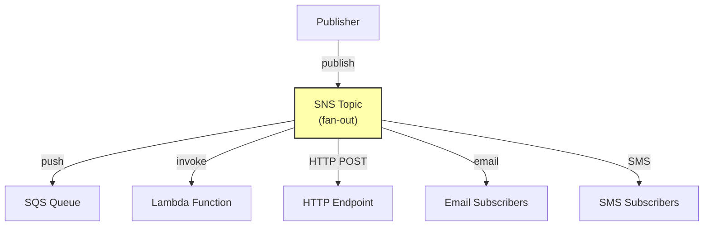

# 2. SNS Fundamentals

> [!info] Chapter Context
> Amazon SNS (Simple Notification Service) is a pub-sub messaging service. Producers publish to topics; subscribers (SQS, Lambda, HTTP endpoints, email, SMS) receive the messages.

Related: [[1. Events and Pub-Sub]] | [[3. SQS Fundamentals]] | [[11 - Serverless Computing/2. Lambda Fundamentals]]

---

## 1. What SNS Is

SNS is a fully-managed pub-sub messaging service. You create a **topic**, publish messages to it, and subscribers receive the messages.



---

## 2. Topics and Subscriptions

### 2.1 Create a Topic

```bash
aws sns create-topic --name my-topic
# Returns the ARN: arn:aws:sns:us-east-1:123456789012:my-topic
```

### 2.2 Subscribe

```bash
# Subscribe an SQS queue
aws sns subscribe --topic-arn arn:aws:sns:us-east-1:123456789012:my-topic \
  --protocol sqs \
  --notification-endpoint arn:aws:sqs:us-east-1:123456789012:my-queue

# Subscribe a Lambda function
aws sns subscribe --topic-arn arn:aws:sns:us-east-1:123456789012:my-topic \
  --protocol lambda \
  --notification-endpoint arn:aws:lambda:us-east-1:123456789012:function:my-func

# Subscribe an HTTPS endpoint
aws sns subscribe --topic-arn arn:aws:sns:us-east-1:123456789012:my-topic \
  --protocol https \
  --notification-endpoint https://example.com/webhook

# Subscribe an email address
aws sns subscribe --topic-arn arn:aws:sns:us-east-1:123456789012:my-topic \
  --protocol email \
  --notification-endpoint alice@example.com
```

Email subscriptions require confirmation (the subscriber must click a link in a confirmation email).

### 2.3 Publish

```bash
aws sns publish --topic-arn arn:aws:sns:us-east-1:123456789012:my-topic \
  --subject "Alert" \
  --message "Something happened!"
```

For structured messages (JSON) with different content per protocol:

```bash
aws sns publish --topic-arn arn:aws:sns:us-east-1:123456789012:my-topic \
  --message-structure json \
  --message '{
    "default": "Default message",
    "email": "Plain text email body",
    "sqs": "{\"event\":\"alert\",\"severity\":\"high\"}",
    "lambda": "{\"event\":\"alert\",\"severity\":\"high\"}"
  }'
```

---

## 3. SNS Topic Types

- **Standard** (default) — Best-effort ordering, at-least-once delivery, virtually unlimited throughput.
- **FIFO** — Strict ordering, exactly-once delivery, limited throughput (300 messages/second with batching).

FIFO topic names must end with `.fifo`:

```bash
aws sns create-topic --name my-topic.fifo --attributes FifoTopic=true
```

FIFO topics require FIFO SQS queues as subscriptions (standard queues cannot subscribe).

---

## 4. SNS + SQS Fan-Out

The most common SNS pattern: a producer publishes to SNS; SNS fans out to multiple SQS queues; each consumer reads from its queue.

```bash
# Create the topic
TOPIC_ARN=$(aws sns create-topic --name orders --query 'TopicArn' --output text)

# Create three queues
Q1_URL=$(aws sqs create-queue --queue-name orders-inventory --query 'QueueUrl' --output text)
Q2_URL=$(aws sqs create-queue --queue-name orders-shipping --query 'QueueUrl' --output text)
Q3_URL=$(aws sqs create-queue --queue-name orders-analytics --query 'QueueUrl' --output text)

# Get the queue ARNs
Q1_ARN=$(aws sqs get-queue-attributes --queue-url $Q1_URL --attribute-names QueueArn --query 'Attributes.QueueArn' --output text)
Q2_ARN=$(aws sqs get-queue-attributes --queue-url $Q2_URL --attribute-names QueueArn --query 'Attributes.QueueArn' --output text)
Q3_ARN=$(aws sqs get-queue-attributes --queue-url $Q3_URL --attribute-names QueueArn --query 'Attributes.QueueArn' --output text)

# Subscribe each queue to the topic
aws sns subscribe --topic-arn $TOPIC_ARN --protocol sqs --notification-endpoint $Q1_ARN
aws sns subscribe --topic-arn $TOPIC_ARN --protocol sqs --notification-endpoint $Q2_ARN
aws sns subscribe --topic-arn $TOPIC_ARN --protocol sqs --notification-endpoint $Q3_ARN

# Allow SNS to write to the queues (queue policies)
# (omitted for brevity, but required)

# Publish an order
aws sns publish --topic-arn $TOPIC_ARN --message '{"order_id": 123, "total": 99.99}'
```

Each queue receives a copy of the message. Inventory, shipping, and analytics teams each consume at their own pace.

---

## 5. Message Filtering

SNS can filter messages so subscribers only receive what they care about.

```bash
# Subscribe with a filter policy
aws sns subscribe --topic-arn arn:aws:sns:us-east-1:123456789012:orders \
  --protocol sqs \
  --notification-endpoint arn:aws:sqs:us-east-1:123456789012:high-value-orders \
  --attributes '{"FilterPolicy": "{\"total\": [{\"numeric\": [\">\", 1000]}]}}"}'
```

This subscriber only receives messages where `total > 1000`.

Publishers must include message attributes for filtering to work:

```bash
aws sns publish --topic-arn arn:aws:sns:us-east-1:123456789012:orders \
  --message '{"order_id": 123, "total": 1500}' \
  --message-attributes '{"total": {"DataType": "Number", "StringValue": "1500"}}'
```

---

## 6. SNS Delivery Retries

SNS retries delivery to HTTP/HTTPS endpoints:

- 4 retries: at 10s, 20s, 40s, 80s (total ~3 hours).
- After all retries fail, the message is lost (use a DLQ to capture).

For Lambda and SQS subscribers, retries are handled by those services.

---

## 7. Common Student Mistakes

> [!warning] Mistake 1 — Using SNS for Guaranteed Delivery
> SNS does not persist messages. If all subscribers are down, messages may be lost. Use SQS as a buffer for important messages.

> [!warning] Mistake 2 — Forgetting the Queue Policy for SNS-to-SQS
> The SQS queue must have a policy allowing SNS to send messages to it. Without it, SNS cannot deliver.

> [!warning] Mistake 3 — Forgetting to Confirm Email Subscriptions
> Email subscriptions require the user to click a confirmation link. Until they do, no messages are delivered.

> [!warning] Mistake 4 — Confusing Standard and FIFO Topics
> FIFO topics require FIFO queues as subscribers. Standard queues cannot subscribe to FIFO topics.

> [!warning] Mistake 5 — Forgetting At-Least-Once Delivery
> SNS (standard) is at-least-once. Your subscribers must be idempotent.

---

## 8. Summary Checklist

- [ ] SNS is a pub-sub messaging service.
- [ ] Create a topic; subscribe endpoints (SQS, Lambda, HTTP, email, SMS); publish messages.
- [ ] Standard topics: best-effort ordering, unlimited throughput. FIFO topics: ordered, exactly-once, limited throughput.
- [ ] Fan-out pattern: SNS + multiple SQS queues, each consumer reads independently.
- [ ] Message filtering: subscribers receive only matching messages (based on message attributes).
- [ ] SNS does not persist messages; use SQS as a buffer.
- [ ] HTTP/HTTPS subscribers get 4 retries over 3 hours.

---

Previous: [[1. Events and Pub-Sub]] | Next: [[3. SQS Fundamentals]]
