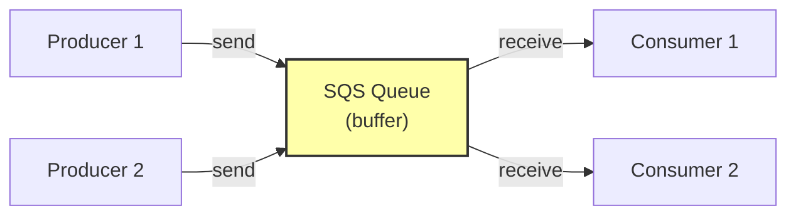

# 3. SQS Fundamentals

> [!info] Chapter Context
> Amazon SQS (Simple Queue Service) is a managed message queue. Producers push messages; consumers pull them. SQS decouples producers from consumers, handles load spikes, and provides reliable delivery.

Related: [[2. SNS Fundamentals]] | [[4. Dead Letter Queues and Fan-Out]] | [[11 - Serverless Computing/2. Lambda Fundamentals]]

---

## 1. What SQS Is

SQS is a fully-managed message queue. Producers send messages; consumers receive them. SQS handles:

- **Storage** — Messages persist (up to 14 days) until consumed.
- **Scaling** — Handles virtually unlimited throughput.
- **Reliability** — Messages are replicated across multiple servers.
- **At-least-once delivery** — A message is delivered at least once (may be delivered more than once).



---

## 2. Queue Types

### 2.1 Standard

- **Best-effort ordering** — Messages may arrive out of order.
- **At-least-once delivery** — A message may be delivered more than once.
- **Unlimited throughput** — Virtually unlimited.
- **Use case** — Most use cases (decoupling, load leveling, background jobs).

### 2.2 FIFO

- **Strict ordering** — Messages arrive in the order they were sent.
- **Exactly-once processing** — No duplicates (with deduplication ID).
- **Limited throughput** — 300 messages/second with batching; 3,000/s with batching in some regions.
- **Use case** — Order processing, financial transactions, anywhere ordering matters.

FIFO queue names must end with `.fifo`:

```bash
aws sqs create-queue --queue-name my-queue.fifo --attributes FifoQueue=true
```

---

## 3. Creating a Queue

```bash
# Standard queue
aws sqs create-queue --queue-name my-queue

# FIFO queue
aws sqs create-queue --queue-name my-queue.fifo --attributes FifoQueue=true,ContentBasedDeduplication=true

# With attributes
aws sqs create-queue --queue-name my-queue --attributes \
  VisibilityTimeout=60,MessageRetentionPeriod=1209600,DelaySeconds=0
```

Key attributes:

- **VisibilityTimeout** — How long (seconds) a message is invisible to other consumers after being received (default 30s). If not deleted within this time, it becomes visible again.
- **MessageRetentionPeriod** — How long SQS keeps a message (1 minute to 14 days; default 4 days).
- **DelaySeconds** — Default delay for messages (0-900 seconds; default 0).
- **MaximumMessageSize** — 1 KB to 256 KB (default 256 KB).
- **ReceiveMessageWaitTimeSeconds** — Long polling duration (0-20 seconds; default 0).

---

## 4. Sending Messages

```bash
# Simple
aws sqs send-message --queue-url https://sqs.us-east-1.amazonaws.com/123456789012/my-queue \
  --message-body "Hello, world!"

# With attributes
aws sqs send-message --queue-url $QUEUE_URL \
  --message-body '{"order_id": 123}' \
  --message-attributes '{"order_type": {"DataType": "String", "StringValue": "premium"}}'

# With a delay (specific to this message)
aws sqs send-message --queue-url $QUEUE_URL --message-body "Delayed" --delay-seconds 60

# FIFO: with message group ID and deduplication ID
aws sqs send-message --queue-url $FIFO_URL \
  --message-body "Ordered message" \
  --message-group-id "user-123" \
  --message-deduplication-id "abc123"
```

For FIFO queues:

- **MessageGroupId** — Required. Messages with the same group ID are delivered in order.
- **MessageDeduplicationId** — Optional. Prevents duplicates within 5 minutes. If `ContentBasedDeduplication` is on, SQS uses the message body hash.

---

## 5. Receiving Messages

```bash
# Receive up to 10 messages
aws sqs receive-message --queue-url $QUEUE_URL --max-number-of-messages 10

# With long polling (wait up to 20 seconds for messages)
aws sqs receive-message --queue-url $QUEUE_URL --wait-time-seconds 20

# With visibility timeout (override the queue default)
aws sqs receive-message --queue-url $QUEUE_URL --visibility-timeout 120
```

The response:

```json
{
  "Messages": [
    {
      "MessageId": "abc123",
      "ReceiptHandle": "AQEBxyz...",
      "MD5OfBody": "...",
      "Body": "Hello, world!"
    }
  ]
}
```

The `ReceiptHandle` is required to delete the message later. Each receive returns a new receipt handle.

---

## 6. Deleting Messages

After processing, you must delete the message (otherwise it becomes visible again after the visibility timeout and is re-delivered):

```bash
aws sqs delete-message --queue-url $QUEUE_URL --receipt-handle "AQEBxyz..."
```

Delete multiple messages:

```bash
aws sqs delete-message-batch --queue-url $QUEUE_URL --entries \
  '[{"Id":"1","ReceiptHandle":"AQEBxyz..."},{"Id":"2","ReceiptHandle":"AQEBdef..."}]'
```

---

## 7. Visibility Timeout

When a consumer receives a message, it becomes "invisible" to other consumers for the **visibility timeout** (default 30s). This prevents multiple consumers from processing the same message simultaneously.

- If the consumer processes and deletes the message within the timeout, all good.
- If the consumer crashes (or takes too long), the message becomes visible again after the timeout, and another consumer picks it up.

```bash
# Change a queue's default visibility timeout
aws sqs set-queue-attributes --queue-url $QUEUE_URL --attributes VisibilityTimeout=120

# Override per-receive
aws sqs receive-message --queue-url $QUEUE_URL --visibility-timeout 300
```

> [!tip] Set Visibility Timeout to Match Your Processing Time
> If processing takes 2 minutes, set the visibility timeout to 3+ minutes. Too short: the message is re-delivered while you're still processing. Too long: if the consumer crashes, the message takes a long time to be re-delivered.

---

## 8. Long Polling

By default, `receive-message` returns immediately (short polling), even if no messages are available. This wastes API calls and money.

**Long polling** waits up to 20 seconds for messages to arrive. If messages are available, they're returned immediately. Otherwise, it waits.

```bash
# Per-receive
aws sqs receive-message --queue-url $QUEUE_URL --wait-time-seconds 20

# As queue default
aws sqs set-queue-attributes --queue-url $QUEUE_URL --attributes ReceiveMessageWaitTimeSeconds=20
```

Always use long polling. It reduces API calls (and cost) and reduces empty responses.

---

## 9. Common Student Mistakes

> [!warning] Mistake 1 — Forgetting to Delete Processed Messages
> If you don't delete, the message is re-delivered after the visibility timeout. Your consumer must call `delete-message` after successful processing.

> [!warning] Mistake 2 — Visibility Timeout Too Short
> If processing takes longer than the visibility timeout, the message is re-delivered while you're still processing. Set the timeout to be longer than your max processing time.

> [!warning] Mistake 3 — Using Short Polling
> Short polling wastes API calls. Always use long polling (`--wait-time-seconds 20`).

> [!warning] Mistake 4 — Not Handling Duplicate Messages
> Standard SQS is at-least-once. Your consumer must be idempotent (processing the same message twice should not cause issues).

> [!warning] Mistake 5 — Using FIFO When Not Needed
> FIFO has lower throughput. Use standard queues unless you need strict ordering.

> [!warning] Mistake 6 — Forgetting MessageGroupId in FIFO
> FIFO messages require a `MessageGroupId`. Messages with the same group ID are delivered in order; different group IDs are processed in parallel.

---

## 10. Summary Checklist

- [ ] SQS is a managed message queue. Producers send; consumers receive.
- [ ] Standard queues: best-effort ordering, at-least-once, unlimited throughput.
- [ ] FIFO queues: strict ordering, exactly-once, limited throughput (300-3000/s).
- [ ] Visibility timeout: message is invisible to other consumers after receive (default 30s).
- [ ] Must delete messages after processing (otherwise re-delivered).
- [ ] Long polling (`--wait-time-seconds 20`) reduces API calls and cost.
- [ ] Standard queues can deliver duplicates; consumers must be idempotent.
- [ ] FIFO messages require MessageGroupId; optional MessageDeduplicationId.

---

Previous: [[2. SNS Fundamentals]] | Next: [[4. Dead Letter Queues and Fan-Out]]
