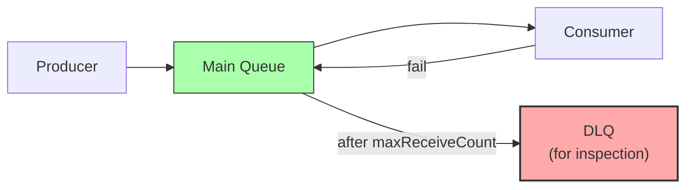
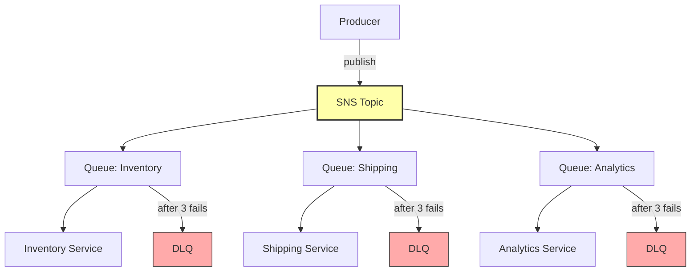

# 4. Dead Letter Queues and Fan-Out

> [!info] Chapter Context
> Building on [[3. SQS Fundamentals]], this note covers Dead Letter Queues (DLQs) for handling poison messages, and the SNS+SQS fan-out pattern in detail.

Related: [[3. SQS Fundamentals]] | [[2. SNS Fundamentals]] | [[11 - Serverless Computing/3. Lambda Triggers and Events]]

---

## 1. What a DLQ Is

A **Dead Letter Queue (DLQ)** is a queue that receives messages from another queue after they fail to process multiple times. Use it to:

- **Isolate poison messages** — A malformed message that crashes your consumer.
- **Debug** — Inspect what failed and why.
- **Replay** — After fixing the consumer, reprocess messages from the DLQ.



---

## 2. Configuring a DLQ

### 2.1 Create the DLQ

```bash
aws sqs create-queue --queue-name my-queue-dlq
```

### 2.2 Attach to the Main Queue

```bash
MAIN_URL=$(aws sqs get-queue-url --queue-name my-queue --query 'QueueUrl' --output text)
DLQ_ARN=$(aws sqs get-queue-attributes --queue-url https://sqs.us-east-1.amazonaws.com/123456789012/my-queue-dlq --attribute-names QueueArn --query 'Attributes.QueueArn' --output text)

aws sqs set-queue-attributes --queue-url $MAIN_URL --attributes \
  "RedrivePolicy={\"deadLetterTargetArn\":\"$DLQ_ARN\",\"maxReceiveCount\":\"3\"}"
```

`maxReceiveCount` is the number of times a message is received (and not deleted) before being moved to the DLQ.

### 2.3 How It Works

1. A consumer receives a message (ReceiveCount = 1).
2. The consumer fails to process (or crashes); the message becomes visible again after the visibility timeout.
3. Another consumer receives it (ReceiveCount = 2).
4. Same failure.
5. After `maxReceiveCount` (e.g., 3) receives, SQS moves the message to the DLQ.

### 2.4 Viewing DLQ Messages

```bash
aws sqs receive-message --queue-url https://sqs.us-east-1.amazonaws.com/123456789012/my-queue-dlq \
  --message-attribute-names All \
  --attribute-names All
```

The message includes `ApproximateReceiveCount` showing how many times it was received before being moved.

### 2.5 Replay from DLQ

After fixing your consumer, move messages from the DLQ back to the main queue:

```bash
DLQ_URL=$(aws sqs get-queue-url --queue-name my-queue-dlq --query 'QueueUrl' --output text)
MAIN_URL=$(aws sqs get-queue-url --queue-name my-queue --query 'QueueUrl' --output text)

# Receive from DLQ, send to main, delete from DLQ
while true; do
  msg=$(aws sqs receive-message --queue-url $DLQ_URL --max-number-of-messages 10 --wait-time-seconds 5)
  if [ -z "$msg" ] || [ "$msg" = "null" ]; then break; fi

  echo "$msg" | jq -c '.Messages[]' | while read m; do
    body=$(echo "$m" | jq -r '.Body')
    aws sqs send-message --queue-url $MAIN_URL --message-body "$body"
    aws sqs delete-message --queue-url $DLQ_URL --receipt-handle "$(echo $m | jq -r '.ReceiptHandle')"
  done
done
```

Or use the AWS SDK in a script.

---

## 3. Lambda DLQs

Lambda functions can have a DLQ (for asynchronous invocations). If the function fails (or times out) after all retries, the event is sent to the DLQ.

```bash
aws lambda update-function-configuration --function-name my-func \
  --dead-letter-config TargetArn=arn:aws:sqs:us-east-1:123456789012:my-func-dlq
```

For Lambda with SQS triggers, the DLQ is on the SQS queue (not Lambda) — when SQS moves a message to its DLQ, Lambda never sees it again.

---

## 4. The SNS + SQS Fan-Out Pattern

The most common event-driven pattern on AWS:



### 4.1 Why Use SNS + SQS Instead of Just SNS

- **Persistence** — SQS buffers messages if a consumer is down. SNS alone drops messages if subscribers are unavailable.
- **Independent processing** — Each consumer reads at its own pace.
- **DLQ support** — SQS has DLQs; SNS alone doesn't.
- **Visibility timeout** — SQS prevents two consumers from processing the same message.

### 4.2 Setup

```bash
# Create the topic
TOPIC_ARN=$(aws sns create-topic --name orders --query 'TopicArn' --output text)

# Create main queues and DLQs
for name in inventory shipping analytics; do
  aws sqs create-queue --queue-name orders-$name
  aws sqs create-queue --queue-name orders-$name-dlq

  MAIN_URL=$(aws sqs get-queue-url --queue-name orders-$name --query 'QueueUrl' --output text)
  DLQ_ARN=$(aws sqs get-queue-attributes --queue-url https://sqs.us-east-1.amazonaws.com/123456789012/orders-$name-dlq --attribute-names QueueArn --query 'Attributes.QueueArn' --output text)

  # Attach DLQ
  aws sqs set-queue-attributes --queue-url $MAIN_URL \
    --attributes "RedrivePolicy={\"deadLetterTargetArn\":\"$DLQ_ARN\",\"maxReceiveCount\":\"3\"}"

  # Get the main queue ARN
  MAIN_ARN=$(aws sqs get-queue-attributes --queue-url $MAIN_URL --attribute-names QueueArn --query 'Attributes.QueueArn' --output text)

  # Allow SNS to send to the queue
  aws sqs set-queue-attributes --queue-url $MAIN_URL --attributes \
    '{"Policy": "{\"Version\":\"2012-10-17\",\"Statement\":[{\"Effect\":\"Allow\",\"Principal\":{\"Service\":\"sns.amazonaws.com\"},\"Action\":\"sqs:SendMessage\",\"Resource\":\"'$MAIN_ARN'\",\"Condition\":{\"ArnEquals\":{\"aws:SourceArn\":\"'$TOPIC_ARN'\"}}]}"}'

  # Subscribe to SNS
  aws sns subscribe --topic-arn $TOPIC_ARN --protocol sqs --notification-endpoint $MAIN_ARN
done
```

Now publishing to the topic delivers a copy to each queue:

```bash
aws sns publish --topic-arn $TOPIC_ARN --message '{"order_id": 123, "total": 99.99}'
```

---

## 5. Common Student Mistakes

> [!warning] Mistake 1 — No DLQ
> Without a DLQ, poison messages are retried forever (or until retention expires). Always configure a DLQ.

> [!warning] Mistake 2 — maxReceiveCount Too Low
> If `maxReceiveCount` is 1, transient failures (a Lambda cold start timing out) immediately move to DLQ. Use 3-5 to handle transient failures.

> [!warning] Mistake 3 — Forgetting the Queue Policy for SNS
> SQS queues are private by default. You must add a policy allowing SNS to send messages.

> [!warning] Mistake 4 — Not Monitoring DLQ Depth
> A growing DLQ indicates your consumer is failing. Set a CloudWatch alarm on `ApproximateNumberOfMessagesVisible` for the DLQ.

> [!warning] Mistake 5 — Forgetting to Replay from DLQ After Fixing
> After fixing the consumer, manually replay DLQ messages back to the main queue.

> [!warning] Mistake 6 — Using SNS Directly to Lambda Without a Queue
> If Lambda is down or rate-limited, SNS retries then drops. Use SQS in between for important messages.

---

## 6. Summary Checklist

- [ ] DLQ receives messages that fail processing `maxReceiveCount` times.
- [ ] Configure via `RedrivePolicy` attribute on the main queue.
- [ ] After fixing the consumer, replay DLQ messages back to the main queue.
- [ ] SNS+SQS fan-out: SNS broadcasts; each SQS queue buffers for its consumer.
- [ ] Use SNS+SQS (not SNS alone) for persistence, independent processing, and DLQs.
- [ ] Each SQS queue needs a policy allowing SNS to send.
- [ ] Monitor DLQ depth with CloudWatch alarms.

---

Previous: [[3. SQS Fundamentals]] | Next: [[11 - Serverless Computing/1. Serverless Concepts]]
