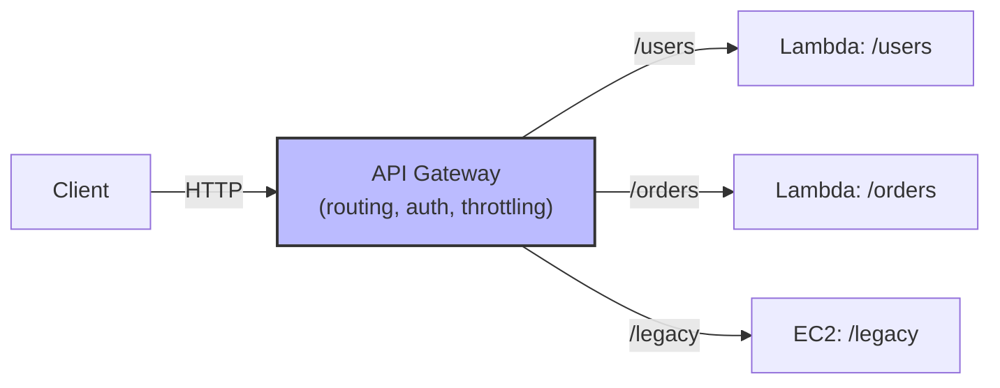

# 4. API Gateway

> [!info] Chapter Context
> Amazon API Gateway is a managed service for creating, publishing, and securing HTTP/WebSocket APIs. It is the standard front-end for Lambda-based serverless applications and is also used with EC2/ECS backends.

Related: [[3. Lambda Triggers and Events]] | [[5. Step Functions]] | [[08 - Object Storage/4. Presigned URLs and Static Website Hosting]]

---

## 1. What API Gateway Does

API Gateway:

- Receives HTTP/WebSocket requests from clients.
- Authenticates and authorizes (via Lambda authorizers, Cognito, IAM).
- Routes to backends (Lambda, EC2, ECS, other HTTP endpoints).
- Throttles and rate-limits.
- Transforms requests/responses.
- Logs to CloudWatch.
- Bills per request.



---

## 2. API Gateway Types

### 2.1 REST API

- The original API Gateway.
- Full features: mapping templates, request validation, WAF, private integrations.
- Higher cost per request.
- Use when you need full-featured REST APIs.

### 2.2 HTTP API

- Newer, simpler, cheaper (~70% less than REST API).
- Fewer features (no mapping templates, limited auth).
- Use for simple HTTP APIs backed by Lambda.

### 2.3 WebSocket API

- Bidirectional, persistent connections.
- Use cases: chat apps, real-time dashboards, streaming data.

For most new serverless apps, **HTTP API** is sufficient. Use REST API if you need its specific features.

---

## 3. Creating an HTTP API with Lambda

### 3.1 With the Console

1. Create the Lambda function.
2. Create the HTTP API.
3. Add a route (e.g., `GET /hello`).
4. Attach the Lambda function as the integration.

### 3.2 With the CLI

```bash
# Create the API
API_ID=$(aws apigatewayv2 create-api \
  --name my-api \
  --protocol-type HTTP \
  --target arn:aws:lambda:us-east-1:123456789012:function:my-func \
  --query 'ApiId' --output text)

# The default URL is:
# https://$API_ID.execute-api.us-east-1.amazonaws.com/

# Add a route
aws apigatewayv2 create-route \
  --api-id $API_ID \
  --route-key "GET /hello" \
  --target arn:aws:lambda:us-east-1:123456789012:function:my-func

# Add permission for API Gateway to invoke Lambda
aws lambda add-permission \
  --function-name my-func \
  --statement-id apigateway-invoke \
  --action lambda:InvokeFunction \
  --principal apigateway.amazonaws.com \
  --source-arn arn:aws:execute-api:us-east-1:123456789012:$API_ID/*/GET/hello
```

### 3.3 With SAM

```yaml
# template.yaml (SAM)
Resources:
  MyApi:
    Type: AWS::Serverless::HttpApi
    Properties:
      DefinitionBody:
        openapi: 3.0.1
        paths:
          /hello:
            get:
              responses:
                '200':
                  description: OK
              x-amazon-apigateway-integration:
                uri: !Sub arn:aws:apigateway:${AWS::Region}:lambda:path/2015-03-31/functions/${MyFunction.Arn}/invocations
                httpMethod: POST
                type: aws_proxy

  MyFunction:
    Type: AWS::Serverless::Function
    Properties:
      CodeUri: ./src
      Handler: index.handler
      Runtime: python3.11
      Events:
        Hello:
          Type: HttpApi
          Properties:
            ApiId: !Ref MyApi
            Method: GET
            Path: /hello
```

---

## 4. The Lambda Proxy Integration

With **Lambda proxy integration** (the default), API Gateway passes the entire HTTP request to Lambda as the event:

```json
{
  "httpMethod": "GET",
  "path": "/users/123",
  "resource": "/users/{id}",
  "headers": {"Content-Type": "application/json"},
  "multiValueHeaders": {"Accept": ["application/json", "text/html"]},
  "queryStringParameters": {"filter": "active"},
  "multiValueQueryStringParameters": {"filter": ["active", "premium"]},
  "pathParameters": {"id": "123"},
  "body": "{\"name\": \"Alice\"}",
  "isBase64Encoded": false,
  "requestContext": {
    "httpMethod": "GET",
    "path": "/users/123",
    "protocol": "HTTP/1.1",
    "requestId": "abc123",
    "stage": "prod",
    "identity": {"sourceIp": "1.2.3.4"}
  }
}
```

Lambda must return:

```json
{
  "statusCode": 200,
  "headers": {"Content-Type": "application/json"},
  "body": "{\"message\": \"OK\"}",
  "isBase64Encoded": false
}
```

```python
def lambda_handler(event, context):
    user_id = event['pathParameters']['id']
    return {
        'statusCode': 200,
        'headers': {'Content-Type': 'application/json'},
        'body': json.dumps({'id': user_id, 'name': 'Alice'})
    }
```

---

## 5. Authentication

### 5.1 IAM Auth

API Gateway checks the AWS SigV4 signature. Useful for internal APIs called by other AWS services.

### 5.2 Cognito User Pools

API Gateway validates the JWT from Cognito. The user authenticates via Cognito (sign-in, OAuth); API Gateway validates the token.

```bash
aws apigatewayv2 create-authorizer \
  --api-id $API_ID \
  --authorizer-type JWT \
  --identity-source '$request.header.Authorization' \
  --jwt-configuration \
    'audience=abc123,issuer=https://cognito-idp.us-east-1.amazonaws.com/us-east-1_abc123'
```

### 5.3 Lambda Authorizers (Custom)

A Lambda function receives the request, validates the token, and returns the IAM policy. Use for custom auth (e.g., third-party JWTs, API keys).

```python
def lambda_handler(event, context):
    token = event['authorizationToken']
    if validate(token):
        return {
            'principalId': 'user-123',
            'policyDocument': {
                'Version': '2012-10-17',
                'Statement': [{
                    'Effect': 'Allow',
                    'Action': 'execute-api:Invoke',
                    'Resource': event['methodArn']
                }]
            }
        }
    else:
        return {'principalId': 'user', 'policyDocument': {'Version': '2012-10-17', 'Statement': [{'Effect': 'Deny', 'Action': 'execute-api:Invoke', 'Resource': event['methodArn']}]}}
```

---

## 6. Throttling and Rate Limiting

API Gateway throttles requests to protect backends:

```bash
aws apigateway update-usage-plan \
  --usage-plan-id abc123 \
  --patch-operations op=replace,path=/throttle/rateLimit,value=100,op=replace,path=/throttle/burstLimit,value=50
```

- **Rate limit** — Steady-state requests per second.
- **Burst limit** — Maximum concurrent requests at any instant.

API keys + usage plans let you throttle per-client.

---

## 7. Custom Domains and TLS

API Gateway provides a default URL (`https://abc123.execute-api.us-east-1.amazonaws.com`). For production, use a custom domain (`api.example.com`):

```bash
# Create an ACM certificate (must be in us-east-1 for CloudFront edge)
aws acm request-certificate --domain-name api.example.com --validation-method DNS

# Create a custom domain in API Gateway
aws apigatewayv2 create-domain-name \
  --domain-name api.example.com \
  --domain-name-configurations certificateArn=arn:aws:acm:us-east-1:123456789012:certificate/abc-123,endpointType=REGIONAL,securityPolicy=TLS_1_2

# Map the custom domain to the API
aws apigatewayv2 create-api-mapping \
  --api-id $API_ID \
  --domain-name api.example.com \
  --stage '$default'
```

Add a Route 53 alias record pointing to the API Gateway domain.

---

## 8. Common Student Mistakes

> [!warning] Mistake 1 — Using REST API When HTTP API Suffices
> HTTP API is 70% cheaper and simpler. Use REST API only if you need its specific features (mapping templates, private integrations).

> [!warning] Mistake 2 — Forgetting to Add Lambda Permission
> API Gateway needs `lambda:InvokeFunction` permission. Use `aws lambda add-permission` (or the SAM/CloudFormation, which does it for you).

> [!warning] Mistake 3 — Returning the Wrong Format from Lambda
> With Lambda proxy integration, Lambda must return `statusCode`, `headers`, `body`. Returning just the body causes a 502 Bad Gateway.

> [!warning] Mistake 4 — Forgetting to Deploy the API (REST API)
> REST API changes must be deployed to a stage. (`aws apigateway create-deployment`). HTTP API auto-deploys.

> [!warning] Mistake 5 — No Throttling
> Without throttling, a flood of requests can overwhelm your backend (Lambda, DB). Set rate and burst limits.

> [!warning] Mistake 6 — Forgetting the `isBase64Encoded` Flag for Binary Responses
> If returning binary data (images), set `isBase64Encoded: true` and base64-encode the body.

---

## 9. Summary Checklist

- [ ] API Gateway is a managed HTTP/WebSocket API service.
- [ ] Three types: REST API (full features), HTTP API (simpler, cheaper), WebSocket API.
- [ ] Lambda proxy integration: API Gateway passes the full HTTP request as the event; Lambda returns statusCode/headers/body.
- [ ] Auth: IAM, Cognito User Pools, Lambda authorizers.
- [ ] Throttling: rate limit (steady-state) + burst limit (instantaneous).
- [ ] Custom domains via ACM certificate + Route 53 alias.
- [ ] For most new serverless apps, HTTP API is sufficient.

---

Previous: [[3. Lambda Triggers and Events]] | Next: [[5. Step Functions]]
