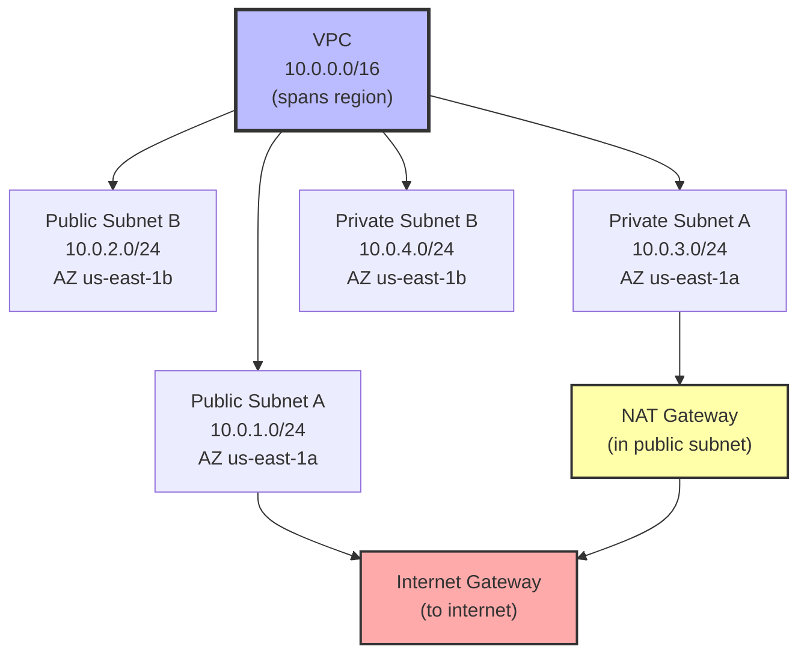

# 1. VPC Fundamentals

> [!info] Chapter Context
> The VPC (Virtual Private Cloud) is your private network in AWS. Understanding VPCs is essential for any non-trivial AWS deployment. This note covers VPC concepts, subnets, route tables, internet gateways, NAT, and security groups.

Related: [[11 - Serverless Computing/5. Step Functions]] | [[2. Subnets, Route Tables, and NAT]] | [[3. DNS and Route 53]] | [[04 - Linux/06 - Networking/1. Networking Fundamentals]]

---

## 1. What a VPC Is

A VPC is a virtual network you define in AWS. It is:

- **Regional** — Spans all AZs in a region.
- **Isolated** — Your VPC is logically isolated from other customers.
- **Customizable** — You choose the IP range, subnets, routing, and security.



---

## 2. CIDR Blocks and IP Addressing

VPCs use **CIDR blocks** (Classless Inter-Domain Routing) to define their IP range. `10.0.0.0/16` means:

- The first 16 bits (10.0) are fixed.
- The remaining 16 bits (0.0 to 255.255) are usable.
- That gives 65,536 IPs (10.0.0.0 to 10.0.255.255).

AWS reserves 5 IPs per subnet (network, broadcast, DNS, future use, router). A `/24` subnet has 256 IPs, of which 251 are usable.

Common VPC sizes:

- `/16` — 65,536 IPs (the maximum). Use for large VPCs.
- `/20` — 4,096 IPs. Good for medium VPCs.
- `/24` — 256 IPs. Small VPC.

> [!tip] Plan Your IP Space Carefully
> Once you create a VPC, you cannot change its CIDR (you can add secondary CIDRs). Plan for growth. Most teams use `/16` to leave room.

---

## 3. Subnets

A subnet is a range of IPs within a VPC, in a specific AZ.

### 3.1 Public Subnets

A public subnet has a route to the **Internet Gateway (IGW)**, making its resources reachable from the internet (if they have a public IP).

Use cases: load balancers, bastion hosts, NAT gateways.

### 3.2 Private Subnets

A private subnet has no direct internet route. Resources have private IPs only; they cannot be reached from the internet directly.

Use cases: databases, application servers, internal APIs.

To let private subnet resources access the internet (for updates, package downloads), use a **NAT Gateway** in a public subnet.

### 3.3 Subnet Sizing

A common pattern:

- VPC: `10.0.0.0/16` (65,536 IPs).
- Public subnets: `10.0.0.0/24`, `10.0.1.0/24`, `10.0.2.0/24` (256 IPs each, one per AZ).
- Private subnets: `10.0.4.0/22`, `10.0.8.0/22`, `10.0.12.0/22` (1024 IPs each, larger because they hold more resources).

---

## 4. Route Tables

A route table defines where traffic from a subnet goes. Each subnet is associated with one route table.

### 4.1 Public Subnet Route Table

```
Destination    Target
10.0.0.0/16    local
0.0.0.0/0      igw-abc123   (Internet Gateway)
```

The `0.0.0.0/0` route (default route) sends all non-VPC traffic to the IGW — making the subnet public.

### 4.2 Private Subnet Route Table

```
Destination    Target
10.0.0.0/16    local
0.0.0.0/0      nat-abc123   (NAT Gateway)
```

The default route sends non-VPC traffic to the NAT Gateway, which forwards to the IGW. Private subnet resources can reach the internet (outbound) but cannot be reached from the internet.

---

## 5. Internet Gateway (IGW)

An IGW is a VPC component that allows communication between the VPC and the internet. It is:

- **Attached to the VPC** (one per VPC).
- **Highly available** across all AZs.
- **Free**.

Without an IGW, the VPC has no internet access at all.

---

## 6. NAT Gateway

A NAT (Network Address Translation) Gateway lets private subnet resources access the internet (outbound) while preventing inbound connections.

- **Placed in a public subnet** (so it can reach the IGW).
- **Managed** by AWS (no server to manage).
- **Charged** per hour + per GB processed (~$32/month + $0.045/GB).

```bash
# Create a NAT Gateway
aws ec2 create-nat-gateway \
  --subnet-id subnet-12345 \
  --allocation-id eipalloc-12345
```

You need an Elastic IP for the NAT Gateway.

### 6.1 NAT Instance (Legacy)

Before NAT Gateways, you could run a NAT instance (an EC2 instance configured as a NAT). Cheaper but less reliable and lower bandwidth. Use NAT Gateway for production.

---

## 7. Security Groups and NACLs

### 7.1 Security Groups (SGs)

Stateful firewalls attached to ENIs (and thus to EC2 instances, RDS, etc.). Rules:

- **Allow rules only** (no deny).
- **Stateful** — If you allow inbound on port 80, the response is automatically allowed.
- **Per-instance** — Each instance can have multiple SGs.
- **Default** — Deny all inbound, allow all outbound.

Example: an ALB SG allowing 80/443 from the internet; an app SG allowing 8080 from the ALB SG; a DB SG allowing 5432 from the app SG.

### 7.2 Network ACLs (NACLs)

Stateless firewalls at the subnet boundary. Rules:

- **Allow and deny rules**.
- **Stateless** — You must explicitly allow return traffic.
- **Per-subnet** — Each subnet has one NACL.
- **Default** — Allow all.

NACLs are less commonly used than SGs. Use them for explicit denies (e.g., block a known-bad IP).

---

## 8. Creating a VPC

### 8.1 With the CLI (Simplified)

```bash
# Create the VPC
VPC_ID=$(aws ec2 create-vpc --cidr-block 10.0.0.0/16 --query 'Vpc.VpcId' --output text)

# Enable DNS support and hostnames (required for many AWS services)
aws ec2 modify-vpc-attribute --vpc-id $VPC_ID --enable-dns-support
aws ec2 modify-vpc-attribute --vpc-id $VPC_ID --enable-dns-hostnames

# Create an Internet Gateway
IGW_ID=$(aws ec2 create-internet-gateway --query 'InternetGateway.InternetGatewayId' --output text)
aws ec2 attach-internet-gateway --vpc-id $VPC_ID --internet-gateway-id $IGW_ID

# Create a public subnet
PUB_SUBNET_ID=$(aws ec2 create-subnet --vpc-id $VPC_ID --cidr-block 10.0.1.0/24 --availability-zone us-east-1a --query 'Subnet.SubnetId' --output text)
aws ec2 modify-subnet-attribute --subnet-id $PUB_SUBNET_ID --map-public-ip-on-launch

# Create a private subnet
PRIV_SUBNET_ID=$(aws ec2 create-subnet --vpc-id $VPC_ID --cidr-block 10.0.2.0/24 --availability-zone us-east-1a --query 'Subnet.SubnetId' --output text)

# Create route tables and routes
PUB_RT_ID=$(aws ec2 create-route-table --vpc-id $VPC_ID --query 'RouteTable.RouteTableId' --output text)
aws ec2 create-route --route-table-id $PUB_RT_ID --destination-cidr-block 0.0.0.0/0 --gateway-id $IGW_ID
aws ec2 associate-route-table --subnet-id $PUB_SUBNET_ID --route-table-id $PUB_RT_ID

# (Private subnet uses the default route table, no internet route)
```

### 8.2 With Terraform

For real deployments, use Terraform or the AWS VPC module:

```hcl
module "vpc" {
  source  = "terraform-aws-modules/vpc/aws"
  version = "~> 5.0"

  name = "my-vpc"
  cidr = "10.0.0.0/16"

  azs             = ["us-east-1a", "us-east-1b", "us-east-1c"]
  private_subnets = ["10.0.1.0/24", "10.0.2.0/24", "10.0.3.0/24"]
  public_subnets  = ["10.0.101.0/24", "10.0.102.0/24", "10.0.103.0/24"]

  enable_nat_gateway = true
  single_nat_gateway = true   # one NAT GW for all private subnets (cheaper)

  tags = {
    Environment = "production"
  }
}
```

---

## 9. VPC Peering and Transit Gateway

### 9.1 VPC Peering

Connect two VPCs (in the same or different accounts/regions) so they can communicate as if they were one network.

```bash
# Request peering
aws ec2 create-vpc-peering-connection --vpc-id vpc-1 --peer-vpc-id vpc-2

# Accept (in the other account)
aws ec2 accept-vpc-peering-connection --vpc-peering-connection-id pcx-12345
```

Both VPCs must update their route tables to point to the peering connection. IP ranges must not overlap.

### 9.2 Transit Gateway

A hub-and-spoke model for connecting many VPCs and on-premises networks. Avoids the O(N²) complexity of full-mesh peering.

Use Transit Gateway when you have more than 3-4 VPCs to connect.

---

## 10. Common Student Mistakes

> [!warning] Mistake 1 — Public Subnets for Databases
> Databases should be in private subnets. Putting them in public subnets exposes them to the internet.

> [!warning] Mistake 2 — Forgetting the NAT Gateway for Private Subnets
> Without a NAT Gateway, private subnet resources cannot download updates or reach external APIs.

> [!warning] Mistake 3 — Single NAT Gateway in Multi-AZ
> If you have one NAT Gateway in AZ-a and AZ-a fails, private subnets in AZ-b lose internet access. For high availability, deploy a NAT Gateway per AZ (more expensive).

> [!warning] Mistake 4 — Overlapping IP Ranges
> VPC peering requires non-overlapping CIDRs. Plan IP space carefully to avoid conflicts.

> [!warning] Mistake 5 — Forgetting DNS Hostnames
> Many AWS services (RDS, ALB) require `enableDnsHostnames` and `enableDnsSupport` to be enabled on the VPC. Enable both.

> [!warning] Mistake 6 — Allowing 0.0.0.0/0 on SSH (port 22)
> This is the most common security group mistake. Restrict SSH to your office IP or use AWS Systems Manager Session Manager instead.

---

## 11. Summary Checklist

- [ ] VPC = virtual network in AWS; regional; spans all AZs.
- [ ] CIDR blocks define IP ranges (e.g., 10.0.0.0/16).
- [ ] Subnets are within a VPC and a specific AZ.
- [ ] Public subnets have a route to the Internet Gateway; private subnets don't.
- [ ] NAT Gateway lets private subnets access the internet (outbound only).
- [ ] Route tables define where traffic goes; each subnet has one.
- [ ] Security Groups: stateful, allow-only, per-instance.
- [ ] NACLs: stateless, allow/deny, per-subnet.
- [ ] VPC Peering connects two VPCs; Transit Gateway for many.
- [ ] Always enable DNS support and hostnames on the VPC.

---

Previous: [[11 - Serverless Computing/5. Step Functions]] | Next: [[2. Subnets, Route Tables, and NAT]]
