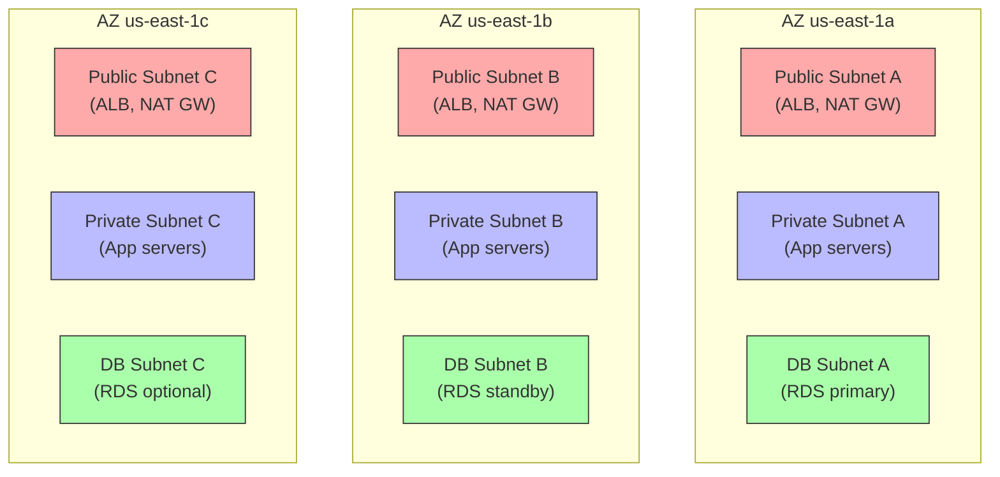

# 2. Subnets, Route Tables, and NAT

> [!info] Chapter Context
> Building on [[1. VPC Fundamentals]], this note goes deeper into subnet design, route table patterns, NAT Gateway placement, and the common VPC topologies.

Related: [[1. VPC Fundamentals]] | [[3. DNS and Route 53]] | [[4. Load Balancers and CloudFront]]

---

## 1. Subnet Design Patterns

### 1.1 The Three-Tier VPC

The most common VPC topology: public, private, and database subnets across 3 AZs.



- **Public subnets** — ALB, NAT Gateways, bastion hosts. Have public IPs and an IGW route.
- **Private subnets** — App servers, ECS tasks, EKS nodes. No public IP. NAT Gateway for outbound.
- **DB subnets** — RDS, ElastiCache. Tightest security group (only from app servers).

### 1.2 Subnet Sizing

A typical `/16` VPC with 3 AZs:

- Public: `/24` per AZ (256 IPs each).
- Private: `/22` per AZ (1024 IPs each).
- DB: `/26` per AZ (64 IPs each — DBs don't need many IPs).

Total per AZ: 256 + 1024 + 64 = 1344 IPs. Across 3 AZs: 4032 IPs. Plenty of room in a /16.

### 1.3 Why Use Separate DB Subnets?

- **Security** — DB subnets have no internet route (not even NAT). DBs cannot make outbound connections, reducing attack surface.
- **Network ACL isolation** — Apply stricter NACLs.
- **RDS requires a "DB subnet group"** spanning at least 2 AZs.

---

## 2. Route Table Patterns

### 2.1 Public Subnet Route Table

```
Destination    Target
10.0.0.0/16    local
0.0.0.0/0      igw-abc123
```

All internet-bound traffic goes to the IGW. Public subnets have a public route.

### 2.2 Private Subnet Route Table (with NAT)

```
Destination    Target
10.0.0.0/16    local
0.0.0.0/0      nat-abc123
```

Internet-bound traffic goes to the NAT Gateway. The NAT Gateway (in a public subnet) forwards to the IGW.

### 2.3 DB Subnet Route Table (No Internet)

```
Destination    Target
10.0.0.0/16    local
```

No default route. DBs cannot reach the internet, and the internet cannot reach them.

### 2.4 VPC Peering Route Table

```
Destination       Target
10.0.0.0/16       local
172.16.0.0/16     pcx-abc123   (VPC peering connection)
0.0.0.0/0         nat-abc123
```

Routes for the peered VPC's CIDR go to the peering connection.

---

## 3. NAT Gateway Placement

### 3.1 Single NAT Gateway (Cost-Optimized)

One NAT Gateway in one AZ's public subnet. All private subnets route to it.

- **Pros** — Cheap (~$32/month).
- **Cons** — Single AZ failure takes down internet access for all private subnets.

### 3.2 NAT Gateway Per AZ (Highly Available)

One NAT Gateway in each AZ's public subnet. Each private subnet routes to its own AZ's NAT Gateway.

- **Pros** — Survives AZ failure.
- **Cons** — 3x cost (~$96/month for 3 AZs).

For production, **use NAT Gateway per AZ**. For dev/test, single NAT is fine.

### 3.3 Why Cross-AZ NAT Is Suboptimal

If a private subnet in AZ-a routes to a NAT Gateway in AZ-b, all traffic crosses AZs — and cross-AZ data transfer costs $0.01/GB each way. For high-traffic apps, this is significant.

---

## 4. Elastic IPs

An Elastic IP (EIP) is a static public IP that you allocate to your account. It can be associated with an EC2 instance, NAT Gateway, or Network Load Balancer.

```bash
# Allocate an EIP
aws ec2 allocate-address --domain vpc
# Returns AllocationId

# Associate with a NAT Gateway
aws ec2 create-nat-gateway --subnet-id subnet-12345 --allocation-id eipalloc-12345
```

The EIP is yours until you release it (even if not associated with anything). You pay a small fee for unattached EIPs.

---

## 5. VPC Endpoints

VPC endpoints let your VPC connect to AWS services (S3, DynamoDB, etc.) without traversing the internet.

### 5.1 Gateway Endpoints (Free)

For S3 and DynamoDB. A gateway endpoint adds a route in your route table, sending S3/DynamoDB traffic through AWS's internal network instead of the internet.

```bash
aws ec2 create-vpc-endpoint \
  --vpc-id vpc-12345 \
  --service-name com.amazonaws.us-east-1.s3 \
  --route-table-ids rtb-12345
```

Use gateway endpoints for S3 and DynamoDB to avoid NAT Gateway data processing fees.

### 5.2 Interface Endpoints (Paid)

For other AWS services (Lambda, SQS, SNS, Secrets Manager, etc.). An interface endpoint creates an ENI in your subnet with a private IP.

```bash
aws ec2 create-vpc-endpoint \
  --vpc-id vpc-12345 \
  --vpc-endpoint-type Interface \
  --service-name com.amazonaws.us-east-1.secrets-manager \
  --subnet-ids subnet-12345 subnet-67890
```

Interface endpoints cost ~$7/month per AZ + data processing fees. Use them for security (no internet traversal) and for services without gateway endpoints.

---

## 6. Bastion Hosts and Session Manager

### 6.1 Bastion Host (Jump Box)

A small EC2 instance in a public subnet. You SSH to the bastion, then SSH from the bastion to private subnet instances.

- **Pros** — Simple, well-understood.
- **Cons** — Another server to manage, patch, and secure. SSH keys to manage.

### 6.2 AWS Systems Manager Session Manager

A modern alternative to bastion hosts. Uses the SSM agent (pre-installed on Amazon Linux 2+, Ubuntu 16.04+) to open a shell session via the AWS API. No SSH, no bastion, no inbound ports.

```bash
aws ssm start-session --target i-1234567890
```

- **Pros** — No SSH keys, no inbound ports, audit log of all sessions, IAM-controlled.
- **Cons** — Requires SSM agent on the instance and IAM permissions.

**Use Session Manager instead of bastion hosts** for new deployments.

---

## 7. Common Student Mistakes

> [!warning] Mistake 1 — Single NAT Gateway for Production
> Single NAT is a single point of failure. For production, deploy NAT Gateways per AZ.

> [!warning] Mistake 2 — Forgetting Cross-AZ Data Transfer Costs
> Routing private subnet traffic to a NAT Gateway in another AZ incurs $0.01/GB each way. Keep NAT Gateways in the same AZ as the subnets they serve.

> [!warning] Mistake 3 — Allowing SSH from 0.0.0.0/0
> Restrict SSH to known IPs, or use Session Manager (no inbound ports needed).

> [!warning] Mistake 4 — Forgetting Gateway Endpoints for S3
> Without a gateway endpoint, S3 traffic from private subnets traverses the NAT Gateway — incurring $0.045/GB. Add a gateway endpoint (free) to avoid this.

> [!warning] Mistake 5 — Overlapping Subnet CIDRs Across VPCs
> VPC peering requires non-overlapping CIDRs. Plan IP space across all VPCs.

> [!warning] Mistake 6 — Forgetting to Map Public IP on Launch
> Public subnets must have "Auto-assign public IP" enabled. Otherwise, instances launch without a public IP and cannot be reached.

---

## 8. Summary Checklist

- [ ] Three-tier VPC: public, private, DB subnets across 3 AZs.
- [ ] Subnet sizing: public /24, private /22, DB /26 per AZ.
- [ ] Route tables: public → IGW, private → NAT, DB → no default route.
- [ ] Single NAT Gateway for dev (cheaper); per-AZ NAT Gateway for prod (highly available).
- [ ] Avoid cross-AZ NAT (incurs data transfer fees).
- [ ] Elastic IPs are static public IPs; charged when unattached.
- [ ] Gateway endpoints (free) for S3 and DynamoDB; interface endpoints (paid) for other services.
- [ ] Use Session Manager instead of bastion hosts.

---

Previous: [[1. VPC Fundamentals]] | Next: [[3. DNS and Route 53]]
