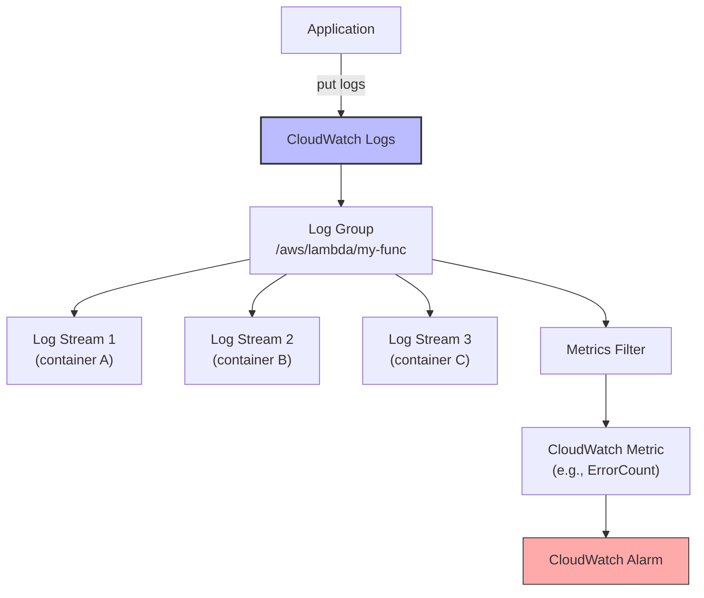

# 1. Logging

> [!info] Chapter Context
> AWS services emit logs to CloudWatch Logs. This note covers CloudWatch Logs concepts, log groups, streams, insights, and how to ship logs from EC2, containers, and Lambda.

Related: [[12 - AWS Networking/4. Load Balancers and CloudFront]] | [[2. Metrics and Alarms]] | [[3. Tracing with X-Ray]]

---

## 1. CloudWatch Logs Concepts

- **Log group** — A container for log streams. Has a name (e.g., `/aws/lambda/my-func`), retention settings, and encryption settings.
- **Log stream** — A sequence of logs from a single source (e.g., a Lambda container, an EC2 instance).
- **Log event** — A single log line with a timestamp and message.
- **Metric filter** — Extract metrics from log text (e.g., count "ERROR" lines).
- **Insights** — Query logs with a SQL-like syntax.



---

## 2. Where AWS Services Send Logs

- **Lambda** — `stdout`/`stderr` → `/aws/lambda/<function-name>`.
- **API Gateway** — Execution logs → `/aws/apigateway/<api-name>`; access logs (configurable).
- **ECS** — `awslogs` log driver sends container stdout to a configurable log group.
- **EKS** — Fluent Bit / Fluentd ships container logs.
- **RDS** — Slow query logs, error logs (must be enabled).
- **CloudTrail** — API calls → a configurable S3 bucket (and optionally CloudWatch Logs).
- **ALB/NLB** — Access logs → S3 bucket (must be enabled).
- **S3** — Server access logs → another S3 bucket (must be enabled).
- **VPC Flow Logs** — Network traffic → CloudWatch Logs or S3.

---

## 3. Viewing Logs

### 3.1 With the CLI

```bash
# List log groups
aws logs describe-log-groups

# List log streams in a group
aws logs describe-log-streams --log-group-name /aws/lambda/my-func

# Get log events
aws logs get-log-events \
  --log-group-name /aws/lambda/my-func \
  --log-stream-name '2024/01/15/[$LATEST]abc123'

# Filter log events across all streams in a group
aws logs filter-log-events \
  --log-group-name /aws/lambda/my-func \
  --filter-pattern "ERROR" \
  --start-time 1705276800000   # epoch ms

# Tail logs live
aws logs tail /aws/lambda/my-func --follow
```

### 3.2 With CloudWatch Logs Insights

A SQL-like query language for searching logs.

```awslogs
fields @timestamp, @message
| filter @message like /ERROR/
| sort @timestamp desc
| limit 20
```

```awslogs
# Count errors per hour
filter @message like /ERROR/
| stats count() as errorCount by bin(1h)
| sort @timestamp desc
```

```awslogs
# Find the slowest Lambda invocations
filter @type = "REPORT"
| parse @message /Duration: (?<duration>\d+\.\d+) ms/
| sort duration desc
| limit 10
```

Run via the Console or CLI:

```bash
aws logs start-query \
  --log-group-name /aws/lambda/my-func \
  --start-time 1705276800000 \
  --end-time 1705363200000 \
  --query-string 'fields @timestamp, @message | filter @message like /ERROR/ | limit 20'

# Wait, then get results
aws logs get-query-results --query-id abc123
```

---

## 4. Shipping Logs from EC2

EC2 instances don't automatically send logs to CloudWatch. Install the **CloudWatch agent**:

```bash
# Install
sudo yum install -y amazon-cloudwatch-agent   # Amazon Linux
# Or: sudo apt install -y amazon-cloudwatch-agent  # Ubuntu

# Configure
sudo /opt/aws/amazon-cloudwatch-agent/bin/amazon-cloudwatch-agent-config-wizard

# Start
sudo systemctl start amazon-cloudwatch-agent
sudo systemctl enable amazon-cloudwatch-agent
```

The config file (`/opt/aws/amazon-cloudwatch-agent/bin/config.json`) specifies:

- Which log files to ship.
- Which log group and stream to send them to.

The EC2 instance's IAM role needs `logs:CreateLogGroup`, `logs:CreateLogStream`, `logs:PutLogEvents` permissions.

---

## 5. Shipping Logs from Containers

### 5.1 ECS with `awslogs` Driver

In your task definition:

```json
"logConfiguration": {
  "logDriver": "awslogs",
  "options": {
    "awslogs-group": "/ecs/my-app",
    "awslogs-region": "us-east-1",
    "awslogs-stream-prefix": "ecs"
  }
}
```

Container stdout goes to CloudWatch Logs.

### 5.2 EKS with Fluent Bit

Install Fluent Bit as a DaemonSet:

```bash
helm repo add fluent https://fluent.github.io/helm-charts
helm install fluent-bit fluent/fluent-bit -n kube-system -f values.yaml
```

Configure Fluent Bit to ship container logs to CloudWatch Logs.

### 5.3 Fargate

Fargate tasks can use the `awslogs` driver (like ECS). For advanced routing, use FireLens (Fluent Bit sidecar).

---

## 6. Log Retention

By default, logs are kept forever (which can get expensive). Set retention:

```bash
aws logs put-retention-policy --log-group-name /aws/lambda/my-func --retention-in-days 30
```

Options: 1, 3, 5, 7, 14, 30, 60, 90, 120, 150, 180, 365, 400, 545, 731, 1096, 1827, 2192, 2557, 2922, 3288, 3653 days, or `-1` (never expire).

Set retention on every log group — otherwise, logs accumulate indefinitely.

---

## 7. Exporting Logs to S3

For long-term storage or analysis with Athena:

```bash
aws logs create-export-task \
  --log-group-name /aws/lambda/my-func \
  --from 1705276800000 \
  --to 1705363200000 \
  --destination my-logs-bucket \
  --destination-prefix lambda-logs
```

The S3 bucket must have a policy allowing CloudWatch Logs to write to it.

---

## 8. Metric Filters

Extract metrics from log text:

```bash
aws logs put-metric-filter \
  --log-group-name /aws/lambda/my-func \
  --filter-name ErrorCount \
  --filter-pattern '"ERROR"' \
  --metric-transformations metricName=LambdaErrors,metricNamespace=MyApp,metricValue=1
```

Each log line matching the pattern increments the `LambdaErrors` metric. Set alarms on the metric.

---

## 9. Common Student Mistakes

> [!warning] Mistake 1 — No Retention Policy
> Without retention, logs accumulate forever, costing $0.50/GB/month. Set retention on every log group.

> [!warning] Mistake 2 — Logging Sensitive Data
> Don't log passwords, API keys, PII. Use log redaction (or don't log them at all).

> [!warning] Mistake 3 — Forgetting IAM Permissions for the CloudWatch Agent
> The EC2 instance's role needs `logs:PutLogEvents` etc. Without it, logs don't ship.

> [!warning] Mistake 4 — Using `print` Instead of `logging` in Lambda
> Use Python's `logging` module for structured logs with levels. `print` works but is less flexible.

> [!warning] Mistake 5 — Not Using Insights for Searches
> Searching logs by eye is painful. Learn CloudWatch Logs Insights queries.

> [!warning] Mistake 6 — Forgetting to Enable ALB Access Logs
> Without access logs, you cannot debug 5xx errors or analyze traffic patterns. Enable them (to S3).

---

## 10. Summary Checklist

- [ ] Log groups contain log streams; log streams contain log events.
- [ ] Lambda, API Gateway, ECS, EKS all send logs to CloudWatch Logs.
- [ ] Use CloudWatch Logs Insights for SQL-like queries.
- [ ] Install the CloudWatch agent on EC2 to ship logs.
- [ ] Use `awslogs` log driver for ECS; Fluent Bit for EKS.
- [ ] Set retention on every log group (default is forever).
- [ ] Use metric filters to extract metrics from log text.
- [ ] Don't log sensitive data.

---

Previous: [[12 - AWS Networking/4. Load Balancers and CloudFront]] | Next: [[2. Metrics and Alarms]]
