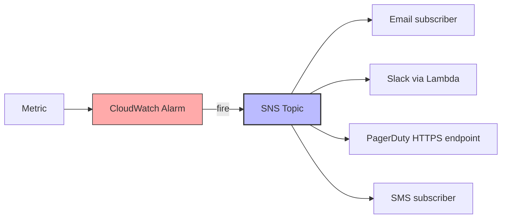

# 4. SNS Notifications and Alerting

> [!info] Chapter Context
> CloudWatch Alarms notify you via SNS. This note covers SNS for alerting, common notification channels (email, Slack, PagerDuty), and how to build an alerting pipeline.

Related: [[2. Metrics and Alarms]] | [[10 - Event Driven Systems/2. SNS Fundamentals]] | [[3. Tracing with X-Ray]]

---

## 1. The Alerting Pipeline



---

## 2. Creating an Alerting Topic

```bash
# Create the topic
TOPIC_ARN=$(aws sns create-topic --name alerts --query 'TopicArn' --output text)

# Subscribe your email
aws sns subscribe --topic-arn $TOPIC_ARN --protocol email --notification-endpoint alice@example.com

# Confirm via the email link
```

Now any alarm that publishes to this topic sends an email.

---

## 3. Common Alert Patterns

### 3.1 Critical (Page Someone)

- Lambda errors > 0 for 1 minute.
- RDS CPU > 90% for 5 minutes.
- ALB 5xx rate > 1%.
- DynamoDB throttles > 0.

Route to PagerDuty (or Opsgenie) for 24/7 on-call.

### 3.2 Warning (Email/Slack)

- EC2 CPU > 70% for 10 minutes.
- RDS free storage < 20%.
- Lambda p99 duration > 1 second.

Route to a Slack channel or email.

### 3.3 Informational

- Daily cost report.
- Deployment notifications.

Route to Slack only.

---

## 4. Routing to Slack

Slack doesn't natively subscribe to SNS. Use a Lambda function as the subscriber, which posts to Slack's incoming webhook:

```python
import urllib.request
import json
import os

WEBHOOK_URL = os.environ['SLACK_WEBHOOK_URL']

def lambda_handler(event, context):
    for record in event['Records']:
        message = json.loads(record['Sns']['Message'])
        
        slack_message = {
            'text': f":rotating_light: *{message['AlarmName']}*\n{message['NewStateReason']}",
            'channel': '#alerts'
        }
        
        req = urllib.request.Request(
            WEBHOOK_URL,
            data=json.dumps(slack_message).encode('utf-8'),
            headers={'Content-Type': 'application/json'}
        )
        urllib.request.urlopen(req)
```

Subscribe the Lambda to the SNS topic:

```bash
aws sns subscribe --topic-arn $TOPIC_ARN --protocol lambda \
  --notification-endpoint arn:aws:lambda:us-east-1:123456789012:function:slack-alerts
```

---

## 5. Routing to PagerDuty

PagerDuty provides an SNS integration (or an HTTPS endpoint). Easiest: use the PagerDuty AWS integration.

1. In PagerDuty, create a service with "Amazon CloudWatch" as the integration type.
2. PagerDuty gives you an integration URL.
3. Subscribe the SNS topic to the URL:

```bash
aws sns subscribe --topic-arn $TOPIC_ARN --protocol https \
  --notification-endpoint https://events.pagerduty.com/integration/abc123/enqueue
```

PagerDuty formats the SNS message as an incident.

---

## 6. Common Student Mistakes

> [!warning] Mistake 1 — One Topic for All Alerts
#  Mixing critical and informational alerts in one topic means people ignore all of them. Use separate topics: `critical-alerts`, `warning-alerts`, `info-alerts`.

> [!warning] Mistake 2 — Email-Only Alerts
#  Email is easy to miss. For critical alerts, use PagerDuty/Opsgenie (which pages the on-call engineer).

> [!warning] Mistake 3 — Alarm Without SNS Action
#  An alarm without an SNS action just changes state — no one is notified.

> [!warning] Mistake 4 — Forgetting to Confirm Email Subscriptions
#  Email subscriptions require confirmation (click a link). Until confirmed, no emails are sent.

> [!warning] Mistake 5 — Alert Fatigue
#  Too many false-positive alerts train people to ignore them. Tune thresholds; use anomaly detection; route non-critical alerts to Slack only.

> [!warning] Mistake 6 — No Runbook Linked
#  Each alert should link to a runbook explaining what to do. Otherwise, the on-call engineer has to figure it out under pressure.

---

## 7. Summary Checklist

- [ ] Alerting pipeline: Metric → CloudWatch Alarm → SNS Topic → Subscribers (email, Slack, PagerDuty).
- [ ] Use separate topics for critical, warning, and informational alerts.
- [ ] For Slack: SNS → Lambda → Slack incoming webhook.
- [ ] For PagerDuty: SNS → HTTPS endpoint (PagerDuty AWS integration).
- [ ] Always set an SNS action on alarms.
- [ ] Confirm email subscriptions.
- [ ] Tune thresholds to avoid alert fatigue.
- [ ] Link each alert to a runbook.

---

Previous: [[3. Tracing with X-Ray]] | Next: [[14 - Infrastructure as Code/1. IaC Fundamentals]]
