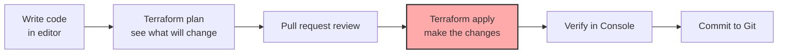
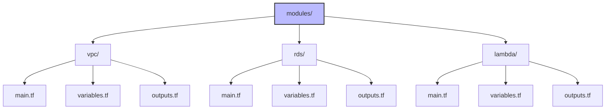

# 1. IaC Fundamentals

> [!info] Chapter Context
> Infrastructure as Code (IaC) is the practice of defining infrastructure (servers, databases, networks) in code, instead of clicking through a console. This note covers why IaC matters, the major tools (Terraform, CloudFormation, CDK, Pulumi), and the core concepts.

Related: [[13 - Monitoring and Observability/4. SNS Notifications and Alerting]] | [[2. Terraform Fundamentals]] | [[3. AWS CDK]] | [[4. CloudFormation]]

---

## 1. Why IaC

Manual infrastructure (clicking in the AWS Console) has problems:

- **Not reproducible** — You cannot easily recreate the same setup.
- **Not auditable** — No history of changes.
- **Not reviewable** — No code review for changes.
- **Error-prone** — Clicking the wrong button can break production.
- **Slow** — Provisioning 100 resources manually takes hours.

IaC solves these:

- **Reproducible** — The same code creates the same infrastructure, every time.
- **Auditable** — Code is version-controlled; you can see every change.
- **Reviewable** — Pull requests before applying changes.
- **Automatable** — CI/CD pipelines can apply changes.
- **Fast** — Define once, deploy to multiple environments.

---

## 2. The Major Tools

| Tool | Provider | Language | Approach |
| :--- | :--- | :--- | :--- |
| **Terraform** | HashiCorp | HCL (custom DSL) | Declarative |
| **CloudFormation** | AWS | JSON/YAML | Declarative |
| **AWS CDK** | AWS | TypeScript, Python, Java, etc. | Imperative (compiles to CloudFormation) |
| **Pulumi** | Pulumi | TypeScript, Python, Go, etc. | Imperative |
| **Serverless Framework** | Serverless Inc. | YAML config | Declarative (focused on serverless) |
| **SAM** | AWS | YAML + CloudFormation | Declarative (focused on serverless) |

### 2.1 Terraform

- Multi-cloud (AWS, Azure, GCP, on-prem).
- Uses HCL (HashiCorp Configuration Language).
- State is stored in a file (locally or in S3/DynamoDB).
- The most popular IaC tool.

### 2.2 CloudFormation

- AWS-only.
- Uses JSON or YAML.
- Native to AWS (no third-party dependency).
- Free (you pay for the resources, not CloudFormation itself).

### 2.3 CDK (Cloud Development Kit)

- AWS-only (compiles to CloudFormation).
- Use real programming languages (TypeScript, Python, Java, C#, Go).
- More expressive than YAML; can use loops, conditionals, functions.

### 2.4 Pulumi

- Multi-cloud.
- Use real programming languages.
- Similar to CDK but multi-cloud.

---

## 3. Declarative vs. Imperative

### 3.1 Declarative

You describe the **desired state**; the tool figures out how to get there.

```hcl
# Terraform (declarative)
resource "aws_s3_bucket" "my_bucket" {
  bucket = "my-bucket"
}
```

"I want a bucket named my-bucket." Terraform creates it if it doesn't exist, leaves it if it does.

### 3.2 Imperative

You describe the **steps** to take.

```python
# Pulumi (imperative-ish, but actually compiles to declarative)
import pulumi_aws as aws
bucket = aws.s3.Bucket("my-bucket")
```

Most modern IaC tools are declarative under the hood. The difference is mostly in the authoring experience.

---

## 4. The IaC Workflow



1. Write code locally.
2. Run `plan` (preview changes).
3. Open a pull request for review.
4. After approval, run `apply`.
5. Verify the changes.
6. The code is now in Git, matching production.

---

## 5. State Management

IaC tools maintain a **state file** that records what infrastructure exists. On `apply`, the tool:

1. Reads the current state.
2. Compares to the desired state (in your code).
3. Computes the diff (what to create, update, delete).
4. Applies the diff to the cloud.
5. Updates the state file.

### 5.1 Local vs. Remote State

- **Local state** — Stored on your machine. Fine for solo learning; terrible for teams (no collaboration, conflicts).
- **Remote state** — Stored in S3 (with DynamoDB locking for Terraform). Teams can collaborate safely.

For Terraform on AWS:

```hcl
# backend.tf
terraform {
  backend "s3" {
    bucket = "my-terraform-state"
    key    = "prod/terraform.tfstate"
    region = "us-east-1"
    dynamodb_table = "terraform-locks"
    encrypt = true
  }
}
```

### 5.2 State File Security

The state file contains sensitive data (RDS passwords, secrets). Protect it:

- Store in a private S3 bucket.
- Enable encryption (SSE-KMS).
- Restrict IAM access.
- Never commit to Git.

---

## 6. Modularization

Break infrastructure into modules (reusable units). A module is a directory of `.tf` files. A typical module layout:



Use modules in your root config:

```hcl
module "vpc" {
  source = "./modules/vpc"
  cidr   = "10.0.0.0/16"
}

module "rds" {
  source       = "./modules/rds"
  vpc_id       = module.vpc.vpc_id
  subnet_ids   = module.vpc.private_subnet_ids
  db_name      = "myapp"
  db_username  = "admin"
  db_password  = var.db_password
}
```

The community shares modules at the [Terraform Registry](https://registry.terraform.io/). Use vetted modules (e.g., `terraform-aws-modules/vpc/aws`) instead of writing everything from scratch.

---

## 7. Common Student Mistakes

> [!warning] Mistake 1 — Manual Changes Outside IaC
> If you make changes via the Console, your state drifts from your code. Next `apply` may revert or break things. Always use IaC for changes.

> [!warning] Mistake 2 — Local State for Teams
> Local state causes conflicts and lost updates. Use remote state (S3 + DynamoDB for Terraform).

> [!warning] Mistake 3 — Committing State to Git
> State contains secrets. Never commit `.tfstate` to Git. Add it to `.gitignore`.

> [!warning] Mistake 4 — Not Using Modules
> Copy-pasting the same code across environments is error-prone. Use modules.

> [!warning] Mistake 5 — Applying in Production Without a Plan
> Always run `terraform plan` first. Review the changes before applying.

> [!warning] Mistake 6 — One Big Terraform Project for Everything
> A single state file for the entire company is unmanageable. Split into smaller projects (per team, per environment).

---

## 8. Summary Checklist

- [ ] IaC = infrastructure defined in code, version-controlled, reproducible.
- [ ] Major tools: Terraform (multi-cloud, HCL), CloudFormation (AWS, YAML/JSON), CDK (AWS, real languages), Pulumi (multi-cloud, real languages).
- [ ] Declarative: describe desired state; the tool computes the diff.
- [ ] Workflow: write → plan → review → apply → verify.
- [ ] State file records what exists; store remotely (S3 + DynamoDB) for teams.
- [ ] Never commit state to Git (contains secrets).
- [ ] Use modules for reusability.
- [ ] Never make manual changes outside IaC.

---

Previous: [[13 - Monitoring and Observability/4. SNS Notifications and Alerting]] | Next: [[2. Terraform Fundamentals]]
