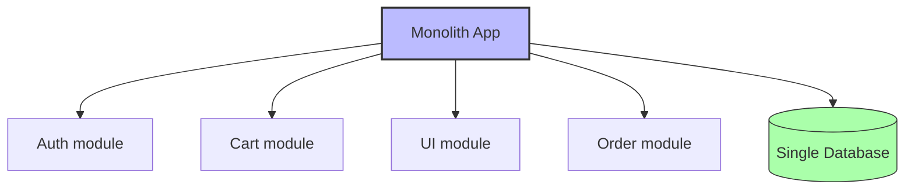
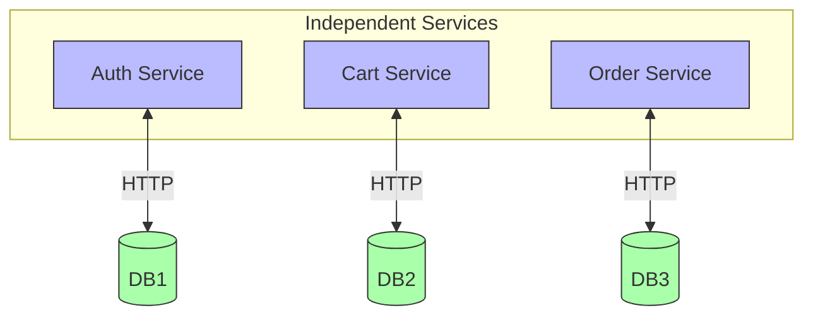

# 1. Microservices

> [!info] Chapter Context
> Microservices are an architectural pattern where an application is built as a set of small, independent services. This note covers when to use microservices, the trade-offs vs. monoliths, and the patterns for communication, data, and deployment.

Related: [[14 - Infrastructure as Code/4. CloudFormation]] | [[2. Event Driven Architecture]] | [[3. Saga Pattern]] | [[05 - Kubernetes/1. What Is Kubernetes]]

---

## 1. Monolith vs. Microservices

### 1.1 Monolith

A single application containing all functionality. Easier to build initially; harder to scale and evolve over time.



Pros: Simple deployment, easy debugging, low latency (in-process calls).
Cons: Hard to scale parts independently, tightly coupled, large codebase.

### 1.2 Microservices

Multiple small services, each owning its data, communicating via APIs.



Pros: Independent scaling/deployment, technology diversity, team autonomy.
Cons: Distributed system complexity, network calls, data consistency challenges.

---

## 2. When to Use Microservices

### 2.1 Good Fits

- Large teams (>10 developers) that need to work in parallel.
- Subsystems with different scaling requirements.
- Subsystems with different technology needs (e.g., ML service in Python, web service in Node.js).
- Organizations that value deployment independence.

### 2.2 Bad Fits

- Small teams (1-5 developers).
- Early-stage startups (the architecture is overhead).
- Applications with very tight latency requirements (in-process calls are faster than network).
- Simple CRUD apps.

> [!tip] Start Monolith, Extract Microservices
> Begin with a monolith. Extract microservices only when there's a clear need (team boundaries, scaling pressure, deployment conflict). Premature microservicing is a common mistake.

---

## 3. Service Boundaries

### 3.1 Domain-Driven Design (DDD)

Define service boundaries around **business capabilities**, not technical layers. Examples:

- **Inventory service** — Tracks what's in stock.
- **Order service** — Manages orders.
- **Shipping service** — Tracks shipments.
- **Billing service** — Charges customers.

Each service owns its data (no shared databases). The order service does not query the inventory database directly; it calls the inventory service's API.

### 3.2 Bounded Contexts

A bounded context is a boundary within which a particular domain model applies. The same word may mean different things in different contexts:

- "Product" in inventory = a physical item with stock levels.
- "Product" in catalog = a description with images and reviews.
- "Product" in pricing = a price and discount rules.

Each context gets its own service with its own model.

---

## 4. Communication Patterns

### 4.1 Synchronous (HTTP/REST, gRPC)

The caller waits for a response. Easy to understand; introduces coupling (if the callee is down, the caller fails).

```
Order Service --HTTP--> Inventory Service (waits for response)
```

Use when: the caller needs the response to proceed.

### 4.2 Asynchronous (Events, Messages)

The caller publishes an event; the callee processes it later. Decoupled; the caller doesn't wait.

```
Order Service --publish event--> Event Bus --deliver--> Inventory Service (later)
```

Use when: the callee's work can happen later.

### 4.3 Mix Both

Most microservice architectures use both. Synchronous for "I need this now" (e.g., check inventory before placing an order); asynchronous for "tell others what happened" (e.g., order placed, notify shipping).

---

## 5. Data Patterns

### 5.1 Database per Service

Each service owns its database. Other services cannot access it directly. Reduces coupling; enables independent scaling and technology choice.

### 5.2 Shared Database (Anti-Pattern)

All services share one database. Easy initially; creates tight coupling (schema changes break everyone).

### 5.3 CQRS (Command Query Responsibility Segregation)

Separate the write model (commands) from the read model (queries). Writes go to the source-of-truth database; reads come from optimized read models (materialized views, search indexes).

Use when: read and write patterns differ significantly (e.g., write once, read many).

### 5.4 Event Sourcing

Store events; derive current state by replaying. See [[10 - Event Driven Systems/1. Events and Pub-Sub]].

### 5.5 Saga Pattern

Multi-service transactions via a sequence of local transactions + compensations. See [[3. Saga Pattern]].

---

## 6. Service Discovery

In a microservices architecture, services need to find each other.

### 6.1 Server-Side Discovery (AWS ALB)

A load balancer routes requests to healthy instances. The client calls the LB; the LB picks an instance.

### 6.2 Client-Side Discovery (Netflix Eureka, Consul)

The client queries a service registry for available instances, picks one, calls directly.

### 6.3 Service Mesh (Istio, Linkerd)

A sidecar proxy handles discovery, routing, retries, and observability. The application code doesn't deal with service discovery.

On AWS, **ALB + Route 53** is the most common pattern. Service mesh is overkill for most applications.

---

## 7. API Gateway

A single entry point for external clients. Routes requests to internal services. Handles:

- Authentication (validate JWT, etc.).
- Rate limiting.
- Request/response transformation.
- Aggregation (call multiple services, combine responses).
- TLS termination.

On AWS: API Gateway or an ALB with path-based routing.

---

## 8. Deployment Patterns

### 8.1 Blue/Green Deployment

Run two identical environments (blue and green). Switch traffic from blue to green after testing green. Easy rollback (switch back).

### 8.2 Canary Deployment

Release to a small percentage of users first (e.g., 5%). Monitor. If healthy, increase to 100%.

### 8.3 Rolling Deployment

Gradually replace old instances with new ones. Zero downtime if done right.

### 8.4 Feature Flags

Deploy new code hidden behind a flag. Enable for specific users/percentages. Disable if issues arise. Allows decoupling deployment from release.

---

## 9. Common Student Mistakes

> [!warning] Mistake 1 — Premature Microservicing
> Don't start with microservices for a new project. Start monolith; extract when there's clear need.

> [!warning] Mistake 2 — Shared Database
> Sharing a database defeats the purpose of microservices. Each service should own its data.

> [!warning] Mistake 3 — Synchronous Chains
> A long chain of synchronous calls (A → B → C → D) is fragile. If any service fails, the whole chain fails. Use async where possible.

> [!warning] Mistake 4 — Forgetting About Distributed Transactions
> ACID transactions don't work across services. Use sagas for multi-service business processes.

> [!warning] Mistake 5 — Too Many Services
> Each service has operational overhead. Don't split into services smaller than a team can own.

> [!warning] Mistake 6 — No Observability
#  In a distributed system, observability (logs, metrics, traces) is critical. See [[13 - Monitoring and Observability/1. Logging]].

---

## 10. Summary Checklist

- [ ] Monolith: simple, low latency, hard to scale independently.
- [ ] Microservices: independent scaling/deployment, distributed system complexity.
- [ ] Define service boundaries around business capabilities (DDD).
- [ ] Each service owns its database (no shared DBs).
- [ ] Communication: synchronous (HTTP, gRPC) for "need now"; async (events) for "tell others."
- [ ] CQRS separates read and write models.
- [ ] Saga pattern for multi-service transactions.
- [ ] Service discovery: ALB + Route 53 (simplest on AWS).
- [ ] API Gateway for external entry.
- [ ] Deployment: blue/green, canary, rolling, feature flags.
- [ ] Start monolith; extract microservices when needed.

---

Previous: [[14 - Infrastructure as Code/4. CloudFormation]] | Next: [[2. Event Driven Architecture]]
