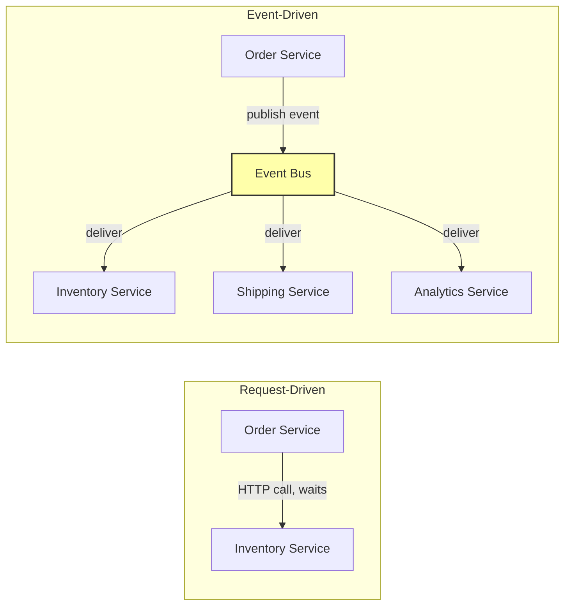
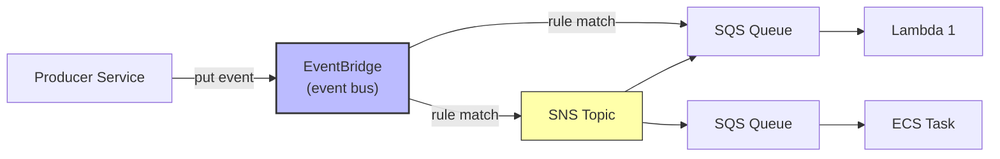

# 2. Event Driven Architecture

> [!info] Chapter Context
> Event-Driven Architecture (EDA) is a pattern where services communicate via events rather than direct calls. This note covers EDA principles, patterns, and trade-offs vs. request-driven architectures.

Related: [[1. Microservices]] | [[3. Saga Pattern]] | [[10 - Event Driven Systems/1. Events and Pub-Sub]] | [[4. CQRS]]

---

## 1. What EDA Is

In a **request-driven** architecture, service A calls service B and waits for a response. Tight coupling.

In an **event-driven** architecture, service A emits an event ("order placed"); service B (and any other interested service) reacts to it later. Loose coupling.



---

## 2. Benefits

- **Loose coupling** — Producers don't know about consumers.
- **Easy to add consumers** — Just subscribe a new service to the event bus.
- **Async** — Producers don't wait for consumers.
- **Scalable** — Consumers process at their own pace.
- **Resilient** — If a consumer is down, the event is buffered (in a queue).

---

## 3. Trade-offs

- **Complexity** — Harder to trace flow (no single call stack).
- **Eventual consistency** — State propagates over time, not immediately.
- **Debugging** — Harder to debug (events are async).
- **Schema management** — Event schemas must be versioned and coordinated.
- **Ordering** — Events may arrive out of order (depends on the broker).

---

## 4. EDA Patterns

### 4.1 Event Notification

The event says "something happened" with minimal data. Consumers query back for details.

```
Event: "OrderPlaced" { order_id: 123 }
Consumer: queries Order Service: GET /orders/123
```

Pros: Small events. Cons: Extra round-trips.

### 4.2 Event-Carried State Transfer

The event contains all the data consumers need. No queries back.

```
Event: "OrderPlaced" { order_id: 123, user_id: 456, items: [...], total: 99.99 }
Consumer: has everything it needs.
```

Pros: No coupling to the producer for queries. Cons: Larger events; schema coordination.

### 4.3 Event Sourcing

The event log IS the source of truth. Current state is derived by replaying events. See [[10 - Event Driven Systems/1. Events and Pub-Sub]].

### 4.4 CQRS

Separate write model (commands) from read model (queries). See [[4. CQRS]].

### 4.5 Saga

Multi-step business process via events. See [[3. Saga Pattern]].

---

## 5. AWS Building Blocks for EDA

| Component | AWS Service |
| :--- | :--- |
| Event bus | EventBridge |
| Pub/sub messaging | SNS |
| Queue | SQS |
| Stream | Kinesis Data Streams, DynamoDB Streams |
| Event processor | Lambda, ECS, EKS |

A typical EDA flow on AWS:



---

## 6. When to Use EDA

### 6.1 Good Fits

- Multiple services need to react to the same event (fan-out).
- Producers and consumers have different throughput patterns.
- You want to add new consumers without modifying producers.
- Long-running workflows (async).

### 6.2 Bad Fits

- You need an immediate response (use synchronous).
- Strong consistency is required across services (use 2PC, or rethink the boundaries).
- Simple CRUD apps with no cross-service workflows.

---

## 7. Event Schema Management

As events evolve, schemas change. Without coordination, consumers break.

### 7.1 Schema Registry

A central registry of event schemas. Producers register; consumers can find and validate against.

AWS offers **EventBridge Schema Registry** (auto-discovers schemas from events on the bus). Other options: Confluent Schema Registry (for Kafka), AWS Glue Schema Registry.

### 7.2 Versioning

- Include a `version` field in events.
- Make breaking changes additive (new fields, not removed/renamed).
- Use a new event type for major changes (`OrderPlaced.v2`).

### 7.3 Backward Compatibility

- New consumers should handle old events (use default values for new fields).
- Old consumers should ignore unknown fields (don't crash on new fields).

---

## 8. Idempotency

In EDA, events may be delivered more than once. Consumers must be **idempotent** — processing the same event twice should have the same effect as once.

Strategies:

- **Use a unique event ID** — Track processed IDs; skip if already processed.
- **Make operations idempotent** — `SET status = 'paid'` is idempotent (running it twice gives the same result); `ADD count = count + 1` is not.

```python
processed_events = set()

def handle_event(event):
    event_id = event['id']
    if event_id in processed_events:
        return  # already processed
    process(event)
    processed_events.add(event_id)
```

In production, use a persistent store (DynamoDB, Redis) instead of an in-memory set.

---

## 9. Common Student Mistakes

> [!warning] Mistake 1 — Treating Events as RPC
> Events are not request/response. The producer should not wait for the consumer. If you need a response, use synchronous.

> [!warning] Mistake 2 — No Schema Management
#  Without schemas, producers and consumers drift. Use a schema registry.

> [!warning] Mistake 3 — Forgetting Idempotency
#  Events may be delivered more than once. Make consumers idempotent.

> [!warning] Mistake 4 — Using EDA for Everything
#  Some operations are naturally synchronous (e.g., "check inventory before placing order"). Don't force them into events.

> [!warning] Mistake 5 — No Observability for Events
#  Trace events with a correlation ID. Without it, debugging event flows is impossible.

> [!warning] Mistake 6 — Tight Coupling via Schema
#  If producers and consumers must update in lockstep, you've lost the benefit. Make schemas backward-compatible.

---

## 10. Summary Checklist

- [ ] EDA: services communicate via events (not direct calls).
- [ ] Benefits: loose coupling, async, scalable, resilient.
- [ ] Trade-offs: complexity, eventual consistency, harder debugging.
- [ ] Patterns: event notification, event-carried state transfer, event sourcing, CQRS, saga.
- [ ] AWS: EventBridge (event bus), SNS (pub-sub), SQS (queue), Lambda (processor).
- [ ] Use schema registry; version events; maintain backward compatibility.
- [ ] Consumers must be idempotent (events may be delivered more than once).
- [ ] Use correlation IDs for tracing.

---

Previous: [[1. Microservices]] | Next: [[3. Saga Pattern]]
