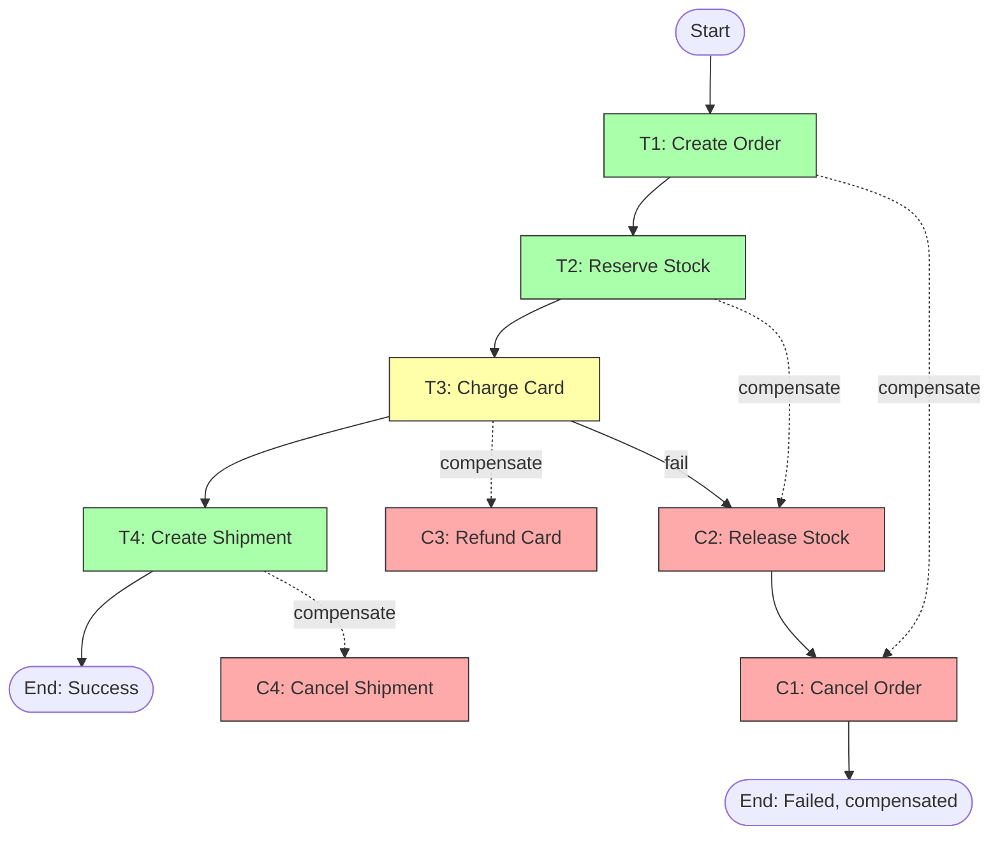

# 3. Saga Pattern

> [!info] Chapter Context
> In a microservices architecture, you cannot use a traditional ACID transaction across multiple services. The **saga pattern** is the standard solution: a sequence of local transactions, each with a compensating transaction to undo it on failure.

Related: [[2. Event Driven Architecture]] | [[1. Microservices]] | [[10 - Event Driven Systems/1. Events and Pub-Sub]]

---

## 1. The Problem

In a monolith with a single database, you can use a transaction:

```sql
BEGIN;
INSERT INTO orders ...;
UPDATE inventory SET stock = stock - 1 WHERE ...;
INSERT INTO shipments ...;
COMMIT;
```

If any step fails, the whole transaction rolls back. ACID guarantees.

In microservices, each service has its own database. You cannot run a single transaction across them. If the order service inserts an order, then the inventory service fails to reserve stock, you have an inconsistent state.

---

## 2. The Saga Solution

A **saga** is a sequence of local transactions, each in one service:

1. **Order Service** creates an order (local transaction).
2. **Inventory Service** reserves stock (local transaction).
3. **Payment Service** charges the card (local transaction).
4. **Shipping Service** creates a shipment (local transaction).

If any step fails, **compensating transactions** run in reverse to undo the previous steps:

- If step 3 (payment) fails:
  - Compensate step 2: release the reserved stock.
  - Compensate step 1: mark the order as cancelled.



---

## 3. Coordination Patterns

### 3.1 Choreography (Event-Driven)

Each service emits an event when done; the next service listens and proceeds. No central coordinator.

```
Order Service: emits OrderCreated
Inventory Service: listens for OrderCreated, reserves stock, emits StockReserved
Payment Service: listens for StockReserved, charges card, emits CardCharged
Shipping Service: listens for CardCharged, creates shipment, emits ShipmentCreated
```

If payment fails:

```
Payment Service: emits CardChargeFailed
Inventory Service: listens for CardChargeFailed, releases stock, emits StockReleased
Order Service: listens for StockReleased, cancels order
```

Pros: Decentralized, no single point of failure, easy to add new steps.
Cons: Hard to track the flow; risk of cyclic dependencies.

### 3.2 Orchestration (Central Coordinator)

A central **orchestrator** (e.g., AWS Step Functions) tells each service what to do.

```
Orchestrator: call Order Service to create order
Orchestrator: call Inventory Service to reserve stock
Orchestrator: call Payment Service to charge card
  → fails
Orchestrator: call Inventory Service to release stock (compensate)
Orchestrator: call Order Service to cancel order (compensate)
```

Pros: Easy to track flow; easy to add error handling; central view of state.
Cons: Orchestrator is a single point of failure (mitigated by managed services like Step Functions).

### 3.3 When to Use Which

- **Choreography** — For simple sagas (2-4 steps). For systems where you want loose coupling.
- **Orchestration** — For complex sagas (5+ steps). For systems where you need central visibility and control.

Most production systems use orchestration (via Step Functions or similar) for non-trivial sagas.

---

## 4. Implementing a Saga with Step Functions

```json
{
  "StartAt": "CreateOrder",
  "States": {
    "CreateOrder": {
      "Type": "Task",
      "Resource": "arn:aws:lambda:...:function:create-order",
      "Next": "ReserveStock"
    },
    "ReserveStock": {
      "Type": "Task",
      "Resource": "arn:aws:lambda:...:function:reserve-stock",
      "Retry": [{"ErrorEquals": ["States.TaskFailed"], "MaxAttempts": 3}],
      "Catch": [{"ErrorEquals": ["States.ALL"], "Next": "CancelOrder"}],
      "Next": "ChargeCard"
    },
    "ChargeCard": {
      "Type": "Task",
      "Resource": "arn:aws:lambda:...:function:charge-card",
      "Catch": [{"ErrorEquals": ["CardDeclined"], "Next": "ReleaseStock"}, {"ErrorEquals": ["States.ALL"], "Next": "ReleaseStock"}],
      "Next": "CreateShipment"
    },
    "CreateShipment": {
      "Type": "Task",
      "Resource": "arn:aws:lambda:...:function:create-shipment",
      "End": true
    },
    "ReleaseStock": {
      "Type": "Task",
      "Resource": "arn:aws:lambda:...:function:release-stock",
      "Next": "CancelOrder"
    },
    "CancelOrder": {
      "Type": "Task",
      "Resource": "arn:aws:lambda:...:function:cancel-order",
      "End": true
    }
  }
}
```

Step Functions handles retries, error catching, and state transitions.

---

## 5. Compensating Transactions

A compensating transaction is NOT the same as rolling back. It's a business-level undo:

- "Create order" → "Cancel order" (sets status to cancelled; doesn't delete the record).
- "Reserve stock" → "Release stock" (returns reserved items to inventory).
- "Charge card" → "Refund card" (issues a refund, not "un-charges").
- "Create shipment" → "Cancel shipment" (cancels with the carrier).

The state after compensation is **not** the same as the initial state — there's a record that the saga was attempted and failed. This is intentional (for audit, analytics).

---

## 6. Idempotency

Saga steps may be retried. Each step must be idempotent:

- "Create order" — Use the order ID from the saga; don't create a duplicate.
- "Charge card" — Use an idempotency key (Stripe, etc. support this).
- "Refund card" — Track refund IDs; don't refund twice.

Without idempotency, retries can cause double charges, duplicate orders, etc.

---

## 7. Common Student Mistakes

> [!warning] Mistake 1 — Trying to Use 2PC Across Services
> Two-phase commit is slow, blocking, and fragile. Use sagas instead.

> [!warning] Mistake 2 — Forgetting Compensations
#  Every step must have a compensation. If you can't undo a step, your saga is broken.

> [!warning] Mistake 3 — Non-Idempotent Steps
#  Retries cause duplicates. Make each step idempotent.

> [!warning] Mistake 4 — Choreography for Complex Sagas
#  Choreography becomes unmanageable past 4-5 steps. Use orchestration (Step Functions).

> [!warning] Mistake 5 — Forgetting to Handle Compensation Failures
#  What if the compensation itself fails? Retry, alert a human, or accept the inconsistency (with monitoring).

> [!warning] Mistake 6 — Treating Compensations as Rollbacks
#  Compensations are business-level undos, not DB rollbacks. The state after compensation is different from the initial state.

---

## 8. Summary Checklist

- [ ] Saga = sequence of local transactions, each with a compensating transaction.
- [ ] Used in microservices where ACID transactions don't work across services.
- [ ] Two coordination patterns: choreography (events) and orchestration (central coordinator).
- [ ] Use orchestration (Step Functions) for complex sagas (5+ steps).
- [ ] Compensating transactions are business-level undos, not DB rollbacks.
- [ ] Each step must be idempotent (retries may happen).
- [ ] Handle compensation failures (retry, alert, accept inconsistency).

---

Previous: [[2. Event Driven Architecture]] | Next: [[4. CQRS]]
