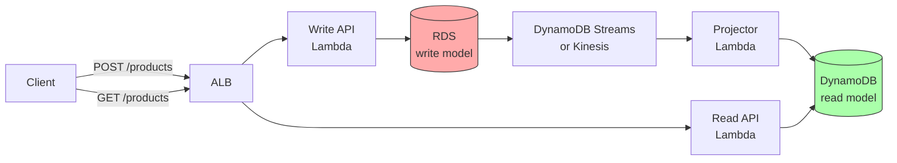

# 4. CQRS

> [!info] Chapter Context
> CQRS (Command Query Responsibility Segregation) separates the write model from the read model. This note covers when to use CQRS, the patterns, and the trade-offs.

Related: [[3. Saga Pattern]] | [[2. Event Driven Architecture]] | [[5. Serverless Patterns]]

---

## 1. The Problem

In a traditional CRUD app, the same model handles reads and writes:

```
User → Application → Database (one model for reads and writes)
```

This works for simple apps but has issues at scale:

- **Read and write patterns differ** — Writes are normalized (good for integrity); reads are denormalized (good for performance). One model can't optimize both.
- **Different scale** — Reads may be 100x more frequent than writes (or vice versa).
- **Complex read queries** — JOINs across many tables are slow.

---

## 2. CQRS: Separate Read and Write

CQRS separates the model:

```mermaid
graph TD
    User[Client]
    User -->|write (command)| WriteModel[Write Model<br/>e.g., RDS]
    User -->|read (query)| ReadModel[Read Model<br/>e.g., DynamoDB, Elasticsearch]

    WriteModel -->|emit event| Bus[Event Bus]
    Bus -->|update| ReadModel

    style WriteModel fill:#faa,stroke:#333
    style ReadModel fill:#afa,stroke:#333
    style Bus fill:#ffa,stroke:#333
```

- **Commands** (writes) go to the write model. The write model is the source of truth, optimized for consistency.
- **Queries** (reads) go to the read model. The read model is denormalized, optimized for queries.
- The write model emits events when state changes; the read model updates itself by consuming events.

---

## 3. Example: E-Commerce Product Catalog

### 3.1 Write Model (RDS)

Normalized for integrity:

```
products (id, name, price, ...)
categories (id, name, ...)
product_categories (product_id, category_id)
reviews (id, product_id, rating, comment)
```

Writes: insert/update products, add reviews, etc.

### 3.2 Read Model (Elasticsearch or DynamoDB)

Denormalized for fast queries:

```
product_search (id, name, price, avg_rating, categories[], review_count)
```

Reads: search by name, filter by category, sort by rating — all fast in Elasticsearch.

### 3.3 Synchronization

When a review is added (write to RDS), emit a `ReviewAdded` event. A consumer updates the `avg_rating` and `review_count` in Elasticsearch.

---

## 4. When to Use CQRS

### 4.1 Good Fits

- Read-heavy workloads with complex queries (e.g., search, analytics).
- Different read and write scale.
- Multiple read models (e.g., a search index + a recommendation engine + a reporting DB).
- Collaborative domains (many users writing; need eventual consistency).

### 4.2 Bad Fits

- Simple CRUD apps (the overhead isn't worth it).
- Strong consistency requirements (CQRS is eventually consistent).
- Small teams (CQRS adds complexity).

---

## 5. CQRS + Event Sourcing

CQRS is often combined with **event sourcing**:

- The write model stores events (not current state).
- The read model is built by replaying events.
- Multiple read models can be built from the same event stream.

```
Commands → Event Store (source of truth)
                ↓ events
            Read Model 1 (search)
            Read Model 2 (analytics)
            Read Model 3 (audit)
```

This is powerful but complex. Use only when you need the audit trail and multiple projections.

---

## 6. Trade-offs

### 6.1 Pros

- Independent scaling of reads and writes.
- Optimized read models (fast queries).
- Multiple read models (different views of the same data).
- Easier to evolve (add a new read model without touching the write model).

### 6.2 Cons

- **Complexity** — Two models, synchronization logic, event handling.
- **Eventual consistency** — Reads may be stale (the read model lags the write model).
- **Operational overhead** — More moving parts to monitor.
- **Debugging** — Harder (writes and reads go to different places).

---

## 7. CQRS on AWS

A common AWS CQRS setup:

- **Write model**: RDS (PostgreSQL) — source of truth, ACID.
- **Event bus**: DynamoDB Streams or Kinesis — captures changes.
- **Read model**: DynamoDB (key-based lookups) or Elasticsearch (search) — denormalized.
- **Projector**: Lambda function — consumes events, updates the read model.



---

## 8. Common Student Mistakes

> [!warning] Mistake 1 — Using CQRS for Simple Apps
#  CQRS adds complexity. Use it only when read/write patterns differ significantly.

> [!warning] Mistake 2 — Forgetting About Eventual Consistency
#  The read model lags the write model. Users may see stale data briefly. Communicate this in the UI ("data may be delayed").

> [!warning] Mistake 3 — Synchronous Synchronization
#  Don't update the read model synchronously in the write request. Use events (async).

> [!warning] Mistake 4 — No Monitoring of Lag
#  If the projector falls behind, reads are very stale. Monitor the lag.

> [!warning] Mistake 5 — One Read Model for Everything
#  The point of CQRS is multiple read models. If you only have one, you've added complexity without the benefit.

> [!warning] Mistake 6 — Schema Drift Between Models
#  When the write model changes, the projector must be updated. Otherwise, the read model gets stale or incorrect.

---

## 9. Summary Checklist

- [ ] CQRS separates the write model (commands) from the read model (queries).
- [ ] Use when read and write patterns differ significantly.
- [ ] The write model is the source of truth (ACID); the read model is denormalized (fast queries).
- [ ] The write model emits events; the read model updates itself by consuming events.
- [ ] CQRS is eventually consistent (reads may lag writes).
- [ ] Often combined with event sourcing (events are the source of truth).
- [ ] Common AWS setup: RDS (write) + DynamoDB Streams + Lambda (projector) + DynamoDB/Elasticsearch (read).
- [ ] Don't use CQRS for simple CRUD apps.

---

Previous: [[3. Saga Pattern]] | Next: [[5. Serverless Patterns]]
