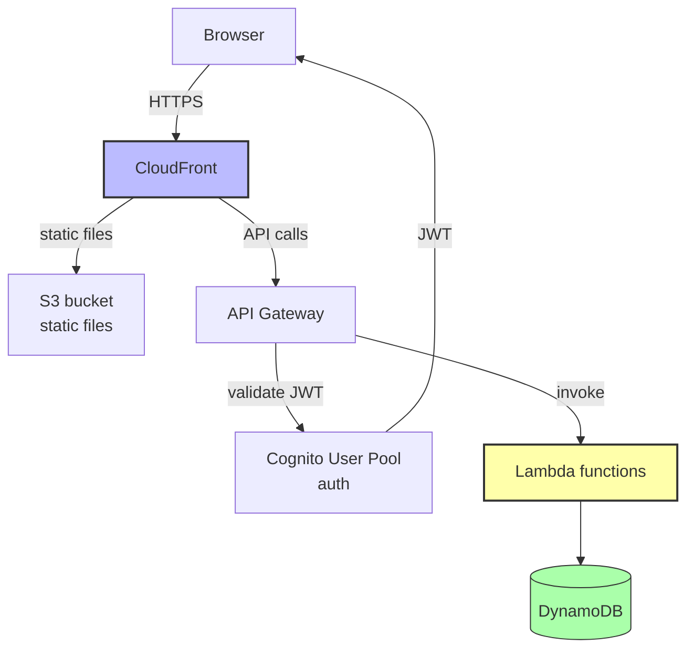
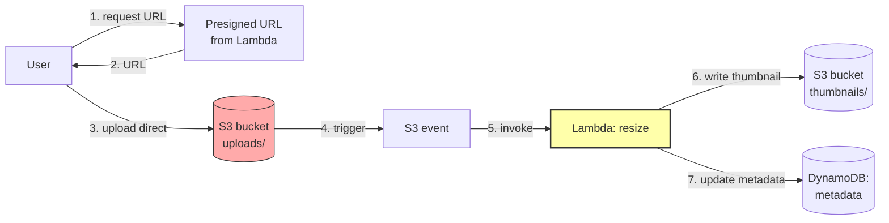
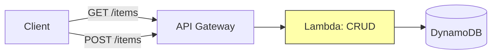
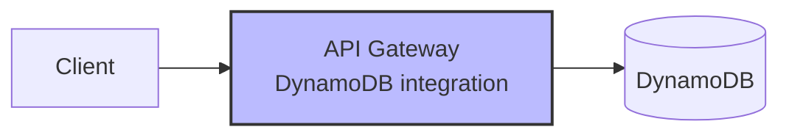
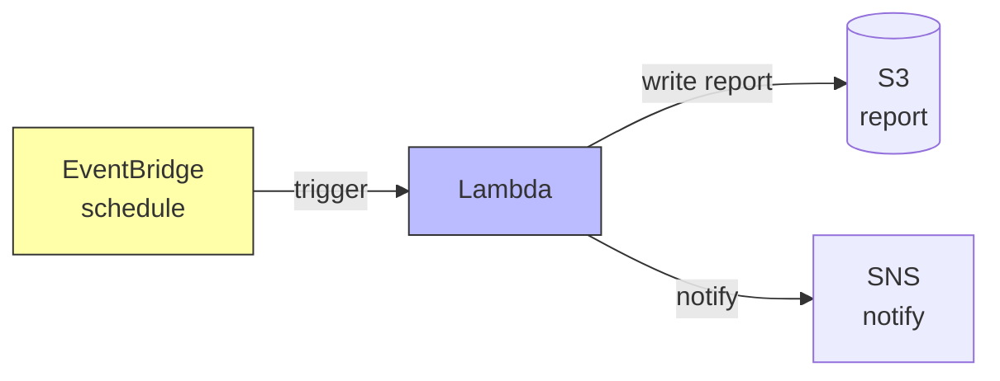
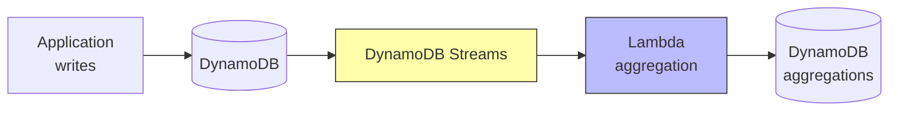
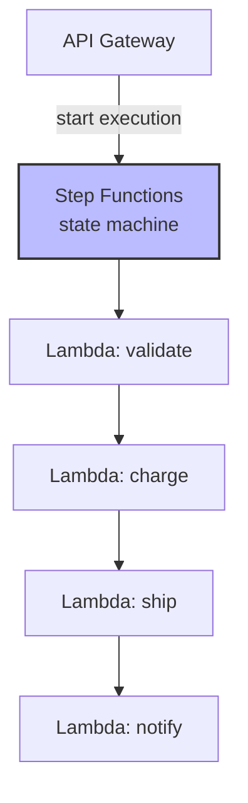
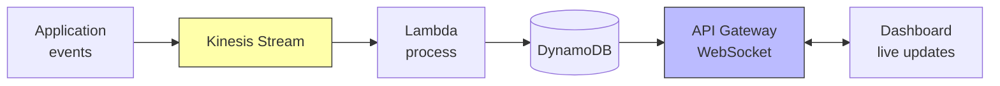
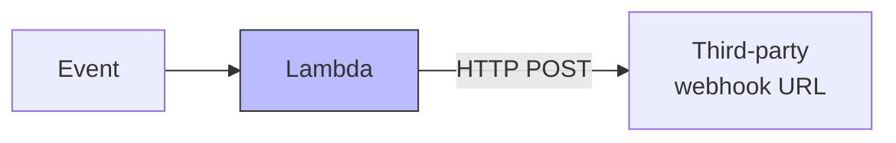
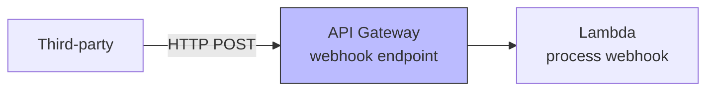

# 5. Serverless Patterns

> [!info] Chapter Context
> Serverless architectures have common patterns: the "serverless web app," the "serverless backend," the "event-driven processor," and more. This note catalogs the patterns you'll see in production.

Related: [[4. CQRS]] | [[11 - Serverless Computing/1. Serverless Concepts]] | [[16 - Projects/1. Project 1 - Dropbox Clone]]

---

## 1. Pattern: Serverless Web App

A single-page app (React/Vue/Angular) with a serverless backend.

Components:

- **S3 + CloudFront** — Host the SPA. CloudFront provides HTTPS and CDN.
- **Cognito** — User authentication. Issues JWTs.
- **API Gateway** — HTTP API. Validates JWTs via Cognito.
- **Lambda** — Business logic.
- **DynamoDB** — State.

Use case: SaaS web apps with variable traffic.

---

## 2. Pattern: Event-Driven Image Processing

Process images uploaded by users (resize, watermark, generate thumbnails).

Components:

- **Presigned URL** — Lets the user upload directly to S3 (bypassing your server).
- **S3 trigger** — Invokes Lambda on object creation.
- **Lambda** — Resizes the image, uploads the thumbnail, updates metadata.

Use case: image hosting, document processing, video transcoding.

---

## 3. Pattern: API Backend (CRUD)

A CRUD API over a DynamoDB table.

For very simple CRUD, you can use **DynamoDB directly via API Gateway** (no Lambda):

API Gateway maps HTTP requests to DynamoDB API calls directly. No Lambda needed.

---

## 4. Pattern: Cron Job (Scheduled Task)

Run a periodic task (daily report, cleanup, backup).

EventBridge rule with a `cron()` or `rate()` expression triggers Lambda.

---

## 5. Pattern: Stream Processing

React to changes in DynamoDB or Kinesis.

Use case: real-time aggregations (count of items per user, total revenue per day), audit logs, replication.

---

## 6. Pattern: Multi-Service Workflow (Step Functions)

Orchestrate multiple services for a business process.

Use case: order processing, ETL pipelines, multi-step approvals.

---

## 7. Pattern: Real-Time Dashboard

Live-updating dashboard (e.g., number of active users, latest orders).

Use case: operations dashboards, live sports scores, chat apps.

---

## 8. Pattern: Polling vs. Webhooks

### 8.1 Polling

The client periodically calls the server to check for updates. Simple but wasteful (most polls return nothing).

### 8.2 Webhooks

The server calls the client when there's an update. Efficient but requires the client to be reachable.

For serverless webhooks (your serverless app calls a third-party webhook):

For receiving webhooks (a third party calls your serverless app):

---

## 9. Common Pitfalls in Serverless Architectures

> [!warning] Pitfall 1 — Synchronous Chains
> A → Lambda → B → Lambda → C → Lambda is slow (cold starts at each step) and fragile. Use Step Functions or events.

> [!warning] Pitfall 2 — Lambda Doing Long Tasks
> Lambda max is 15 minutes. For long tasks, use Fargate or Step Functions with wait states.

> [!warning] Pitfall 3 — No Connection Pooling for RDS
> Lambda opens many connections (one per concurrent invocation). Use RDS Proxy.

> [!warning] Pitfall 4 — Cold Starts on User-Facing APIs
> For latency-sensitive APIs, use provisioned concurrency.

> [!warning] Pitfall 5 — Forgetting Idempotency
> Lambda may be invoked multiple times. Make handlers idempotent.

> [!warning] Pitfall 6 — Overusing Serverless
#  Serverless is more expensive than containers at high steady traffic. Use containers (Fargate/ECS) for steady, high-traffic workloads.

---

## 10. Summary Checklist

- [ ] Serverless web app: S3 + CloudFront + Cognito + API Gateway + Lambda + DynamoDB.
- [ ] Event-driven image processing: presigned URL → S3 → Lambda → thumbnails.
- [ ] CRUD API: API Gateway + Lambda + DynamoDB (or API Gateway directly to DynamoDB).
- [ ] Cron: EventBridge schedule → Lambda.
- [ ] Stream processing: DynamoDB Streams or Kinesis → Lambda.
- [ ] Multi-service workflow: Step Functions orchestrating Lambdas.
- [ ] Real-time dashboard: Kinesis → Lambda → DynamoDB → API Gateway WebSocket.
- [ ] Avoid synchronous Lambda chains, long tasks, and missing connection pooling.

---

Previous: [[4. CQRS]] | Next: [[16 - Projects/1. Project 1 - Dropbox Clone]]
