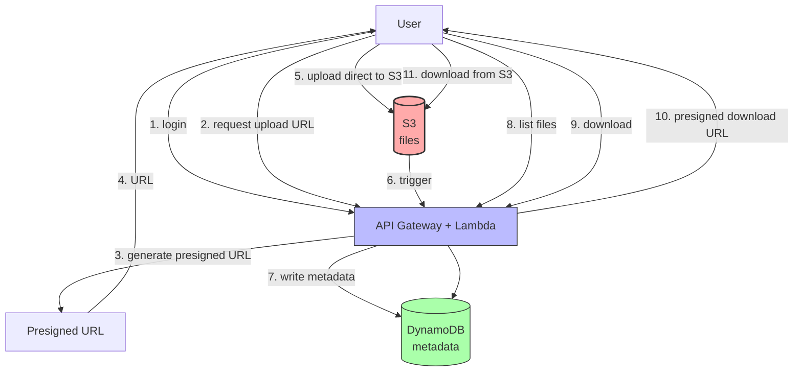

# 1. Project 1 - Dropbox Clone

> [!info] Chapter Context
> Build a file storage service (like Dropbox) using S3, IAM, and presigned URLs. This project brings together concepts from S3, IAM, and presigned URLs.

Related: [[15 - Architecture Patterns/5. Serverless Patterns]] | [[08 - Object Storage/4. Presigned URLs and Static Website Hosting]] | [[2. Project 2 - Image Hosting Platform]]

---

## 1. Project Overview

Build a simple file storage service:

- Users can upload files.
- Users can list their files.
- Users can download their files.
- Each user sees only their own files.

Architecture:



---

## 2. Components

### 2.1 S3 Bucket

Stores the actual files. Use a prefix per user (`users/{user_id}/...`).

```bash
aws s3 mb s3://my-dropbox-clone-12345 --region us-east-1
```

### 2.2 DynamoDB Table

Stores file metadata: file ID, user ID, filename, size, upload date, S3 key.

```bash
aws dynamodb create-table \
  --table-name files \
  --attribute-definitions AttributeName=user_id,AttributeType=S AttributeName=file_id,AttributeType=S \
  --key-schema AttributeName=user_id,KeyType=HASH AttributeName=file_id,KeyType=RANGE \
  --billing-mode PAY_PER_REQUEST
```

### 2.3 Lambda Functions

- `request-upload-url` — Generates a presigned PUT URL.
- `request-download-url` — Generates a presigned GET URL.
- `list-files` — Lists files for the current user.
- `record-metadata` — Triggered by S3, writes metadata to DynamoDB.

### 2.4 API Gateway

Exposes the Lambda functions as HTTP endpoints.

### 2.5 Cognito (Optional)

For user authentication. In a minimal version, you can use API keys or simple tokens.

---

## 3. Implementation

### 3.1 The Upload URL Lambda (Python)

```python
import boto3
import uuid
import json
import os

s3 = boto3.client('s3')
BUCKET = os.environ['BUCKET_NAME']

def lambda_handler(event, context):
    user_id = event['requestContext']['authorizer']['claims']['sub']  # from Cognito
    file_name = event['queryStringParameters']['filename']
    
    file_id = str(uuid.uuid4())
    key = f'users/{user_id}/{file_id}/{file_name}'
    
    url = s3.generate_presigned_url(
        'put_object',
        Params={'Bucket': BUCKET, 'Key': key},
        ExpiresIn=300  # 5 minutes
    )
    
    return {
        'statusCode': 200,
        'body': json.dumps({
            'upload_url': url,
            'file_id': file_id
        })
    }
```

### 3.2 The S3 Trigger Lambda (Record Metadata)

```python
import boto3
import json
import os
from datetime import datetime

dynamodb = boto3.resource('dynamodb')
table = dynamodb.Table(os.environ['TABLE_NAME'])

def lambda_handler(event, context):
    for record in event['Records']:
        bucket = record['s3']['bucket']['name']
        key = record['s3']['object']['key']
        size = record['s3']['object']['size']
        
        # Parse the key: users/{user_id}/{file_id}/{filename}
        parts = key.split('/')
        user_id = parts[1]
        file_id = parts[2]
        filename = parts[3]
        
        table.put_item(Item={
            'user_id': user_id,
            'file_id': file_id,
            'filename': filename,
            's3_key': key,
            'size': size,
            'uploaded_at': datetime.utcnow().isoformat()
        })
```

### 3.3 The List Files Lambda

```python
import boto3
import json
import os

dynamodb = boto3.resource('dynamodb')
table = dynamodb.Table(os.environ['TABLE_NAME'])

def lambda_handler(event, context):
    user_id = event['requestContext']['authorizer']['claims']['sub']
    
    response = table.query(
        KeyConditionExpression='user_id = :uid',
        ExpressionAttributeValues={':uid': user_id}
    )
    
    return {
        'statusCode': 200,
        'body': json.dumps({'files': response['Items']})
    }
```

### 3.4 The Download URL Lambda

```python
import boto3
import json
import os

s3 = boto3.client('s3')
dynamodb = boto3.resource('dynamodb')
table = dynamodb.Table(os.environ['TABLE_NAME'])
BUCKET = os.environ['BUCKET_NAME']

def lambda_handler(event, context):
    user_id = event['requestContext']['authorizer']['claims']['sub']
    file_id = event['queryStringParameters']['file_id']
    
    # Get the file metadata
    response = table.get_item(Key={'user_id': user_id, 'file_id': file_id})
    if 'Item' not in response:
        return {'statusCode': 404, 'body': json.dumps({'error': 'File not found'})}
    
    key = response['Item']['s3_key']
    
    url = s3.generate_presigned_url(
        'get_object',
        Params={'Bucket': BUCKET, 'Key': key},
        ExpiresIn=300
    )
    
    return {
        'statusCode': 200,
        'body': json.dumps({'download_url': url})
    }
```

### 3.5 IAM Policy for the Lambda

The Lambda needs:

- `s3:PutObject` and `s3:GetObject` on the bucket.
- `dynamodb:PutItem`, `dynamodb:GetItem`, `dynamodb:Query` on the table.
- `s3:ListBucket` if you need to list objects.

```json
{
  "Version": "2012-10-17",
  "Statement": [
    {
      "Effect": "Allow",
      "Action": ["s3:PutObject", "s3:GetObject"],
      "Resource": "arn:aws:s3:::my-dropbox-clone-12345/*"
    },
    {
      "Effect": "Allow",
      "Action": ["dynamodb:PutItem", "dynamodb:GetItem", "dynamodb:Query"],
      "Resource": "arn:aws:dynamodb:us-east-1:123456789012:table/files"
    }
  ]
}
```

---

## 4. Testing with LocalStack

### 4.1 Start LocalStack

```bash
docker run -d -p 4566:4566 -v /var/run/docker.sock:/var/run/docker.sock \
  -e SERVICES=s3,dynamodb,lambda,iam,sts localstack/localstack
```

### 4.2 Create Resources

```bash
export AWS_PROFILE=localstack

awslocal s3 mb s3://my-dropbox-clone
awslocal dynamodb create-table --table-name files \
  --attribute-definitions AttributeName=user_id,AttributeType=S AttributeName=file_id,AttributeType=S \
  --key-schema AttributeName=user_id,KeyType=HASH AttributeName=file_id,KeyType=RANGE \
  --billing-mode PAY_PER_REQUEST
```

### 4.3 Deploy the Lambda

```bash
zip function.zip index.py
awslocal lambda create-function --function-name request-upload-url \
  --runtime python3.11 --handler index.lambda_handler \
  --role arn:aws:iam::000000000000:role/lambda-role \
  --zip-file fileb://function.zip \
  --environment Variables={BUCKET_NAME=my-dropbox-clone}
```

### 4.4 Invoke

```bash
awslocal lambda invoke --function-name request-upload-url \
  --payload '{"queryStringParameters":{"filename":"test.txt"},"requestContext":{"authorizer":{"claims":{"sub":"user-1"}}}}' \
  output.json

cat output.json
# {"upload_url": "http://localhost:4566/my-dropbox-clone/users/user-1/...", "file_id": "..."}
```

---

## 5. Extensions

Once the basic version works:

- **Add Cognito for real authentication.**
- **Add file sharing** (a user can generate a download URL for another user).
- **Add file versioning** (use S3 versioning).
- **Add virus scanning** (trigger a Lambda on upload that scans with ClamAV).
- **Add thumbnails for images** (trigger a Lambda that resizes).
- **Add a frontend** (React app that calls the APIs).

---

## 6. Common Student Mistakes

> [!warning] Mistake 1 — Letting Users Specify the S3 Key
> If users can specify the key, they can overwrite other users' files. Always generate the key server-side with the user's ID.

> [!warning] Mistake 2 — Forgetting to Scope the DynamoDB Query
> Always query by `user_id` (the partition key). Without it, a user could list all files.

> [!warning] Mistake 3 — Long-Lived Presigned URLs
> Use 5-minute expirations. Anyone with the URL can upload/download.

> [!warning] Mistake 4 — Forgetting to Handle the S3 Trigger
> Without the S3 trigger, metadata is never recorded in DynamoDB.

> [!warning] Mistake 5 — Not Setting CORS on the S3 Bucket
> If the upload comes from a browser, you need CORS configuration on S3.

---

## 7. Summary Checklist

- [ ] Architecture: S3 (files) + DynamoDB (metadata) + Lambda (logic) + API Gateway (HTTP).
- [ ] Use presigned URLs for direct upload/download (bypass your server).
- [ ] Always include the user_id in the S3 key (security isolation).
- [ ] Query DynamoDB by user_id (partition key) for the list operation.
- [ ] Use an S3 trigger to record metadata on upload.
- [ ] Use Cognito for authentication.
- [ ] Test end-to-end with LocalStack.

---

Previous: [[15 - Architecture Patterns/5. Serverless Patterns]] | Next: [[2. Project 2 - Image Hosting Platform]]
