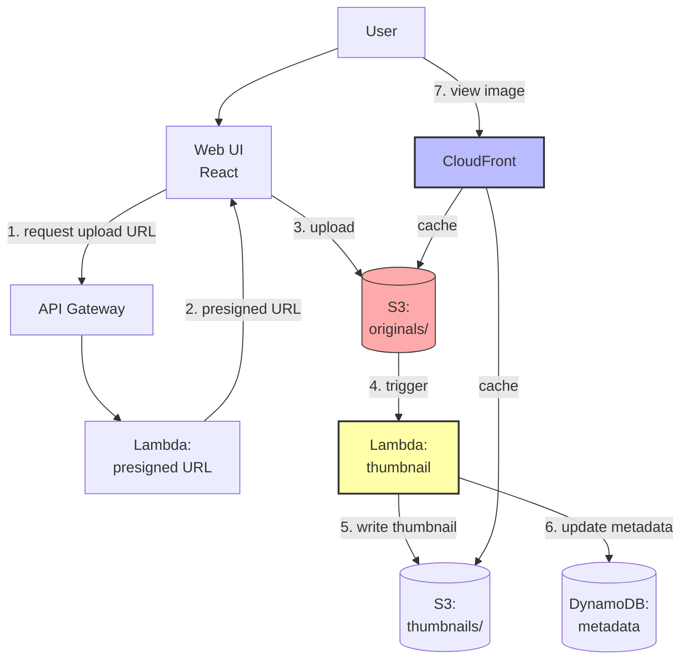

# 2. Project 2 - Image Hosting Platform

> [!info] Chapter Context
> Build an image hosting platform (like Imgur) where users upload images and the platform generates thumbnails, stores metadata, and serves images via CDN.

Related: [[1. Project 1 - Dropbox Clone]] | [[3. Project 3 - URL Shortener]] | [[11 - Serverless Computing/3. Lambda Triggers and Events]]

---

## 1. Project Overview

- Users upload images via a web UI.
- The platform generates thumbnails automatically.
- Images are served via CloudFront (CDN).
- Metadata is stored in DynamoDB.



---

## 2. Components

### 2.1 Two S3 Buckets (or One with Prefixes)

- `originals/` — The uploaded images.
- `thumbnails/` — Auto-generated thumbnails.

### 2.2 Lambda: Generate Thumbnail

Triggered by S3 PUT on `originals/`. Downloads the image, resizes (using Pillow in Python), uploads to `thumbnails/`.

### 2.3 DynamoDB: Metadata

```bash
aws dynamodb create-table --table-name images \
  --attribute-definitions \
    AttributeName=image_id,AttributeType=S \
    AttributeName=user_id,AttributeType=S \
    AttributeName=created_at,AttributeType=S \
  --key-schema AttributeName=image_id,KeyType=HASH \
  --billing-mode PAY_PER_REQUEST \
  --global-secondary-indexes \
    '[{"IndexName":"user-images","KeySchema":[{"AttributeName":"user_id","KeyType":"HASH"},{"AttributeName":"created_at","KeyType":"RANGE"}],"Projection":{"ProjectionType":"ALL"}}]'
```

The GSI lets you query "all images for user X, sorted by date."

### 2.4 CloudFront Distribution

Serves images via CDN. Origins:

- `originals/` bucket.
- `thumbnails/` bucket.

Use OAC (Origin Access Control) to keep the buckets private.

---

## 3. The Thumbnail Lambda

```python
import boto3
import os
import io
from PIL import Image

s3 = boto3.client('s3')
SOURCE_BUCKET = os.environ['SOURCE_BUCKET']
THUMB_BUCKET = os.environ['THUMB_BUCKET']
THUMB_SIZE = (200, 200)

def lambda_handler(event, context):
    for record in event['Records']:
        key = record['s3']['object']['key']
        
        # Download the original
        response = s3.get_object(Bucket=SOURCE_BUCKET, Key=key)
        image_data = response['Body'].read()
        
        # Resize
        with Image.open(io.BytesIO(image_data)) as img:
            img.thumbnail(THUMB_SIZE)
            buffer = io.BytesIO()
            img.save(buffer, format=img.format)
            buffer.seek(0)
        
        # Upload the thumbnail
        thumb_key = key.replace('originals/', 'thumbnails/')
        s3.put_object(Bucket=THUMB_BUCKET, Key=thumb_key, Body=buffer)
```

### 3.1 Lambda Layer for Pillow

Pillow isn't in the Lambda runtime. Either:

- Build a Lambda Layer with Pillow.
- Use a container image with Pillow pre-installed.

```dockerfile
# Dockerfile for the Lambda
FROM public.ecr.aws/lambda/python:3.11
RUN pip install pillow
COPY index.py ${LAMBDA_TASK_ROOT}/
CMD ["index.lambda_handler"]
```

---

## 4. Serving via CloudFront

```bash
aws cloudfront create-distribution \
  --origin-domain-name my-images-originals.s3.us-east-1.amazonaws.com \
  --default-cache-behavior TargetOriginId=originals,ViewerProtocolPolicy=redirect-to-https \
  --enabled
```

Configure a second origin for `thumbnails/` and a cache behavior with a path pattern `thumbnails/*`.

---

## 5. Extensions

- **Image moderation** — Use Rekognition to detect inappropriate content; reject if detected.
- **EXIF metadata extraction** — Store camera info, GPS, etc.
- **Multiple thumbnail sizes** — Generate 100x100, 500x500, 1000x1000.
- **Image format conversion** — Convert to WebP for smaller files.
- **Watermarking** — Add a watermark to originals.
- **Delete on user request** — Delete from both buckets and DynamoDB.

---

## 6. Common Student Mistakes

> [!warning] Mistake 1 — Lambda Memory Too Low
#  Image processing is memory-intensive. Use 1024 MB or more.

> [!warning] Mistake 2 — Forgetting the Lambda Timeout
#  Resizing large images takes time. Set timeout to 30+ seconds.

> [!warning] Mistake 3 — Forgetting to Use a Layer for Pillow
#  Pillow isn't in the Lambda runtime. Use a layer or a container image.

> [!warning] Mistake 4 — No CDN for Serving Images
#  Serving images directly from S3 is slow for distant users. Use CloudFront.

> [!warning] Mistake 5 — Forgetting Idempotency
#  S3 may invoke Lambda multiple times for the same event. Make the function idempotent (check if the thumbnail already exists).

---

## 7. Summary Checklist

- [ ] Architecture: S3 (originals + thumbnails) + Lambda (resize) + DynamoDB (metadata) + CloudFront (CDN).
- [ ] Lambda triggered by S3 PUT on originals/.
- [ ] Use Pillow (via Lambda layer or container image) for image processing.
- [ ] Allocate sufficient memory (1024+ MB) and timeout (30+ seconds).
- [ ] Use CloudFront with OAC for serving images.
- [ ] DynamoDB GSI for "user's images, sorted by date."
- [ ] Make the thumbnail function idempotent.

---

Previous: [[1. Project 1 - Dropbox Clone]] | Next: [[3. Project 3 - URL Shortener]]
