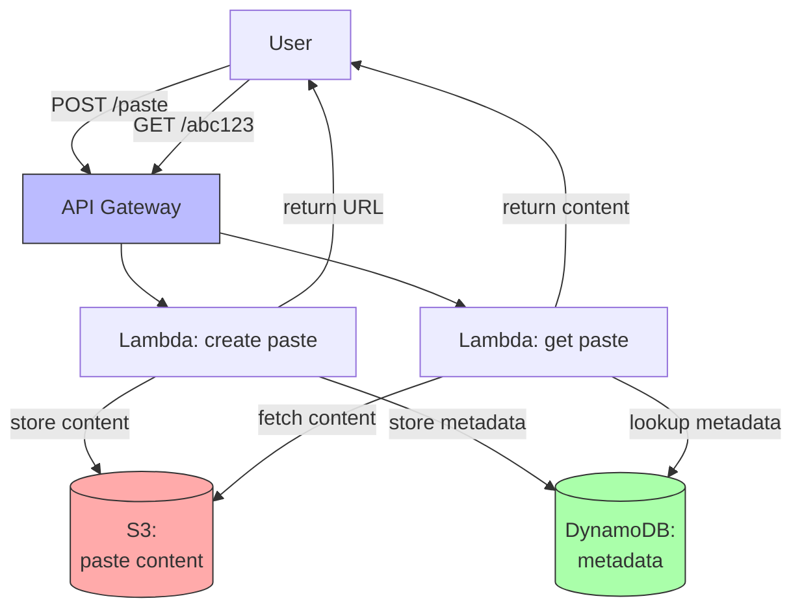

# 4. Project 4 - Pastebin Clone

> [!info] Chapter Context
> Build a Pastebin-style service where users paste text, get a shareable URL, and others can view the paste. Uses API Gateway, Lambda, DynamoDB, and S3 (for large pastes).

Related: [[3. Project 3 - URL Shortener]] | [[5. Project 5 - Event Processing Pipeline]] | [[09 - Databases/3. DynamoDB Fundamentals]]

---

## 1. Project Overview

- User submits text.
- The service returns a URL (e.g., `https://paste.example.com/abc123`).
- Visiting the URL shows the text.
- Optional: expiration, syntax highlighting, password protection.



---

## 2. Storage Design

For small pastes (<1 KB), store the content directly in DynamoDB. For large pastes, store in S3 and keep the S3 key in DynamoDB.

DynamoDB item:

```json
{
  "paste_id": {"S": "abc123"},
  "created_at": {"S": "2024-01-15T10:30:00Z"},
  "expires_at": {"S": "2024-01-22T10:30:00Z"},
  "size": {"N": "1234"},
  "s3_key": {"S": "pastes/abc123"}  // null for small pastes
}
```

For small pastes, add a `content` attribute (under 400 KB total item size).

---

## 3. The Create Lambda

```python
import boto3
import json
import os
import secrets
from datetime import datetime, timedelta

dynamodb = boto3.resource('dynamodb')
s3 = boto3.client('s3')
table = dynamodb.Table(os.environ['TABLE_NAME'])
BUCKET = os.environ.get('BUCKET_NAME')
LARGE_PASTE_THRESHOLD = 1024  # 1 KB

def lambda_handler(event, context):
    body = json.loads(event['body'])
    content = body['content']
    
    paste_id = secrets.token_urlsafe(8)[:8]
    created_at = datetime.utcnow()
    expires_at = created_at + timedelta(days=7)  # 7-day expiration
    
    item = {
        'paste_id': paste_id,
        'created_at': created_at.isoformat(),
        'expires_at': expires_at.isoformat(),
        'size': len(content.encode('utf-8'))
    }
    
    # Store large pastes in S3
    if len(content) > LARGE_PASTE_THRESHOLD and BUCKET:
        s3.put_object(Bucket=BUCKET, Key=f'pastes/{paste_id}', Body=content.encode('utf-8'))
        item['s3_key'] = f'pastes/{paste_id}'
    else:
        item['content'] = content
    
    table.put_item(Item=item)
    
    return {
        'statusCode': 200,
        'body': json.dumps({
            'url': f'https://{event["headers"]["Host"]}/{paste_id}',
            'paste_id': paste_id
        })
    }
```

---

## 4. The Get Lambda

```python
import boto3
import json
import os
from datetime import datetime

dynamodb = boto3.resource('dynamodb')
s3 = boto3.client('s3')
table = dynamodb.Table(os.environ['TABLE_NAME'])
BUCKET = os.environ.get('BUCKET_NAME')

def lambda_handler(event, context):
    paste_id = event['pathParameters']['id']
    
    response = table.get_item(Key={'paste_id': paste_id})
    if 'Item' not in response:
        return {'statusCode': 404, 'body': 'Paste not found'}
    
    item = response['Item']
    
    # Check expiration
    if datetime.fromisoformat(item['expires_at']) < datetime.utcnow():
        return {'statusCode': 410, 'body': 'Paste expired'}
    
    # Get content
    if 's3_key' in item:
        s3_response = s3.get_object(Bucket=BUCKET, Key=item['s3_key'])
        content = s3_response['Body'].read().decode('utf-8')
    else:
        content = item['content']
    
    return {
        'statusCode': 200,
        'body': json.dumps({
            'paste_id': paste_id,
            'content': content,
            'created_at': item['created_at']
        })
    }
```

---

## 5. TTL for Auto-Expiration

DynamoDB supports TTL — items are automatically deleted after the TTL.

```bash
aws dynamodb update-time-to-live --table-name pastes \
  --time-to-live-specification Enabled=true,AttributeName=expires_at
```

Set the `expires_at` attribute as epoch seconds (not ISO string). DynamoDB will delete the item after that time.

---

## 6. Cleanup for S3

DynamoDB TTL deletes the DynamoDB item, but not the S3 object. Use S3 lifecycle rules:

```json
{
  "Rules": [{
    "ID": "Delete old pastes",
    "Status": "Enabled",
    "Filter": {"Prefix": "pastes/"},
    "Expiration": {"Days": 7}
  }]
}
```

Or trigger a Lambda on DynamoDB deletion events (via DynamoDB Streams) to delete the S3 object.

---

## 7. Extensions

- **Syntax highlighting** — Use a library like Prism.js on the frontend.
- **Password protection** — Encrypt the content with a user-provided password.
- **Edit pastes** — Allow the creator to edit (with a separate edit URL).
- **Paste history** — Track revisions.
- **API access** — Allow programmatic paste creation via API key.
- **Anti-spam** — Rate-limit paste creation; detect spam.

---

## 8. Common Student Mistakes

> [!warning] Mistake 1 — Storing Large Content in DynamoDB
#  DynamoDB item max is 400 KB. For larger pastes, use S3.

> [!warning] Mistake 2 — Forgetting TTL
#  Without TTL, pastes accumulate forever. Enable TTL on the `expires_at` attribute.

> [!warning] Mistake 3 — Forgetting S3 Cleanup
#  TTL deletes the DynamoDB item but not the S3 object. Use S3 lifecycle rules or a DynamoDB Streams trigger.

> [!warning] Mistake 4 — No Rate Limiting
#  Without rate limiting, spammers can create millions of pastes. Use API Gateway throttling.

> [!warning] Mistake 5 — Returning 200 for Expired Pastes
#  Return 410 Gone for expired pastes, not 200 with content.

---

## 9. Summary Checklist

- [ ] Architecture: API Gateway + 2 Lambdas + DynamoDB (+ S3 for large pastes).
- [ ] DynamoDB partition key: `paste_id`.
- [ ] Store content in DynamoDB for small pastes; S3 for large.
- [ ] Enable TTL on `expires_at` for auto-deletion.
- [ ] Use S3 lifecycle rules or DynamoDB Streams to clean up S3.
- [ ] Rate-limit creation via API Gateway throttling.
- [ ] Return 410 for expired pastes.

---

Previous: [[3. Project 3 - URL Shortener]] | Next: [[5. Project 5 - Event Processing Pipeline]]
