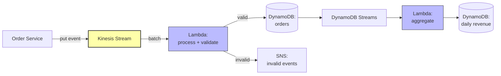

# 5. Project 5 - Event Processing Pipeline

> [!info] Chapter Context
> Build an event processing pipeline: events flow from a producer through Kinesis/DynamoDB Streams, are processed by Lambda, and stored/aggregated. This project brings together event-driven concepts.

Related: [[4. Project 4 - Pastebin Clone]] | [[10 - Event Driven Systems/1. Events and Pub-Sub]] | [[15 - Architecture Patterns/2. Event Driven Architecture]]

---

## 1. Project Overview

Build a real-time event processing pipeline for an e-commerce site:

- Producers emit order events.
- Events flow through Kinesis Data Streams.
- Lambda processes events (validation, enrichment).
- Validated events are stored in DynamoDB.
- An aggregation Lambda updates daily revenue totals.



---

## 2. Components

### 2.1 Kinesis Data Stream

```bash
aws kinesis create-stream --stream-name orders --shard-count 2
```

The producer puts events:

```python
import boto3
import json

kinesis = boto3.client('kinesis')

def emit_order(order):
    kinesis.put_record(
        StreamName='orders',
        Data=json.dumps(order).encode('utf-8'),
        PartitionKey=order['user_id']  # same user → same shard (ordering)
    )
```

### 2.2 Process Lambda

Triggered by Kinesis. Validates events, writes valid ones to DynamoDB, sends invalid ones to SNS.

```python
import boto3
import json
import os
from datetime import datetime

dynamodb = boto3.resource('dynamodb')
sns = boto3.client('sns')
table = dynamodb.Table(os.environ['TABLE_NAME'])
SNS_TOPIC = os.environ['INVALID_TOPIC_ARN']

def lambda_handler(event, context):
    for record in event['Records']:
        # Kinesis data is base64-encoded
        import base64
        data = json.loads(base64.b64decode(record['kinesis']['data']).decode('utf-8'))
        
        # Validate
        if not validate(data):
            sns.publish(
                TopicArn=SNS_TOPIC,
                Message=json.dumps({'invalid_event': data, 'reason': 'validation_failed'})
            )
            continue
        
        # Store
        table.put_item(Item={
            'order_id': data['order_id'],
            'user_id': data['user_id'],
            'amount': data['amount'],
            'created_at': datetime.utcnow().isoformat()
        })

def validate(order):
    return all(k in order for k in ['order_id', 'user_id', 'amount']) and order['amount'] > 0
```

### 2.3 Aggregation Lambda

Triggered by DynamoDB Streams. Updates daily revenue.

```python
import boto3
import os
from datetime import datetime
from decimal import Decimal

dynamodb = boto3.resource('dynamodb')
table = dynamodb.Table(os.environ['AGG_TABLE'])

def lambda_handler(event, context):
    for record in event['Records']:
        if record['eventName'] != 'INSERT':
            continue
        
        new_image = record['dynamodb']['NewImage']
        amount = Decimal(new_image['amount']['N'])
        created_at = new_image['created_at']['S']
        date = created_at[:10]  # YYYY-MM-DD
        
        table.update_item(
            Key={'date': date},
            UpdateExpression='ADD total_revenue :amt, order_count :inc',
            ExpressionAttributeValues={':amt': amount, ':inc': 1}
        )
```

### 2.4 DynamoDB Streams Configuration

Enable streams on the orders table:

```bash
aws dynamodb update-table --table-name orders \
  --stream-specification StreamEnabled=true,StreamViewType=NEW_IMAGE
```

Then create an event source mapping from the stream to the aggregation Lambda.

---

## 3. Event Source Mapping

```bash
# Kinesis → Process Lambda
aws lambda create-event-source-mapping \
  --function-name process-orders \
  --event-source-arn arn:aws:kinesis:us-east-1:123456789012:stream/orders \
  --starting-position LATEST \
  --batch-size 100

# DynamoDB Streams → Aggregation Lambda
aws lambda create-event-source-mapping \
  --function-name aggregate-revenue \
  --event-source-arn arn:aws:dynamodb:us-east-1:123456789012:table/orders/stream/... \
  --starting-position LATEST \
  --batch-size 100
```

---

## 4. Monitoring

Key metrics to watch:

- **Kinesis**: `GetRecords.IteratorAgeMilliseconds` — high value means Lambda is falling behind.
- **Lambda**: `Errors`, `IteratorAge`, `Duration`.
- **DynamoDB**: `ThrottledRequests`, `ConsumedReadCapacityUnits`, `ConsumedWriteCapacityUnits`.

Set alarms:

- IteratorAge > 60 seconds → alert (Lambda is behind).
- Lambda errors > 0 → alert.
- DynamoDB throttles > 0 → alert (need more capacity).

---

## 5. Error Handling

### 5.1 Invalid Events

Send invalid events to an SNS topic (or an SQS DLQ). A human or another process can inspect them.

### 5.2 Lambda Failures

For Kinesis triggers, if the Lambda fails, the batch is retried. After `MaximumRetryAttempts`, the batch goes to a DLQ (if configured) or is discarded.

For DynamoDB Streams, similar behavior. Use `ReportBatchItemFailures` for partial failures.

### 5.3 Poison Messages

If a single bad message causes the whole batch to fail forever, use `ReportBatchItemFailures` to skip it (or move to DLQ).

---

## 6. Scaling

### 6.1 Kinesis Shards

Each shard can handle:

- 1 MB/second input.
- 2 MB/second output.
- 1,000 records/second.

If you need more, add shards. Lambda scales to match (one concurrent invocation per shard).

### 6.2 Lambda Concurrency

For Kinesis triggers, Lambda runs one invocation per shard per batch. To increase parallelism, increase the batch size or the number of shards.

### 6.3 DynamoDB Capacity

If using provisioned capacity, monitor `ConsumedWriteCapacityUnits` and scale up if throttled.

---

## 7. Extensions

- **Real-time analytics dashboard** — Build a dashboard showing daily revenue, top products, etc.
- **Anomaly detection** — Detect unusual spikes in orders.
- **Multi-stage pipeline** — Add an enrichment stage (lookup user details from another service) before storage.
- **Cross-region replication** — Replicate the Kinesis stream to another region for DR.
- **Long-term storage** — Archive events to S3 (via Kinesis Firehose) for compliance.

---

## 8. Common Student Mistakes

> [!warning] Mistake 1 — Forgetting to Base64-Decode Kinesis Data
#  Kinesis records are base64-encoded. Decode before parsing JSON.

> [!warning] Mistake 2 — Not Handling Batch Failures
#  A single bad record in a batch can cause the whole batch to be retried forever. Use `ReportBatchItemFailures`.

> [!warning] Mistake 3 — No Monitoring of IteratorAge
#  If `IteratorAge` grows, Lambda is falling behind. Set an alarm.

> [!warning] Mistake 4 — Using the Wrong Partition Key
#  The partition key determines which shard a record goes to. If you use a low-cardinality key (e.g., "orders"), all records go to one shard (hot shard). Use a high-cardinality key (e.g., user_id).

> [!warning] Mistake 5 — Forgetting Idempotency
#  Lambda may process the same record twice (retries). Make your processing idempotent.

> [!warning] Mistake 6 — No DLQ for Invalid Events
#  Without a DLQ, invalid events are lost. Send them to SNS or SQS for inspection.

---

## 9. Summary Checklist

- [ ] Architecture: Producer → Kinesis → Process Lambda → DynamoDB → DynamoDB Streams → Aggregation Lambda → Aggregation DynamoDB.
- [ ] Use Kinesis partition key for shard distribution (high-cardinality like user_id).
- [ ] Lambda processes batches; use `ReportBatchItemFailures` for partial failures.
- [ ] Send invalid events to SNS/SQS for inspection.
- [ ] Monitor `IteratorAge` (Lambda falling behind).
- [ ] Set alarms on errors, throttles, iterator age.
- [ ] Make processing idempotent.

---

Previous: [[4. Project 4 - Pastebin Clone]] | Next: [[17 - Interview Preparation/1. AWS Interview Questions]]
