# AWS Through LocalStack — Obsidian Vault

> [!info] About This Vault
> This vault is a comprehensive, polished, and exhaustive learning resource for cloud engineering, built around the philosophy of **learning cloud concepts through local tools**. It contains 130 detailed notes (~190,000 words) covering everything from Linux and Docker fundamentals to advanced AWS architecture patterns, serverless, Kubernetes, and interview preparation.

---

## Vault Overview

```mermaid
graph TD
    Root["AWS Through LocalStack Vault<br/>130 notes / ~190K words"]
    Root --> Foundations["00 - Foundations<br/>(5 notes)"]
    Root --> AWSFund["01 - AWS Fundamentals<br/>(5 notes)"]
    Root --> CLI["02 - AWS CLI and SDKs<br/>(4 notes)"]
    Root --> Docker["03 - Docker<br/>(27 notes)"]
    Root --> Linux["04 - Linux<br/>(29 notes)"]
    Root --> K8s["05 - Kubernetes<br/>(6 notes)"]
    Root --> LocalStack["06 - LocalStack<br/>(4 notes)"]
    Root --> IAM["07 - Identity and Security<br/>(5 notes)"]
    Root --> S3["08 - Object Storage<br/>(4 notes)"]
    Root --> DBs["09 - Databases<br/>(4 notes)"]
    Root --> Events["10 - Event Driven Systems<br/>(4 notes)"]
    Root --> Serverless["11 - Serverless Computing<br/>(5 notes)"]
    Root --> Networking["12 - AWS Networking<br/>(4 notes)"]
    Root --> Monitoring["13 - Monitoring and Observability<br/>(4 notes)"]
    Root --> IaC["14 - Infrastructure as Code<br/>(4 notes)"]
    Root --> Arch["15 - Architecture Patterns<br/>(5 notes)"]
    Root --> Projects["16 - Projects<br/>(5 notes)"]
    Root --> Interview["17 - Interview Preparation<br/>(3 notes)"]
    Root --> Resources["Resources<br/>(3 notes)"]

    style Root fill:#bbf,stroke:#333,stroke-width:3px
    style Docker fill:#afa,stroke:#333,stroke-width:2px
    style Linux fill:#afa,stroke:#333,stroke-width:2px
```

---

## 00 - Foundations (5 notes)

1. [[00 - Foundations/1. Cloud Computing Fundamentals]] — IaaS/PaaS/SaaS, CapEx vs. OpEx, shared responsibility.
2. [[00 - Foundations/2. Distributed Systems Basics]] — CAP theorem, consistency, latency, 8 fallacies.
3. [[00 - Foundations/3. HTTP and REST APIs]] — Methods, status codes, headers, REST principles.
4. [[00 - Foundations/4. DNS and TLS]] — DNS hierarchy, TLS handshake, certificates, ACM.
5. [[00 - Foundations/5. Authentication and Authorization Concepts]] — Passwords, MFA, JWT, OAuth, OIDC, SAML.

---

## 01 - AWS Fundamentals (5 notes)

1. [[01 - AWS Fundamentals/1. What Is AWS]] — Service categories, AWS history, the foundational services.
2. [[01 - AWS Fundamentals/2. AWS Global Infrastructure]] — Regions, AZs, edge locations.
3. [[01 - AWS Fundamentals/3. Regions and Availability Zones]] — Choosing regions, multi-AZ design patterns.
4. [[01 - AWS Fundamentals/4. The Shared Responsibility Model]] — What AWS manages vs. what you manage.
5. [[01 - AWS Fundamentals/5. AWS Pricing and Cost Management]] — On-demand, RI, Savings Plans, Spot; billing alarms.

---

## 02 - AWS CLI and SDKs (4 notes)

1. [[02 - AWS CLI and SDKs/1. The AWS CLI]] — Installation, configuration, profiles, common commands.
2. [[02 - AWS CLI and SDKs/2. Boto3 and AWS SDKs]] — Python SDK, clients vs. resources, pagination, error handling.
3. [[02 - AWS CLI and SDKs/3. Credentials and Profiles]] — Credential types, IAM roles, environment variables, multiple accounts.
4. [[02 - AWS CLI and SDKs/4. AWS CLI Best Practices]] — Scripting, output parsing, error handling, security.

---

## 03 - Docker (27 notes)

The Docker chapter starts from "what is a container?" and progresses through installation, images, layers, Dockerfiles, container management, networking, Compose, security, registries, and debugging. Includes 3 detailed quizzes.

### Foundations

1. [[03 - Docker/1. What is Docker]] — The "Works on My Machine" problem, containers vs. VMs.
2. [[03 - Docker/1.1 Container Isolation Internals]] — Namespaces, cgroups, overlay2, capabilities, seccomp.
3. [[03 - Docker/2. Installing Docker]] — Mac, Windows (WSL 2), Linux install.
4. [[03 - Docker/2.1 Docker Engine vs Docker Desktop]] — When to use each, contexts.

### Images and Layers

5. [[03 - Docker/3. Images and Containers]] — Image vs. container, immutability, the writable layer.
6. [[03 - Docker/3.1 Image Layers and Storage Drivers]] — Layers, content-addressable storage, overlay2 internals, copy-on-write.
7. [[03 - Docker/3.2 Volumes and Bind Mounts]] — Named volumes, bind mounts, tmpfs, permission hell.

### Dockerfiles

8. [[03 - Docker/4. The Dockerfile]] — Every instruction, layer caching, RUN vs. CMD vs. ENTRYPOINT.
9. [[03 - Docker/4.1 The .dockerignore File]] — What to ignore, the node_modules trap.
10. [[03 - Docker/4.2 Multi-Stage Builds]] — Smaller images by separating build and runtime stages.
11. [[03 - Docker/4.3 Dockerfile Best Practices]] — The production-ready checklist.

### Container Management

12. [[03 - Docker/5. Container Lifecycle and Management]] — States, run/start/stop/kill/rm.
13. [[03 - Docker/5.1 Interacting with Containers Exec]] — docker exec, the -it flags, standard streams.
14. [[03 - Docker/5.2 Port Mapping and Environment Variables]] — -p HOST:CONTAINER, EXPOSE vs -p.
15. [[03 - Docker/5.3 Resource Limits and Health Checks]] — --memory, --cpus, HEALTHCHECK, exit code 137.
16. [[03 - Docker/5.4 Logging and Log Drivers]] — json-file, local, syslog, awslogs, log rotation.

### Networking

17. [[03 - Docker/6. Docker Networking]] — bridge, host, none, overlay drivers.
18. [[03 - Docker/6.1 Custom Networks and DNS]] — User-defined bridges, DNS at 127.0.0.11.

### Docker Compose

19. [[03 - Docker/7. Docker Compose]] — The docker-compose.yml, services, networks, volumes.
20. [[03 - Docker/7.1 Compose Files in Depth]] — Multiple files, env_file vs environment, secrets, watch mode.
21. [[03 - Docker/7.2 Compose Commands and Profiles]] — All Compose CLI commands, profiles, scaling.

### Security and Distribution

22. [[03 - Docker/8. Docker Security]] — Non-root users, capabilities, seccomp, AppArmor, user namespaces.
23. [[03 - Docker/9. Registries and Distribution]] — Docker Hub, ECR, GCR, GHCR, OCI artifacts, Cosign.
24. [[03 - Docker/10. Debugging and Troubleshooting]] — Exit codes, logs, inspect, debugging workflow.

### Quizzes

25. [[03 - Docker/Quizzes/Quiz 1 - Containers and Virtualization]]
26. [[03 - Docker/Quizzes/Quiz 2 - Dockerfile and Volumes]]
27. [[03 - Docker/Quizzes/Quiz 3 - Networking and Compose]]

---

## 04 - Linux (29 notes)

The Linux chapter is organized into 8 sub-sections, covering everything from the filesystem hierarchy to advanced shell scripting, plus 2 quizzes.

### 01 - Installing Apps

1. [[04 - Linux/01 - Installing Apps/1. Linux Overview and Distributions]]
2. [[04 - Linux/01 - Installing Apps/2. The Linux Kernel and User Space]]
3. [[04 - Linux/01 - Installing Apps/3. The Filesystem Hierarchy Standard]]
4. [[04 - Linux/01 - Installing Apps/4. Ways to Install Apps in Linux]]
5. [[04 - Linux/01 - Installing Apps/5. APT and dpkg]]
6. [[04 - Linux/01 - Installing Apps/6. .deb Files]]
7. [[04 - Linux/01 - Installing Apps/7. .tar.gz Files and Manual Installation]]
8. [[04 - Linux/01 - Installing Apps/8. AppImage, Snap, and Flatpak]]

### 02 - File System and Permissions

9. [[04 - Linux/02 - File System and Permissions/1. Paths, Inodes, and Links]]
10. [[04 - Linux/02 - File System and Permissions/2. Permissions and Ownership]]
11. [[04 - Linux/02 - File System and Permissions/3. Special Permission Bits]]

### 03 - Processes and Services

12. [[04 - Linux/03 - Processes and Services/1. Processes and the Process Tree]]
13. [[04 - Linux/03 - Processes and Services/2. Signals and Job Control]]
14. [[04 - Linux/03 - Processes and Services/3. systemd and journalctl]]
15. [[04 - Linux/03 - Processes and Services/4. nice and renice]]

### 04 - Shell and Text Tools

16. [[04 - Linux/04 - Shell and Text Tools/1. The Shell and Bash Basics]]
17. [[04 - Linux/04 - Shell and Text Tools/2. Pipelines and Redirection]]
18. [[04 - Linux/04 - Shell and Text Tools/3. tar and Archive Tools]]
19. [[04 - Linux/04 - Shell and Text Tools/4. grep, sed, and awk]]
20. [[04 - Linux/04 - Shell and Text Tools/5. find and locate]]
21. [[04 - Linux/04 - Shell and Text Tools/6. vim and nano Editors]]

### 05 - Users and Security

22. [[04 - Linux/05 - Users and Security/1. Users and Groups]]
23. [[04 - Linux/05 - Users and Security/2. sudo and Privilege Escalation]]
24. [[04 - Linux/05 - Users and Security/3. SSH and Key Management]]

### 06 - Networking

25. [[04 - Linux/06 - Networking/1. Networking Fundamentals]]

### 07 - Disk and Storage

26. [[04 - Linux/07 - Disk and Storage/1. Disk Usage and Filesystems]]

### 08 - Automation

27. [[04 - Linux/08 - Automation/1. Cron and systemd Timers]]

### Quizzes

28. [[04 - Linux/Quizzes/Quiz 1 - Fundamentals]]
29. [[04 - Linux/Quizzes/Quiz 2 - Processes and Shell]]

---

## 05 - Kubernetes (6 notes)

1. [[05 - Kubernetes/1. What Is Kubernetes]] — Why K8s exists, core concepts (Pods, Deployments, Services).
2. [[05 - Kubernetes/2. Kubernetes Architecture]] — Control plane, worker nodes, etcd, reconciliation loops.
3. [[05 - Kubernetes/3. Pods, Deployments, and Services]] — YAML, resource requests, probes, rolling updates.
4. [[05 - Kubernetes/4. ConfigMaps, Secrets, and Storage]] — ConfigMaps, Secrets, PersistentVolumes, StatefulSets.
5. [[05 - Kubernetes/5. EKS and Managed Kubernetes]] — EKS architecture, the AWS Load Balancer Controller, Fargate, Karpenter.
6. [[05 - Kubernetes/6. Helm and Package Management]] — Charts, values, templates, OCI registries.

---

## 06 - LocalStack (4 notes)

1. [[06 - LocalStack/1. Installing LocalStack]] — Docker setup, CLI configuration, what works.
2. [[06 - LocalStack/2. LocalStack Architecture]] — Single endpoint, per-service emulators, persistence.
3. [[06 - LocalStack/3. LocalStack vs AWS]] — When to use each, the hybrid workflow.
4. [[06 - LocalStack/4. LocalStack Projects and Patterns]] — Project structure, seed scripts, CI integration.

---

## 07 - Identity and Security (5 notes)

1. [[07 - Identity and Security/1. IAM Overview]] — Users, groups, roles, policies, the evaluation logic.
2. [[07 - Identity and Security/2. IAM Users, Groups, and Roles]] — Creating and managing IAM entities; cross-account access.
3. [[07 - Identity and Security/3. IAM Policies]] — Policy structure, common patterns, conditions, variables.
4. [[07 - Identity and Security/4. STS and Temporary Credentials]] — AssumeRole, GetSessionToken, EC2/Lambda credential flow, OIDC federation.
5. [[07 - Identity and Security/5. Secrets Management in AWS]] — Secrets Manager, Parameter Store, KMS.

---

## 08 - Object Storage (4 notes)

1. [[08 - Object Storage/1. S3 Fundamentals]] — Buckets, objects, storage classes, versioning, lifecycle.
2. [[08 - Object Storage/2. S3 Operations and CLI]] — Multipart uploads, presigned URLs, sync, replication.
3. [[08 - Object Storage/3. S3 Permissions and Security]] — Bucket policies, Block Public Access, encryption, logging.
4. [[08 - Object Storage/4. Presigned URLs and Static Website Hosting]] — Presigned URLs, S3+CloudFront for static sites.

---

## 09 - Databases (4 notes)

1. [[09 - Databases/1. Database Fundamentals]] — SQL vs. NoSQL, ACID vs. BASE, access patterns.
2. [[09 - Databases/2. RDS and Relational Databases]] — Managed SQL, Multi-AZ, read replicas, Aurora, RDS Proxy.
3. [[09 - Databases/3. DynamoDB Fundamentals]] — Tables, partition keys, GSIs, Query vs. Scan, streams.
4. [[09 - Databases/4. ElastiCache and In-Memory Stores]] — Redis vs. Memcached, caching patterns, eviction policies.

---

## 10 - Event Driven Systems (4 notes)

1. [[10 - Event Driven Systems/1. Events and Pub-Sub]] — Events, pub-sub, event sourcing, AWS building blocks.
2. [[10 - Event Driven Systems/2. SNS Fundamentals]] — Topics, subscriptions, fan-out, message filtering.
3. [[10 - Event Driven Systems/3. SQS Fundamentals]] — Standard vs. FIFO, visibility timeout, long polling.
4. [[10 - Event Driven Systems/4. Dead Letter Queues and Fan-Out]] — DLQs, SNS+SQS fan-out pattern.

---

## 11 - Serverless Computing (5 notes)

1. [[11 - Serverless Computing/1. Serverless Concepts]] — What serverless is, when to use it, cost model, cold starts.
2. [[11 - Serverless Computing/2. Lambda Fundamentals]] — Programming model, deployment, execution environment.
3. [[11 - Serverless Computing/3. Lambda Triggers and Events]] — S3, DynamoDB Streams, SQS, SNS, EventBridge triggers.
4. [[11 - Serverless Computing/4. API Gateway]] — REST/HTTP/WebSocket APIs, Lambda proxy integration, auth.
5. [[11 - Serverless Computing/5. Step Functions]] — State machines, state types, Standard vs. Express workflows.

---

## 12 - AWS Networking (4 notes)

1. [[12 - AWS Networking/1. VPC Fundamentals]] — VPC, subnets, route tables, IGW, NAT, security groups, NACLs.
2. [[12 - AWS Networking/2. Subnets, Route Tables, and NAT]] — Three-tier VPC, route table patterns, NAT placement, VPC endpoints.
3. [[12 - AWS Networking/3. DNS and Route 53]] — Hosted zones, record types, Alias vs. CNAME, routing policies, health checks.
4. [[12 - AWS Networking/4. Load Balancers and CloudFront]] — ALB, NLB, GWLB, CLB; CloudFront CDN; Lambda@Edge.

---

## 13 - Monitoring and Observability (4 notes)

1. [[13 - Monitoring and Observability/1. Logging]] — CloudWatch Logs, log groups, streams, Insights, metric filters.
2. [[13 - Monitoring and Observability/2. Metrics and Alarms]] — Standard metrics, custom metrics, alarms, anomaly detection.
3. [[13 - Monitoring and Observability/3. Tracing with X-Ray]] — Distributed tracing, segments, subsegments, sampling.
4. [[13 - Monitoring and Observability/4. SNS Notifications and Alerting]] — Alerting pipeline, Slack/PagerDuty integration.

---

## 14 - Infrastructure as Code (4 notes)

1. [[14 - Infrastructure as Code/1. IaC Fundamentals]] — Why IaC, major tools, declarative vs. imperative, state.
2. [[14 - Infrastructure as Code/2. Terraform Fundamentals]] — Syntax, providers, resources, variables, modules.
3. [[14 - Infrastructure as Code/3. AWS CDK]] — TypeScript/Python IaC; L1/L2/L3 constructs; CDK vs. Terraform.
4. [[14 - Infrastructure as Code/4. CloudFormation]] — Native AWS IaC; templates, stacks, StackSets, drift detection.

---

## 15 - Architecture Patterns (5 notes)

1. [[15 - Architecture Patterns/1. Microservices]] — Monolith vs. microservices, service boundaries, communication.
2. [[15 - Architecture Patterns/2. Event Driven Architecture]] — EDA patterns, schema management, idempotency.
3. [[15 - Architecture Patterns/3. Saga Pattern]] — Multi-service transactions; choreography vs. orchestration.
4. [[15 - Architecture Patterns/4. CQRS]] — Separating read and write models; event sourcing.
5. [[15 - Architecture Patterns/5. Serverless Patterns]] — Common serverless architectures.

---

## 16 - Projects (5 notes)

1. [[16 - Projects/1. Project 1 - Dropbox Clone]] — File storage with S3, presigned URLs, DynamoDB, Lambda.
2. [[16 - Projects/2. Project 2 - Image Hosting Platform]] — S3 + Lambda thumbnails + CloudFront CDN.
3. [[16 - Projects/3. Project 3 - URL Shortener]] — API Gateway + Lambda + DynamoDB; key-based modeling.
4. [[16 - Projects/4. Project 4 - Pastebin Clone]] — Text paste service with TTL and S3 for large pastes.
5. [[16 - Projects/5. Project 5 - Event Processing Pipeline]] — Kinesis + Lambda + DynamoDB Streams + aggregation.

---

## 17 - Interview Preparation (3 notes)

1. [[17 - Interview Preparation/1. AWS Interview Questions]] — 25+ common questions with model answers.
2. [[17 - Interview Preparation/2. System Design Questions]] — The 5-step framework; URL shortener, Twitter, chat app, rate limiter.
3. [[17 - Interview Preparation/3. Scenario Based Questions]] — Real-world scenarios (slow DB, public bucket, cost spike, multi-region DR).

---

## Resources (3 notes)

1. [[Resources/1. Cheat Sheets]] — One-liner service descriptions, CLI command cheat sheets, limits, ports, IP ranges.
2. [[Resources/2. CLI Examples]] — Practical CLI patterns for S3, EC2, IAM, DynamoDB, Lambda, CloudWatch, Cost.
3. [[Resources/3. AWS Service Reference]] — Comprehensive service catalog organized by category.

---

## How to Use This Vault

### If You Are Learning from Scratch

Read in order:
1. **Foundations** (00) — Get the conceptual foundation.
2. **Linux** (04) — Master the OS that runs everything.
3. **Docker** (03) — Master containers.
4. **AWS Fundamentals + CLI** (01, 02) — Learn the AWS mental model.
5. **LocalStack** (06) — Set up your local AWS.
6. **Identity and Security** (07) — IAM is foundational.
7. **Object Storage, Databases, Event-Driven, Serverless, Networking, Monitoring** (08-13) — Core AWS services.
8. **Kubernetes** (05) — Container orchestration.
9. **IaC, Architecture Patterns** (14, 15) — Production-grade engineering.
10. **Projects** (16) — Apply what you learned.
11. **Interview Prep** (17) — Prepare for interviews.

### If You Are Reviewing

Use the wikilinks (`[[like this]]`) to jump between related notes. Every note has `Previous:` / `Next:` navigation at the bottom and a `Related:` section.

### If You Are Preparing for an Interview

The quizzes (in Docker and Linux chapters) and the Interview Preparation chapter are designed to surface common interview questions with model answers and reasoning.

---

## Conventions Used in This Vault

- **Numbered file names**: `1. What is Docker.md`, `1.1 Container Isolation Internals.md`. No underscores.
- **Numbered section headings**: `## 1. Background`, `## 2. How It Works`.
- **Obsidian callouts**: `> [!info]`, `> [!note]`, `> [!warning]`, `> [!tip]`, `> [!danger]`, `> [!example]`, `> [!question]`, `> [!success]`.
- **Mermaid diagrams only**: No ASCII art, no box-drawing characters.
- **Long-form content**: Every note is 800-2500 words. No shallow paragraphs. Each section has substantive content.
- **Practical examples**: Real `bash`, `dockerfile`, `yaml`, `python`, and `hcl` code blocks.
- **Tips and common mistakes**: Callouts for "what students often miss."
- **Navigation**: `Previous:` / `Next:` / `Related:` wikilinks at the bottom of every note.

---

## Vault Statistics

| Chapter | Notes |
| :--- | :--- |
| 00 - Foundations | 5 |
| 01 - AWS Fundamentals | 5 |
| 02 - AWS CLI and SDKs | 4 |
| 03 - Docker | 27 |
| 04 - Linux | 29 |
| 05 - Kubernetes | 6 |
| 06 - LocalStack | 4 |
| 07 - Identity and Security | 5 |
| 08 - Object Storage | 4 |
| 09 - Databases | 4 |
| 10 - Event Driven Systems | 4 |
| 11 - Serverless Computing | 5 |
| 12 - AWS Networking | 4 |
| 13 - Monitoring and Observability | 4 |
| 14 - Infrastructure as Code | 4 |
| 15 - Architecture Patterns | 5 |
| 16 - Projects | 5 |
| 17 - Interview Preparation | 3 |
| Resources | 3 |
| **Total** | **130** |

- **Total word count**: ~190,000 words.
- **Files with Mermaid diagrams**: 73.
- **All 130 files** use Obsidian callouts.

---

## The Most Important Mindset

Don't think:

> "I am learning LocalStack."

Think:

> "I am learning:
> - Object Storage
> - Event Systems
> - Queues
> - IAM
> - Serverless
> - Distributed Systems"

AWS is mostly a collection of these concepts packaged as managed services. If you understand the concepts deeply, switching from LocalStack to real AWS is mostly a matter of changing configuration and deployment targets.
