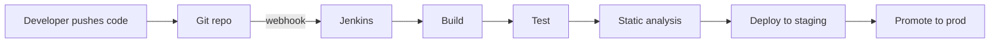
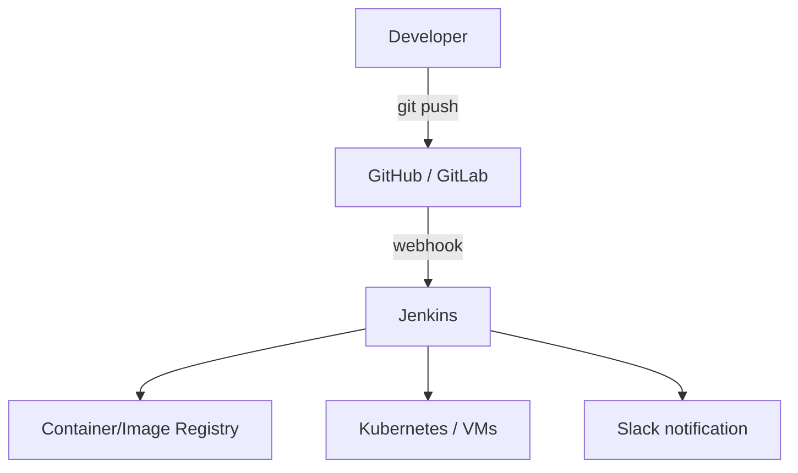

# What is Jenkins?

> [!summary] TL;DR
> **Jenkins** is an open-source automation server used to build, test, and deploy software — the de facto engine of CI/CD pipelines for over a decade.

## Definition

Jenkins is a **self-contained, Java-based automation server** that runs as a daemon on a server (or in a container). You define **jobs** (also called "projects") that Jenkins executes: pulling source code, running tests, building artifacts, and deploying them. Plugins extend Jenkins to talk to virtually any tool in the DevOps ecosystem.

Originally forked from Hudson in 2011, Jenkins is now governed by the CD Foundation and remains one of the most widely used CI/CD tools in the world.

## What It Does

## Key Capabilities

| Capability                | Description                                                              |
| ------------------------- | ------------------------------------------------------------------------ |
| **Continuous Integration**| Auto-trigger builds & tests on every commit.                             |
| **Continuous Delivery**   | Package and stage artifacts for release.                                 |
| **Continuous Deployment** | Auto-deploy to production after green builds.                            |
| **Pipeline as Code**      | Define pipelines in a `Jenkinsfile` committed to your repo.              |
| **Distributed builds**    | Run jobs across multiple [[Jenkins Architecture\|agents]].               |
| **Extensible**            | 1,800+ plugins for Git, Docker, Kubernetes, AWS, Slack, SonarQube, etc.  |
| **Notifications**         | Email, Slack, Teams, webhooks.                                           |

## Where Jenkins Fits

## Alternatives (Context)

| Tool          | Style                                    |
| ------------- | ---------------------------------------- |
| Jenkins       | Self-hosted, plugin-driven, very flexible. |
| GitHub Actions| Native to GitHub, YAML-based, hosted.    |
| GitLab CI     | Built into GitLab, YAML-based.           |
| CircleCI      | Cloud-first, fast, container-based.      |
| Tekton        | Kubernetes-native, CRD-driven.           |
| Argo Workflows| Kubernetes-native workflows.             |

> [!note] Why Jenkins still matters
> Many enterprises have years of investment in Jenkins pipelines and plugins. It's also fully self-hosted — useful when regulatory or security constraints prevent SaaS CI/CD.

## Related Notes
- [[Why Jenkins]] · [[Jenkins Architecture]] · [[Installation and Setup]] · [[Common Terminology]]
