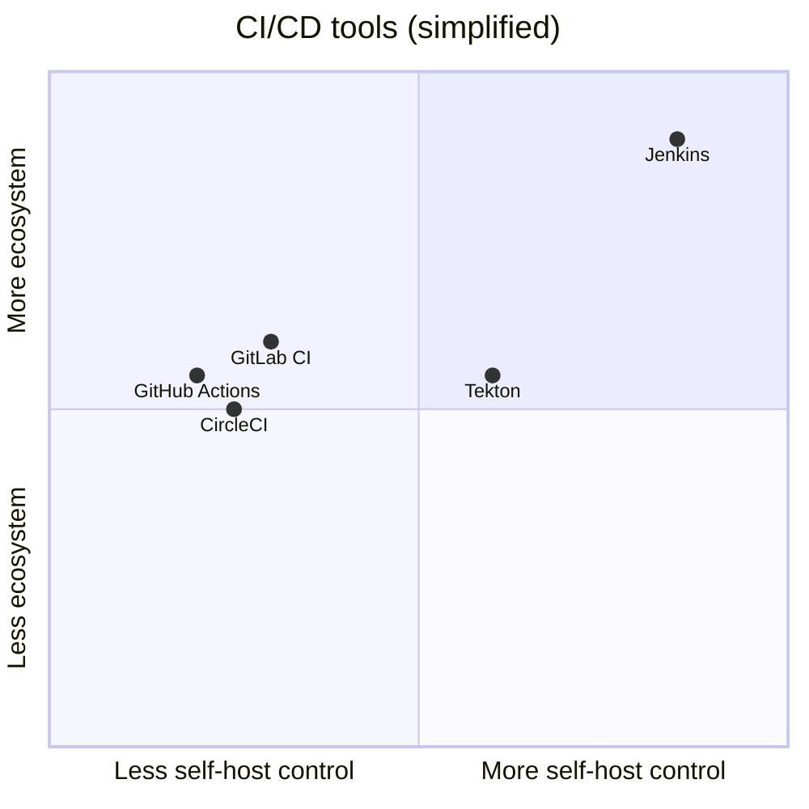

# Why Jenkins

> [!summary] TL;DR
> Jenkins is used because it's free, extensible, runs anywhere Java runs, and has the largest CI/CD plugin ecosystem on earth — making it ideal for teams that need full control.

## The Problems Jenkins Solves

| Problem without CI/CD                       | How Jenkins helps                                |
| ------------------------------------------- | ------------------------------------------------ |
| "Works on my machine"                       | Reproducible build environments.                 |
| Manual testing = bugs slip through          | Auto-run test suite on every commit.             |
| Releases are scary, manual, error-prone     | Push-button or fully automated deploy pipeline.  |
| Hard to coordinate multi-step workflows     | [[Pipelines]] with [[Stages and Steps\|stages]]. |
| Many tools, no glue                         | Plugins connect Git, Docker, K8s, AWS, etc.      |
| No audit trail for builds/deployments       | Every run is logged & archived.                  |

## Why Teams Pick Jenkins

- **Open source & free** — no per-seat licensing.
- **Self-hosted** — full control over data, network, and security.
- **Massive plugin ecosystem** — 1,800+ plugins cover almost any tool.
- **Pipeline as Code** — version-controlled `Jenkinsfile`.
- **Distributed** — scale horizontally by adding agents.
- **Mature** — battle-tested for 15+ years; lots of community knowledge.

## Why Teams Move Away From Jenkins

Be honest about the trade-offs:

-  **Maintenance burden** — upgrades, plugin conflicts, JVM tuning.
-  **Plugin fragility** — plugins can break each other after upgrades.
-  **UI-driven legacy** — many old jobs live only in the UI, not in Git.
-  **Not cloud-native** — modern alternatives (GitHub Actions, GitLab CI, Tekton) feel more "Kubernetes-native".

## When Jenkins Is a Good Fit

-  You need full self-hosting (regulatory / security).
-  You have many legacy plugin-based workflows.
-  You want to script complex custom logic in Groovy.
-  You have a platform team to maintain it.

## When to Consider Alternatives

-  Your repo lives on GitHub/GitLab and you want zero infrastructure.
-  Your team is small and you don't want to babysit a CI server.
-  You're starting fresh with no legacy Jenkins investment.

## Related Notes
- [[What is Jenkins]] · [[Best Practices for Beginners]] · [[Installation and Setup]]
