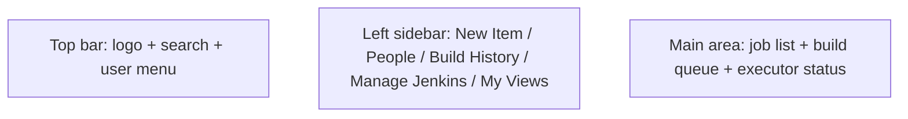
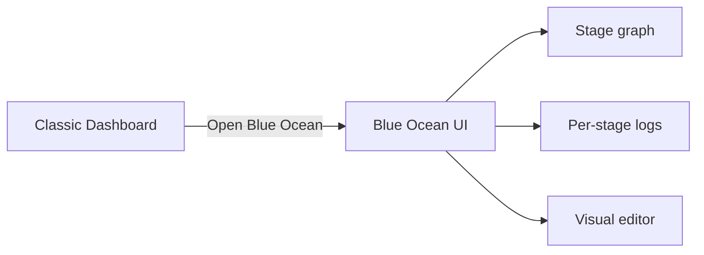

# Dashboard Overview

> [!summary] TL;DR
> The Jenkins dashboard is your control center — lists of jobs, build status, and links to management screens.

## Layout

## Main Sections

| Section              | What it shows                                                  |
| -------------------- | -------------------------------------------------------------- |
| **Build Queue**      | Builds waiting for an executor.                                |
| **Build Executor Status** | Per-agent executors and the build currently running.      |
| **Job List**         | All jobs in this view (folder, name, last build, status).     |
| **My Views**         | Personal filtered views of jobs.                              |

## Top-Level Menu Items

| Item              | Purpose                                                                 |
| ----------------- | ----------------------------------------------------------------------- |
| **New Item**      | Create a new job/folder/pipeline.                                       |
| **People**        | List of users.                                                          |
| **Build History** | Recent builds across all jobs.                                          |
| **Manage Jenkins** | Global configuration: security, plugins, tools, nodes, system info.    |
| **My Views**      | Create or switch to a custom view (e.g. only your team's jobs).         |

## Job Status Icons

| Icon | Meaning                  |
| ---- | ------------------------ |
|  / Blue | Last build succeeded.   |
|  / Red  | Last build failed.      |
|  / Yellow | Last build unstable (tests failed but build succeeded). |
|  / Grey | Build pending or disabled. |

> [!note] Blue = success?
> Historically Jenkins used **blue** for success. You can switch to green via the **Green Balls** plugin (or use Blue Ocean for a modern look).

## Manage Jenkins — Most Used Screens

- **System** — global config (URL, executors, environment vars).
- **Plugins** — install / update / uninstall.
- **Tools** — JDK, Git, Maven, Node auto-installations.
- **Credentials** — manage secrets (see [[Managing Credentials]]).
- **Nodes** — manage agents (see [[Jenkins Architecture]]).
- **Users** — accounts.
- **System Information** — JVM properties, env vars.
- **System Log** — Jenkins internal logs.

## Views

Create a view to filter jobs:

1. Click **+** next to the tab bar.
2. Choose **List View** or **My View**.
3. Use a regex or pick jobs to include.

Useful for grouping jobs by team or environment.

## Blue Ocean (Modern UI)

If installed, open it via **Open Blue Ocean** in the sidebar. It gives:

- Visual pipeline editor.
- Cleaner logs view.
- Per-stage status graph.

## Related Notes
- [[Installation and Setup]] · [[Jenkins Architecture]] · [[Jobs]] · [[Plugins]]
