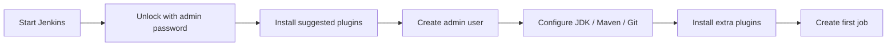

# Installation and Setup

> [!summary] TL;DR
> Easiest way to start: run Jenkins in Docker. For production, install via OS package manager or Helm chart on Kubernetes.

## Option 1 — Docker (Recommended for Learning)

```bash
docker run -d \
  --name jenkins \
  -p 8080:8080 -p 50000:50000 \
  -v jenkins_home:/var/jenkins_home \
  --restart unless-stopped \
  jenkins/jenkins:lts
```

Then:
1. Open <http://localhost:8080>.
2. Get the initial admin password:
   ```bash
   docker exec jenkins cat /var/jenkins_home/secrets/initialAdminPassword
   ```
3. Paste it, then click **Install suggested plugins**.
4. Create your first admin user.
5. Done — you're on the [[Dashboard Overview]].

> [!tip] Ports
> - **8080** — Web UI.
> - **50000** — Agent communication (JNLP). Only needed if you connect agents.

## Option 2 — Linux Package (Production-style)

```bash
# Debian/Ubuntu
sudo apt update
sudo apt install -y openjdk-17-jre
curl -fsSL https://pkg.jenkins.io/debian-stable/jenkins.io-2023.key | \
  sudo tee /usr/share/keyrings/jenkins-keyring.asc > /dev/null
echo "deb [signed-by=/usr/share/keyrings/jenkins-keyring.asc] https://pkg.jenkins.io/debian-stable binary/" | \
  sudo tee /etc/apt/sources.list.d/jenkins.list > /dev/null
sudo apt update
sudo apt install -y jenkins
sudo systemctl enable --now jenkins
```

Initial password: `sudo cat /var/lib/jenkins/secrets/initialAdminPassword`

## Option 3 — Kubernetes (Helm)

```bash
helm repo add jenkins https://charts.jenkins.io
helm repo update
helm install jenkins jenkins/jenkins \
  --namespace jenkins --create-namespace \
  --set controller.serviceType=LoadBalancer
```

Get admin password:

```bash
kubectl exec -n jenkins service/jenkins -c jenkins -- \
  cat /run/secrets/additional/chart-admin-password && echo
```

## First-Run Checklist



## Recommended First Plugins

After initial setup, go to **Manage Jenkins → Plugins → Available plugins** and add:

- **Git** (usually preinstalled)
- **Pipeline** (usually preinstalled)
- **Blue Ocean** (modern pipeline UI)
- **Docker Pipeline** (build images from pipeline)
- **Kubernetes** (run agents on K8s)
- **Credentials Binding** (inject secrets safely)
- **Workspace Cleanup** (clean pre-build)
- **Timestamper** (timestamps in logs)
- **ANSI Color** (colored logs)

## Global Tool Configuration

**Manage Jenkins → Tools**:

- **JDK** — auto-install from adoptedium.net.
- **Git** — usually already on the system.
- **Maven / Gradle / Node** — auto-install as needed.

## Related Notes
- [[Jenkins Architecture]] · [[Dashboard Overview]] · [[Plugins]] · [[Jobs]]
